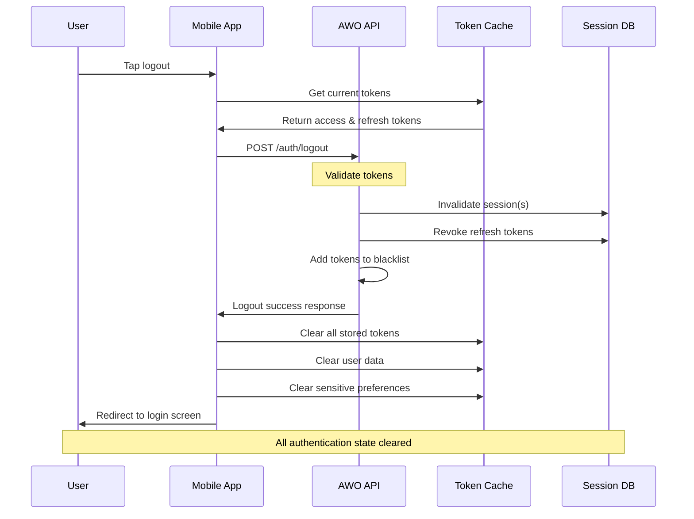

# User Logout

Securely terminate user sessions and invalidate authentication tokens across all devices or specific sessions. This endpoint ensures proper cleanup of authentication state and provides comprehensive session management for African mobile users.

## Overview

<CardGroup cols={1}>
  <Card>
    **POST** `/v1/auth/logout`
    
    **Authentication**: Bearer token required  
    **Rate Limit**: 10 requests per minute per user  
    **Response Time**: ~150ms average
  </Card>
</CardGroup>

## Table of Contents

1. [Logout Flow Overview](#logout-flow-overview)
2. [Request Formats](#request-formats)
3. [Response Formats](#response-formats)
4. [Implementation Examples](#implementation-examples)
5. [Session Management](#session-management)
6. [Security Considerations](#security-considerations)
7. [African Market Optimizations](#african-market-optimizations)
8. [Error Handling](#error-handling)
9. [Related Endpoints](#related-endpoints)

## Logout Flow Overview



## Logout Types and Use Cases

<CardGroup cols={3}>
  <Card title="Single Device Logout" icon="mobile-alt">
    **Scope**: Current device only  
    **Use Case**: Normal logout  
    **Sessions**: Keeps other devices active  
    **Security**: Standard cleanup
  </Card>
  <Card title="All Devices Logout" icon="devices">
    **Scope**: All user sessions  
    **Use Case**: Security concern  
    **Sessions**: Terminates everywhere  
    **Security**: Complete revocation
  </Card>
  <Card title="Remote Device Logout" icon="ban">
    **Scope**: Specific device  
    **Use Case**: Lost/stolen device  
    **Sessions**: Target termination  
    **Security**: Emergency revocation
  </Card>
</CardGroup>

## Request Formats

### Standard Single Device Logout

```json
{
  "logoutType": "current_device",
  "deviceInfo": {
    "deviceId": "device_abc123",
    "platform": "ios",
    "appVersion": "1.2.0"
  },
  "options": {
    "clearLocalData": true,
    "revokeRefreshToken": true,
    "notifyOtherDevices": false
  }
}
```

### All Devices Logout (Security Event)

```json
{
  "logoutType": "all_devices",
  "reason": "security_concern",
  "deviceInfo": {
    "deviceId": "device_abc123",
    "platform": "ios",
    "appVersion": "1.2.0"
  },
  "options": {
    "clearLocalData": true,
    "revokeRefreshToken": true,
    "notifyOtherDevices": true,
    "blacklistTokens": true
  },
  "securityContext": {
    "suspiciousActivity": true,
    "userInitiated": true,
    "emergencyLogout": false
  }
}
```

### Remote Device Logout

```json
{
  "logoutType": "remote_device",
  "targetDeviceId": "device_xyz789",
  "reason": "device_lost",
  "deviceInfo": {
    "deviceId": "device_abc123",
    "platform": "ios",
    "appVersion": "1.2.0"
  },
  "options": {
    "notifyTargetDevice": false,
    "blacklistDevice": true
  }
}
```

### Parameter Details

| Parameter | Type | Required | Description |
|-----------|------|----------|-------------|
| `logoutType` | string | ✅ | Type: `current_device`, `all_devices`, `remote_device` |
| `deviceInfo.deviceId` | string | ✅ | Current device identifier |
| `deviceInfo.platform` | string | ❌ | Platform: `ios`, `android`, `web` |
| `deviceInfo.appVersion` | string | ❌ | Current app version |
| `targetDeviceId` | string | ❌ | Target device for remote logout |
| `reason` | string | ❌ | Reason: `user_choice`, `security_concern`, `device_lost`, `suspicious_activity` |
| `options.clearLocalData` | boolean | ❌ | Clear local app data (default: true) |
| `options.revokeRefreshToken` | boolean | ❌ | Revoke refresh tokens (default: true) |
| `options.notifyOtherDevices` | boolean | ❌ | Send push notifications to other devices |
| `options.blacklistTokens` | boolean | ❌ | Add tokens to security blacklist |

## Response Formats

### Successful Single Device Logout

```json
{
  "success": true,
  "data": {
    "logoutType": "current_device",
    "sessionTerminated": {
      "sessionId": "sess_abc123",
      "deviceId": "device_abc123",
      "terminatedAt": "2024-01-15T10:30:00Z",
      "lastActivity": "2024-01-15T10:29:45Z"
    },
    "tokensRevoked": {
      "accessToken": true,
      "refreshToken": true,
      "revokedCount": 2,
      "blacklisted": false
    },
    "cleanup": {
      "localDataCleared": true,
      "cacheCleared": true,
      "secureStorageCleared": true
    },
    "remainingSessions": {
      "count": 2,
      "devices": [
        {
          "deviceId": "device_xyz789",
          "deviceName": "iPad",
          "lastActive": "2024-01-14T15:20:00Z",
          "platform": "ios"
        },
        {
          "deviceId": "device_def456",
          "deviceName": "Chrome Browser",
          "lastActive": "2024-01-13T09:15:00Z",
          "platform": "web"
        }
      ]
    }
  },
  "meta": {
    "requestId": "req_logout_abc123",
    "timestamp": "2024-01-15T10:30:00Z",
    "processingTime": "0.145s"
  }
}
```

### Successful All Devices Logout

```json
{
  "success": true,
  "data": {
    "logoutType": "all_devices",
    "sessionsTerminated": {
      "count": 3,
      "devices": [
        {
          "deviceId": "device_abc123",
          "deviceName": "iPhone 13",
          "platform": "ios",
          "terminatedAt": "2024-01-15T10:30:00Z"
        },
        {
          "deviceId": "device_xyz789", 
          "deviceName": "iPad",
          "platform": "ios",
          "terminatedAt": "2024-01-15T10:30:00Z"
        },
        {
          "deviceId": "device_def456",
          "deviceName": "Chrome Browser", 
          "platform": "web",
          "terminatedAt": "2024-01-15T10:30:00Z"
        }
      ]
    },
    "tokensRevoked": {
      "accessTokens": 3,
      "refreshTokens": 3,
      "totalRevoked": 6,
      "blacklisted": true
    },
    "notifications": {
      "sent": true,
      "recipients": [
        {
          "deviceId": "device_xyz789",
          "method": "push_notification",
          "status": "delivered"
        },
        {
          "deviceId": "device_def456",
          "method": "email",
          "status": "delivered"
        }
      ]
    },
    "security": {
      "reason": "security_concern",
      "emergencyLogout": false,
      "accountLocked": false,
      "securityScore": "medium_risk"
    }
  }
}
```

### Logout Error Response

```json
{
  "success": false,
  "error": {
    "code": "INVALID_SESSION",
    "message": "Session has already been terminated or is invalid",
    "details": {
      "sessionId": "sess_abc123",
      "lastValidAt": "2024-01-15T09:30:00Z",
      "terminatedBy": "user_action",
      "canRetry": false
    }
  },
  "actions": {
    "clearLocalData": {
      "recommended": true,
      "message": "Clear local app data to ensure clean state"
    },
    "redirectToLogin": {
      "url": "/auth/login",
      "message": "Session invalid, please log in again"
    }
  }
}
```

## Implementation Examples

### React Native with Comprehensive Cleanup

```typescript
import React, { useContext } from 'react';
import { Alert, Platform } from 'react-native';
import * as SecureStore from 'expo-secure-store';
import AsyncStorage from '@react-native-async-storage/async-storage';
import { AuthContext } from './AuthContext';

interface LogoutOptions {
  logoutType: 'current_device' | 'all_devices' | 'remote_device';
  reason?: string;
  clearCache?: boolean;
  notifyOtherDevices?: boolean;
}

class LogoutManager {
  private apiClient: any;
  private authContext: any;

  constructor(apiClient: any, authContext: any) {
    this.apiClient = apiClient;
    this.authContext = authContext;
  }

  async logout(options: LogoutOptions = { logoutType: 'current_device' }): Promise<void> {
    try {
      // Step 1: Prepare logout request
      const logoutRequest = await this.prepareLogoutRequest(options);
      
      // Step 2: Call logout API
      const response = await this.callLogoutAPI(logoutRequest);
      
      // Step 3: Clean up local data
      await this.cleanupLocalData(options.clearCache !== false);
      
      // Step 4: Update auth context
      this.authContext.setAuthenticated(false);
      
      // Step 5: Show confirmation
      this.showLogoutConfirmation(response.data);
      
    } catch (error) {
      console.error('Logout error:', error);
      // Even if API fails, clean up locally
      await this.cleanupLocalData(true);
      this.authContext.setAuthenticated(false);
      
      // Show error but still redirect
      Alert.alert(
        'Logout Notice',
        'Logged out locally. Some cleanup may be incomplete.',
        [{ text: 'OK' }]
      );
    }
  }

  private async prepareLogoutRequest(options: LogoutOptions) {
    const deviceInfo = await this.getDeviceInfo();
    
    return {
      logoutType: options.logoutType,
      reason: options.reason || 'user_choice',
      deviceInfo,
      options: {
        clearLocalData: true,
        revokeRefreshToken: true,
        notifyOtherDevices: options.notifyOtherDevices || false,
        blacklistTokens: options.logoutType === 'all_devices'
      }
    };
  }

  private async callLogoutAPI(request: any) {
    const response = await this.apiClient.post('/auth/logout', request);
    
    if (!response.data.success) {
      throw new Error(response.data.error.message);
    }
    
    return response.data;
  }

  private async cleanupLocalData(clearCache: boolean = true): Promise<void> {
    try {
      // Clear secure tokens
      await this.clearSecureTokens();
      
      // Clear user data
      await this.clearUserData();
      
      // Clear cache if requested
      if (clearCache) {
        await this.clearApplicationCache();
      }
      
      // Clear biometric data
      await this.clearBiometricData();
      
    } catch (error) {
      console.error('Error during local cleanup:', error);
    }
  }

  private async clearSecureTokens(): Promise<void> {
    const tokenKeys = [
      'accessToken',
      'refreshToken',
      'userId',
      'sessionId',
      'deviceId'
    ];

    for (const key of tokenKeys) {
      try {
        await SecureStore.deleteItemAsync(key);
      } catch (error) {
        console.warn(`Failed to clear ${key}:`, error);
      }
    }
  }

  private async clearUserData(): Promise<void> {
    const userDataKeys = [
      'userProfile',
      'divaScore',
      'chamaList',
      'investmentPortfolio',
      'transactionHistory',
      'preferences',
      'coachingHistory'
    ];

    for (const key of userDataKeys) {
      try {
        await AsyncStorage.removeItem(key);
      } catch (error) {
        console.warn(`Failed to clear ${key}:`, error);
      }
    }
  }

  private async clearApplicationCache(): Promise<void> {
    try {
      // Clear AsyncStorage cache
      const keys = await AsyncStorage.getAllKeys();
      const cacheKeys = keys.filter(key => 
        key.startsWith('cache_') || 
        key.startsWith('temp_') ||
        key.startsWith('api_cache_')
      );
      
      if (cacheKeys.length > 0) {
        await AsyncStorage.multiRemove(cacheKeys);
      }

      // Clear image cache (if using react-native-fast-image)
      // FastImage.clearMemoryCache();
      // FastImage.clearDiskCache();
      
    } catch (error) {
      console.warn('Failed to clear application cache:', error);
    }
  }

  private async clearBiometricData(): Promise<void> {
    try {
      // Clear biometric preferences
      await AsyncStorage.removeItem('biometricEnabled');
      await AsyncStorage.removeItem('biometricType');
      
      // Clear any stored biometric tokens
      await SecureStore.deleteItemAsync('biometricToken');
    } catch (error) {
      console.warn('Failed to clear biometric data:', error);
    }
  }

  private async getDeviceInfo() {
    return {
      deviceId: await SecureStore.getItemAsync('deviceId'),
      platform: Platform.OS,
      appVersion: '1.2.0', // Get from app config
      lastSyncAt: new Date().toISOString()
    };
  }

  private showLogoutConfirmation(responseData: any): void {
    const { logoutType, remainingSessions } = responseData;
    
    let message = 'You have been logged out successfully.';
    
    if (logoutType === 'all_devices') {
      message = 'You have been logged out from all devices.';
    } else if (remainingSessions?.count > 0) {
      message = `Logged out from this device. You're still logged in on ${remainingSessions.count} other device(s).`;
    }

    Alert.alert('Logout Successful', message, [{ text: 'OK' }]);
  }

  // Security-focused logout for suspicious activity
  async emergencyLogout(): Promise<void> {
    await this.logout({
      logoutType: 'all_devices',
      reason: 'security_concern',
      notifyOtherDevices: true,
      clearCache: true
    });
  }

  // Remote device logout
  async logoutRemoteDevice(deviceId: string, reason: string = 'user_request'): Promise<void> {
    try {
      const request = {
        logoutType: 'remote_device',
        targetDeviceId: deviceId,
        reason,
        deviceInfo: await this.getDeviceInfo(),
        options: {
          notifyTargetDevice: false,
          blacklistDevice: reason === 'device_lost'
        }
      };

      const response = await this.apiClient.post('/auth/logout', request);
      
      if (response.data.success) {
        Alert.alert(
          'Device Logged Out',
          'The selected device has been logged out successfully.',
          [{ text: 'OK' }]
        );
      }
    } catch (error) {
      Alert.alert('Error', 'Failed to logout remote device. Please try again.');
    }
  }
}

// Usage in React component
const LogoutButton: React.FC = () => {
  const authContext = useContext(AuthContext);
  const logoutManager = new LogoutManager(apiClient, authContext);

  const handleLogout = () => {
    Alert.alert(
      'Confirm Logout',
      'Are you sure you want to log out?',
      [
        { text: 'Cancel', style: 'cancel' },
        { 
          text: 'Log Out', 
          style: 'destructive',
          onPress: () => logoutManager.logout()
        }
      ]
    );
  };

  const handleSecurityLogout = () => {
    Alert.alert(
      'Security Logout',
      'This will log you out from ALL devices. Continue?',
      [
        { text: 'Cancel', style: 'cancel' },
        { 
          text: 'Log Out All', 
          style: 'destructive',
          onPress: () => logoutManager.emergencyLogout()
        }
      ]
    );
  };

  return (
    <View>
      <TouchableOpacity onPress={handleLogout}>
        <Text>Log Out</Text>
      </TouchableOpacity>
      
      <TouchableOpacity onPress={handleSecurityLogout}>
        <Text>Security Logout (All Devices)</Text>
      </TouchableOpacity>
    </View>
  );
};
```

### Web Application with Session Management

```typescript
class WebLogoutManager {
  private apiClient: any;
  private eventEmitter: EventTarget;

  constructor(apiClient: any) {
    this.apiClient = apiClient;
    this.eventEmitter = new EventTarget();
  }

  async logout(options: LogoutOptions = { logoutType: 'current_device' }): Promise<void> {
    try {
      // Emit logout start event
      this.emitLogoutEvent('logout:started', { options });

      // Prepare request
      const request = this.prepareWebLogoutRequest(options);
      
      // Call API
      const response = await this.apiClient.post('/auth/logout', request);
      
      if (response.data.success) {
        // Clean up web storage
        await this.cleanupWebStorage();
        
        // Clear cookies
        this.clearAuthCookies();
        
        // Clear service worker cache
        await this.clearServiceWorkerCache();
        
        // Emit success event
        this.emitLogoutEvent('logout:success', response.data);
        
        // Redirect to login
        this.redirectToLogin();
      }
    } catch (error) {
      console.error('Web logout error:', error);
      
      // Clean up locally even if API fails
      await this.cleanupWebStorage();
      this.clearAuthCookies();
      
      // Emit error event
      this.emitLogoutEvent('logout:error', { error });
      
      // Still redirect to login
      this.redirectToLogin();
    }
  }

  private prepareWebLogoutRequest(options: LogoutOptions) {
    return {
      logoutType: options.logoutType,
      reason: options.reason || 'user_choice',
      deviceInfo: {
        deviceId: this.getWebDeviceId(),
        platform: 'web',
        appVersion: '1.2.0',
        userAgent: navigator.userAgent,
        lastSyncAt: new Date().toISOString()
      },
      options: {
        clearLocalData: true,
        revokeRefreshToken: true,
        notifyOtherDevices: options.notifyOtherDevices || false
      }
    };
  }

  private async cleanupWebStorage(): Promise<void> {
    try {
      // Clear localStorage
      localStorage.clear();
      
      // Clear sessionStorage
      sessionStorage.clear();
      
      // Clear IndexedDB
      await this.clearIndexedDB();
      
    } catch (error) {
      console.warn('Error cleaning web storage:', error);
    }
  }

  private clearAuthCookies(): void {
    const cookiesToClear = [
      'accessToken',
      'refreshToken',
      'sessionId',
      'userId',
      'authState'
    ];

    cookiesToClear.forEach(cookieName => {
      document.cookie = `${cookieName}=; expires=Thu, 01 Jan 1970 00:00:00 UTC; path=/; secure; samesite=strict`;
    });
  }

  private async clearServiceWorkerCache(): Promise<void> {
    if ('serviceWorker' in navigator && 'caches' in window) {
      try {
        const cacheNames = await caches.keys();
        const authCaches = cacheNames.filter(name => 
          name.includes('auth') || 
          name.includes('user') || 
          name.includes('api')
        );
        
        await Promise.all(
          authCaches.map(cacheName => caches.delete(cacheName))
        );
      } catch (error) {
        console.warn('Error clearing service worker cache:', error);
      }
    }
  }

  private async clearIndexedDB(): Promise<void> {
    try {
      if ('indexedDB' in window) {
        const databases = await indexedDB.databases();
        
        await Promise.all(
          databases.map(db => {
            if (db.name?.includes('awo') || db.name?.includes('auth')) {
              return new Promise((resolve, reject) => {
                const deleteReq = indexedDB.deleteDatabase(db.name!);
                deleteReq.onsuccess = () => resolve(undefined);
                deleteReq.onerror = () => reject(deleteReq.error);
              });
            }
          })
        );
      }
    } catch (error) {
      console.warn('Error clearing IndexedDB:', error);
    }
  }

  private getWebDeviceId(): string {
    let deviceId = localStorage.getItem('deviceId');
    if (!deviceId) {
      deviceId = `web_${Date.now()}_${Math.random().toString(36).substr(2, 9)}`;
      localStorage.setItem('deviceId', deviceId);
    }
    return deviceId;
  }

  private emitLogoutEvent(eventType: string, data: any): void {
    this.eventEmitter.dispatchEvent(
      new CustomEvent(eventType, { detail: data })
    );
  }

  private redirectToLogin(): void {
    // Use router if available, otherwise direct navigation
    if (window.location.pathname !== '/login') {
      window.location.href = '/login';
    }
  }

  // Public method to listen to logout events
  onLogoutEvent(eventType: string, callback: (event: CustomEvent) => void): void {
    this.eventEmitter.addEventListener(eventType, callback as EventListener);
  }

  // Remove event listener
  offLogoutEvent(eventType: string, callback: (event: CustomEvent) => void): void {
    this.eventEmitter.removeEventListener(eventType, callback as EventListener);
  }
}

// Usage with React
const useLogout = () => {
  const [isLoggingOut, setIsLoggingOut] = useState(false);
  const logoutManager = useMemo(() => new WebLogoutManager(apiClient), []);

  useEffect(() => {
    const handleLogoutStart = () => setIsLoggingOut(true);
    const handleLogoutEnd = () => setIsLoggingOut(false);

    logoutManager.onLogoutEvent('logout:started', handleLogoutStart);
    logoutManager.onLogoutEvent('logout:success', handleLogoutEnd);
    logoutManager.onLogoutEvent('logout:error', handleLogoutEnd);

    return () => {
      logoutManager.offLogoutEvent('logout:started', handleLogoutStart);
      logoutManager.offLogoutEvent('logout:success', handleLogoutEnd);
      logoutManager.offLogoutEvent('logout:error', handleLogoutEnd);
    };
  }, [logoutManager]);

  const logout = useCallback(async (options?: LogoutOptions) => {
    await logoutManager.logout(options);
  }, [logoutManager]);

  return { logout, isLoggingOut };
};
```

## Session Management

### Active Sessions Overview

Users can manage all their active sessions through the logout functionality:

<CardGroup cols={2}>
  <Card title="Session Monitoring" icon="eye">
    **Real-time tracking** of all active sessions  
    **Device information** including platform and location  
    **Last activity** timestamps for security monitoring  
    **Suspicious activity** alerts and automatic blocking
  </Card>
  <Card title="Selective Logout" icon="check-square">
    **Individual device** logout capabilities  
    **Bulk operations** for multiple devices  
    **Emergency logout** for security incidents  
    **Granular control** over session termination
  </Card>
</CardGroup>

### Session Security Features

<Accordion title="Advanced Session Security">
**Geographic Validation**:
- Location-based session validation
- Alerts for sessions from new countries
- Automatic blocking of suspicious locations
- Travel pattern analysis for fraud detection

**Device Fingerprinting**:
- Unique device identification
- Hardware and software characteristic tracking
- Anomaly detection for device spoofing
- Trusted device management

**Behavioral Analysis**:
- Usage pattern monitoring
- Unusual activity detection
- Risk scoring for each session
- Proactive security responses

**Network Security**:
- IP address monitoring and validation
- VPN and proxy detection
- Network risk assessment
- Connection security analysis
</Accordion>

## Security Considerations

### Logout Security Best Practices

<Steps>
  <Step title="Immediate Token Revocation">
    All tokens are immediately invalidated upon logout request, preventing any further use
  </Step>
  <Step title="Secure Local Cleanup">
    Complete removal of all authentication data from device storage, cache, and memory
  </Step>
  <Step title="Cross-Device Notification">
    Optional notifications to other devices about logout events for security awareness
  </Step>
  <Step title="Audit Trail Creation">
    Comprehensive logging of logout events for security monitoring and compliance
  </Step>
</Steps>

### Emergency Logout Procedures

<CardGroup cols={2}>
  <Card title="Compromised Account" icon="exclamation-triangle">
    **Immediate Response**: All devices logged out instantly  
    **Token Blacklisting**: All tokens added to security blacklist  
    **Account Lock**: Temporary account lock pending verification  
    **Notification**: Security team and user notifications
  </Card>
  <Card title="Device Theft/Loss" icon="mobile-alt">
    **Remote Logout**: Specific device termination  
    **Device Blacklist**: Permanent device blocking  
    **Data Wipe**: Remote data clearing if available  
    **Recovery Assistance**: Account recovery support
  </Card>
</CardGroup>

## African Market Optimizations

### Network Resilience for Logout

<Info>
Logout operations are designed to work reliably even with poor network conditions common in some African regions, with multiple retry mechanisms and graceful degradation.
</Info>

<CardGroup cols={2}>
  <Card title="Offline Logout" icon="wifi">
    **Local Cleanup**: Immediate local data clearing  
    **Queued Operations**: Logout queued for when online  
    **Retry Logic**: Automatic retry with exponential backoff  
    **Status Tracking**: Clear feedback on logout status
  </Card>
  <Card title="Low Bandwidth Mode" icon="signal">
    **Minimal Payload**: Compressed logout requests  
    **Essential Only**: Only critical logout data sent  
    **Background Sync**: Non-critical cleanup in background  
    **Data Savings**: Optimized for expensive data plans
  </Card>
</CardGroup>

### Multi-Language Support

Logout confirmations and notifications support multiple African languages:

<CardGroup cols={3}>
  <Card title="English" icon="globe">
    **Primary Language**: Default interface language  
    **Technical Terms**: Clear technical explanations  
    **Local Context**: African English variations
  </Card>
  <Card title="Afrikaans" icon="globe">
    **South Africa**: Native Afrikaans support  
    **UI Elements**: Translated interface elements  
    **Cultural Context**: Culturally appropriate messaging
  </Card>
  <Card title="Local Languages" icon="globe">
    **Zulu/Xhosa**: South African native languages  
    **Portuguese**: Mozambique and Angola support  
    **French**: Francophone African countries
  </Card>
</CardGroup>

## Error Handling

### Common Logout Errors

| Error Code | Description | Resolution | Auto-Recovery |
|------------|-------------|------------|---------------|
| `INVALID_SESSION` | Session already terminated | Clear local data and redirect | ✅ Yes |
| `TOKEN_EXPIRED` | Token expired before logout | Clear local data | ✅ Yes |
| `NETWORK_ERROR` | Network connectivity issues | Retry with backoff | ✅ Yes |
| `DEVICE_NOT_FOUND` | Remote device not found | Update device list | ❌ Manual |
| `PERMISSION_DENIED` | Insufficient permissions | Contact support | ❌ Manual |
| `RATE_LIMITED` | Too many logout attempts | Wait and retry | ✅ Yes |

### Graceful Error Recovery

```typescript
// Comprehensive error handling example
const handleLogoutError = async (error: any, options: LogoutOptions) => {
  switch (error.code) {
    case 'INVALID_SESSION':
    case 'TOKEN_EXPIRED':
      // These are actually success cases - clean up locally
      await cleanupLocalData();
      redirectToLogin();
      break;
      
    case 'NETWORK_ERROR':
      // Queue logout for retry when online
      await queueOfflineLogout(options);
      await cleanupLocalData(); // Clean locally anyway
      showNetworkErrorMessage();
      break;
      
    case 'RATE_LIMITED':
      // Show rate limit message and schedule retry
      const retryAfter = error.details?.retryAfter || 60;
      showRateLimitMessage(retryAfter);
      setTimeout(() => logout(options), retryAfter * 1000);
      break;
      
    case 'DEVICE_NOT_FOUND':
      // For remote logout, device may have been already removed
      showDeviceNotFoundMessage();
      refreshDeviceList();
      break;
      
    default:
      // Unknown error - clean up locally for safety
      await cleanupLocalData();
      showGenericErrorMessage();
      redirectToLogin();
  }
};

const queueOfflineLogout = async (options: LogoutOptions) => {
  try {
    const queuedLogout = {
      timestamp: Date.now(),
      options,
      retryCount: 0,
      maxRetries: 3
    };
    
    await AsyncStorage.setItem('queuedLogout', JSON.stringify(queuedLogout));
    
    // Set up retry when network comes back
    NetInfo.addEventListener(state => {
      if (state.isConnected) {
        processQueuedLogout();
      }
    });
  } catch (error) {
    console.error('Failed to queue offline logout:', error);
  }
};
```

### User-Friendly Error Messages

<CardGroup cols={2}>
  <Card title="Technical Errors" icon="code">
    **Network Issues**: "Connection problem. Logged out locally."  
    **Server Errors**: "Service temporarily unavailable. Try again."  
    **Rate Limits**: "Too many attempts. Please wait before retrying."
  </Card>
  <Card title="User Actions" icon="user">
    **Already Logged Out**: "You've already been logged out."  
    **Device Not Found**: "Selected device is no longer active."  
    **Permission Issues**: "Contact support for assistance."
  </Card>
</CardGroup>

## Related Endpoints

<CardGroup cols={2}>
  <Card title="User Login" href="/api-reference/auth/login">
    Authenticate and create new session
  </Card>
  <Card title="Token Refresh" href="/api-reference/auth/refresh">
    Refresh expired access tokens
  </Card>
  <Card title="Session Management" href="/api-reference/users/sessions">
    View and manage active sessions
  </Card>
  <Card title="Device Management" href="/api-reference/users/devices">
    Manage trusted devices and security
  </Card>
</CardGroup>

---

**Next Steps**: Implement comprehensive logout functionality in your application or explore [Session Management](/api-reference/users/sessions) for advanced session control.