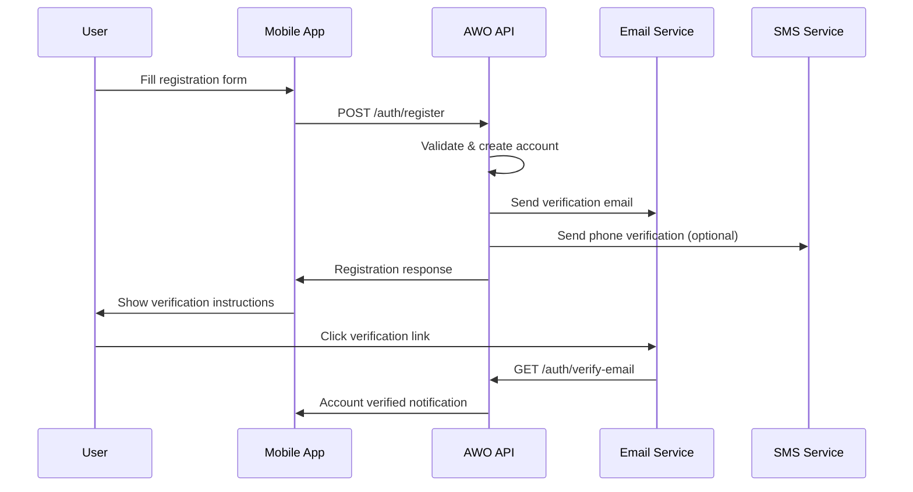

# User Registration

Register new users on the AWO Platform with progressive verification levels optimized for African markets. This endpoint creates user accounts with initial Tier 1 KYC and supports country-specific validation requirements across the SADC region.

<Info>
**Endpoint**: `POST /auth/register`  
**Authentication**: Not required (public endpoint)  
**Rate Limit**: 3 registrations per hour per IP address
</Info>

## Registration Flow Overview



## Request Format

### Headers

```http
Content-Type: application/json
X-Device-ID: device_unique_identifier (optional)
X-User-Agent: YourApp/1.0.0 (optional)
Accept-Language: en, sw, zu, af (optional)
X-Country-Code: ZA (optional, auto-detected if not provided)
```

### Request Body

```json
{
  "personal": {
    "firstName": "Sarah",
    "lastName": "Johnson",
    "email": "sarah.johnson@example.com",
    "phoneNumber": "+27821234567",
    "dateOfBirth": "1985-06-15",
    "gender": "female",
    "language": "en"
  },
  "location": {
    "country": "ZA",
    "province": "Gauteng",
    "city": "Johannesburg",
    "timezone": "Africa/Johannesburg"
  },
  "security": {
    "password": "MySecurePassword123!",
    "confirmPassword": "MySecurePassword123!",
    "agreeToTerms": true,
    "agreeToPrivacy": true,
    "agreeToMarketing": false
  },
  "verification": {
    "emailVerification": true,
    "phoneVerification": false,
    "preferredMethod": "email"
  },
  "referral": {
    "referralCode": "REF_ABC123",
    "source": "friend_referral"
  },
  "deviceInfo": {
    "deviceId": "device_abc123",
    "deviceName": "Sarah's iPhone",
    "platform": "ios",
    "version": "16.1",
    "appVersion": "1.2.0"
  }
}
```

### Parameter Details

#### Personal Information (Required)

| Parameter | Type | Required | Validation | Description |
|-----------|------|----------|------------|-------------|
| `firstName` | string | ✅ | 2-50 chars, letters only | User's first name |
| `lastName` | string | ✅ | 2-50 chars, letters only | User's last name |
| `email` | string | ✅ | Valid email format | Primary email address |
| `phoneNumber` | string | ✅ | E.164 format | Mobile number with country code |
| `dateOfBirth` | string | ✅ | YYYY-MM-DD, 18+ years | Date of birth (must be 18 or older) |
| `gender` | string | ❌ | `male`, `female`, `other` | Gender identification |
| `language` | string | ❌ | ISO 639-1 code | Preferred language |

#### Location Information (Required)

| Parameter | Type | Required | Validation | Description |
|-----------|------|----------|------------|-------------|
| `country` | string | ✅ | ISO 3166-1 alpha-2 | Country code (must be supported SADC country) |
| `province` | string | ❌ | Valid province/state | Province or state |
| `city` | string | ❌ | 2-100 chars | City or town |
| `timezone` | string | ❌ | IANA timezone | User's timezone |

#### Security Settings (Required)

| Parameter | Type | Required | Validation | Description |
|-----------|------|----------|------------|-------------|
| `password` | string | ✅ | 8+ chars, mixed case, numbers, symbols | Account password |
| `confirmPassword` | string | ✅ | Must match password | Password confirmation |
| `agreeToTerms` | boolean | ✅ | Must be true | Terms of service agreement |
| `agreeToPrivacy` | boolean | ✅ | Must be true | Privacy policy agreement |
| `agreeToMarketing` | boolean | ❌ | Default: false | Marketing communications opt-in |

## Response Format

### Successful Registration

```json
{
  "success": true,
  "data": {
    "user": {
      "id": "usr_abc123",
      "email": "sarah.johnson@example.com",
      "profile": {
        "firstName": "Sarah",
        "lastName": "Johnson",
        "phone": "+27821234567",
        "country": "ZA",
        "language": "en",
        "timezone": "Africa/Johannesburg",
        "createdAt": "2024-01-15T10:30:00Z"
      },
      "verification": {
        "email": {
          "verified": false,
          "sentAt": "2024-01-15T10:30:00Z",
          "expiresAt": "2024-01-15T11:30:00Z"
        },
        "phone": {
          "verified": false,
          "required": false
        },
        "identity": {
          "tier": "tier0",
          "nextTier": "tier1",
          "requiredDocuments": ["national_id", "selfie"]
        }
      },
      "status": {
        "active": true,
        "kycTier": "tier0",
        "divaScore": null,
        "portfolioTier": null
      }
    },
    "session": {
      "accessToken": "eyJhbGciOiJIUzI1NiIsInR5cCI6IkpXVCJ9...",
      "refreshToken": "eyJhbGciOiJIUzI1NiIsInR5cCI6IkpXVCJ9...",
      "tokenType": "Bearer",
      "expiresIn": 86400,
      "sessionId": "sess_xyz789"
    },
    "welcome": {
      "message": "Welcome to AWO Platform, Sarah!",
      "nextSteps": [
        {
          "step": "verify_email",
          "title": "Verify Your Email",
          "description": "Check your email for a verification link",
          "required": true,
          "deadline": "2024-01-15T11:30:00Z"
        },
        {
          "step": "complete_profile",
          "title": "Complete Your Profile",
          "description": "Add additional information for better recommendations",
          "required": false
        },
        {
          "step": "diva_assessment",
          "title": "Take DIVA Assessment",
          "description": "Connect your bank account for personalized financial insights",
          "required": false
        }
      ]
    }
  },
  "meta": {
    "requestId": "req_register_abc123",
    "timestamp": "2024-01-15T10:30:00Z",
    "processingTime": "0.234s"
  }
}
```

### Validation Errors

```json
{
  "success": false,
  "error": {
    "code": "VALIDATION_ERROR",
    "message": "Registration data contains validation errors",
    "details": {
      "email": ["Email address is already registered"],
      "phoneNumber": ["Phone number format is invalid for South Africa"],
      "password": ["Password must contain at least one special character"],
      "dateOfBirth": ["User must be at least 18 years old"],
      "country": ["Country 'XX' is not supported in SADC region"]
    }
  }
}
```

## Implementation Examples

### React Native Implementation

```typescript
import React, { useState } from 'react';
import { Alert, ScrollView } from 'react-native';
import * as Device from 'expo-device';
import * as Localization from 'expo-localization';

interface RegistrationFormData {
  firstName: string;
  lastName: string;
  email: string;
  phoneNumber: string;
  dateOfBirth: string;
  country: string;
  password: string;
  confirmPassword: string;
  agreeToTerms: boolean;
  agreeToPrivacy: boolean;
}

export const RegistrationForm: React.FC = () => {
  const [formData, setFormData] = useState<RegistrationFormData>({
    firstName: '',
    lastName: '',
    email: '',
    phoneNumber: '',
    dateOfBirth: '',
    country: 'ZA', // Default to South Africa
    password: '',
    confirmPassword: '',
    agreeToTerms: false,
    agreeToPrivacy: false
  });

  const [loading, setLoading] = useState(false);
  const [errors, setErrors] = useState<Record<string, string>>({});

  const validateForm = (): boolean => {
    const newErrors: Record<string, string> = {};

    // Name validation
    if (!formData.firstName.trim()) {
      newErrors.firstName = 'First name is required';
    } else if (!/^[a-zA-Z\s]{2,50}$/.test(formData.firstName)) {
      newErrors.firstName = 'First name must be 2-50 letters only';
    }

    if (!formData.lastName.trim()) {
      newErrors.lastName = 'Last name is required';
    } else if (!/^[a-zA-Z\s]{2,50}$/.test(formData.lastName)) {
      newErrors.lastName = 'Last name must be 2-50 letters only';
    }

    // Email validation
    const emailRegex = /^[^\s@]+@[^\s@]+\.[^\s@]+$/;
    if (!formData.email.trim()) {
      newErrors.email = 'Email is required';
    } else if (!emailRegex.test(formData.email)) {
      newErrors.email = 'Please enter a valid email address';
    }

    // Phone validation (basic E.164 format)
    const phoneRegex = /^\+[1-9]\d{1,14}$/;
    if (!formData.phoneNumber.trim()) {
      newErrors.phoneNumber = 'Phone number is required';
    } else if (!phoneRegex.test(formData.phoneNumber)) {
      newErrors.phoneNumber = 'Please enter phone number with country code (e.g., +27821234567)';
    }

    // Date of birth validation
    if (!formData.dateOfBirth) {
      newErrors.dateOfBirth = 'Date of birth is required';
    } else {
      const birthDate = new Date(formData.dateOfBirth);
      const today = new Date();
      const age = today.getFullYear() - birthDate.getFullYear();
      
      if (age < 18) {
        newErrors.dateOfBirth = 'You must be at least 18 years old';
      }
    }

    // Password validation
    const passwordRegex = /^(?=.*[a-z])(?=.*[A-Z])(?=.*\d)(?=.*[@$!%*?&])[A-Za-z\d@$!%*?&]{8,}$/;
    if (!formData.password) {
      newErrors.password = 'Password is required';
    } else if (!passwordRegex.test(formData.password)) {
      newErrors.password = 'Password must be 8+ characters with uppercase, lowercase, number and special character';
    }

    if (formData.password !== formData.confirmPassword) {
      newErrors.confirmPassword = 'Passwords do not match';
    }

    // Terms agreement validation
    if (!formData.agreeToTerms) {
      newErrors.agreeToTerms = 'You must agree to the Terms of Service';
    }

    if (!formData.agreeToPrivacy) {
      newErrors.agreeToPrivacy = 'You must agree to the Privacy Policy';
    }

    setErrors(newErrors);
    return Object.keys(newErrors).length === 0;
  };

  const handleRegistration = async () => {
    if (!validateForm()) {
      Alert.alert('Validation Error', 'Please correct the errors and try again');
      return;
    }

    setLoading(true);

    try {
      // Get device information
      const deviceInfo = {
        deviceId: await Device.getDeviceIdAsync(),
        deviceName: Device.deviceName || 'Unknown Device',
        platform: Device.osName?.toLowerCase() as 'ios' | 'android',
        version: Device.osVersion || 'Unknown'
      };

      // Prepare registration data
      const registrationData = {
        personal: {
          firstName: formData.firstName.trim(),
          lastName: formData.lastName.trim(),
          email: formData.email.toLowerCase().trim(),
          phoneNumber: formData.phoneNumber.trim(),
          dateOfBirth: formData.dateOfBirth,
          gender: 'female', // Could be from form
          language: Localization.locale.split('-')[0] || 'en'
        },
        location: {
          country: formData.country,
          timezone: Localization.timezone || 'Africa/Johannesburg'
        },
        security: {
          password: formData.password,
          confirmPassword: formData.confirmPassword,
          agreeToTerms: formData.agreeToTerms,
          agreeToPrivacy: formData.agreeToPrivacy,
          agreeToMarketing: false
        },
        verification: {
          emailVerification: true,
          phoneVerification: false,
          preferredMethod: 'email'
        },
        deviceInfo
      };

      const response = await fetch('https://api.awo-platform.com/v1/auth/register', {
        method: 'POST',
        headers: {
          'Content-Type': 'application/json',
          'X-Device-ID': deviceInfo.deviceId,
          'X-Country-Code': formData.country
        },
        body: JSON.stringify(registrationData)
      });

      const result = await response.json();

      if (result.success) {
        // Store authentication tokens
        await SecureStore.setItemAsync('accessToken', result.data.session.accessToken);
        await SecureStore.setItemAsync('refreshToken', result.data.session.refreshToken);
        await SecureStore.setItemAsync('userId', result.data.user.id);

        // Track registration success
        Analytics.track('user_registration_success', {
          userId: result.data.user.id,
          country: formData.country,
          referralCode: null
        });

        // Show success message
        Alert.alert(
          'Registration Successful!',
          `Welcome to AWO Platform, ${formData.firstName}! Please check your email to verify your account.`,
          [
            {
              text: 'Continue',
              onPress: () => {
                navigation.navigate('EmailVerification', {
                  email: formData.email,
                  nextSteps: result.data.welcome.nextSteps
                });
              }
            }
          ]
        );
      } else {
        // Handle validation errors
        if (result.error?.details) {
          setErrors(result.error.details);
        }
        
        Alert.alert(
          'Registration Failed',
          result.error?.message || 'Please check your information and try again'
        );
      }
    } catch (error) {
      console.error('Registration error:', error);
      Alert.alert(
        'Network Error',
        'Please check your internet connection and try again'
      );
    } finally {
      setLoading(false);
    }
  };

  return (
    <ScrollView style={styles.container}>
      {/* Form fields would be rendered here */}
      <TextInput
        value={formData.firstName}
        onChangeText={(text) => setFormData(prev => ({ ...prev, firstName: text }))}
        placeholder="First Name"
        error={errors.firstName}
      />
      
      <TextInput
        value={formData.lastName}
        onChangeText={(text) => setFormData(prev => ({ ...prev, lastName: text }))}
        placeholder="Last Name"
        error={errors.lastName}
      />

      <TextInput
        value={formData.email}
        onChangeText={(text) => setFormData(prev => ({ ...prev, email: text }))}
        placeholder="Email Address"
        keyboardType="email-address"
        autoCapitalize="none"
        error={errors.email}
      />

      <PhoneNumberInput
        value={formData.phoneNumber}
        onChangeText={(text) => setFormData(prev => ({ ...prev, phoneNumber: text }))}
        country={formData.country}
        error={errors.phoneNumber}
      />

      <DatePicker
        value={formData.dateOfBirth}
        onDateChange={(date) => setFormData(prev => ({ ...prev, dateOfBirth: date }))}
        maximumDate={new Date(Date.now() - 18 * 365 * 24 * 60 * 60 * 1000)}
        error={errors.dateOfBirth}
      />

      <PasswordInput
        value={formData.password}
        onChangeText={(text) => setFormData(prev => ({ ...prev, password: text }))}
        placeholder="Password"
        showStrengthIndicator
        error={errors.password}
      />

      <PasswordInput
        value={formData.confirmPassword}
        onChangeText={(text) => setFormData(prev => ({ ...prev, confirmPassword: text }))}
        placeholder="Confirm Password"
        error={errors.confirmPassword}
      />

      <CheckBox
        value={formData.agreeToTerms}
        onValueChange={(value) => setFormData(prev => ({ ...prev, agreeToTerms: value }))}
        title="I agree to the Terms of Service"
        error={errors.agreeToTerms}
      />

      <CheckBox
        value={formData.agreeToPrivacy}
        onValueChange={(value) => setFormData(prev => ({ ...prev, agreeToPrivacy: value }))}
        title="I agree to the Privacy Policy"
        error={errors.agreeToPrivacy}
      />

      <TouchableOpacity
        onPress={handleRegistration}
        disabled={loading}
        style={[styles.button, loading && styles.buttonDisabled]}
      >
        <Text style={styles.buttonText}>
          {loading ? 'Creating Account...' : 'Create Account'}
        </Text>
      </TouchableOpacity>
    </ScrollView>
  );
};
```

### JavaScript/Node.js Implementation

```javascript
const AWO = require('@awo-platform/sdk');

class RegistrationService {
  constructor(apiKey) {
    this.awo = new AWO.Client({ apiKey });
  }

  async registerUser(userData) {
    try {
      // Validate input data
      this.validateRegistrationData(userData);

      // Prepare registration request
      const registrationData = {
        personal: {
          firstName: userData.firstName.trim(),
          lastName: userData.lastName.trim(),
          email: userData.email.toLowerCase().trim(),
          phoneNumber: this.formatPhoneNumber(userData.phoneNumber, userData.country),
          dateOfBirth: userData.dateOfBirth,
          gender: userData.gender || 'not_specified',
          language: userData.language || 'en'
        },
        location: {
          country: userData.country,
          province: userData.province,
          city: userData.city,
          timezone: userData.timezone || this.getTimezoneForCountry(userData.country)
        },
        security: {
          password: userData.password,
          confirmPassword: userData.confirmPassword,
          agreeToTerms: true,
          agreeToPrivacy: true,
          agreeToMarketing: userData.agreeToMarketing || false
        },
        verification: {
          emailVerification: true,
          phoneVerification: userData.requirePhoneVerification || false,
          preferredMethod: 'email'
        },
        referral: userData.referralCode ? {
          referralCode: userData.referralCode,
          source: 'referral_link'
        } : undefined
      };

      // Make registration request
      const response = await this.awo.auth.register(registrationData);

      if (response.success) {
        // Log successful registration
        console.log(`User registered successfully: ${response.data.user.id}`);
        
        // Send welcome email (if not handled by API)
        await this.sendWelcomeEmail(response.data.user);
        
        return {
          success: true,
          user: response.data.user,
          session: response.data.session,
          nextSteps: response.data.welcome.nextSteps
        };
      } else {
        return {
          success: false,
          error: response.error
        };
      }
    } catch (error) {
      console.error('Registration failed:', error);
      throw new Error(`Registration failed: ${error.message}`);
    }
  }

  validateRegistrationData(userData) {
    const errors = [];

    // Name validation
    if (!userData.firstName || userData.firstName.length < 2) {
      errors.push('First name must be at least 2 characters');
    }

    if (!userData.lastName || userData.lastName.length < 2) {
      errors.push('Last name must be at least 2 characters');
    }

    // Email validation
    const emailRegex = /^[^\s@]+@[^\s@]+\.[^\s@]+$/;
    if (!userData.email || !emailRegex.test(userData.email)) {
      errors.push('Valid email address is required');
    }

    // Phone validation
    const phoneRegex = /^\+[1-9]\d{1,14}$/;
    if (!userData.phoneNumber || !phoneRegex.test(userData.phoneNumber)) {
      errors.push('Valid phone number with country code is required');
    }

    // Age validation
    if (!userData.dateOfBirth) {
      errors.push('Date of birth is required');
    } else {
      const birthDate = new Date(userData.dateOfBirth);
      const age = (Date.now() - birthDate.getTime()) / (365.25 * 24 * 60 * 60 * 1000);
      if (age < 18) {
        errors.push('User must be at least 18 years old');
      }
    }

    // Password validation
    const passwordRegex = /^(?=.*[a-z])(?=.*[A-Z])(?=.*\d)(?=.*[@$!%*?&])[A-Za-z\d@$!%*?&]{8,}$/;
    if (!userData.password || !passwordRegex.test(userData.password)) {
      errors.push('Password must be 8+ characters with uppercase, lowercase, number and special character');
    }

    if (userData.password !== userData.confirmPassword) {
      errors.push('Passwords do not match');
    }

    // Country validation
    const supportedCountries = ['ZA', 'KE', 'NG', 'GH', 'BW', 'ZW', 'ZM', 'MW', 'MZ', 'SZ', 'LS', 'NA'];
    if (!userData.country || !supportedCountries.includes(userData.country)) {
      errors.push('Country must be a supported SADC region country');
    }

    if (errors.length > 0) {
      throw new Error(`Validation errors: ${errors.join(', ')}`);
    }
  }

  formatPhoneNumber(phoneNumber, country) {
    // Basic phone number formatting based on country
    const countryPhoneCodes = {
      'ZA': '+27',
      'KE': '+254',
      'NG': '+234',
      'GH': '+233'
    };

    const countryCode = countryPhoneCodes[country];
    if (countryCode && !phoneNumber.startsWith('+')) {
      // Remove leading zeros and add country code
      const localNumber = phoneNumber.replace(/^0+/, '');
      return `${countryCode}${localNumber}`;
    }

    return phoneNumber;
  }

  getTimezoneForCountry(country) {
    const timezones = {
      'ZA': 'Africa/Johannesburg',
      'KE': 'Africa/Nairobi',
      'NG': 'Africa/Lagos',
      'GH': 'Africa/Accra',
      'BW': 'Africa/Gaborone',
      'ZW': 'Africa/Harare'
    };

    return timezones[country] || 'Africa/Johannesburg';
  }

  async sendWelcomeEmail(user) {
    // Custom welcome email logic if needed
    console.log(`Sending welcome email to ${user.email}`);
  }
}

// Usage example
const registrationService = new RegistrationService(process.env.AWO_API_KEY);

const newUser = await registrationService.registerUser({
  firstName: 'Sarah',
  lastName: 'Johnson',
  email: 'sarah@example.com',
  phoneNumber: '+27821234567',
  dateOfBirth: '1985-06-15',
  country: 'ZA',
  password: 'MySecurePassword123!',
  confirmPassword: 'MySecurePassword123!',
  agreeToMarketing: false
});

if (newUser.success) {
  console.log('Registration successful:', newUser.user.id);
} else {
  console.error('Registration failed:', newUser.error);
}
```

## Country-Specific Validations

### Supported SADC Countries

<Accordion title="Country-Specific Requirements">
| Country | Code | Phone Format | ID Document | Additional Requirements |
|---------|------|--------------|-------------|------------------------|
| **South Africa** | ZA | +27xxxxxxxxx | National ID (13 digits) | FICA compliance |
| **Kenya** | KE | +254xxxxxxxxx | National ID or Passport | Central Bank regulations |
| **Nigeria** | NG | +234xxxxxxxxx | National ID or BVN | CBN compliance |
| **Ghana** | GH | +233xxxxxxxxx | Ghana Card or Passport | Bank of Ghana rules |
| **Botswana** | BW | +267xxxxxxxx | Omang ID | Bank of Botswana |
| **Zimbabwe** | ZW | +263xxxxxxxxx | National ID | RBZ compliance |
| **Zambia** | ZM | +260xxxxxxxxx | National Registration Card | BOZ regulations |

**Phone Number Validation by Country**:
```javascript
const phoneValidation = {
  'ZA': /^\+27[0-9]{9}$/,     // South Africa
  'KE': /^\+254[0-9]{9}$/,    // Kenya  
  'NG': /^\+234[0-9]{10}$/,   // Nigeria
  'GH': /^\+233[0-9]{9}$/,    // Ghana
  'BW': /^\+267[0-9]{8}$/,    // Botswana
  'ZW': /^\+263[0-9]{9}$/,    // Zimbabwe
  'ZM': /^\+260[0-9]{9}$/     // Zambia
};
```
</Accordion>

## Error Codes & Responses

### Validation Errors

| Error Code | Description | Resolution |
|------------|-------------|------------|
| `EMAIL_ALREADY_EXISTS` | Email address is already registered | Use different email or try login |
| `PHONE_ALREADY_EXISTS` | Phone number is already registered | Use different phone or contact support |
| `INVALID_COUNTRY` | Country not supported in SADC region | Use supported SADC country |
| `UNDERAGE_USER` | User is under 18 years old | Must be 18+ to register |
| `WEAK_PASSWORD` | Password doesn't meet security requirements | Use stronger password |
| `INVALID_PHONE_FORMAT` | Phone number format invalid for country | Use correct country format |

### Rate Limiting Errors

```json
{
  "success": false,
  "error": {
    "code": "REGISTRATION_RATE_LIMIT",
    "message": "Too many registration attempts. Please try again later.",
    "details": {
      "attemptsRemaining": 0,
      "resetTime": "2024-01-15T11:30:00Z",
      "maxAttempts": 3,
      "windowDuration": "1 hour"
    }
  }
}
```

## Security Features

### Password Security

<Steps>
  <Step title="Strength Requirements">
    Minimum 8 characters with uppercase, lowercase, numbers, and special characters
  </Step>
  <Step title="Common Password Blocking">
    Prevents use of common passwords and dictionary words
  </Step>
  <Step title="Breach Detection">
    Checks against known compromised password databases
  </Step>
  <Step title="Secure Storage">
    Passwords hashed with bcrypt (cost factor 12+)
  </Step>
</Steps>

### Email Verification

- **Verification Link**: Sent immediately upon registration
- **Expiration**: Links expire after 1 hour
- **Resend Capability**: Users can request new verification emails
- **Security**: Links are single-use and cryptographically secure

### Device Registration

- **Device Fingerprinting**: Unique device identification
- **Trust Management**: Progressive trust building
- **Suspicious Activity**: Automatic detection and alerting
- **Geographic Validation**: Location-based security checks

## Related Endpoints

<CardGroup cols={2}>
  <Card title="Email Verification" href="/api-reference/auth/verify-email">
    Complete email verification process
  </Card>
  <Card title="User Login" href="/api-reference/auth/login">
    Authenticate registered users
  </Card>
  <Card title="Resend Verification" href="/api-reference/auth/resend-verification">
    Resend verification emails
  </Card>
  <Card title="User Profile" href="/api-reference/users/profile">
    Manage user profile information
  </Card>
</CardGroup>

---

**Next Step**: After successful registration, guide users through [Email Verification](/api-reference/auth/verify-email) to activate their accounts and access AWO Platform features.