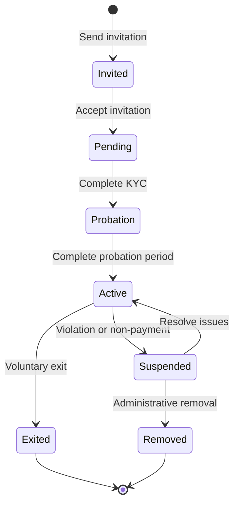

# Manage Members

Manage membership in your Chama groups including adding new members, updating roles, handling membership requests, and maintaining the democratic governance that makes traditional savings groups successful across Africa.

<Info>
Effective member management preserves the trust and accountability that have made Chamas successful for generations while leveraging modern tools for transparency and efficiency.
</Info>

## Authentication

This endpoint requires a valid JWT token with appropriate Chama permissions:

- **View Members**: All Chama members can view member lists
- **Add Members**: Admins and members with invite permissions
- **Remove Members**: Admins only (with group voting if required)
- **Update Roles**: Chama founder and designated admins

```bash
Authorization: Bearer <access_token>
```

## Endpoints Overview

| Method | Endpoint | Description | Required Role |
|--------|----------|-------------|---------------|
| GET | `/chamas/{chamaId}/members` | List all members | Member |
| POST | `/chamas/{chamaId}/members` | Add new member | Admin |
| PUT | `/chamas/{chamaId}/members/{userId}` | Update member details | Admin |
| DELETE | `/chamas/{chamaId}/members/{userId}` | Remove member | Admin |
| POST | `/chamas/{chamaId}/members/{userId}/promote` | Promote member role | Admin |
| POST | `/chamas/{chamaId}/members/{userId}/suspend` | Suspend member | Admin |
| GET | `/chamas/{chamaId}/invitations` | List pending invitations | Member |
| POST | `/chamas/{chamaId}/invitations` | Send invitation | Admin |

## List Members

### Request
```
GET /chamas/{chamaId}/members
```

### Query Parameters

| Parameter | Type | Required | Default | Description |
|-----------|------|----------|---------|-------------|
| `status` | string | No | `active` | Filter by status: `active`, `suspended`, `pending`, `all` |
| `role` | string | No | `all` | Filter by role: `admin`, `treasurer`, `secretary`, `member`, `all` |
| `sort_by` | string | No | `joined_date` | Sort by: `name`, `joined_date`, `contribution_amount`, `diva_score` |
| `order` | string | No | `asc` | Sort order: `asc`, `desc` |
| `limit` | integer | No | `50` | Maximum members to return (1-100) |
| `offset` | integer | No | `0` | Number of members to skip |

### Success Response (200 OK)

```json
{
  "success": true,
  "data": {
    "members": [
      {
        "id": "user_4K8n5RmP2vQ9xE6wT7cY1sA8",
        "personal_info": {
          "name": "Naledi Mbeki",
          "phone_number": "+27821234567",
          "email": "naledi.mbeki@example.com",
          "profile_image_url": "https://cdn.awo-platform.com/profiles/user_4K8n5RmP2vQ9x.jpg"
        },
        "membership_details": {
          "role": "admin",
          "status": "active",
          "joined_date": "2024-03-15T08:00:00Z",
          "invited_by": "system",
          "invitation_accepted_date": "2024-03-15T08:00:00Z",
          "member_number": 1,
          "position_in_queue": 1,
          "voting_weight": 1.0
        },
        "contribution_summary": {
          "total_contributed": 12000.00,
          "contributions_made": 8,
          "missed_contributions": 0,
          "contribution_status": "up_to_date",
          "last_contribution_date": "2025-06-15T14:30:00Z",
          "contribution_rate": 100.0,
          "average_monthly_contribution": 1500.00
        },
        "payout_info": {
          "has_received_payout": true,
          "last_payout_date": "2024-04-20T08:00:00Z",
          "last_payout_amount": 18000.00,
          "next_eligible_date": "2025-04-20T08:00:00Z",
          "total_payouts_received": 1
        },
        "performance_metrics": {
          "reliability_score": 98.5,
          "punctuality_score": 95.0,
          "participation_score": 92.3,
          "leadership_score": 88.7,
          "overall_member_score": 93.6
        },
        "diva_impact": {
          "score_before_joining": 650,
          "current_estimated_score": 723,
          "improvement_from_chama": 73,
          "monthly_average_boost": 9.1
        },
        "permissions": {
          "can_invite_members": true,
          "can_view_financials": true,
          "can_manage_contributions": true,
          "can_initiate_votes": true,
          "can_access_emergency_fund": false
        },
        "social_connections": {
          "referred_members": 2,
          "mutual_chama_memberships": 1,
          "trust_network_size": 15,
          "community_endorsements": 8
        }
      },
      {
        "id": "user_7N9mK3pL8vQ2xR5qF6tE4wA1",
        "personal_info": {
          "name": "Thandiwe Nkomo",
          "phone_number": "+27823456789",
          "email": "thandiwe.nkomo@example.com",
          "profile_image_url": "https://cdn.awo-platform.com/profiles/user_7N9mK3pL8vQ2x.jpg"
        },
        "membership_details": {
          "role": "treasurer",
          "status": "active",
          "joined_date": "2024-03-16T10:30:00Z",
          "invited_by": "user_4K8n5RmP2vQ9xE6wT7cY1sA8",
          "invitation_accepted_date": "2024-03-16T12:15:00Z",
          "member_number": 2,
          "position_in_queue": 8,
          "voting_weight": 1.0
        },
        "contribution_summary": {
          "total_contributed": 12000.00,
          "contributions_made": 8,
          "missed_contributions": 0,
          "contribution_status": "up_to_date",
          "last_contribution_date": "2025-06-15T16:45:00Z",
          "contribution_rate": 100.0,
          "average_monthly_contribution": 1500.00
        },
        "payout_info": {
          "has_received_payout": false,
          "next_payout_date": "2025-07-20T08:00:00Z",
          "expected_payout_amount": 18000.00,
          "position_in_current_cycle": 8,
          "total_payouts_received": 0
        },
        "performance_metrics": {
          "reliability_score": 96.8,
          "punctuality_score": 98.2,
          "participation_score": 89.5,
          "leadership_score": 91.3,
          "overall_member_score": 93.9
        },
        "diva_impact": {
          "score_before_joining": 620,
          "current_estimated_score": 695,
          "improvement_from_chama": 75,
          "monthly_average_boost": 9.4
        },
        "permissions": {
          "can_invite_members": false,
          "can_view_financials": true,
          "can_manage_contributions": true,
          "can_initiate_votes": false,
          "can_access_emergency_fund": true
        },
        "social_connections": {
          "referred_members": 1,
          "mutual_chama_memberships": 0,
          "trust_network_size": 12,
          "community_endorsements": 6
        }
      }
    ],
    "pagination": {
      "total_members": 12,
      "active_members": 11,
      "suspended_members": 1,
      "limit": 50,
      "offset": 0,
      "has_more": false
    },
    "group_statistics": {
      "average_contribution_rate": 94.2,
      "average_reliability_score": 91.5,
      "total_member_referrals": 15,
      "member_retention_rate": 95.8,
      "average_diva_improvement": 68.3
    }
  },
  "meta": {
    "timestamp": "2025-06-19T16:20:15Z",
    "version": "1.0.0",
    "user_permission_level": "admin"
  }
}
```

## Add New Member

### Request
```
POST /chamas/{chamaId}/members
```

### Request Body

```json
{
  "user_identification": {
    "phone_number": "+27824567890",
    "email": "amahle.dlamini@example.com",
    "national_id": "8506154789012"
  },
  "membership_details": {
    "role": "member",
    "position_in_queue": "auto",
    "voting_weight": 1.0,
    "custom_contribution_amount": null,
    "probation_period_months": 3
  },
  "invitation_method": "sms",
  "invitation_message": "You've been invited to join Ubuntu Women's Investment Group! This Chama will help you save and grow your wealth together with other amazing women.",
  "referral_info": {
    "referred_by": "user_4K8n5RmP2vQ9xE6wT7cY1sA8",
    "referral_notes": "Naledi's sister - very reliable with money",
    "relationship": "family"
  },
  "verification_requirements": {
    "require_kyc": true,
    "require_references": false,
    "require_background_check": false,
    "require_meeting_attendance": true
  },
  "auto_approve": false
}
```

### Request Parameters

| Parameter | Type | Required | Description |
|-----------|------|----------|-------------|
| `user_identification` | object | Yes | User identification methods |
| `membership_details` | object | Yes | Membership configuration |
| `invitation_method` | string | Yes | How to send invitation: `sms`, `email`, `whatsapp`, `in_person` |
| `invitation_message` | string | No | Custom invitation message (max 500 chars) |
| `referral_info` | object | No | Information about who referred this member |
| `verification_requirements` | object | No | Required verification steps |
| `auto_approve` | boolean | No | Automatically approve without voting (admin only) |

### Success Response (201 Created)

```json
{
  "success": true,
  "data": {
    "invitation_id": "inv_3M8jH5nK7pV2wQ9xE6tY4sA5",
    "member_id": "user_2M8jH5nK7pV3wQ9xE6tY4sA2",
    "membership_status": "pending_acceptance",
    "invitation_details": {
      "method": "sms",
      "sent_to": "+27824567890",
      "sent_at": "2025-06-19T16:25:30Z",
      "expires_at": "2025-06-26T16:25:30Z",
      "invitation_code": "CHM-3M8jH5"
    },
    "member_info": {
      "name": "Amahle Dlamini",
      "phone_number": "+27824567890",
      "email": "amahle.dlamini@example.com",
      "assigned_role": "member",
      "position_in_queue": 13,
      "member_number": 13
    },
    "group_impact": {
      "new_total_members": 13,
      "remaining_capacity": 2,
      "next_payout_adjustment": {
        "amount_per_member": 1384.62,
        "new_cycle_duration_days": 390
      }
    },
    "next_steps": [
      {
        "step": "invitation_acceptance",
        "description": "Member must accept invitation within 7 days",
        "deadline": "2025-06-26T16:25:30Z"
      },
      {
        "step": "kyc_verification",
        "description": "Complete KYC verification process",
        "required": true
      },
      {
        "step": "first_contribution",
        "description": "Make first contribution to activate membership",
        "amount": 1500.00,
        "currency": "ZAR"
      }
    ]
  },
  "meta": {
    "timestamp": "2025-06-19T16:25:30Z",
    "version": "1.0.0"
  }
}
```

## Update Member Details

### Request
```
PUT /chamas/{chamaId}/members/{userId}
```

### Request Body

```json
{
  "role_update": {
    "new_role": "treasurer",
    "effective_date": "2025-07-01T08:00:00Z",
    "reason": "Elected by group vote due to excellent financial management skills",
    "requires_vote": true
  },
  "permission_updates": {
    "can_invite_members": true,
    "can_access_emergency_fund": true,
    "can_initiate_votes": false
  },
  "contribution_adjustments": {
    "custom_amount": null,
    "payment_schedule_preference": "monthly",
    "auto_contribute_enabled": true
  },
  "status_update": {
    "new_status": "active",
    "reason": "Completed probation period successfully",
    "effective_immediately": true
  },
  "administrative_notes": {
    "performance_notes": "Excellent contributor, very reliable, good leadership potential",
    "special_circumstances": null,
    "trust_level": "high"
  }
}
```

### Success Response (200 OK)

```json
{
  "success": true,
  "data": {
    "member_id": "user_7N9mK3pL8vQ2xR5qF6tE4wA1",
    "updates_applied": {
      "role_changed": {
        "from": "member",
        "to": "treasurer",
        "effective_date": "2025-07-01T08:00:00Z",
        "vote_required": true,
        "vote_id": "vote_5K2n8RmP4vQ7xE9wT3cY6sA1"
      },
      "permissions_updated": {
        "changes": [
          "can_access_emergency_fund: false → true",
          "can_invite_members: false → true"
        ]
      },
      "status_updated": {
        "from": "probation",
        "to": "active",
        "effective_immediately": true
      }
    },
    "group_impact": {
      "new_treasurer_assigned": true,
      "voting_initiated": true,
      "member_privileges_expanded": true,
      "group_governance_updated": true
    },
    "notification_status": {
      "member_notified": true,
      "group_notified": true,
      "vote_initiated": true,
      "admin_updated": true
    }
  },
  "meta": {
    "timestamp": "2025-06-19T16:30:45Z",
    "version": "1.0.0",
    "updated_by": "user_4K8n5RmP2vQ9xE6wT7cY1sA8"
  }
}
```

## Remove Member

### Request
```
DELETE /chamas/{chamaId}/members/{userId}
```

### Query Parameters

| Parameter | Type | Required | Default | Description |
|-----------|------|----------|---------|-------------|
| `reason` | string | Yes | - | Reason for removal: `voluntary_exit`, `inactivity`, `violation`, `non_payment`, `group_decision` |
| `return_contributions` | boolean | No | `true` | Whether to return member's contributions |
| `requires_vote` | boolean | No | `auto` | Force group voting (auto-determined by Chama rules) |
| `effective_date` | string | No | `immediate` | When removal takes effect (ISO 8601) |
| `payout_handling` | string | No | `proportional` | How to handle pending payouts: `forfeit`, `proportional`, `full` |

### Success Response (200 OK)

```json
{
  "success": true,
  "data": {
    "removal_id": "rem_8K3n5RmP2vQ9xE6wT7cY1sA4",
    "member_removed": {
      "id": "user_6L4m9RnQ3vP8xE2wT5cY7sA9",
      "name": "Former Member",
      "removal_date": "2025-06-19T16:35:20Z",
      "reason": "voluntary_exit",
      "final_status": "exited"
    },
    "financial_settlement": {
      "total_contributions": 7500.00,
      "contribution_refund": 7500.00,
      "fees_deducted": 0.00,
      "pending_payouts_forfeited": 0.00,
      "net_settlement": 7500.00,
      "currency": "ZAR",
      "settlement_method": "mobile_money",
      "estimated_processing_time": "24-48 hours"
    },
    "group_adjustments": {
      "new_member_count": 11,
      "payout_schedule_updated": true,
      "contribution_cycle_adjusted": true,
      "queue_positions_updated": true,
      "new_payout_amount_per_member": 16500.00
    },
    "governance_impact": {
      "voting_weight_redistributed": true,
      "quorum_requirements_updated": true,
      "committee_roles_affected": false,
      "emergency_fund_access_revoked": true
    },
    "administrative_actions": {
      "member_access_revoked": true,
      "notifications_sent": true,
      "records_archived": true,
      "references_updated": true,
      "exit_interview_scheduled": false
    }
  },
  "meta": {
    "timestamp": "2025-06-19T16:35:20Z",
    "version": "1.0.0",
    "processed_by": "user_4K8n5RmP2vQ9xE6wT7cY1sA8"
  }
}
```

## Member Roles & Permissions

### Role Hierarchy

| Role | Permissions | Responsibilities |
|------|-------------|------------------|
| **Founder** | All permissions | Group creation, dissolution, ultimate authority |
| **Admin** | Most permissions | Member management, financial oversight, governance |
| **Treasurer** | Financial permissions | Contribution tracking, payout management, financial reports |
| **Secretary** | Communication permissions | Meeting coordination, record keeping, communication |
| **Member** | Basic permissions | Contributions, voting, participation |

### Permission Matrix

| Permission | Founder | Admin | Treasurer | Secretary | Member |
|------------|---------|-------|-----------|-----------|--------|
| View members | ✅ | ✅ | ✅ | ✅ | ✅ |
| Add members | ✅ | ✅ | ❌ | ❌ | ❌ |
| Remove members | ✅ | ✅ | ❌ | ❌ | ❌ |
| Update roles | ✅ | ✅ | ❌ | ❌ | ❌ |
| Manage finances | ✅ | ✅ | ✅ | ❌ | ❌ |
| Access emergency fund | ✅ | ✅ | ✅ | ❌ | ❌ |
| Initiate votes | ✅ | ✅ | ❌ | ✅ | ❌ |
| Send announcements | ✅ | ✅ | ❌ | ✅ | ❌ |
| View analytics | ✅ | ✅ | ✅ | ✅ | ❌ |

## DIVA Score Impact

<Note>
Member management activities impact DIVA scores:
- **Adding quality members**: +5-10 points for referrer
- **Leadership roles**: +10-20 points monthly for admins/treasurers
- **Community building**: +5 points for successful member integrations
- **Conflict resolution**: +3-8 points for helping resolve member disputes
- **Group stability**: +15 points bonus for maintaining stable membership
</Note>

## Cultural Context

Traditional Chama member management emphasizes:
- **Ubuntu Philosophy**: "I am because we are" - collective responsibility
- **Democratic Decision Making**: Important decisions made by group consensus
- **Trust Building**: New members vouched for by existing members
- **Community Integration**: Members support each other beyond financial transactions
- **Respect for Elders**: Senior members often guide group decisions
- **Conflict Resolution**: Issues resolved through dialogue and community wisdom

AWO preserves these values while adding transparency and efficiency through technology.

## Error Handling

### Common Error Codes

| Code | Status | Description | Solution |
|------|--------|-------------|----------|
| `MEMBER_NOT_FOUND` | 404 | Member does not exist in this Chama | Verify member ID and Chama membership |
| `INSUFFICIENT_PERMISSIONS` | 403 | User lacks required permissions | Check user role and permissions |
| `CHAMA_FULL` | 400 | Chama has reached maximum member capacity | Remove inactive members or increase capacity |
| `INVALID_ROLE_ASSIGNMENT` | 400 | Cannot assign specified role | Check role hierarchy and permissions |
| `MEMBER_HAS_OUTSTANDING_OBLIGATIONS` | 409 | Member has unpaid contributions or pending payouts | Resolve financial obligations before removal |
| `VOTING_REQUIRED` | 400 | Action requires group voting approval | Initiate voting process for the action |
| `DUPLICATE_INVITATION` | 409 | User already invited or is member | Check invitation status |
| `INVALID_PHONE_NUMBER` | 400 | Phone number format invalid | Use valid international format |
| `KYC_REQUIRED` | 400 | Member must complete KYC verification | Complete KYC process |
| `PROBATION_PERIOD_ACTIVE` | 400 | Action not allowed during probation | Wait for probation period to end |

## Code Examples

<CodeGroup>

```javascript JavaScript/TypeScript
import { AWOClient } from '@awo-platform/js-sdk';

const awo = new AWOClient({
  apiKey: process.env.AWO_API_KEY,
  environment: 'production'
});

// Get all active members
async function getChamaMembers(chamaId, filters = {}) {
  try {
    const members = await awo.chamas.getMembers(chamaId, {
      status: filters.status || 'active',
      role: filters.role || 'all',
      sort_by: 'contribution_rate',
      order: 'desc',
      limit: 50
    });
    
    console.log(`👥 ${members.pagination.total_members} total members`);
    console.log(`✅ ${members.pagination.active_members} active members`);
    console.log(`📊 Average contribution rate: ${members.group_statistics.average_contribution_rate}%`);
    
    // Display top contributors
    const topContributors = members.members
      .filter(m => m.membership_details.status === 'active')
      .sort((a, b) => b.contribution_summary.contribution_rate - a.contribution_summary.contribution_rate)
      .slice(0, 3);
    
    console.log('\n🏆 Top Contributors:');
    topContributors.forEach((member, index) => {
      console.log(`${index + 1}. ${member.personal_info.name} - ${member.contribution_summary.contribution_rate}% rate`);
    });
    
    return members;
  } catch (error) {
    console.error('❌ Failed to get members:', error.message);
    throw error;
  }
}

// Add new member with invitation
async function addChamaMember(chamaId, memberInfo) {
  try {
    const invitation = await awo.chamas.addMember(chamaId, {
      user_identification: {
        phone_number: memberInfo.phoneNumber,
        email: memberInfo.email,
        national_id: memberInfo.nationalId
      },
      membership_details: {
        role: memberInfo.role || 'member',
        position_in_queue: 'auto',
        voting_weight: 1.0,
        probation_period_months: 3
      },
      invitation_method: 'sms',
      invitation_message: `Hello! You've been invited to join our Chama group. This is a great opportunity to save and invest with other amazing women in our community.`,
      referral_info: {
        referred_by: memberInfo.referredBy,
        relationship: memberInfo.relationship || 'friend',
        referral_notes: memberInfo.notes || 'Recommended as a reliable and trustworthy person'
      },
      verification_requirements: {
        require_kyc: true,
        require_meeting_attendance: true
      },
      auto_approve: false
    });
    
    console.log('✅ Member invitation sent successfully!');
    console.log(`📱 Invitation sent to: ${invitation.invitation_details.sent_to}`);
    console.log(`⏰ Expires: ${new Date(invitation.invitation_details.expires_at).toLocaleDateString()}`);
    console.log(`🔢 Invitation code: ${invitation.invitation_details.invitation_code}`);
    console.log(`📍 Position in queue: ${invitation.member_info.position_in_queue}`);
    
    return invitation;
  } catch (error) {
    console.error('❌ Failed to add member:', error.message);
    
    if (error.code === 'CHAMA_FULL') {
      console.log('💡 Consider removing inactive members or increasing group capacity');
    } else if (error.code === 'DUPLICATE_INVITATION') {
      console.log('💡 This person may already be a member or have a pending invitation');
    }
    
    throw error;
  }
}

// Promote member to leadership role
async function promoteMember(chamaId, userId, newRole, reason) {
  try {
    const update = await awo.chamas.updateMember(chamaId, userId, {
      role_update: {
        new_role: newRole,
        effective_date: new Date(Date.now() + 7 * 24 * 60 * 60 * 1000).toISOString(), // 1 week from now
        reason: reason,
        requires_vote: true
      },
      permission_updates: {
        can_invite_members: newRole === 'admin',
        can_access_emergency_fund: ['admin', 'treasurer'].includes(newRole),
        can_initiate_votes: newRole === 'admin'
      }
    });
    
    console.log('✅ Member promotion initiated!');
    console.log(`👤 Role change: ${update.updates_applied.role_changed.from} → ${update.updates_applied.role_changed.to}`);
    console.log(`🗳️ Vote required: ${update.updates_applied.role_changed.vote_required}`);
    console.log(`📅 Effective date: ${new Date(update.updates_applied.role_changed.effective_date).toLocaleDateString()}`);
    
    if (update.updates_applied.role_changed.vote_id) {
      console.log(`🗳️ Vote ID: ${update.updates_applied.role_changed.vote_id}`);
      console.log('📢 Group members will be notified to vote on this promotion');
    }
    
    return update;
  } catch (error) {
    console.error('❌ Failed to promote member:', error.message);
    throw error;
  }
}

// Remove member with proper settlement
async function removeMember(chamaId, userId, removalReason, returnContributions = true) {
  try {
    const removal = await awo.chamas.removeMember(chamaId, userId, {
      reason: removalReason,
      return_contributions: returnContributions,
      requires_vote: removalReason === 'violation', // Force vote for violations
      payout_handling: 'proportional'
    });
    
    console.log('✅ Member removed successfully');
    console.log(`💰 Financial settlement: ${removal.financial_settlement.currency} ${removal.financial_settlement.net_settlement}`);
    console.log(`⏰ Processing time: ${removal.financial_settlement.estimated_processing_time}`);
    console.log(`👥 New member count: ${removal.group_adjustments.new_member_count}`);
    console.log(`💸 New payout per member: ${removal.group_adjustments.currency} ${removal.group_adjustments.new_payout_amount_per_member}`);
    
    return removal;
  } catch (error) {
    console.error('❌ Failed to remove member:', error.message);
    
    if (error.code === 'MEMBER_HAS_OUTSTANDING_OBLIGATIONS') {
      console.log('💡 Member has outstanding contributions or pending payouts that need to be resolved first');
    } else if (error.code === 'VOTING_REQUIRED') {
      console.log('💡 This removal requires group voting approval');
    }
    
    throw error;
  }
}

// Get member performance analytics
async function getMemberAnalytics(chamaId) {
  try {
    const members = await awo.chamas.getMembers(chamaId);
    
    const analytics = {
      totalMembers: members.pagination.total_members,
      activeMembers: members.pagination.active_members,
      retentionRate: members.group_statistics.member_retention_rate,
      
      // Performance distribution
      performanceDistribution: {
        excellent: members.members.filter(m => m.performance_metrics.overall_member_score >= 90).length,
        good: members.members.filter(m => m.performance_metrics.overall_member_score >= 75 && m.performance_metrics.overall_member_score < 90).length,
        average: members.members.filter(m => m.performance_metrics.overall_member_score >= 60 && m.performance_metrics.overall_member_score < 75).length,
        poor: members.members.filter(m => m.performance_metrics.overall_member_score < 60).length
      },
      
      // Role distribution
      roleDistribution: {
        admins: members.members.filter(m => m.membership_details.role === 'admin').length,
        treasurers: members.members.filter(m => m.membership_details.role === 'treasurer').length,
        secretaries: members.members.filter(m => m.membership_details.role === 'secretary').length,
        members: members.members.filter(m => m.membership_details.role === 'member').length
      },
      
      // Contribution statistics
      contributionStats: {
        averageRate: members.group_statistics.average_contribution_rate,
        upToDate: members.members.filter(m => m.contribution_summary.contribution_status === 'up_to_date').length,
        late: members.members.filter(m => m.contribution_summary.contribution_status === 'late').length,
        defaulted: members.members.filter(m => m.contribution_summary.contribution_status === 'defaulted').length
      },
      
      // DIVA score improvements
      divaImpact: {
        averageImprovement: members.group_statistics.average_diva_improvement,
        totalMembersImproved: members.members.filter(m => m.diva_impact.improvement_from_chama > 0).length,
        highestImprovement: Math.max(...members.members.map(m => m.diva_impact.improvement_from_chama))
      }
    };
    
    console.log('📊 Member Analytics Summary:');
    console.log(`👥 Total Members: ${analytics.totalMembers} (${analytics.activeMembers} active)`);
    console.log(`📈 Retention Rate: ${analytics.retentionRate}%`);
    console.log(`⭐ Performance: ${analytics.performanceDistribution.excellent} excellent, ${analytics.performanceDistribution.good} good`);
    console.log(`💰 Contribution Rate: ${analytics.contributionStats.averageRate}%`);
    console.log(`📈 Average DIVA Improvement: +${analytics.divaImpact.averageImprovement} points`);
    
    return analytics;
  } catch (error) {
    console.error('❌ Failed to get member analytics:', error.message);
    throw error;
  }
}

// Example usage
(async () => {
  try {
    const chamaId = 'chama_9xKm2Pv8B4nHfR6qE7tY5wA3';
    
    // Get current members
    const members = await getChamaMembers(chamaId);
    
    // Add new member
    const newMember = await addChamaMember(chamaId, {
      phoneNumber: '+27824567890',
      email: 'amahle.dlamini@example.com',
      nationalId: '8506154789012',
      role: 'member',
      referredBy: 'user_4K8n5RmP2vQ9xE6wT7cY1sA8',
      relationship: 'friend',
      notes: 'Very reliable with savings and investments'
    });
    
    // Get analytics
    const analytics = await getMemberAnalytics(chamaId);
    
    console.log('\n🎯 Ready for member management!');
  } catch (error) {
    console.error('Failed member management operations:', error.message);
  }
})();
```

```python Python
import requests
from datetime import datetime, timedelta
from typing import Dict, List, Optional

class AWOChamaMembers:
    def __init__(self, api_key: str, base_url: str = "https://api.awo-platform.com/v1"):
        self.api_key = api_key
        self.base_url = base_url
        self.headers = {
            'Authorization': f'Bearer {api_key}',
            'Content-Type': 'application/json'
        }
    
    def get_members(self, chama_id: str, status: str = 'active', 
                   role: str = 'all', sort_by: str = 'joined_date') -> Dict:
        """Get list of Chama members"""
        params = {
            'status': status,
            'role': role,
            'sort_by': sort_by,
            'order': 'desc',
            'limit': 100
        }
        
        response = requests.get(
            f"{self.base_url}/chamas/{chama_id}/members",
            headers=self.headers,
            params=params
        )
        
        if response.status_code == 200:
            return response.json()['data']
        else:
            error_data = response.json()
            raise Exception(f"Failed to get members: {error_data['error']['message']}")
    
    def add_member(self, chama_id: str, member_data: Dict) -> Dict:
        """Add new member to Chama"""
        response = requests.post(
            f"{self.base_url}/chamas/{chama_id}/members",
            headers=self.headers,
            json=member_data
        )
        
        if response.status_code == 201:
            return response.json()['data']
        else:
            error_data = response.json()
            raise Exception(f"Failed to add member: {error_data['error']['message']}")
    
    def update_member(self, chama_id: str, user_id: str, updates: Dict) -> Dict:
        """Update member details"""
        response = requests.put(
            f"{self.base_url}/chamas/{chama_id}/members/{user_id}",
            headers=self.headers,
            json=updates
        )
        
        if response.status_code == 200:
            return response.json()['data']
        else:
            error_data = response.json()
            raise Exception(f"Failed to update member: {error_data['error']['message']}")
    
    def remove_member(self, chama_id: str, user_id: str, 
                     reason: str, return_contributions: bool = True) -> Dict:
        """Remove member from Chama"""
        params = {
            'reason': reason,
            'return_contributions': str(return_contributions).lower(),
            'payout_handling': 'proportional'
        }
        
        response = requests.delete(
            f"{self.base_url}/chamas/{chama_id}/members/{user_id}",
            headers=self.headers,
            params=params
        )
        
        if response.status_code == 200:
            return response.json()['data']
        else:
            error_data = response.json()
            raise Exception(f"Failed to remove member: {error_data['error']['message']}")
    
    def analyze_member_performance(self, chama_id: str) -> Dict:
        """Analyze member performance metrics"""
        members_data = self.get_members(chama_id)
        members = members_data['members']
        
        if not members:
            return {'error': 'No members found'}
        
        # Calculate performance statistics
        performance_scores = [m['performance_metrics']['overall_member_score'] for m in members]
        contribution_rates = [m['contribution_summary']['contribution_rate'] for m in members]
        diva_improvements = [m['diva_impact']['improvement_from_chama'] for m in members]
        
        analysis = {
            'member_summary': {
                'total_members': len(members),
                'active_members': len([m for m in members if m['membership_details']['status'] == 'active']),
                'suspended_members': len([m for m in members if m['membership_details']['status'] == 'suspended']),
                'average_membership_duration_days': self._calculate_average_membership_duration(members)
            },
            'performance_metrics': {
                'average_performance_score': sum(performance_scores) / len(performance_scores),
                'highest_performer': max(members, key=lambda m: m['performance_metrics']['overall_member_score']),
                'performance_distribution': {
                    'excellent_90_plus': len([s for s in performance_scores if s >= 90]),
                    'good_75_to_89': len([s for s in performance_scores if 75 <= s < 90]),
                    'average_60_to_74': len([s for s in performance_scores if 60 <= s < 75]),
                    'poor_below_60': len([s for s in performance_scores if s < 60])
                }
            },
            'contribution_analysis': {
                'average_contribution_rate': sum(contribution_rates) / len(contribution_rates),
                'members_up_to_date': len([m for m in members if m['contribution_summary']['contribution_status'] == 'up_to_date']),
                'members_behind': len([m for m in members if m['contribution_summary']['contribution_status'] in ['late', 'defaulted']]),
                'total_contributions': sum(m['contribution_summary']['total_contributed'] for m in members),
                'best_contributor': max(members, key=lambda m: m['contribution_summary']['contribution_rate'])
            },
            'diva_impact_analysis': {
                'average_diva_improvement': sum(diva_improvements) / len(diva_improvements),
                'members_with_improvement': len([imp for imp in diva_improvements if imp > 0]),
                'highest_diva_improvement': max(diva_improvements),
                'total_diva_points_generated': sum(diva_improvements)
            },
            'role_distribution': {
                'admins': len([m for m in members if m['membership_details']['role'] == 'admin']),
                'treasurers': len([m for m in members if m['membership_details']['role'] == 'treasurer']),
                'secretaries': len([m for m in members if m['membership_details']['role'] == 'secretary']),
                'regular_members': len([m for m in members if m['membership_details']['role'] == 'member'])
            },
            'social_network_analysis': {
                'total_referrals': sum(m['social_connections']['referred_members'] for m in members),
                'average_trust_network_size': sum(m['social_connections']['trust_network_size'] for m in members) / len(members),
                'top_referrer': max(members, key=lambda m: m['social_connections']['referred_members']),
                'community_endorsements': sum(m['social_connections']['community_endorsements'] for m in members)
            }
        }
        
        return analysis
    
    def _calculate_average_membership_duration(self, members: List[Dict]) -> int:
        """Calculate average membership duration in days"""
        total_days = 0
        for member in members:
            joined_date = datetime.fromisoformat(member['membership_details']['joined_date'].replace('Z', '+00:00'))
            duration = (datetime.now() - joined_date).days
            total_days += duration
        
        return total_days // len(members) if members else 0
    
    def get_member_recommendations(self, chama_id: str) -> List[Dict]:
        """Get recommendations for member management"""
        try:
            analysis = self.analyze_member_performance(chama_id)
            recommendations = []
            
            # Check for members who need attention
            if analysis['contribution_analysis']['members_behind'] > 0:
                recommendations.append({
                    'type': 'contribution_support',
                    'priority': 'high',
                    'title': 'Support Members Behind on Contributions',
                    'description': f"{analysis['contribution_analysis']['members_behind']} members need help with contributions",
                    'action': 'Reach out to late contributors and offer support or payment plan options',
                    'impact': 'Improved group stability and member retention'
                })
            
            # Check performance distribution
            poor_performers = analysis['performance_metrics']['performance_distribution']['poor_below_60']
            if poor_performers > 0:
                recommendations.append({
                    'type': 'performance_improvement',
                    'priority': 'medium',
                    'title': 'Help Low-Performing Members',
                    'description': f"{poor_performers} members have performance scores below 60",
                    'action': 'Provide mentorship and support to help improve participation',
                    'impact': 'Better group cohesion and overall performance'
                })
            
            # Check for leadership opportunities
            excellent_members = analysis['performance_metrics']['performance_distribution']['excellent_90_plus']
            if excellent_members > analysis['role_distribution']['admins'] + analysis['role_distribution']['treasurers']:
                recommendations.append({
                    'type': 'leadership_development',
                    'priority': 'low',
                    'title': 'Promote High-Performing Members',
                    'description': f"{excellent_members} members show excellent performance",
                    'action': 'Consider promoting outstanding members to leadership roles',
                    'impact': 'Improved group management and member engagement'
                })
            
            # Check member capacity
            total_members = analysis['member_summary']['total_members']
            if total_members < 10:  # Assuming minimum viable group size
                recommendations.append({
                    'type': 'member_recruitment',
                    'priority': 'medium',
                    'title': 'Recruit New Members',
                    'description': f"Group has {total_members} members, consider expanding",
                    'action': 'Invite trusted friends and family to join the group',
                    'impact': 'Larger payouts and stronger community support'
                })
            
            return recommendations
            
        except Exception as e:
            print(f"Error generating recommendations: {e}")
            return []
    
    def invite_member_by_phone(self, chama_id: str, phone_number: str, 
                             invited_by: str, relationship: str = 'friend') -> Dict:
        """Simplified member invitation by phone number"""
        member_data = {
            'user_identification': {
                'phone_number': phone_number
            },
            'membership_details': {
                'role': 'member',
                'position_in_queue': 'auto',
                'voting_weight': 1.0,
                'probation_period_months': 3
            },
            'invitation_method': 'sms',
            'invitation_message': (
                "You've been invited to join our Chama savings group! "
                "Join us to save money together and build wealth as a community. "
                "This is a great opportunity to improve your financial future."
            ),
            'referral_info': {
                'referred_by': invited_by,
                'relationship': relationship,
                'referral_notes': f'Invited via phone by trusted {relationship}'
            },
            'verification_requirements': {
                'require_kyc': True,
                'require_meeting_attendance': True
            },
            'auto_approve': False
        }
        
        return self.add_member(chama_id, member_data)

# Example usage
if __name__ == "__main__":
    awo_members = AWOChamaMembers('your-api-key')
    
    try:
        chama_id = 'chama_9xKm2Pv8B4nHfR6qE7tY5wA3'
        
        # Get all members
        members_data = awo_members.get_members(chama_id)
        print(f"👥 Total Members: {members_data['pagination']['total_members']}")
        print(f"✅ Active Members: {members_data['pagination']['active_members']}")
        
        # Analyze performance
        analysis = awo_members.analyze_member_performance(chama_id)
        print(f"\n📊 Performance Analysis:")
        print(f"Average performance score: {analysis['performance_metrics']['average_performance_score']:.1f}")
        print(f"Average contribution rate: {analysis['contribution_analysis']['average_contribution_rate']:.1f}%")
        print(f"Average DIVA improvement: +{analysis['diva_impact_analysis']['average_diva_improvement']:.1f} points")
        
        # Get recommendations
        recommendations = awo_members.get_member_recommendations(chama_id)
        if recommendations:
            print(f"\n💡 Management Recommendations:")
            for rec in recommendations:
                print(f"  {rec['priority'].upper()}: {rec['title']}")
                print(f"    {rec['description']}")
                print(f"    Action: {rec['action']}\n")
        
        # Invite new member (example)
        # invitation = awo_members.invite_member_by_phone(
        #     chama_id,
        #     '+27824567890',
        #     'user_4K8n5RmP2vQ9xE6wT7cY1sA8',
        #     'friend'
        # )
        # print(f"📱 Invitation sent: {invitation['invitation_details']['invitation_code']}")
        
    except Exception as e:
        print(f"Error: {e}")
```

```curl cURL
# Get all active members
curl -X GET "https://api.awo-platform.com/v1/chamas/chama_9xKm2Pv8B4nHfR6qE7tY5wA3/members?status=active&sort_by=contribution_rate&order=desc" \
  -H "Authorization: Bearer $AWO_ACCESS_TOKEN" \
  -H "Accept: application/json"

# Add new member with invitation
curl -X POST "https://api.awo-platform.com/v1/chamas/chama_9xKm2Pv8B4nHfR6qE7tY5wA3/members" \
  -H "Authorization: Bearer $AWO_ACCESS_TOKEN" \
  -H "Content-Type: application/json" \
  -d '{
    "user_identification": {
      "phone_number": "+27824567890",
      "email": "amahle.dlamini@example.com"
    },
    "membership_details": {
      "role": "member",
      "position_in_queue": "auto",
      "probation_period_months": 3
    },
    "invitation_method": "sms",
    "invitation_message": "Join our amazing women'\''s savings group!",
    "referral_info": {
      "referred_by": "user_4K8n5RmP2vQ9xE6wT7cY1sA8",
      "relationship": "friend",
      "referral_notes": "Very reliable and trustworthy"
    },
    "verification_requirements": {
      "require_kyc": true,
      "require_meeting_attendance": true
    }
  }'

# Promote member to treasurer
curl -X PUT "https://api.awo-platform.com/v1/chamas/chama_9xKm2Pv8B4nHfR6qE7tY5wA3/members/user_7N9mK3pL8vQ2xR5qF6tE4wA1" \
  -H "Authorization: Bearer $AWO_ACCESS_TOKEN" \
  -H "Content-Type: application/json" \
  -d '{
    "role_update": {
      "new_role": "treasurer",
      "reason": "Elected by group due to excellent financial management skills",
      "requires_vote": true
    },
    "permission_updates": {
      "can_access_emergency_fund": true,
      "can_invite_members": true
    }
  }'

# Remove member with contribution return
curl -X DELETE "https://api.awo-platform.com/v1/chamas/chama_9xKm2Pv8B4nHfR6qE7tY5wA3/members/user_6L4m9RnQ3vP8xE2wT5cY7sA9?reason=voluntary_exit&return_contributions=true&payout_handling=proportional" \
  -H "Authorization: Bearer $AWO_ACCESS_TOKEN" \
  -H "Accept: application/json"

# Get member statistics summary
curl -X GET "https://api.awo-platform.com/v1/chamas/chama_9xKm2Pv8B4nHfR6qE7tY5wA3/members" \
  -H "Authorization: Bearer $AWO_ACCESS_TOKEN" \
  -H "Accept: application/json" | \
  jq '.data | "Total: \(.pagination.total_members), Active: \(.pagination.active_members), Avg Contribution Rate: \(.group_statistics.average_contribution_rate)%"'

# Get top performers by contribution rate
curl -X GET "https://api.awo-platform.com/v1/chamas/chama_9xKm2Pv8B4nHfR6qE7tY5wA3/members?sort_by=contribution_rate&order=desc&limit=5" \
  -H "Authorization: Bearer $AWO_ACCESS_TOKEN" \
  -H "Accept: application/json" | \
  jq '.data.members[] | "\(.personal_info.name): \(.contribution_summary.contribution_rate)% (\(.membership_details.role))"'
```

</CodeGroup>

## Member Lifecycle Management

### New Member Onboarding

<Steps>
  <Step title="Invitation Sent">
    Admin sends invitation via SMS, email, or WhatsApp with custom message and group details
  </Step>
  <Step title="Invitation Acceptance">
    New member accepts invitation and completes basic profile setup
  </Step>
  <Step title="KYC Verification">
    Member completes identity verification process as required by group rules
  </Step>
  <Step title="Probation Period">
    3-month probation period where member makes contributions but has limited voting rights
  </Step>
  <Step title="Full Membership">
    After successful probation, member gains full voting rights and eligibility for leadership roles
  </Step>
</Steps>

### Member Status Progression



## Best Practices

### For Chama Administrators
- **Regular Check-ins**: Monitor member performance and contribution rates monthly
- **Open Communication**: Maintain transparent communication about group finances and decisions
- **Democratic Process**: Use voting for major decisions like role changes and member removal
- **Support System**: Help struggling members rather than removing them immediately
- **Recognition**: Celebrate member achievements and milestones

### For Member Management
- **Quality over Quantity**: Focus on recruiting committed members rather than just growing numbers
- **Cultural Fit**: Ensure new members align with group values and commitment levels
- **Gradual Integration**: Use probation periods to help new members understand group dynamics
- **Conflict Resolution**: Address disputes quickly and fairly through group consensus
- **Leadership Development**: Provide opportunities for members to grow into leadership roles

### For Developers
- **Permission Validation**: Always check user permissions before allowing member management actions
- **Audit Trails**: Log all member management actions for transparency and compliance
- **Graceful Degradation**: Handle partial failures when updating multiple member records
- **Real-time Updates**: Notify relevant parties immediately when membership changes occur

## Related Endpoints

<CardGroup cols={2}>
  <Card title="Chama Details" href="/api-reference/chamas/details">
    View comprehensive Chama information
  </Card>
  <Card title="Make Contribution" href="/api-reference/chamas/contribute">
    Process member contributions
  </Card>
  <Card title="Voting System" href="/api-reference/governance/voting">
    Manage democratic group decisions
  </Card>
  <Card title="Member Analytics" href="/api-reference/analytics/members">
    Detailed member performance analytics
  </Card>
</CardGroup>

## Testing

### Test Member Operations

Use these test scenarios in sandbox environment:

| Operation | Test Data | Expected Result |
|-----------|-----------|-----------------|
| Add member | Valid phone +27824567890 | Invitation sent successfully |
| Add duplicate | Existing member phone | Duplicate invitation error |
| Promote member | Regular member to treasurer | Vote initiated for promotion |
| Remove active member | Member with contributions | Successful removal with settlement |
| Remove defaulted member | Member with missed payments | Removal with penalty application |

<Warning>
All member management operations in sandbox use test data and don't affect real user accounts or send actual SMS/email notifications.
</Warning>

---

**Next Steps**: After managing members, explore [Chama governance and voting](/api-reference/governance/voting), [contribution tracking](/api-reference/chamas/contribute), or [member analytics](/api-reference/analytics/members) to maintain a healthy and thriving savings group.