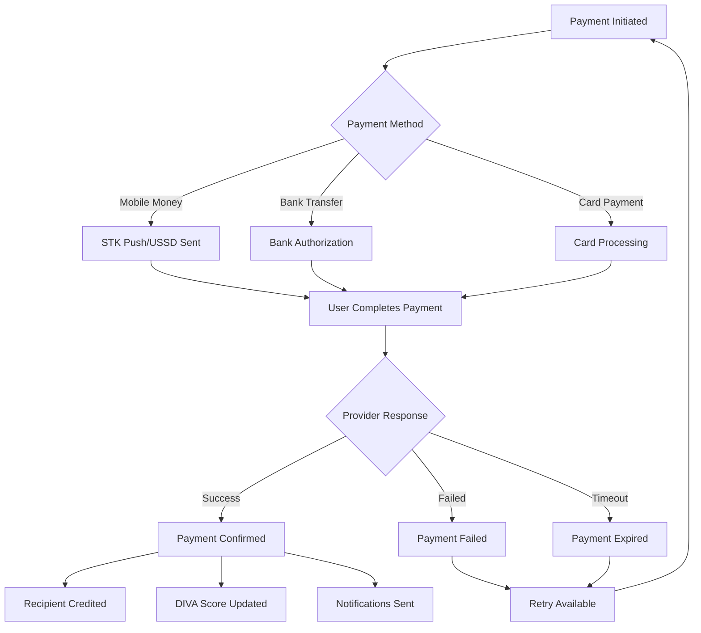

# Initiate Payment

Start secure payment transactions through AWO's integrated payment system supporting mobile money, bank transfers, and card payments across SADC countries. This endpoint handles Chama contributions, savings deposits, investment purchases, and peer-to-peer transfers.

<Info>
Payment integration is the backbone of financial empowerment. AWO supports the most trusted payment methods across Africa, ensuring every woman can participate in the digital economy regardless of her preferred payment method.
</Info>

## Authentication

This endpoint requires authentication and may require additional verification for larger payment amounts or first-time payments.

```bash
Authorization: Bearer YOUR_JWT_TOKEN
```

## Endpoint

```http
POST /payments/initiate
```

## Request Body

<ParamField body="amount" type="number" required>
  Payment amount in the smallest currency unit (cents for ZAR/KES, centimes for XOF, etc.)
</ParamField>

<ParamField body="currency" type="string" required>
  Three-letter currency code (ZAR, KES, USD, XOF, etc.)
</ParamField>

<ParamField body="paymentMethod" type="string" required>
  Payment method: `mobile_money`, `bank_transfer`, `card`, `wallet_balance`
</ParamField>

<ParamField body="provider" type="string" required>
  Specific payment provider (see regional providers below)
</ParamField>

<ParamField body="recipientType" type="string" required>
  Type of recipient: `chama`, `savings_goal`, `investment`, `user`, `merchant`
</ParamField>

<ParamField body="recipientId" type="string" required>
  ID of the recipient (Chama ID, goal ID, user ID, etc.)
</ParamField>

<ParamField body="phoneNumber" type="string">
  Phone number for mobile money payments (E.164 format: +254712345678)
</ParamField>

<ParamField body="accountNumber" type="string">
  Account number for bank transfers
</ParamField>

<ParamField body="cardToken" type="string">
  Tokenized card details for card payments
</ParamField>

<ParamField body="reference" type="string">
  Internal reference for tracking (auto-generated if not provided)
</ParamField>

<ParamField body="description" type="string">
  Payment description visible to recipient (max 200 characters)
</ParamField>

<ParamField body="metadata" type="object">
  Additional payment metadata for tracking and analytics
</ParamField>

## Regional Payment Providers

<Tabs>
  <Tab title="Kenya">
    **Mobile Money:**
    - `mpesa` - Safaricom M-Pesa (most popular)
    - `airtel_money` - Airtel Money
    - `tkash` - Telkom T-Kash
    
    **Banks:**
    - `equity_bank` - Equity Bank
    - `kcb` - Kenya Commercial Bank
    - `cooperative_bank` - Co-operative Bank
    - `standard_chartered` - Standard Chartered Kenya
    
    **Cards:**
    - `visa` - Visa cards via Flutterwave
    - `mastercard` - Mastercard via Flutterwave
    
    **Currency:** KES (Kenyan Shilling)
  </Tab>
  
  <Tab title="South Africa">
    **Mobile Money:**
    - `mpesa_sa` - Vodacom M-Pesa South Africa
    - `mtn_momo` - MTN Mobile Money
    
    **Banks:**
    - `standard_bank` - Standard Bank Instant EFT
    - `fnb` - First National Bank
    - `absa` - ABSA Bank
    - `nedbank` - Nedbank
    - `capitec` - Capitec Bank
    
    **Cards:**
    - `visa` - Visa cards via Paystack
    - `mastercard` - Mastercard via Paystack
    
    **Currency:** ZAR (South African Rand)
  </Tab>
  
  <Tab title="Zimbabwe">
    **Mobile Money:**
    - `ecocash` - Econet EcoCash
    - `onemoney` - NetOne OneMoney
    - `telecash` - Telecel Telecash
    
    **Banks:**
    - `cbz_bank` - CBZ Bank
    - `stanbic` - Stanbic Bank Zimbabwe
    - `zb_bank` - ZB Bank
    
    **Cards:**
    - `visa` - Visa (USD transactions)
    - `mastercard` - Mastercard (USD transactions)
    
    **Currency:** USD, ZWL
  </Tab>
  
  <Tab title="Nigeria">
    **Mobile Money:**
    - `paga` - Paga
    - `opay` - OPay
    - `palmpay` - PalmPay
    
    **Banks:**
    - `gtbank` - Guaranty Trust Bank
    - `access_bank` - Access Bank
    - `zenith_bank` - Zenith Bank
    - `first_bank` - First Bank of Nigeria
    
    **Cards:**
    - `visa` - Visa via Paystack
    - `mastercard` - Mastercard via Paystack
    - `verve` - Verve (local card scheme)
    
    **Currency:** NGN (Nigerian Naira)
  </Tab>
</Tabs>

## Request Examples

<CodeGroup>

```bash cURL - M-Pesa Chama Contribution
curl -X POST "https://api.awo-platform.com/v1/payments/initiate" \
  -H "Authorization: Bearer YOUR_JWT_TOKEN" \
  -H "Content-Type: application/json" \
  -d '{
    "amount": 2500000,
    "currency": "KES",
    "paymentMethod": "mobile_money",
    "provider": "mpesa",
    "recipientType": "chama",
    "recipientId": "chama_123e4567-e89b-12d3-a456-426614174000",
    "phoneNumber": "+254712345678",
    "reference": "chama_monthly_june_2025",
    "description": "Monthly contribution to Uongozi Women Investment Group",
    "metadata": {
      "contributionMonth": "2025-06",
      "membershipNumber": "UWG001"
    }
  }'
```

```bash cURL - Bank Transfer Savings
curl -X POST "https://api.awo-platform.com/v1/payments/initiate" \
  -H "Authorization: Bearer YOUR_JWT_TOKEN" \
  -H "Content-Type: application/json" \
  -d '{
    "amount": 50000,
    "currency": "ZAR",
    "paymentMethod": "bank_transfer",
    "provider": "standard_bank",
    "recipientType": "savings_goal",
    "recipientId": "goal_456def789ghi-j012-34k5-l678-901234567890",
    "accountNumber": "1234567890",
    "reference": "emergency_fund_deposit",
    "description": "Monthly deposit to emergency fund goal"
  }'
```

```javascript JavaScript - Investment Purchase
const payment = await fetch('https://api.awo-platform.com/v1/payments/initiate', {
  method: 'POST',
  headers: {
    'Authorization': 'Bearer YOUR_JWT_TOKEN',
    'Content-Type': 'application/json'
  },
  body: JSON.stringify({
    amount: 10000000, // KES 100,000
    currency: 'KES',
    paymentMethod: 'mobile_money',
    provider: 'mpesa',
    recipientType: 'investment',
    recipientId: 'investment_bond_gov_ke_001',
    phoneNumber: '+254723456789',
    reference: 'govt_bond_purchase_001',
    description: 'Purchase of Kenya Government Bond - 5 year term',
    metadata: {
      investmentType: 'government_bond',
      term: '5_years',
      interestRate: '12.5%'
    }
  })
});

const result = await payment.json();
console.log('Payment initiated:', result);
```

```typescript TypeScript - P2P Transfer
import { AWOClient, InitiatePaymentRequest } from '@awo-platform/js-sdk';

const client = new AWOClient({
  apiKey: 'your-api-key',
  environment: 'production'
});

const paymentRequest: InitiatePaymentRequest = {
  amount: 500000, // KES 5,000
  currency: 'KES',
  paymentMethod: 'mobile_money',
  provider: 'mpesa',
  recipientType: 'user',
  recipientId: 'user_789ghi012jkl-m345-67n8-o901-234567890123',
  phoneNumber: '+254734567890',
  reference: 'family_support_payment',
  description: 'Support for sister\'s school fees - university semester payment',
  metadata: {
    relationship: 'sister',
    purpose: 'education_support',
    semester: '2025_Q2'
  }
};

const payment = await client.payments.initiate(paymentRequest);
console.log('P2P payment initiated:', payment);
```

```python Python - Card Payment
import awo_platform

client = awo_platform.Client(api_key="your-api-key")

# Initiate card payment for business investment
card_payment = client.payments.initiate(
    amount=7500000,  # KES 75,000
    currency="KES",
    payment_method="card",
    provider="visa",
    recipient_type="investment",
    recipient_id="business_loan_microfinance_001",
    card_token="card_token_abc123xyz789",
    reference="business_expansion_loan",
    description="Microfinance loan for tailoring business expansion",
    metadata={
        "business_type": "tailoring",
        "loan_term": "12_months",
        "interest_rate": "15%"
    }
)

print(f"Payment initiated: {card_payment['payment_id']}")
```

</CodeGroup>

## Response Format

<ResponseExample>
```json Success Response
{
  "success": true,
  "data": {
    "paymentId": "pay_123e4567-e89b-12d3-a456-426614174000",
    "status": "pending",
    "amount": 2500000,
    "currency": "KES",
    "displayAmount": "KES 25,000",
    "paymentMethod": "mobile_money",
    "provider": "mpesa",
    "recipientType": "chama",
    "recipientId": "chama_123e4567-e89b-12d3-a456-426614174000",
    "recipientInfo": {
      "name": "Uongozi Women Investment Group",
      "type": "rotating_chama",
      "memberCount": 12
    },
    "senderInfo": {
      "userId": "user_456def789ghi-j012-34k5-l678-901234567890",
      "phoneNumber": "+254712***678",
      "accountMasked": "****5678"
    },
    "reference": "chama_monthly_june_2025",
    "description": "Monthly contribution to Uongozi Women Investment Group",
    "transactionDetails": {
      "providerTransactionId": "NLJ7RT61SV",
      "checkoutRequestId": "ws_CO_DMZ_191220251430123456",
      "stkPushSent": true,
      "expiryTime": "2025-06-19T15:30:00Z"
    },
    "fees": {
      "processingFee": 0,
      "providerFee": 0,
      "totalFees": 0,
      "feePolicy": "chama_contributions_free"
    },
    "timeline": {
      "initiated": "2025-06-19T14:30:00Z",
      "estimatedCompletion": "2025-06-19T14:35:00Z",
      "expiresAt": "2025-06-19T15:30:00Z"
    },
    "nextSteps": {
      "userAction": "complete_mpesa_payment",
      "instructions": "Check your phone for M-Pesa payment prompt and enter your PIN to complete the payment",
      "checkStatusUrl": "/payments/pay_123e4567/status",
      "cancelUrl": "/payments/pay_123e4567/cancel"
    },
    "impact": {
      "divaScoreBoost": "+5-8 points",
      "chamaContributionNumber": 6,
      "goalProgress": null,
      "communityImpact": "Supporting 12 women in your Chama community"
    }
  },
  "meta": {
    "timestamp": "2025-06-19T14:30:00Z",
    "version": "1.0.0",
    "requestId": "req_payment_init_abc123"
  }
}
```
</ResponseExample>

## Payment Flow & Status Progression



## Payment Method Capabilities

<Tabs>
  <Tab title="Mobile Money">
    **Advantages:**
    - Instant processing (30 seconds - 5 minutes)
    - No bank account required
    - Available 24/7 including weekends
    - Lower fees for small amounts
    - Familiar to users across Africa
    
    **Supported Features:**
    - STK Push (Kenya M-Pesa)
    - USSD payments
    - QR code payments
    - Offline payment codes
    - Recurring payments
    
    **Limits:**
    - Daily: KES 300,000 (M-Pesa Kenya)
    - Monthly: KES 3,000,000 (M-Pesa Kenya)
    - Transaction: KES 250,000 (M-Pesa Kenya)
  </Tab>
  
  <Tab title="Bank Transfers">
    **Advantages:**
    - Higher transaction limits
    - Lower fees for large amounts
    - Direct bank-to-bank security
    - Better for business payments
    - Detailed transaction records
    
    **Supported Features:**
    - Instant EFT (Standard Bank SA)
    - Real-time payments
    - Scheduled transfers
    - Standing orders
    - International transfers
    
    **Limits:**
    - Daily: R1,000,000 (Standard Bank SA)
    - Transaction: R500,000 (Standard Bank SA)
    - International: $50,000 (various banks)
  </Tab>
  
  <Tab title="Card Payments">
    **Advantages:**
    - International acceptance
    - Strong fraud protection
    - Instant processing
    - Online and offline use
    - Reward programs integration
    
    **Supported Features:**
    - 3D Secure authentication
    - Tokenized payments
    - Recurring billing
    - Installment payments
    - Currency conversion
    
    **Limits:**
    - Daily: $10,000 (varies by card)
    - Transaction: $5,000 (varies by card)
    - International: Based on card issuer
  </Tab>
</Tabs>

## Fee Structure

<Tabs>
  <Tab title="Chama Contributions">
    **Free Transactions:**
    - All Chama contributions are fee-free
    - No processing fees from AWO
    - Standard provider fees may apply
    
    | Provider | Fee | Notes |
    |----------|-----|-------|
    | M-Pesa Kenya | Free | For registered Chamas |
    | Standard Bank SA | Free | EFT transfers |
    | EcoCash Zimbabwe | 1% | Capped at $5 |
  </Tab>
  
  <Tab title="Savings & Investments">
    **Reduced Fees:**
    - 50% discount on all savings transactions
    - Investment purchases: 0.5% fee (min $1)
    - No fees for deposits under $100 equivalent
    
    | Amount Range | Fee |
    |--------------|-----|
    | $0 - $100 | Free |
    | $100 - $1,000 | 0.5% |
    | $1,000+ | 0.3% |
  </Tab>
  
  <Tab title="P2P Transfers">
    **Standard Fees:**
    - Domestic transfers: 1% (min $0.50, max $10)
    - International transfers: 2% (min $2, max $25)
    - Express transfers: +$1 surcharge
    
    | Transfer Type | Fee | Processing Time |
    |---------------|-----|-----------------|
    | Domestic | 1% | 5 minutes |
    | International | 2% | 1-24 hours |
    | Express | +$1 | 30 seconds |
  </Tab>
</Tabs>

## Security & Fraud Prevention

### Multi-Layer Security
- **Device Fingerprinting**: Detect unusual device patterns
- **Behavioral Analysis**: Monitor spending patterns for anomalies
- **Real-time Monitoring**: Flag suspicious transactions instantly
- **Geographic Validation**: Verify location consistency
- **Amount Limits**: Progressive limits based on user verification level

### KYC Requirements by Amount
| Amount (USD Equivalent) | KYC Level | Requirements |
|------------------------|-----------|--------------|
| $0 - $100 | Basic | Phone verification |
| $100 - $1,000 | Standard | ID document + address |
| $1,000 - $10,000 | Enhanced | Income verification |
| $10,000+ | Premium | Source of funds documentation |

## Error Responses

| Status Code | Error Code | Description | Resolution |
|-------------|-------------|-------------|------------|
| 400 | `INVALID_AMOUNT` | Amount below minimum or above maximum | Check amount limits for payment method |
| 400 | `INVALID_PHONE_NUMBER` | Phone number format incorrect | Use E.164 format (+country code + number) |
| 400 | `UNSUPPORTED_CURRENCY` | Currency not supported in user's region | Use supported regional currencies |
| 400 | `INVALID_RECIPIENT` | Recipient ID doesn't exist or inaccessible | Verify recipient exists and is accessible |
| 401 | `UNAUTHORIZED` | Authentication token missing/invalid | Include valid JWT token |
| 403 | `INSUFFICIENT_PERMISSIONS` | User lacks permission for this payment type | Complete KYC or upgrade account level |
| 403 | `ACCOUNT_SUSPENDED` | User account suspended | Contact support to resolve suspension |
| 409 | `DUPLICATE_REFERENCE` | Reference already used recently | Use unique reference or wait 24 hours |
| 422 | `INSUFFICIENT_FUNDS` | Not enough balance for payment + fees | Add funds to payment source |
| 422 | `LIMIT_EXCEEDED` | Payment exceeds daily/monthly limits | Wait for limit reset or request increase |
| 422 | `PROVIDER_UNAVAILABLE` | Payment provider experiencing issues | Try alternative provider or wait |
| 429 | `RATE_LIMIT_EXCEEDED` | Too many payment attempts | Wait before attempting another payment |
| 502 | `PROVIDER_ERROR` | External payment provider error | Retry with exponential backoff |

<ResponseExample>
```json Error Response
{
  "success": false,
  "error": {
    "code": "INSUFFICIENT_FUNDS",
    "message": "Insufficient funds to complete this payment",
    "details": {
      "requiredAmount": 2500000,
      "availableBalance": 1500000,
      "shortfall": 1000000,
      "currency": "KES",
      "includesFees": true,
      "suggestions": [
        "Add KES 10,000 to your M-Pesa account",
        "Use a different payment method",
        "Reduce the payment amount"
      ]
    }
  },
  "meta": {
    "timestamp": "2025-06-19T14:30:00Z",
    "requestId": "req_error_payment_123"
  }
}
```
</ResponseExample>

## Webhook Events

Payment initiation triggers several webhook events:

- `payment.initiated` - Payment request created
- `payment.pending` - Waiting for user action (STK push, etc.)
- `payment.processing` - Provider is processing payment
- `payment.completed` - Payment successful
- `payment.failed` - Payment failed or rejected
- `payment.expired` - Payment timed out
- `payment.refunded` - Payment was refunded

## Best Practices

<CardGroup cols={2}>
  <Card title="Payment Method Selection" icon="credit-card">
    **Choose Based on Amount**: Mobile money for small amounts (&lt;$100), bank transfers for large amounts (&gt;$1000), cards for international payments.
  </Card>
  
  <Card title="Error Handling" icon="shield-check">
    **Graceful Degradation**: Always provide alternative payment methods when the primary choice fails. Show clear error messages with suggested actions.
  </Card>
  
  <Card title="User Experience" icon="heart">
    **Clear Communication**: Explain fees upfront, provide realistic completion times, and send confirmation notifications immediately.
  </Card>
  
  <Card title="Security Awareness" icon="lock">
    **User Education**: Teach users to verify payment details, never share PINs, and report suspicious activities immediately.
  </Card>
</CardGroup>

## Regional Considerations

### Mobile Money Adoption
- **Kenya**: 96% mobile money penetration, M-Pesa dominant
- **South Africa**: Growing adoption, MTN MoMo and Vodacom leading
- **Zimbabwe**: EcoCash market leader, high adoption in urban areas
- **Nigeria**: Rapid growth, multiple providers competing

### Payment Preferences by Use Case
| Use Case | Kenya | South Africa | Zimbabwe | Nigeria |
|----------|-------|--------------|----------|---------|
| Chama Contributions | M-Pesa (85%) | Bank EFT (60%) | EcoCash (70%) | Bank Transfer (55%) |
| P2P Transfers | M-Pesa (90%) | WhatsApp Pay (40%) | EcoCash (80%) | OPay (45%) |
| Savings Deposits | Bank Transfer (60%) | Debit Orders (70%) | USD Cash (50%) | Bank Transfer (65%) |
| Investment Purchases | M-Pesa (75%) | Card Payments (50%) | USD Transfer (60%) | Bank Transfer (70%) |

## Related Endpoints

<CardGroup cols={2}>
  <Card title="Check Payment Status" icon="search" href="/api-reference/payments/status">
    Monitor payment progress and completion status
  </Card>
  <Card title="Payment History" icon="history" href="/api-reference/payments/history">
    View all previous payment transactions
  </Card>
  <Card title="Cancel Payment" icon="x-circle" href="/api-reference/payments/cancel">
    Cancel pending payments before completion
  </Card>
  <Card title="Payment Analytics" icon="bar-chart" href="/api-reference/payments/analytics">
    Detailed payment patterns and insights
  </Card>
</CardGroup>

## Integration Examples

### Retry Logic Implementation
```typescript
async function initiatePaymentWithRetry(paymentData, maxRetries = 3) {
  for (let attempt = 1; attempt <= maxRetries; attempt++) {
    try {
      const payment = await client.payments.initiate(paymentData);
      return payment;
    } catch (error) {
      if (error.code === 'PROVIDER_UNAVAILABLE' && attempt < maxRetries) {
        // Wait before retry: 1s, 2s, 4s
        await new Promise(resolve => setTimeout(resolve, 1000 * Math.pow(2, attempt - 1)));
        continue;
      }
      throw error;
    }
  }
}
```

### Payment Method Fallback
```typescript
const paymentMethods = ['mpesa', 'airtel_money', 'bank_transfer'];

async function initiatePaymentWithFallback(paymentData) {
  for (const provider of paymentMethods) {
    try {
      const payment = await client.payments.initiate({
        ...paymentData,
        provider
      });
      return payment;
    } catch (error) {
      if (error.code === 'PROVIDER_UNAVAILABLE') {
        continue; // Try next provider
      }
      throw error; // Different error, don't retry
    }
  }
  throw new Error('All payment methods unavailable');
}
```

---

<Note>
Seamless payments empower financial inclusion. By supporting the payment methods African women trust most - from M-Pesa to EcoCash to bank transfers - AWO ensures that every woman can participate in the digital economy on her own terms.
</Note>