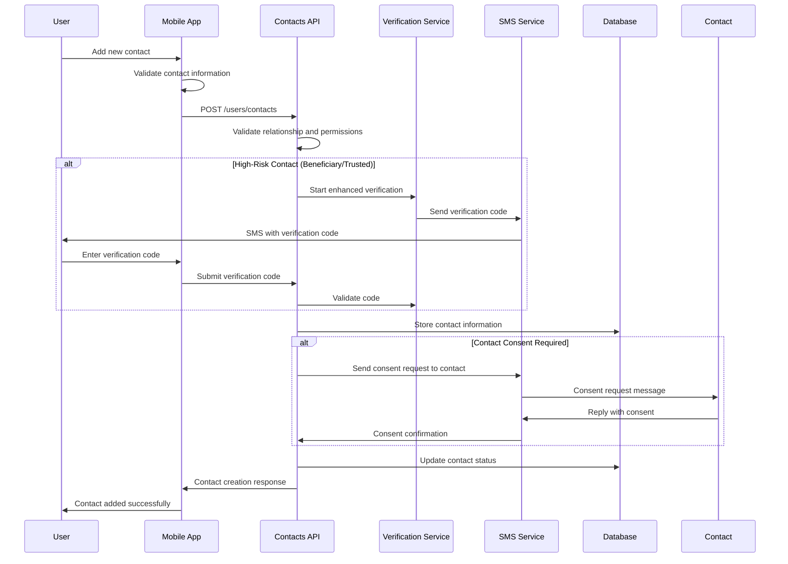

# User Contacts

Manage emergency contacts, trusted connections, and beneficiaries for enhanced security and compliance. This endpoint provides comprehensive contact management with verification, relationship mapping, and inheritance planning features optimized for African family structures.

## Overview

<CardGroup cols={1}>
  <Card>
    **GET/POST/PUT/DELETE** `/v1/users/contacts`
    
    **Authentication**: Bearer token required  
    **Rate Limit**: 30 requests per minute per user  
    **Response Time**: ~200ms average  
    **Verification**: SMS/Email verification for sensitive contacts
  </Card>
</CardGroup>


## Contact Types Overview

```mermaid
graph TD
    A[User Contacts] --> B[Emergency Contacts]
    A --> C[Trusted Connections]
    A --> D[Beneficiaries]
    A --> E[Family Members]
    A --> F[Business Contacts]
    
    B --> B1[Primary Emergency]
    B --> B2[Secondary Emergency]
    B --> B3[Medical Contacts]
    
    C --> C1[Financial Advisors]
    C --> C2[Legal Representatives]
    C --> C3[Account Recovery]
    
    D --> D1[Financial Beneficiaries]
    D --> D2[Insurance Beneficiaries]
    D --> D3[Digital Asset Beneficiaries]
    
    E --> E1[Spouse/Partner]
    E --> E2[Children]
    E --> E3[Parents]
    E --> E4[Siblings]
    E --> E5[Extended Family]
    
    F --> F1[Chama Leaders]
    F --> F2[Investment Advisors]
    F --> F3[Banking Contacts]
```



## Contact Categories

<CardGroup cols={3}>
  <Card title="Emergency Contacts" icon="exclamation-triangle">
    **Primary**: Main emergency contact (required)  
    **Secondary**: Backup emergency contact  
    **Medical**: Healthcare-related emergencies  
    **Verification**: Phone and relationship verification required
  </Card>
  <Card title="Trusted Connections" icon="shield-alt">
    **Financial Advisors**: Investment and financial guidance  
    **Legal Representatives**: Legal matters and compliance  
    **Account Recovery**: Help with account access issues  
    **Verification**: Enhanced verification with documentation
  </Card>
  <Card title="Beneficiaries" icon="users">
    **Financial**: Bank accounts and investments  
    **Insurance**: Life and other insurance policies  
    **Digital Assets**: Platform accounts and digital wealth  
    **Verification**: Legal documentation and witness verification
  </Card>
</CardGroup>

<CardGroup cols={3}>
  <Card title="Family Members" icon="home">
    **Immediate Family**: Spouse, children, parents  
    **Extended Family**: Siblings, grandparents, aunts, uncles  
    **Customizable Relationships**: African family structures  
    **Verification**: Relationship and identity verification
  </Card>
  <Card title="Professional Contacts" icon="briefcase">
    **Chama Leaders**: Savings group administrators  
    **Investment Advisors**: Professional financial guidance  
    **Banking Contacts**: Bank relationship managers  
    **Verification**: Professional credential verification
  </Card>
  <Card title="Community Connections" icon="users">
    **Neighbors**: Local community members  
    **Religious Leaders**: Spiritual advisors and clergy  
    **Community Leaders**: Local traditional authorities  
    **Verification**: Community reference verification
  </Card>
</CardGroup>

## Contact Management Flow



## Request Formats

### Add New Contact

```json
{
  "contactType": "emergency",
  "relationship": "spouse",
  "personalInfo": {
    "firstName": "Thabo",
    "lastName": "Mbeki",
    "phoneNumber": "+27821234567",
    "email": "thabo@example.com",
    "dateOfBirth": "1982-07-20",
    "gender": "male",
    "nationality": "ZA"
  },
  "address": {
    "street": "456 Mandela Street",
    "suburb": "Sandton",
    "city": "Johannesburg",
    "province": "Gauteng",
    "postalCode": "2196",
    "country": "ZA"
  },
  "relationshipDetails": {
    "relationshipType": "spouse",
    "customRelationship": null,
    "marriageDate": "2010-12-15",
    "relationshipDuration": "14_years",
    "livingTogether": true,
    "financiallyDependent": false
  },
  "permissions": {
    "emergencyContact": true,
    "financialAccess": false,
    "medicalDecisions": true,
    "accountRecovery": true,
    "inheritanceRights": true
  },
  "verification": {
    "requireVerification": true,
    "verificationMethods": ["sms", "relationship_proof"],
    "consentRequired": true
  },
  "priority": 1,
  "notes": "Primary emergency contact and spouse"
}
```

### Add Beneficiary Contact

```json
{
  "contactType": "beneficiary",
  "relationship": "child",
  "personalInfo": {
    "firstName": "Lesedi",
    "lastName": "Mbeki",
    "dateOfBirth": "2012-03-10",
    "gender": "female",
    "nationality": "ZA",
    "idNumber": "1203104567089",
    "guardian": {
      "name": "Thabo Mbeki",
      "relationship": "father",
      "contactId": "contact_abc123"
    }
  },
  "beneficiaryDetails": {
    "beneficiaryType": "primary",
    "inheritancePercentage": 50.0,
    "assetTypes": [
      "bank_accounts",
      "investments",
      "insurance_policies",
      "digital_assets"
    ],
    "conditions": {
      "ageRestriction": 21,
      "educationRequirement": "university_graduation",
      "trusteeRequired": true,
      "trustee": "contact_abc123"
    },
    "documents": {
      "birthCertificate": "data:application/pdf;base64,JVBERi0xLjQK...",
      "guardianConsent": "data:application/pdf;base64,JVBERi0xLjQK..."
    }
  },
  "verification": {
    "requireVerification": true,
    "verificationMethods": ["document_verification", "witness_verification"],
    "witnessRequired": true,
    "legalDocumentation": true
  },
  "priority": 1
}
```

### Update Contact

```json
{
  "contactId": "contact_abc123",
  "updates": {
    "personalInfo": {
      "phoneNumber": "+27829876543",
      "email": "thabo.new@example.com"
    },
    "permissions": {
      "financialAccess": true,
      "accountRecovery": true
    },
    "verification": {
      "requireReverification": true,
      "reason": "contact_details_changed"
    }
  },
  "updateReason": "contact_moved_new_details"
}
```

### Search/Filter Contacts

```bash
curl -X GET "https://api.awo-platform.com/v1/users/contacts?type=emergency&verified=true" \
  -H "Authorization: Bearer YOUR_ACCESS_TOKEN"
```

```bash
curl -X GET "https://api.awo-platform.com/v1/users/contacts?relationship=family&include_beneficiaries=true" \
  -H "Authorization: Bearer YOUR_ACCESS_TOKEN"
```

### Delete Contact

```json
{
  "contactId": "contact_abc123",
  "deletionReason": "relationship_ended",
  "confirmDeletion": true,
  "transferBeneficiaryRights": {
    "enabled": true,
    "newBeneficiary": "contact_def456",
    "effectiveDate": "2025-02-01T00:00:00Z"
  },
  "verification": {
    "method": "sms",
    "code": "123456"
  }
}
```

## Response Formats

### Get All Contacts Response

```json
{
  "success": true,
  "data": {
    "contacts": [
      {
        "contactId": "contact_abc123",
        "contactType": "emergency",
        "relationship": "spouse",
        "status": "verified",
        "personalInfo": {
          "firstName": "Thabo",
          "lastName": "Mbeki",
          "displayName": "Thabo M.",
          "phoneNumber": "+27821234567",
          "email": "th***@example.com",
          "profilePicture": "https://cdn.awo-platform.com/contacts/contact_abc123.jpg",
          "lastContact": "2025-01-19T14:30:00Z"
        },
        "relationshipDetails": {
          "relationshipType": "spouse",
          "marriageDate": "2010-12-15",
          "relationshipDuration": "14_years",
          "verified": true,
          "verifiedAt": "2024-08-20T10:00:00Z"
        },
        "permissions": {
          "emergencyContact": true,
          "financialAccess": false,
          "medicalDecisions": true,
          "accountRecovery": true,
          "inheritanceRights": true
        },
        "verification": {
          "status": "verified",
          "verifiedAt": "2024-08-20T10:00:00Z",
          "verificationMethods": ["sms", "relationship_proof"],
          "nextVerificationDue": "2025-08-20T10:00:00Z",
          "consentGiven": true,
          "consentDate": "2024-08-20T10:05:00Z"
        },
        "priority": 1,
        "createdAt": "2024-08-15T16:45:00Z",
        "lastUpdated": "2025-01-15T09:20:00Z"
      },
      {
        "contactId": "contact_def456",
        "contactType": "beneficiary",
        "relationship": "child",
        "status": "verified",
        "personalInfo": {
          "firstName": "Lesedi",
          "lastName": "Mbeki",
          "displayName": "Lesedi M.",
          "dateOfBirth": "2012-03-10",
          "age": 12,
          "minorStatus": true,
          "guardian": {
            "name": "Thabo Mbeki",
            "contactId": "contact_abc123"
          }
        },
        "beneficiaryDetails": {
          "beneficiaryType": "primary",
          "inheritancePercentage": 50.0,
          "estimatedInheritance": {
            "amount": "125000.00",
            "currency": "ZAR",
            "lastCalculated": "2025-01-20T08:00:00Z"
          },
          "assetTypes": [
            "bank_accounts",
            "investments",
            "insurance_policies"
          ],
          "conditions": {
            "ageRestriction": 21,
            "currentAge": 12,
            "yearsUntilEligible": 9,
            "trusteeRequired": true,
            "trustee": "contact_abc123"
          }
        },
        "verification": {
          "status": "verified",
          "verifiedAt": "2024-09-01T15:30:00Z",
          "documentsVerified": [
            "birth_certificate",
            "guardian_consent"
          ],
          "witnessVerification": true,
          "legalDocumentation": true
        },
        "priority": 1,
        "createdAt": "2024-09-01T15:00:00Z"
      }
    ],
    "summary": {
      "totalContacts": 2,
      "byType": {
        "emergency": 1,
        "beneficiary": 1,
        "trusted": 0,
        "family": 2,
        "professional": 0
      },
      "byStatus": {
        "verified": 2,
        "pending": 0,
        "unverified": 0,
        "expired": 0
      },
      "verificationStatus": {
        "allContactsVerified": true,
        "pendingVerifications": 0,
        "nextVerificationDue": "2025-08-20T10:00:00Z"
      }
    }
  },
  "meta": {
    "requestId": "req_contacts_1234567890",
    "timestamp": "2025-01-20T16:30:00Z",
    "processingTime": "0.156s"
  }
}
```

### Add Contact Response

```json
{
  "success": true,
  "data": {
    "contactId": "contact_xyz789",
    "status": "verification_pending",
    "createdAt": "2025-01-20T16:30:00Z",
    "contactInfo": {
      "firstName": "Sarah",
      "lastName": "Ndlovu",
      "phoneNumber": "+27823456789",
      "email": "sa***@example.com"
    },
    "verification": {
      "required": true,
      "methods": ["sms", "email"],
      "smsSent": {
        "to": "+27823456789",
        "status": "delivered",
        "expiresAt": "2025-01-20T17:00:00Z"
      },
      "emailSent": {
        "to": "sa***@example.com",
        "status": "delivered",
        "expiresAt": "2025-01-20T17:00:00Z"
      },
      "consentRequest": {
        "sent": true,
        "method": "sms",
        "message": "Nomsa Mbeki has added you as an emergency contact. Reply YES to confirm.",
        "expiresAt": "2025-01-22T16:30:00Z"
      }
    },
    "nextSteps": [
      "Wait for SMS verification code",
      "Enter verification code to confirm contact",
      "Contact will receive consent request",
      "Contact must consent to being listed"
    ],
    "permissions": {
      "emergencyContact": true,
      "accountRecovery": false,
      "financialAccess": false
    }
  }
}
```

### Contact Verification Failed Response

```json
{
  "success": false,
  "error": {
    "code": "CONTACT_VERIFICATION_FAILED",
    "message": "Contact verification could not be completed",
    "details": {
      "contactId": "contact_xyz789",
      "failureReasons": [
        {
          "verificationType": "sms_verification",
          "reason": "invalid_code",
          "attempts": 3,
          "maxAttempts": 3,
          "message": "Maximum verification attempts exceeded"
        },
        {
          "verificationType": "consent_request",
          "reason": "consent_denied",
          "contactResponse": "NO",
          "message": "Contact declined to be listed as emergency contact"
        }
      ],
      "canRetry": false,
      "retryAvailableAt": "2025-01-21T16:30:00Z"
    }
  },
  "actions": {
    "alternatives": [
      {
        "action": "try_different_contact",
        "description": "Add a different person as emergency contact"
      },
      {
        "action": "contact_directly",
        "description": "Speak with the person directly and try again tomorrow"
      },
      {
        "action": "update_contact_info",
        "description": "Verify you have the correct phone number and email"
      }
    ]
  }
}
```

## Implementation Examples

### React Native Contact Management

```typescript
import React, { useState, useCallback } from 'react';
import { View, Alert, FlatList, TouchableOpacity } from 'react-native';
import { Picker } from '@react-native-picker/picker';

interface Contact {
  contactId: string;
  contactType: string;
  relationship: string;
  personalInfo: any;
  status: string;
  permissions: any;
  verification: any;
}

interface ContactFormData {
  contactType: string;
  relationship: string;
  personalInfo: any;
  permissions: any;
  verification: any;
}

class ContactManager {
  private apiClient: any;
  private relationshipTypes: Map<string, string[]> = new Map();

  constructor(apiClient: any) {
    this.apiClient = apiClient;
    this.initializeRelationshipTypes();
  }

  private initializeRelationshipTypes(): void {
    // African family structure relationships
    this.relationshipTypes.set('family', [
      'spouse', 'partner', 'husband', 'wife',
      'son', 'daughter', 'child',
      'father', 'mother', 'parent',
      'brother', 'sister', 'sibling',
      'grandfather', 'grandmother', 'grandparent',
      'grandson', 'granddaughter', 'grandchild',
      'uncle', 'aunt', 'nephew', 'niece',
      'cousin', 'in_law', 'step_relative'
    ]);

    this.relationshipTypes.set('professional', [
      'financial_advisor', 'lawyer', 'accountant',
      'doctor', 'banker', 'insurance_agent',
      'chama_leader', 'investment_advisor',
      'business_partner', 'employer', 'colleague'
    ]);

    this.relationshipTypes.set('community', [
      'neighbor', 'friend', 'pastor', 'imam',
      'traditional_leader', 'community_leader',
      'teacher', 'mentor', 'godparent'
    ]);
  }

  async getContacts(filters?: {type?: string, verified?: boolean}): Promise<Contact[]> {
    try {
      let url = '/users/contacts';
      const params = new URLSearchParams();
      
      if (filters?.type) params.append('type', filters.type);
      if (filters?.verified !== undefined) params.append('verified', filters.verified.toString());
      
      if (params.toString()) {
        url += `?${params.toString()}`;
      }

      const response = await this.apiClient.get(url);
      
      if (response.data.success) {
        return response.data.data.contacts;
      } else {
        throw new Error(response.data.error.message);
      }
    } catch (error) {
      console.error('Get contacts error:', error);
      throw error;
    }
  }

  async addContact(contactData: ContactFormData): Promise<{success: boolean, contactId?: string, verification?: any}> {
    try {
      const response = await this.apiClient.post('/users/contacts', contactData);
      
      if (response.data.success) {
        return {
          success: true,
          contactId: response.data.data.contactId,
          verification: response.data.data.verification
        };
      } else {
        throw new Error(response.data.error.message);
      }
    } catch (error) {
      console.error('Add contact error:', error);
      return { success: false };
    }
  }

  async updateContact(contactId: string, updates: any): Promise<boolean> {
    try {
      const response = await this.apiClient.put('/users/contacts', {
        contactId,
        updates
      });
      
      return response.data.success;
    } catch (error) {
      console.error('Update contact error:', error);
      return false;
    }
  }

  async deleteContact(contactId: string, reason: string): Promise<boolean> {
    try {
      const response = await this.apiClient.delete('/users/contacts', {
        data: {
          contactId,
          deletionReason: reason,
          confirmDeletion: true
        }
      });
      
      return response.data.success;
    } catch (error) {
      console.error('Delete contact error:', error);
      return false;
    }
  }

  async verifyContact(contactId: string, verificationCode: string): Promise<boolean> {
    try {
      const response = await this.apiClient.post('/users/contacts/verify', {
        contactId,
        verificationCode
      });
      
      return response.data.success;
    } catch (error) {
      console.error('Verify contact error:', error);
      return false;
    }
  }

  getRelationshipTypes(category: string): string[] {
    return this.relationshipTypes.get(category) || [];
  }

  async validateContactInfo(contactInfo: any): Promise<{valid: boolean, errors: string[]}> {
    const errors: string[] = [];
    
    // Basic validation
    if (!contactInfo.firstName || contactInfo.firstName.length < 2) {
      errors.push('First name must be at least 2 characters');
    }
    
    if (!contactInfo.lastName || contactInfo.lastName.length < 2) {
      errors.push('Last name must be at least 2 characters');
    }
    
    // Phone number validation (South African format)
    const phoneRegex = /^\+27[0-9]{9}$/;
    if (!phoneRegex.test(contactInfo.phoneNumber)) {
      errors.push('Phone number must be in format +27XXXXXXXXX');
    }
    
    // Email validation
    const emailRegex = /^[^\s@]+@[^\s@]+\.[^\s@]+$/;
    if (contactInfo.email && !emailRegex.test(contactInfo.email)) {
      errors.push('Invalid email address format');
    }
    
    return {
      valid: errors.length === 0,
      errors
    };
  }
}

// React Hook for Contact Management
const useContacts = () => {
  const [contacts, setContacts] = useState<Contact[]>([]);
  const [loading, setLoading] = useState(true);
  const [error, setError] = useState<string | null>(null);

  const contactManager = new ContactManager(apiClient);

  const loadContacts = useCallback(async (filters?: any) => {
    try {
      setError(null);
      const contactList = await contactManager.getContacts(filters);
      setContacts(contactList);
    } catch (err) {
      setError(err instanceof Error ? err.message : 'Failed to load contacts');
    } finally {
      setLoading(false);
    }
  }, []);

  const addContact = useCallback(async (contactData: ContactFormData) => {
    try {
      setError(null);
      const result = await contactManager.addContact(contactData);
      
      if (result.success) {
        // Reload contacts to get updated list
        await loadContacts();
        
        // Handle verification if required
        if (result.verification?.required) {
          return {
            success: true,
            requiresVerification: true,
            contactId: result.contactId,
            verification: result.verification
          };
        }
        
        return { success: true };
      } else {
        throw new Error('Failed to add contact');
      }
    } catch (err) {
      setError(err instanceof Error ? err.message : 'Failed to add contact');
      return { success: false };
    }
  }, [loadContacts]);

  const updateContact = useCallback(async (contactId: string, updates: any) => {
    try {
      setError(null);
      const success = await contactManager.updateContact(contactId, updates);
      
      if (success) {
        await loadContacts();
        return true;
      } else {
        throw new Error('Failed to update contact');
      }
    } catch (err) {
      setError(err instanceof Error ? err.message : 'Failed to update contact');
      return false;
    }
  }, [loadContacts]);

  const deleteContact = useCallback(async (contactId: string, reason: string) => {
    try {
      setError(null);
      const success = await contactManager.deleteContact(contactId, reason);
      
      if (success) {
        await loadContacts();
        return true;
      } else {
        throw new Error('Failed to delete contact');
      }
    } catch (err) {
      setError(err instanceof Error ? err.message : 'Failed to delete contact');
      return false;
    }
  }, [loadContacts]);

  const verifyContact = useCallback(async (contactId: string, code: string) => {
    try {
      setError(null);
      const success = await contactManager.verifyContact(contactId, code);
      
      if (success) {
        await loadContacts();
        return true;
      } else {
        throw new Error('Verification failed');
      }
    } catch (err) {
      setError(err instanceof Error ? err.message : 'Verification failed');
      return false;
    }
  }, [loadContacts]);

  useEffect(() => {
    loadContacts();
  }, [loadContacts]);

  return {
    contacts,
    loading,
    error,
    addContact,
    updateContact,
    deleteContact,
    verifyContact,
    reload: loadContacts
  };
};

// Contact Form Component
const AddContactForm: React.FC<{
  onSuccess: (contact: any) => void;
  onCancel: () => void;
}> = ({ onSuccess, onCancel }) => {
  const [formData, setFormData] = useState<ContactFormData>({
    contactType: 'emergency',
    relationship: 'spouse',
    personalInfo: {
      firstName: '',
      lastName: '',
      phoneNumber: '',
      email: '',
      dateOfBirth: ''
    },
    permissions: {
      emergencyContact: true,
      financialAccess: false,
      medicalDecisions: false,
      accountRecovery: false
    },
    verification: {
      requireVerification: true,
      verificationMethods: ['sms'],
      consentRequired: true
    }
  });

  const [errors, setErrors] = useState<string[]>([]);
  const [submitting, setSubmitting] = useState(false);
  
  const { addContact } = useContacts();
  const contactManager = new ContactManager(apiClient);

  const handleSubmit = async () => {
    setSubmitting(true);
    setErrors([]);

    try {
      // Validate form data
      const validation = await contactManager.validateContactInfo(formData.personalInfo);
      
      if (!validation.valid) {
        setErrors(validation.errors);
        return;
      }

      // Submit contact
      const result = await addContact(formData);
      
      if (result.success) {
        if (result.requiresVerification) {
          // Show verification screen
          Alert.alert(
            'Verification Required',
            'Please check your SMS for verification code',
            [{ text: 'OK', onPress: () => onSuccess(result) }]
          );
        } else {
          Alert.alert(
            'Contact Added',
            'Contact has been successfully added',
            [{ text: 'OK', onPress: () => onSuccess(result) }]
          );
        }
      }
    } catch (error) {
      Alert.alert('Error', 'Failed to add contact. Please try again.');
    } finally {
      setSubmitting(false);
    }
  };

  const updateFormData = (field: string, value: any) => {
    setFormData(prev => {
      const updated = { ...prev };
      const keys = field.split('.');
      let current = updated;
      
      for (let i = 0; i < keys.length - 1; i++) {
        current = current[keys[i]];
      }
      
      current[keys[keys.length - 1]] = value;
      return updated;
    });
  };

  return (
    <ScrollView style={styles.form}>
      <Text style={styles.sectionTitle}>Contact Type</Text>
      <Picker
        selectedValue={formData.contactType}
        onValueChange={(value) => updateFormData('contactType', value)}
        style={styles.picker}
      >
        <Picker.Item label="Emergency Contact" value="emergency" />
        <Picker.Item label="Trusted Connection" value="trusted" />
        <Picker.Item label="Beneficiary" value="beneficiary" />
        <Picker.Item label="Family Member" value="family" />
        <Picker.Item label="Professional Contact" value="professional" />
      </Picker>

      <Text style={styles.sectionTitle}>Relationship</Text>
      <Picker
        selectedValue={formData.relationship}
        onValueChange={(value) => updateFormData('relationship', value)}
        style={styles.picker}
      >
        {contactManager.getRelationshipTypes('family').map(relationship => (
          <Picker.Item 
            key={relationship}
            label={relationship.replace('_', ' ').toUpperCase()}
            value={relationship}
          />
        ))}
      </Picker>

      <Text style={styles.sectionTitle}>Personal Information</Text>
      
      <TextInput
        placeholder="First Name"
        value={formData.personalInfo.firstName}
        onChangeText={(text) => updateFormData('personalInfo.firstName', text)}
        style={styles.input}
      />
      
      <TextInput
        placeholder="Last Name"
        value={formData.personalInfo.lastName}
        onChangeText={(text) => updateFormData('personalInfo.lastName', text)}
        style={styles.input}
      />
      
      <TextInput
        placeholder="Phone Number (+27XXXXXXXXX)"
        value={formData.personalInfo.phoneNumber}
        onChangeText={(text) => updateFormData('personalInfo.phoneNumber', text)}
        keyboardType="phone-pad"
        style={styles.input}
      />
      
      <TextInput
        placeholder="Email Address (Optional)"
        value={formData.personalInfo.email}
        onChangeText={(text) => updateFormData('personalInfo.email', text)}
        keyboardType="email-address"
        style={styles.input}
      />

      <Text style={styles.sectionTitle}>Permissions</Text>
      
      <View style={styles.permissionRow}>
        <Text style={styles.permissionLabel}>Emergency Contact</Text>
        <Switch
          value={formData.permissions.emergencyContact}
          onValueChange={(value) => updateFormData('permissions.emergencyContact', value)}
        />
      </View>
      
      <View style={styles.permissionRow}>
        <Text style={styles.permissionLabel}>Account Recovery</Text>
        <Switch
          value={formData.permissions.accountRecovery}
          onValueChange={(value) => updateFormData('permissions.accountRecovery', value)}
        />
      </View>

      {errors.length > 0 && (
        <View style={styles.errorContainer}>
          {errors.map((error, index) => (
            <Text key={index} style={styles.errorText}>{error}</Text>
          ))}
        </View>
      )}

      <View style={styles.buttonContainer}>
        <TouchableOpacity 
          onPress={onCancel}
          style={[styles.button, styles.cancelButton]}
        >
          <Text style={styles.cancelButtonText}>Cancel</Text>
        </TouchableOpacity>
        
        <TouchableOpacity 
          onPress={handleSubmit}
          disabled={submitting}
          style={[styles.button, styles.submitButton, submitting && styles.disabledButton]}
        >
          <Text style={styles.submitButtonText}>
            {submitting ? 'Adding...' : 'Add Contact'}
          </Text>
        </TouchableOpacity>
      </View>
    </ScrollView>
  );
};

// Contacts List Component
const ContactsList: React.FC = () => {
  const { contacts, loading, error, deleteContact } = useContacts();
  const [filter, setFilter] = useState<string>('all');

  const filteredContacts = contacts.filter(contact => {
    if (filter === 'all') return true;
    return contact.contactType === filter;
  });

  const handleDeleteContact = (contactId: string, contactName: string) => {
    Alert.alert(
      'Delete Contact',
      `Are you sure you want to remove ${contactName} from your contacts?`,
      [
        { text: 'Cancel', style: 'cancel' },
        {
          text: 'Delete',
          style: 'destructive',
          onPress: () => deleteContact(contactId, 'user_requested')
        }
      ]
    );
  };

  if (loading) {
    return <ContactsSkeletonLoader />;
  }

  if (error) {
    return <ErrorView message={error} onRetry={() => window.location.reload()} />;
  }

  return (
    <View style={styles.container}>
      <ContactsFilter 
        currentFilter={filter}
        onFilterChange={setFilter}
        contactCounts={{
          all: contacts.length,
          emergency: contacts.filter(c => c.contactType === 'emergency').length,
          beneficiary: contacts.filter(c => c.contactType === 'beneficiary').length,
          trusted: contacts.filter(c => c.contactType === 'trusted').length
        }}
      />

      <FlatList
        data={filteredContacts}
        keyExtractor={(item) => item.contactId}
        renderItem={({ item }) => (
          <ContactCard
            contact={item}
            onEdit={() => navigateToEditContact(item.contactId)}
            onDelete={() => handleDeleteContact(item.contactId, item.personalInfo.displayName)}
            onVerify={() => navigateToVerifyContact(item.contactId)}
          />
        )}
        ItemSeparatorComponent={() => <View style={styles.separator} />}
        ListEmptyComponent={() => (
          <EmptyContactsView 
            message={`No ${filter === 'all' ? '' : filter} contacts found`}
            onAddContact={() => navigateToAddContact()}
          />
        )}
      />
    </View>
  );
};
```

## Verification Process

### Multi-Step Verification Flow

<Steps>
  <Step title="Contact Information Verification">
    Verify phone number and email through SMS/email codes sent to the contact
  </Step>
  <Step title="Relationship Verification">
    Provide documentation or witness verification for claimed relationships
  </Step>
  <Step title="Consent Verification">
    Contact must explicitly consent to being listed in the specified role
  </Step>
  <Step title="Identity Verification">
    For beneficiaries and trusted connections, additional identity verification required
  </Step>
  <Step title="Annual Re-verification">
    Periodic re-verification to ensure contact information remains current
  </Step>
</Steps>

### Verification Methods by Contact Type

<CardGroup cols={2}>
  <Card title="Emergency Contacts" icon="exclamation-triangle">
    **Phone Verification**: SMS code to contact's phone  
    **Email Verification**: Email confirmation code  
    **Consent Verification**: Contact must agree to be emergency contact  
    **Relationship Proof**: Optional for close family members
  </Card>
  <Card title="Beneficiaries" icon="users">
    **Identity Verification**: ID document verification  
    **Legal Documentation**: Will, trust, or legal beneficiary documents  
    **Witness Verification**: Independent witness confirmation  
    **Age Verification**: For minor beneficiaries, guardian consent required
  </Card>
</CardGroup>

## African Family Structures

### Extended Family Support

<Accordion title="Traditional African Family Relationships">
**Ubuntu Philosophy Integration**:
- Recognition of extended family responsibility systems
- Community-based support network mapping
- Traditional authority acknowledgment
- Collective decision-making structures

**Polygamous Family Structures**:
- Multiple spouse relationship management
- Complex inheritance hierarchy support
- Children from different mothers/fathers tracking
- Fair distribution planning tools

**Extended Family Networks**:
- Grandparent-grandchild direct relationships
- Uncle/aunt as parental figures
- Cousin relationships with inheritance rights
- Community elder guidance integration

**Cultural Considerations**:
- Traditional marriage vs civil marriage recognition
- Customary law inheritance integration
- Bride price and dowry considerations
- Cultural ceremony documentation support
</Accordion>

### Regional Relationship Types

<CardGroup cols={2}>
  <Card title="Southern African Customs" icon="home">
    **Zulu Traditions**: Extended family hierarchies, clan relationships  
    **Xhosa Customs**: Initiation-based adult recognition, traditional councils  
    **Afrikaner Heritage**: Boer family structures, extended community ties  
    **Mixed Heritage**: Multi-cultural family integration support
  </Card>
  <Card title="Pan-African Integration" icon="globe-africa">
    **West African**: Nigerian, Ghanaian extended family systems  
    **East African**: Kenyan, Tanzanian tribal relationship structures  
    **Central African**: Community-based child-rearing recognition  
    **Diaspora Families**: International family member management
  </Card>
</CardGroup>

## Security Features

### Contact Data Protection

<CardGroup cols={2}>
  <Card title="Data Encryption" icon="lock">
    **Field-Level Encryption**: All sensitive contact data encrypted  
    **Key Management**: Separate encryption keys per contact type  
    **Access Controls**: Role-based access to contact information  
    **Audit Logging**: Complete access history tracking
  </Card>
  <Card title="Privacy Controls" icon="eye-slash">
    **Contact Masking**: Display only necessary information  
    **Permission Levels**: Granular access permission management  
    **Visibility Settings**: Control who can see contact relationships  
    **Data Minimization**: Store only essential contact information
  </Card>
</CardGroup>

### Fraud Prevention

<Accordion title="Contact Security Measures">
**Verification Requirements**:
- Multi-factor verification for high-risk contact types
- Regular re-verification cycles for all contacts
- Suspicious activity monitoring and alerts
- Cross-reference verification with external databases

**Relationship Fraud Prevention**:
- Document verification for claimed relationships
- Witness verification for beneficiary claims
- Community reference checks for traditional relationships
- Government database cross-verification where available

**Access Control Security**:
- Time-limited access permissions
- Emergency access override protocols
- Suspicious access pattern detection
- Geographic access restrictions

**Data Integrity Protection**:
- Contact information change notifications
- Version control for contact modifications
- Rollback capabilities for unauthorized changes
- Regular data consistency checks
</Accordion>

## Inheritance Planning

### Digital Asset Management

<CardGroup cols={2}>
  <Card title="Financial Assets" icon="money-bill-wave">
    **Bank Accounts**: Automatic beneficiary designation  
    **Investments**: Portfolio transfer planning  
    **Insurance**: Beneficiary management integration  
    **Retirement**: Pension and provident fund beneficiaries
  </Card>
  <Card title="Digital Assets" icon="laptop">
    **Platform Access**: AWO account transfer protocols  
    **Cryptocurrency**: Digital wallet inheritance planning  
    **Digital Files**: Document and media transfer  
    **Online Accounts**: Social media and email account handling
  </Card>
</CardGroup>

### Legal Integration

<Steps>
  <Step title="Will Integration">
    Sync with legal will documents and estate planning attorneys
  </Step>
  <Step title="Trust Management">
    Integration with family trust and estate management structures
  </Step>
  <Step title="Guardian Designation">
    Minor children guardian designation and consent management
  </Step>
  <Step title="Power of Attorney">
    Medical and financial power of attorney designation and verification
  </Step>
</Steps>

## Compliance Requirements

### Regional Legal Compliance

<CardGroup cols={2}>
  <Card title="South African Law" icon="scale-balanced">
    **Wills Act**: Legal beneficiary designation compliance  
    **Children's Act**: Minor protection and guardian requirements  
    **Matrimonial Property Act**: Spouse inheritance rights  
    **Traditional Leadership Act**: Customary law recognition
  </Card>
  <Card title="SADC Harmonization" icon="handshake">
    **Cross-Border Recognition**: Multi-country beneficiary support  
    **Legal Framework**: Regional legal standard compliance  
    **Document Verification**: International document acceptance  
    **Enforcement**: Cross-border legal enforcement support
  </Card>
</CardGroup>

### Data Protection Compliance

<Accordion title="Privacy Law Compliance">
**POPIA Compliance (South Africa)**:
- Explicit consent for contact data processing
- Data subject rights for all contacts
- Data processing purpose limitation
- Contact data retention period management

**GDPR Compliance (International)**:
- Right to be forgotten for contacts
- Data portability for contact information
- Consent withdrawal mechanisms
- Cross-border data transfer safeguards

**Regional Privacy Laws**:
- Botswana Data Protection Act compliance
- Namibian privacy legislation adherence
- Zambian data protection requirements
- Regional privacy law harmonization

**Contact Consent Management**:
- Clear consent documentation
- Easy consent withdrawal processes
- Consent renewal notifications
- Granular permission management
</Accordion>

## Related Endpoints

<CardGroup cols={2}>
  <Card title="Contact Verification" href="/api-reference/users/contacts/verify">
    Complete contact verification process and manage verification status
  </Card>
  <Card title="Emergency Protocols" href="/api-reference/users/emergency">
    Emergency contact activation and crisis management procedures
  </Card>
  <Card title="Beneficiary Management" href="/api-reference/users/beneficiaries">
    Advanced beneficiary designation and inheritance planning
  </Card>
  <Card title="Family Accounts" href="/api-reference/users/family">
    Family account linking and shared financial planning features
  </Card>
</CardGroup>

---

**Next Steps**: Implement comprehensive contact management in your application or explore [Emergency Protocols](/api-reference/users/emergency) for crisis management features.