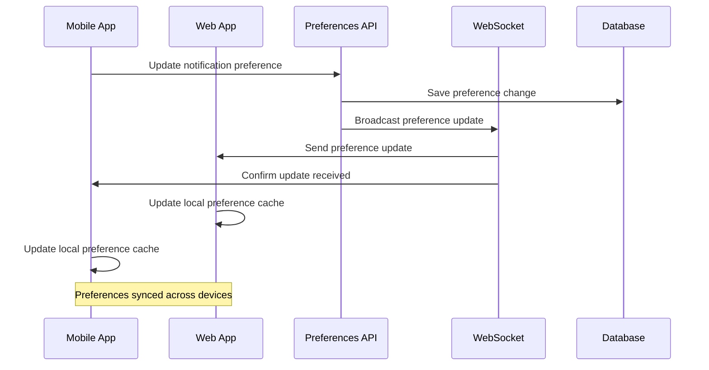

# User Preferences

Manage comprehensive user preferences including language settings, currency preferences, notification controls, privacy settings, and platform customization. Optimized for African markets with multi-language support and regional adaptations.

## Overview

<CardGroup cols={1}>
  <Card>
    **GET/PUT** `/v1/users/preferences`
    
    **Authentication**: Bearer token required  
    **Rate Limit**: 50 requests per minute per user  
    **Response Time**: ~150ms average  
    **Real-time Sync**: Instant preference sync across devices
  </Card>
</CardGroup>

## Preferences Overview

```mermaid
graph TD
    A[User Preferences] --> B[Language & Localization]
    A --> C[Currency & Regional]
    A --> D[Notifications]
    A --> E[Privacy & Security]
    A --> F[Platform Customization]
    
    B --> B1[Interface Language]
    B --> B2[Date/Time Format]
    B --> B3[Number Format]
    B --> B4[Cultural Settings]
    
    C --> C1[Primary Currency]
    C --> C2[Exchange Rates]
    C --> C3[Regional Services]
    C --> C4[Tax Jurisdiction]
    
    D --> D1[Email Notifications]
    D --> D2[SMS Alerts]
    D --> D3[Push Notifications]
    D --> D4[Frequency Controls]
    
    E --> E1[Data Sharing]
    E --> E2[Profile Visibility]
    E --> E3[Marketing Consent]
    E --> E4[Analytics Tracking]
    
    F --> F1[Dashboard Layout]
    F --> F2[Theme Preferences]
    F --> F3[Feature Enablement]
    F --> F4[Accessibility]
```



## Preference Categories

<CardGroup cols={3}>
  <Card title="Language & Regional" icon="globe">
    **Interface Language**: English, Afrikaans, Zulu, Portuguese, French  
    **Date Format**: DD/MM/YYYY, MM/DD/YYYY, YYYY-MM-DD  
    **Number Format**: Comma/decimal preferences  
    **Timezone**: Africa/Johannesburg, Africa/Gaborone, etc.
  </Card>
  <Card title="Financial Settings" icon="money-bill-wave">
    **Primary Currency**: ZAR, BWP, NAD, ZMW  
    **Display Currency**: For multi-currency accounts  
    **Exchange Rate Updates**: Real-time vs daily  
    **Rounding Preferences**: Decimal places for display
  </Card>
  <Card title="Communication" icon="bell">
    **Email Frequency**: Immediate, daily, weekly, monthly  
    **SMS Alerts**: Critical only, transactional, all  
    **Push Notifications**: Real-time, batched, disabled  
    **Language for Communications**: Per channel preferences
  </Card>
</CardGroup>

<CardGroup cols={3}>
  <Card title="Privacy & Data" icon="shield-alt">
    **Data Sharing**: Analytics, marketing, research consent  
    **Profile Visibility**: Public, Chama members only, private  
    **Location Tracking**: For fraud prevention, disabled  
    **Cookie Preferences**: Essential, functional, marketing
  </Card>
  <Card title="Platform Features" icon="cog">
    **Dashboard Layout**: Compact, detailed, cards view  
    **Theme**: Light, dark, auto (system)  
    **Accessibility**: High contrast, large text, screen reader  
    **Feature Flags**: Beta features, experimental options
  </Card>
  <Card title="Investment Settings" icon="chart-line">
    **Risk Preferences**: Conservative, moderate, aggressive  
    **Auto-investing**: Enabled/disabled, frequency  
    **Performance Notifications**: Gains/losses thresholds  
    **Research Alerts**: Market news, analysis updates
  </Card>
</CardGroup>

## Request Formats

### Get User Preferences

```bash
curl -X GET "https://api.awo-platform.com/v1/users/preferences" \
  -H "Authorization: Bearer YOUR_ACCESS_TOKEN" \
  -H "Content-Type: application/json"
```

### Get Specific Preference Category

```bash
curl -X GET "https://api.awo-platform.com/v1/users/preferences?category=notifications" \
  -H "Authorization: Bearer YOUR_ACCESS_TOKEN"
```

### Update All Preferences

```json
{
  "preferences": {
    "language": {
      "interface": "en",
      "communications": "en",
      "fallback": "en"
    },
    "regional": {
      "currency": "ZAR",
      "timezone": "Africa/Johannesburg",
      "country": "ZA",
      "dateFormat": "DD/MM/YYYY",
      "timeFormat": "24h",
      "numberFormat": {
        "decimal": ".",
        "thousands": ",",
        "currency": "R"
      }
    },
    "notifications": {
      "email": {
        "enabled": true,
        "frequency": "daily",
        "types": [
          "diva_score_updates",
          "investment_performance",
          "chama_activities",
          "security_alerts",
          "platform_updates"
        ],
        "digest": true,
        "unsubscribeToken": "token_abc123"
      },
      "sms": {
        "enabled": true,
        "frequency": "immediate",
        "types": [
          "transaction_confirmations",
          "security_codes",
          "urgent_alerts",
          "payment_failures"
        ],
        "quietHours": {
          "enabled": true,
          "start": "22:00",
          "end": "07:00"
        }
      },
      "push": {
        "enabled": true,
        "frequency": "real_time",
        "types": [
          "chama_updates",
          "payment_confirmations",
          "investment_alerts",
          "coaching_reminders",
          "app_updates"
        ],
        "badge": true,
        "sound": true,
        "vibration": true
      },
      "inApp": {
        "enabled": true,
        "persistDuration": "7d",
        "categories": [
          "announcements",
          "tips",
          "achievements",
          "reminders"
        ]
      }
    },
    "privacy": {
      "dataSharing": {
        "analytics": true,
        "marketing": false,
        "research": true,
        "thirdParty": false,
        "anonymizedUsage": true
      },
      "profileVisibility": {
        "chamaMembers": "basic_info",
        "publicProfile": false,
        "searchable": false,
        "showInLeaderboards": true
      },
      "locationTracking": {
        "fraudPrevention": true,
        "serviceImprovement": false,
        "marketing": false
      },
      "cookies": {
        "essential": true,
        "functional": true,
        "analytics": true,
        "marketing": false,
        "preferences": true
      }
    },
    "platform": {
      "theme": {
        "mode": "auto",
        "primaryColor": "#bc9b25",
        "accentColor": "#010101",
        "fontSize": "medium"
      },
      "dashboard": {
        "layout": "cards",
        "defaultView": "overview",
        "showBalance": true,
        "showDivaScore": true,
        "widgetOrder": [
          "balance",
          "diva_score",
          "chamas",
          "investments",
          "recent_transactions"
        ]
      },
      "accessibility": {
        "highContrast": false,
        "largeText": false,
        "screenReader": false,
        "reducedMotion": false,
        "voiceOver": false
      },
      "features": {
        "betaFeatures": false,
        "experimentalFeatures": false,
        "earlyAccess": false,
        "feedbackProgram": true
      }
    },
    "financial": {
      "displayCurrency": "ZAR",
      "exchangeRates": {
        "updateFrequency": "real_time",
        "showConversions": true,
        "baseCurrency": "ZAR"
      },
      "rounding": {
        "displayDecimals": 2,
        "calculationDecimals": 4
      },
      "alerts": {
        "lowBalance": {
          "enabled": true,
          "threshold": "500.00"
        },
        "largeTransactions": {
          "enabled": true,
          "threshold": "5000.00"
        },
        "unusualActivity": {
          "enabled": true,
          "sensitivity": "medium"
        }
      }
    },
    "investment": {
      "riskProfile": "moderate",
      "autoInvesting": {
        "enabled": false,
        "frequency": "monthly",
        "amount": "1000.00"
      },
      "notifications": {
        "performanceUpdates": true,
        "marketNews": true,
        "rebalanceAlerts": true,
        "dividendNotifications": true
      },
      "research": {
        "analysisAlerts": false,
        "recommendationUpdates": true,
        "marketInsights": true
      }
    }
  },
  "metadata": {
    "source": "mobile_app",
    "version": "1.2.0",
    "updateReason": "user_preference_change"
  }
}
```

### Update Specific Preference Category

```json
{
  "category": "notifications",
  "preferences": {
    "email": {
      "enabled": false,
      "types": []
    },
    "sms": {
      "enabled": true,
      "frequency": "immediate",
      "types": ["security_codes", "urgent_alerts"]
    }
  }
}
```

## Response Formats

### Get Preferences Response

```json
{
  "success": true,
  "data": {
    "userId": "usr_7n4m2k8p9q1r",
    "lastUpdated": "2025-01-20T16:30:00Z",
    "preferences": {
      "language": {
        "interface": "en",
        "communications": "en",
        "fallback": "en",
        "supportedLanguages": ["en", "af", "zu", "xh", "pt", "fr"],
        "detectedLanguage": "en",
        "browserLanguage": "en-ZA"
      },
      "regional": {
        "currency": "ZAR",
        "timezone": "Africa/Johannesburg",
        "country": "ZA",
        "dateFormat": "DD/MM/YYYY",
        "timeFormat": "24h",
        "numberFormat": {
          "decimal": ".",
          "thousands": ",",
          "currency": "R"
        },
        "detectedLocation": {
          "country": "ZA",
          "timezone": "Africa/Johannesburg",
          "currency": "ZAR"
        }
      },
      "notifications": {
        "email": {
          "enabled": true,
          "verified": true,
          "address": "nomsa@example.com",
          "frequency": "daily",
          "types": [
            "diva_score_updates",
            "investment_performance",
            "chama_activities"
          ],
          "lastSent": "2025-01-20T08:00:00Z",
          "deliveryStatus": "delivered",
          "unsubscribeUrl": "https://unsubscribe.awo-platform.com/token_abc123"
        },
        "sms": {
          "enabled": true,
          "verified": true,
          "phoneNumber": "+27821234567",
          "frequency": "immediate",
          "types": [
            "transaction_confirmations",
            "security_codes"
          ],
          "lastSent": "2025-01-20T15:45:00Z",
          "deliveryStatus": "delivered",
          "carrier": "MTN",
          "quietHours": {
            "enabled": true,
            "start": "22:00",
            "end": "07:00",
            "timezone": "Africa/Johannesburg"
          }
        },
        "push": {
          "enabled": true,
          "deviceCount": 2,
          "frequency": "real_time",
          "types": [
            "chama_updates",
            "payment_confirmations"
          ],
          "lastSent": "2025-01-20T16:20:00Z",
          "permissions": {
            "granted": true,
            "provisional": false
          }
        }
      },
      "privacy": {
        "dataSharing": {
          "analytics": true,
          "marketing": false,
          "research": true,
          "thirdParty": false,
          "lastUpdated": "2025-01-15T10:00:00Z"
        },
        "profileVisibility": {
          "chamaMembers": "basic_info",
          "publicProfile": false,
          "searchable": false,
          "showInLeaderboards": true
        },
        "gdprCompliance": {
          "consentGiven": true,
          "consentDate": "2024-08-15T10:22:33Z",
          "rightToBeDeleted": true,
          "dataPortability": true
        },
        "popiaCompliance": {
          "consentGiven": true,
          "consentDate": "2024-08-15T10:22:33Z",
          "processingPurposes": [
            "service_provision",
            "fraud_prevention",
            "regulatory_compliance"
          ]
        }
      },
      "platform": {
        "theme": {
          "mode": "auto",
          "currentTheme": "light",
          "primaryColor": "#bc9b25",
          "accentColor": "#010101",
          "fontSize": "medium",
          "customizations": {
            "dashboardCards": "rounded",
            "iconStyle": "filled"
          }
        },
        "dashboard": {
          "layout": "cards",
          "defaultView": "overview",
          "showBalance": true,
          "showDivaScore": true,
          "widgetOrder": [
            "balance",
            "diva_score",
            "chamas",
            "investments"
          ],
          "refreshRate": "real_time"
        },
        "accessibility": {
          "highContrast": false,
          "largeText": false,
          "screenReader": false,
          "reducedMotion": false,
          "detectedRequirements": {
            "screenReader": false,
            "highContrast": false
          }
        }
      },
      "financial": {
        "displayCurrency": "ZAR",
        "exchangeRates": {
          "updateFrequency": "real_time",
          "lastUpdate": "2025-01-20T16:25:00Z",
          "rates": {
            "BWP": 1.35,
            "NAD": 1.00,
            "ZMW": 0.85,
            "USD": 0.054
          }
        },
        "alerts": {
          "lowBalance": {
            "enabled": true,
            "threshold": "500.00",
            "lastTriggered": "2025-01-18T09:30:00Z"
          }
        }
      }
    },
    "inheritedSettings": {
      "fromDevice": {
        "timezone": "Africa/Johannesburg",
        "language": "en",
        "theme": "light"
      },
      "fromBrowser": {
        "language": "en-ZA",
        "timezone": "Africa/Johannesburg"
      }
    },
    "validationResults": {
      "allValid": true,
      "warnings": [],
      "conflicts": []
    }
  },
  "meta": {
    "requestId": "req_preferences_1234567890",
    "timestamp": "2025-01-20T16:30:00Z",
    "processingTime": "0.089s",
    "cacheStatus": "fresh",
    "nextSync": "2025-01-20T16:35:00Z"
  }
}
```

### Update Preferences Response

```json
{
  "success": true,
  "data": {
    "updateId": "pref_upd_abc123xyz789",
    "updatedAt": "2025-01-20T16:30:00Z",
    "updatedCategories": ["notifications", "privacy"],
    "changedFields": [
      "notifications.email.frequency",
      "notifications.sms.types",
      "privacy.dataSharing.marketing"
    ],
    "validationResults": {
      "allValid": true,
      "warnings": [
        {
          "field": "notifications.sms.quietHours",
          "message": "Quiet hours may not apply to security codes",
          "severity": "info"
        }
      ],
      "applied": true
    },
    "impacts": {
      "immediateEffects": [
        "Email notifications will now be sent daily instead of immediately",
        "Marketing data sharing has been disabled"
      ],
      "delayedEffects": [
        "Email digest schedule will update with next email send",
        "Data sharing changes take effect within 24 hours"
      ],
      "deviceSync": {
        "synced": true,
        "devicesUpdated": 2,
        "syncTime": "2025-01-20T16:30:01Z"
      }
    },
    "recommendations": [
      {
        "type": "optimization",
        "message": "Consider enabling investment alerts for better portfolio monitoring",
        "action": "enable_investment_alerts"
      },
      {
        "type": "privacy",
        "message": "You can further enhance privacy by disabling analytics sharing",
        "action": "review_privacy_settings"
      }
    ]
  }
}
```

### Validation Error Response

```json
{
  "success": false,
  "error": {
    "code": "PREFERENCE_VALIDATION_FAILED",
    "message": "Some preference values are invalid",
    "details": {
      "fieldErrors": {
        "notifications.email.frequency": [
          {
            "code": "INVALID_VALUE",
            "message": "Frequency must be one of: immediate, daily, weekly, monthly",
            "allowedValues": ["immediate", "daily", "weekly", "monthly"]
          }
        ],
        "regional.timezone": [
          {
            "code": "UNSUPPORTED_TIMEZONE",
            "message": "Timezone 'Invalid/Timezone' is not supported",
            "suggestion": "Use a valid IANA timezone identifier"
          }
        ]
      },
      "conflictErrors": [
        {
          "code": "NOTIFICATION_CONFLICT",
          "message": "Cannot disable all notification methods while keeping security alerts enabled",
          "conflictingFields": [
            "notifications.email.enabled",
            "notifications.sms.enabled",
            "notifications.push.enabled"
          ],
          "resolution": "Keep at least one notification method enabled for security alerts"
        }
      ]
    }
  }
}
```

## Implementation Examples

### React Native Preferences Manager

```typescript
import React, { useState, useEffect, useCallback } from 'react';
import { View, Switch, Picker, Alert } from 'react-native';
import AsyncStorage from '@react-native-async-storage/async-storage';
import { useNetInfo } from '@react-native-netinfo/netinfo';

interface UserPreferences {
  language: any;
  regional: any;
  notifications: any;
  privacy: any;
  platform: any;
  financial: any;
  investment: any;
}

interface PreferenceUpdate {
  category: string;
  field: string;
  value: any;
}

class PreferencesManager {
  private apiClient: any;
  private cache: Map<string, any> = new Map();
  private pendingUpdates: PreferenceUpdate[] = [];
  private syncTimeout: NodeJS.Timeout | null = null;

  constructor(apiClient: any) {
    this.apiClient = apiClient;
  }

  async getPreferences(category?: string): Promise<UserPreferences | any> {
    try {
      // Check cache first
      const cacheKey = category || 'all';
      const cached = this.cache.get(cacheKey);
      
      if (cached && this.isCacheValid(cached.timestamp)) {
        return cached.data;
      }

      // Build query
      const url = category 
        ? `/users/preferences?category=${category}`
        : '/users/preferences';

      const response = await this.apiClient.get(url);
      
      if (response.data.success) {
        const preferences = response.data.data.preferences;
        
        // Cache response
        this.cache.set(cacheKey, {
          data: preferences,
          timestamp: Date.now()
        });

        // Store locally for offline access
        await this.storeLocalPreferences(preferences, category);
        
        return preferences;
      } else {
        throw new Error(response.data.error.message);
      }
    } catch (error) {
      console.error('Preferences fetch error:', error);
      
      // Fallback to local cache
      const localPrefs = await this.getLocalPreferences(category);
      if (localPrefs) {
        return localPrefs;
      }
      
      throw error;
    }
  }

  async updatePreference(
    category: string, 
    field: string, 
    value: any, 
    immediate: boolean = false
  ): Promise<void> {
    try {
      // Update local cache immediately for responsive UI
      await this.updateLocalPreference(category, field, value);
      
      if (immediate) {
        // Send immediately for critical preferences
        await this.sendUpdate(category, field, value);
      } else {
        // Queue for batch update
        this.queueUpdate(category, field, value);
        this.scheduleSync();
      }
    } catch (error) {
      console.error('Preference update error:', error);
      throw error;
    }
  }

  private queueUpdate(category: string, field: string, value: any): void {
    // Remove any existing update for the same field
    this.pendingUpdates = this.pendingUpdates.filter(
      update => !(update.category === category && update.field === field)
    );
    
    // Add new update
    this.pendingUpdates.push({ category, field, value });
  }

  private scheduleSync(): void {
    // Clear existing timeout
    if (this.syncTimeout) {
      clearTimeout(this.syncTimeout);
    }
    
    // Schedule new sync (debounced)
    this.syncTimeout = setTimeout(() => {
      this.syncPendingUpdates();
    }, 2000); // 2 second delay
  }

  private async syncPendingUpdates(): Promise<void> {
    if (this.pendingUpdates.length === 0) return;

    try {
      // Group updates by category
      const updatesByCategory = this.groupUpdatesByCategory();
      
      // Send batch updates
      for (const [category, updates] of updatesByCategory.entries()) {
        await this.sendBatchUpdate(category, updates);
      }
      
      // Clear pending updates
      this.pendingUpdates = [];
    } catch (error) {
      console.error('Sync error:', error);
      // Keep updates in queue for retry
    }
  }

  private groupUpdatesByCategory(): Map<string, PreferenceUpdate[]> {
    const grouped = new Map<string, PreferenceUpdate[]>();
    
    this.pendingUpdates.forEach(update => {
      if (!grouped.has(update.category)) {
        grouped.set(update.category, []);
      }
      grouped.get(update.category)!.push(update);
    });
    
    return grouped;
  }

  private async sendUpdate(category: string, field: string, value: any): Promise<void> {
    const updateData = {
      category,
      preferences: this.buildNestedObject(field, value)
    };

    const response = await this.apiClient.put('/users/preferences', updateData);
    
    if (!response.data.success) {
      throw new Error(response.data.error.message);
    }
  }

  private async sendBatchUpdate(category: string, updates: PreferenceUpdate[]): Promise<void> {
    const preferences: any = {};
    
    updates.forEach(update => {
      Object.assign(preferences, this.buildNestedObject(update.field, update.value));
    });

    const updateData = {
      category,
      preferences
    };

    const response = await this.apiClient.put('/users/preferences', updateData);
    
    if (!response.data.success) {
      throw new Error(response.data.error.message);
    }
  }

  private buildNestedObject(path: string, value: any): any {
    const keys = path.split('.');
    const result: any = {};
    let current = result;
    
    for (let i = 0; i < keys.length - 1; i++) {
      current[keys[i]] = {};
      current = current[keys[i]];
    }
    
    current[keys[keys.length - 1]] = value;
    return result;
  }

  private async updateLocalPreference(category: string, field: string, value: any): Promise<void> {
    try {
      const cacheKey = category;
      const cached = this.cache.get(cacheKey);
      
      if (cached) {
        const keys = field.split('.');
        let current = cached.data;
        
        // Navigate to parent object
        for (let i = 0; i < keys.length - 1; i++) {
          if (!current[keys[i]]) {
            current[keys[i]] = {};
          }
          current = current[keys[i]];
        }
        
        // Set value
        current[keys[keys.length - 1]] = value;
        
        // Update cache timestamp
        cached.timestamp = Date.now();
      }

      // Update local storage
      const localPrefs = await AsyncStorage.getItem('userPreferences');
      if (localPrefs) {
        const preferences = JSON.parse(localPrefs);
        const keys = field.split('.');
        let current = preferences[category] || {};
        
        for (let i = 0; i < keys.length - 1; i++) {
          if (!current[keys[i]]) {
            current[keys[i]] = {};
          }
          current = current[keys[i]];
        }
        
        current[keys[keys.length - 1]] = value;
        preferences[category] = current;
        
        await AsyncStorage.setItem('userPreferences', JSON.stringify(preferences));
      }
    } catch (error) {
      console.warn('Local preference update failed:', error);
    }
  }

  private async storeLocalPreferences(preferences: any, category?: string): Promise<void> {
    try {
      if (category) {
        // Update specific category
        const existing = await AsyncStorage.getItem('userPreferences');
        const allPrefs = existing ? JSON.parse(existing) : {};
        allPrefs[category] = preferences;
        await AsyncStorage.setItem('userPreferences', JSON.stringify(allPrefs));
      } else {
        // Store all preferences
        await AsyncStorage.setItem('userPreferences', JSON.stringify(preferences));
      }
    } catch (error) {
      console.warn('Local storage failed:', error);
    }
  }

  private async getLocalPreferences(category?: string): Promise<any> {
    try {
      const stored = await AsyncStorage.getItem('userPreferences');
      if (!stored) return null;
      
      const preferences = JSON.parse(stored);
      return category ? preferences[category] : preferences;
    } catch (error) {
      console.warn('Local preferences retrieval failed:', error);
      return null;
    }
  }

  private isCacheValid(timestamp: number): boolean {
    const cacheTimeout = 5 * 60 * 1000; // 5 minutes
    return (Date.now() - timestamp) < cacheTimeout;
  }

  // Force sync all pending updates
  async forceSyncAll(): Promise<void> {
    if (this.syncTimeout) {
      clearTimeout(this.syncTimeout);
      this.syncTimeout = null;
    }
    await this.syncPendingUpdates();
  }

  // Get offline status
  isOffline(): boolean {
    return this.pendingUpdates.length > 0;
  }
}

// React Hook for Preferences
const usePreferences = () => {
  const [preferences, setPreferences] = useState<UserPreferences | null>(null);
  const [loading, setLoading] = useState(true);
  const [error, setError] = useState<string | null>(null);
  const [hasUnsyncedChanges, setHasUnsyncedChanges] = useState(false);
  
  const netInfo = useNetInfo();
  const preferencesManager = new PreferencesManager(apiClient);

  const loadPreferences = useCallback(async (category?: string) => {
    try {
      setError(null);
      const prefs = await preferencesManager.getPreferences(category);
      setPreferences(prefs);
    } catch (err) {
      setError(err instanceof Error ? err.message : 'Failed to load preferences');
    } finally {
      setLoading(false);
    }
  }, []);

  const updatePreference = useCallback(async (
    category: string,
    field: string,
    value: any,
    immediate: boolean = false
  ) => {
    try {
      await preferencesManager.updatePreference(category, field, value, immediate);
      setHasUnsyncedChanges(preferencesManager.isOffline());
      
      // Update local state immediately
      setPreferences(prev => {
        if (!prev) return prev;
        
        const updated = { ...prev };
        const keys = field.split('.');
        let current = updated[category as keyof UserPreferences] as any;
        
        for (let i = 0; i < keys.length - 1; i++) {
          current = current[keys[i]];
        }
        current[keys[keys.length - 1]] = value;
        
        return updated;
      });
    } catch (err) {
      setError(err instanceof Error ? err.message : 'Failed to update preference');
      throw err;
    }
  }, []);

  const syncPendingChanges = useCallback(async () => {
    try {
      await preferencesManager.forceSyncAll();
      setHasUnsyncedChanges(false);
    } catch (err) {
      setError(err instanceof Error ? err.message : 'Failed to sync changes');
    }
  }, []);

  // Auto-sync when coming online
  useEffect(() => {
    if (netInfo.isConnected && hasUnsyncedChanges) {
      syncPendingChanges();
    }
  }, [netInfo.isConnected, hasUnsyncedChanges, syncPendingChanges]);

  useEffect(() => {
    loadPreferences();
  }, [loadPreferences]);

  return {
    preferences,
    loading,
    error,
    hasUnsyncedChanges,
    updatePreference,
    syncPendingChanges,
    reload: () => loadPreferences()
  };
};

// Preferences Screen Component
const PreferencesScreen: React.FC = () => {
  const { 
    preferences, 
    loading, 
    error, 
    hasUnsyncedChanges, 
    updatePreference 
  } = usePreferences();

  if (loading) {
    return <PreferencesSkeletonLoader />;
  }

  if (error) {
    return <ErrorView message={error} onRetry={() => window.location.reload()} />;
  }

  return (
    <ScrollView style={styles.container}>
      {hasUnsyncedChanges && (
        <SyncStatusBanner message="Changes will sync when you're online" />
      )}

      <PreferenceSection title="Language & Region" icon="globe">
        <LanguageSelector 
          value={preferences?.language?.interface}
          onchange={(value) => updatePreference('language', 'interface', value)}
        />
        <CurrencySelector
          value={preferences?.regional?.currency}
          onChange={(value) => updatePreference('regional', 'currency', value)}
        />
      </PreferenceSection>

      <PreferenceSection title="Notifications" icon="bell">
        <NotificationToggle
          title="Email Notifications"
          value={preferences?.notifications?.email?.enabled}
          onChange={(value) => updatePreference('notifications', 'email.enabled', value)}
        />
        <NotificationToggle
          title="SMS Alerts"
          value={preferences?.notifications?.sms?.enabled}
          onChange={(value) => updatePreference('notifications', 'sms.enabled', value)}
        />
      </PreferenceSection>

      <PreferenceSection title="Privacy" icon="shield-alt">
        <PrivacyToggle
          title="Analytics Sharing"
          description="Help improve AWO by sharing anonymous usage data"
          value={preferences?.privacy?.dataSharing?.analytics}
          onChange={(value) => updatePreference('privacy', 'dataSharing.analytics', value)}
        />
      </PreferenceSection>
    </ScrollView>
  );
};
```

## Localization Support

### Multi-Language Implementation

<CardGroup cols={2}>
  <Card title="Supported Languages" icon="language">
    **English (en)**: Primary interface language  
    **Afrikaans (af)**: South African native support  
    **Zulu (zu)**: South African native support  
    **Xhosa (xh)**: South African native support  
    **Portuguese (pt)**: Mozambique and Angola  
    **French (fr)**: Francophone African countries
  </Card>
  <Card title="Regional Adaptations" icon="map-marker-alt">
    **Date Formats**: DD/MM/YYYY (Africa), MM/DD/YYYY (US style)  
    **Number Formats**: European (1.234,56) vs US (1,234.56)  
    **Currency Display**: Local currency symbols and formatting  
    **Time Zones**: All SADC time zones supported
  </Card>
</CardGroup>

### Cultural Preferences

<Accordion title="Cultural Adaptation Features">
**Name Formatting**:
- Support for multiple name formats (first/last, single names)
- Cultural titles and honorifics
- Maiden name and family name preferences
- Name pronunciation guides

**Address Formats**:
- Country-specific address layouts
- Postal code formats and validation
- Province/state naming conventions
- Urban vs rural address styles

**Communication Styles**:
- Formal vs informal language preferences
- Cultural greeting preferences
- Business vs personal communication tone
- Local idioms and expressions

**Calendar and Time**:
- Local holiday calendars
- Business hour preferences
- Weekend definitions (Friday/Saturday vs Saturday/Sunday)
- Prayer time considerations
</Accordion>

## Notification Management

### Notification Channel Configuration

<CardGroup cols={3}>
  <Card title="Email Notifications" icon="envelope">
    **Frequency Options**: Immediate, hourly, daily, weekly  
    **Content Types**: HTML, plain text  
    **Languages**: Per-user language preference  
    **Unsubscribe**: One-click unsubscribe with re-subscribe option
  </Card>
  <Card title="SMS Alerts" icon="mobile-alt">
    **Delivery**: MTN, Vodacom, Cell C, Airtel optimized  
    **Quiet Hours**: Configurable per time zone  
    **Character Limits**: Optimized for cost and clarity  
    **Emergency Override**: Critical alerts bypass quiet hours
  </Card>
  <Card title="Push Notifications" icon="bell">
    **Real-time**: Instant delivery when online  
    **Batching**: Smart batching for battery optimization  
    **Rich Content**: Images, actions, deep linking  
    **Scheduling**: Time zone aware scheduling
  </Card>
</CardGroup>

### Smart Notification Logic

```typescript
// Intelligent notification frequency management
interface NotificationConfig {
  type: string;
  frequency: 'immediate' | 'hourly' | 'daily' | 'weekly';
  quietHours: {
    enabled: boolean;
    start: string;
    end: string;
  };
  priority: 'low' | 'medium' | 'high' | 'critical';
}

class SmartNotificationManager {
  async shouldSendNotification(
    config: NotificationConfig,
    userTimezone: string,
    lastSent?: Date
  ): Promise<boolean> {
    const now = new Date();
    const userTime = this.convertToUserTimezone(now, userTimezone);
    
    // Critical notifications always send
    if (config.priority === 'critical') {
      return true;
    }
    
    // Check quiet hours
    if (config.quietHours.enabled && this.isQuietHour(userTime, config.quietHours)) {
      return false;
    }
    
    // Check frequency limits
    if (lastSent && !this.hasFrequencyElapsed(lastSent, config.frequency)) {
      return false;
    }
    
    return true;
  }
  
  private isQuietHour(time: Date, quietHours: any): boolean {
    const hour = time.getHours();
    const start = parseInt(quietHours.start.split(':')[0]);
    const end = parseInt(quietHours.end.split(':')[0]);
    
    if (start < end) {
      return hour >= start && hour < end;
    } else {
      // Quiet hours cross midnight
      return hour >= start || hour < end;
    }
  }
  
  private hasFrequencyElapsed(lastSent: Date, frequency: string): boolean {
    const now = Date.now();
    const lastSentTime = lastSent.getTime();
    
    switch (frequency) {
      case 'immediate':
        return true;
      case 'hourly':
        return (now - lastSentTime) >= 3600000; // 1 hour
      case 'daily':
        return (now - lastSentTime) >= 86400000; // 24 hours
      case 'weekly':
        return (now - lastSentTime) >= 604800000; // 7 days
      default:
        return true;
    }
  }
}
```

## Privacy Controls

### Data Sharing Preferences

<CardGroup cols={2}>
  <Card title="Granular Controls" icon="sliders-h">
    **Analytics Data**: Usage patterns, feature adoption  
    **Marketing Data**: Preferences, demographics  
    **Research Data**: Anonymous insights for product improvement  
    **Third-party Sharing**: External partner data sharing
  </Card>
  <Card title="Compliance Features" icon="scale-balanced">
    **GDPR Rights**: Access, rectification, erasure, portability  
    **POPIA Compliance**: South African data protection  
    **Consent Management**: Clear, informed consent tracking  
    **Data Minimization**: Collect only necessary data
  </Card>
</CardGroup>

### Profile Visibility Settings

<Steps>
  <Step title="Public Profile">
    Control what information is visible in public directories and search results
  </Step>
  <Step title="Chama Visibility">
    Configure what Chama members can see about your profile and activity
  </Step>
  <Step title="Leaderboard Participation">
    Choose whether to appear in achievement leaderboards and competitions
  </Step>
  <Step title="Contact Preferences">
    Manage how other users can contact you through the platform
  </Step>
</Steps>

## African Market Features

### Mobile Data Optimization

<CardGroup cols={2}>
  <Card title="Data Efficiency" icon="download">
    **Preference Sync**: Minimal data usage for preference updates  
    **Offline Caching**: Store preferences locally for offline access  
    **Compression**: Gzip compression for all preference API calls  
    **Delta Updates**: Only sync changed preferences
  </Card>
  <Card title="Network Resilience" icon="signal">
    **Retry Logic**: Intelligent retry for failed preference updates  
    **Queue Management**: Offline preference change queuing  
    **Conflict Resolution**: Handle preference conflicts gracefully  
    **Background Sync**: Sync preferences in background when possible
  </Card>
</CardGroup>

### Regional Feature Adaptation

<Accordion title="Country-Specific Features">
**South Africa**:
- POPIA compliance features and consent management
- South African bank integration preferences
- Zulu, Xhosa, and Afrikaans language support
- Rand currency formatting and preferences

**Botswana**:
- Bank of Botswana compliance features
- Pula currency support and formatting
- Setswana language support (future)
- Local payment method preferences

**Namibia**:
- Namibian Dollar currency support
- Windhoek timezone and holiday calendar
- German language support (future)
- Local banking preference integration

**Zambia**:
- Zambian Kwacha currency support
- Lusaka timezone configuration
- Local language support expansion
- Mobile money provider preferences
</Accordion>

## Real-time Synchronization

### Cross-Device Preference Sync



<CardGroup cols={2}>
  <Card title="Instant Sync" icon="sync-alt">
    **WebSocket Updates**: Real-time preference sync across devices  
    **Conflict Resolution**: Last-write-wins with user notification  
    **Atomic Updates**: All-or-nothing preference batch updates  
    **Version Control**: Preference change versioning and history
  </Card>
  <Card title="Offline Support" icon="wifi">
    **Local Storage**: Preferences cached locally for offline access  
    **Queue Management**: Offline changes queued for sync  
    **Merge Strategy**: Smart merging of offline and online changes  
    **Sync Indicators**: Clear indicators of sync status
  </Card>
</CardGroup>

## Related Endpoints

<CardGroup cols={2}>
  <Card title="User Profile" href="/api-reference/users/profile">
    View complete user profile information
  </Card>
  <Card title="Notification Settings" href="/api-reference/notifications/preferences">
    Advanced notification configuration
  </Card>
  <Card title="Device Management" href="/api-reference/users/devices">
    Manage trusted devices and device-specific preferences
  </Card>
  <Card title="Privacy Settings" href="/api-reference/users/privacy">
    Advanced privacy and data sharing controls
  </Card>
</CardGroup>

---

**Next Steps**: Implement comprehensive preference management in your application or explore [Device Management](/api-reference/users/devices) for device-specific configurations.