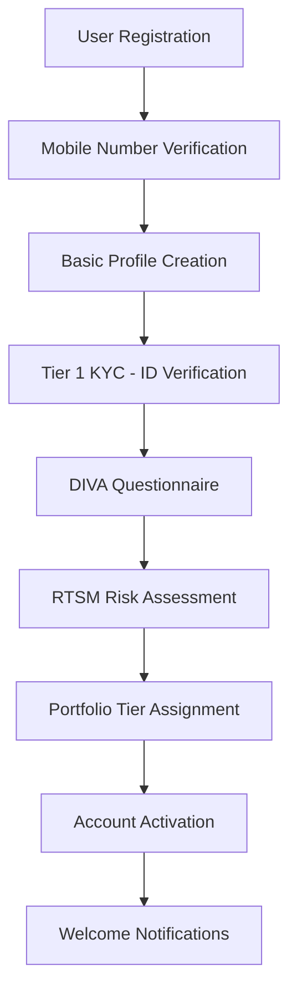
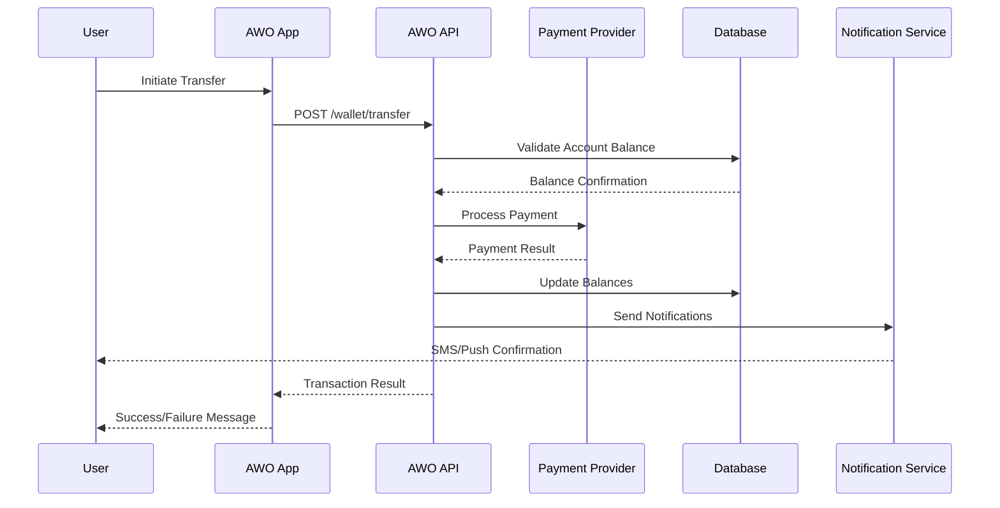
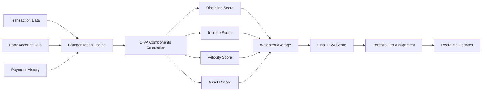
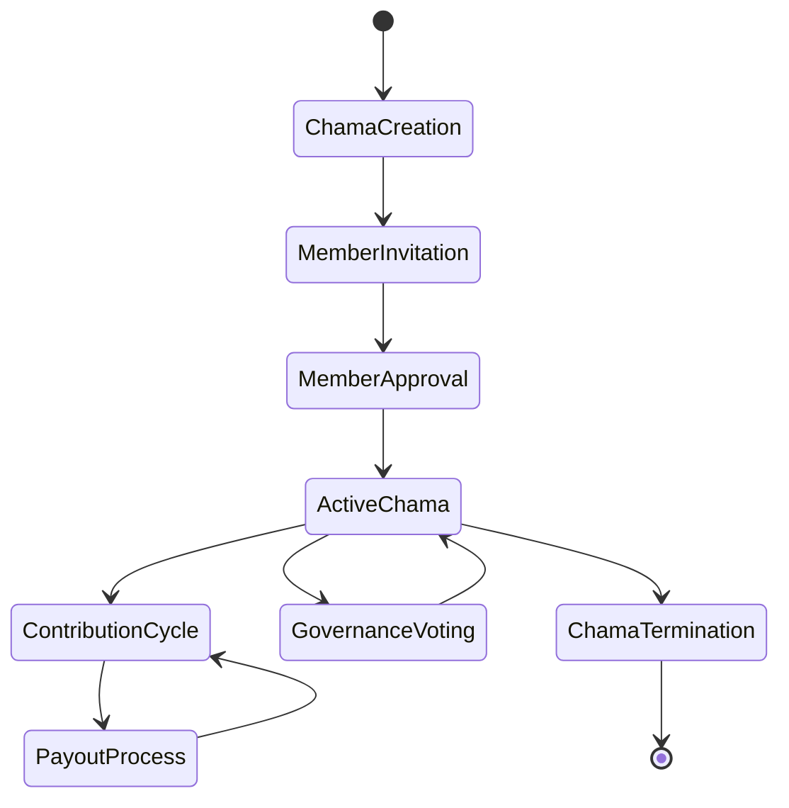
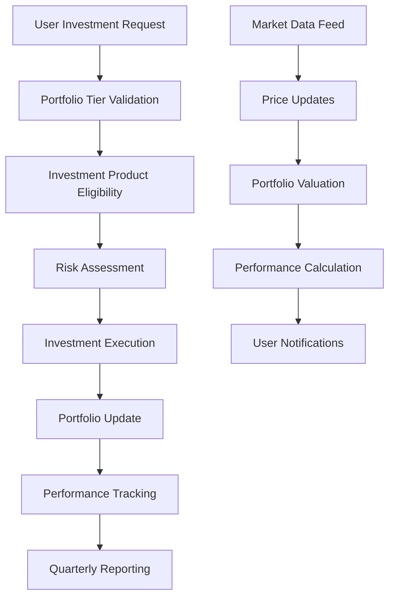
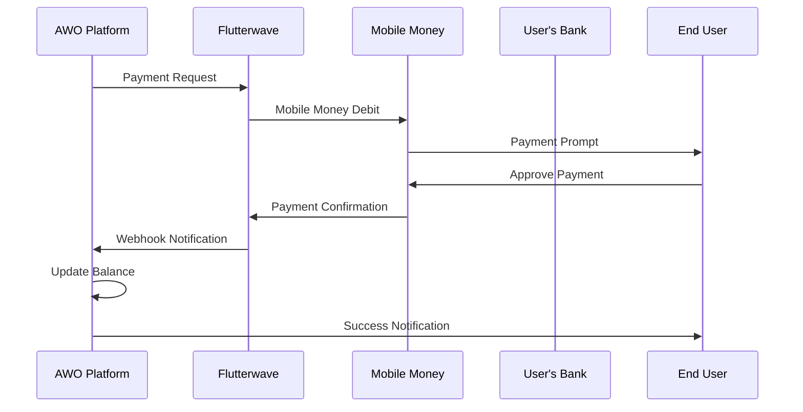
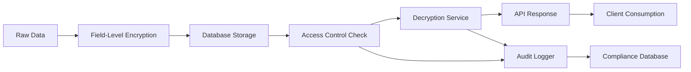

# Data Flow

AWO Platform orchestrates complex data flows across multiple systems, ensuring secure, real-time, and reliable data processing from user interactions to external integrations and back to user interfaces.

## Overview of Data Flow Architecture

<Info>
AWO processes data through multiple interconnected flows: user authentication, financial transactions, DIVA scoring, Chama management, investment processing, and external integrations, all coordinated through event-driven architecture.
</Info>

### Primary Data Flow Categories

<CardGroup cols={2}>
  <Card title="User-Initiated Flows" icon="user">
    Authentication, profile management, transactions, Chama operations, investment actions
  </Card>
  <Card title="System-Generated Flows" icon="computer">
    DIVA score calculations, automated notifications, scheduled tasks, compliance monitoring
  </Card>
</CardGroup>

<CardGroup cols={2}>
  <Card title="External Integration Flows" icon="message">
    Banking APIs, payment gateways, KYC services, SMS/email providers
  </Card>
  <Card title="Real-Time Flows" icon="bolt">
    Live notifications, Chama updates, transaction confirmations, score changes
  </Card>
</CardGroup>

## User Authentication & Onboarding Flow

### Registration and KYC Process



**Detailed Data Flow:**

<Steps>
  <Step title="User Registration Request">
    **Input**: Mobile number, email, basic details  
    **Processing**: Validation, duplicate checking  
    **Output**: User UUID, verification token  
    **Storage**: `users` table with `pending` status
  </Step>
  <Step title="Mobile Verification">
    **Input**: OTP code from user  
    **Processing**: Token validation, expiry check  
    **Output**: Verification confirmation  
    **Update**: User status to `mobile_verified`
  </Step>
  <Step title="Tier 1 KYC Processing">
    **Input**: ID number, nationality, address  
    **Processing**: Smile ID API verification  
    **Output**: Identity verification result  
    **Storage**: `kyc_verifications` table with status
  </Step>
  <Step title="DIVA & RTSM Assessment">
    **Input**: Questionnaire responses  
    **Processing**: Score calculation algorithms  
    **Output**: Initial DIVA score, risk profile  
    **Storage**: `diva_scores`, `risk_profiles` tables
  </Step>
  <Step title="Portfolio Assignment">
    **Input**: DIVA score, risk tolerance  
    **Processing**: Business rules engine  
    **Output**: Portfolio tier (Bronze/Silver/Gold/Platinum)  
    **Storage**: `user_portfolios` table
  </Step>
</Steps>

### Authentication Flow

```typescript
// Authentication data flow
interface AuthFlow {
  login: {
    input: { email: string; password: string; mfaToken?: string };
    validation: CredentialValidation;
    processing: SessionCreation;
    output: { accessToken: string; refreshToken: string; user: UserProfile };
    storage: { sessions: RedisSession; audit: DatabaseLog };
  };
  
  tokenRefresh: {
    input: { refreshToken: string };
    validation: TokenValidation;
    processing: TokenGeneration;
    output: { accessToken: string; refreshToken: string };
    storage: { sessions: RedisUpdate };
  };
}
```

## Financial Transaction Flows

### Wallet Transaction Processing



**Transaction Data Flow Components:**

<CardGroup cols={2}>
  <Card title="Pre-Transaction Validation" icon="shield">
    **Checks**: Account balance, daily limits, fraud detection  
    **Data Sources**: `accounts`, `transactions`, `user_limits`  
    **Output**: Validation result, risk score
  </Card>
  <Card title="Payment Processing" icon="credit-card">
    **Integration**: Flutterwave, mobile money APIs  
    **Data Exchange**: Encrypted payment details  
    **Webhooks**: Real-time status updates
  </Card>
</CardGroup>

<CardGroup cols={2}>
  <Card title="Transaction Recording" icon="database">
    **Storage**: Immutable transaction records  
    **Updates**: Account balances, transaction history  
    **Auditing**: Compliance logs, audit trails
  </Card>
  <Card title="Real-Time Notifications" icon="bell">
    **Channels**: Push, SMS, email, WhatsApp  
    **Content**: Transaction confirmation, balance updates  
    **Delivery**: Multi-channel notification system
  </Card>
</CardGroup>

### Bank Account Integration Flow

```typescript
// Open Banking data flow
interface BankIntegrationFlow {
  accountLinking: {
    input: { bankCode: string; userConsent: ConsentToken };
    processing: StitchOAuthFlow;
    output: { accountToken: string; accountDetails: BankAccount[] };
    storage: { encrypted_tokens: DatabaseStorage; consent_logs: AuditTrail };
  };
  
  transactionSync: {
    trigger: ScheduledJob | UserRequest;
    processing: BankAPIFetch;
    output: { transactions: Transaction[]; balances: AccountBalance[] };
    analysis: TransactionCategorization;
    storage: { transactions: DatabaseUpdate; diva_impact: ScoreRecalculation };
  };
}
```

## DIVA Scoring System Data Flow

### Score Calculation Process



**DIVA Calculation Data Pipeline:**

<Steps>
  <Step title="Data Collection">
    **Sources**: Bank transactions, wallet activity, payment history  
    **Frequency**: Real-time for wallet, daily batch for bank data  
    **Volume**: 1000+ transactions per user per month  
    **Processing**: Data normalization and validation
  </Step>
  <Step title="Transaction Categorization">
    **Algorithm**: Rule-based categorization engine  
    **Categories**: Income, expenses, savings, investments  
    **ML Enhancement**: Pattern recognition for improved accuracy  
    **Output**: Categorized transaction dataset
  </Step>
  <Step title="Component Score Calculation">
    **Discipline**: Payment punctuality, overdraft avoidance (30% weight)  
    **Income**: Stability, growth, diversification (25% weight)  
    **Velocity**: Cash flow timing, efficiency (25% weight)  
    **Assets**: Savings rate, investment balance (20% weight)
  </Step>
  <Step title="Score Aggregation">
    **Formula**: Weighted average of components  
    **Range**: 0-1000 scale  
    **Validation**: Business rule validation  
    **Storage**: `diva_scores` table with timestamp
  </Step>
  <Step title="Real-Time Updates">
    **Trigger**: New transaction processing  
    **Processing**: Incremental score updates  
    **Notification**: Socket.io real-time updates  
    **Cache**: Redis cache invalidation and refresh
  </Step>
</Steps>

### Score History and Analytics

```typescript
// DIVA analytics data flow
interface DivaAnalyticsFlow {
  historicalAnalysis: {
    input: { userId: string; dateRange: DateRange };
    processing: TimeSeriesAnalysis;
    output: { trends: ScoreTrend[]; insights: ScoreInsight[] };
    visualization: ChartData;
  };
  
  benchmarkingAnalysis: {
    input: { userScore: DivaScore; demographicFilters: UserFilters };
    processing: PeerComparison;
    output: { percentile: number; recommendations: Recommendation[] };
    privacy: AnonymizedComparison;
  };
}
```

## Chama Management Data Flows

### Chama Creation and Member Management



**Chama Data Flow Stages:**

<CardGroup cols={2}>
  <Card title="Formation Phase" icon="circle">
    **Creator Actions**: Group setup, rules definition  
    **Data Storage**: `chamas` table, governance rules  
    **Notifications**: Member invitation messages  
    **Validation**: Minimum member requirements
  </Card>
  <Card title="Operational Phase" icon="users">
    **Member Activities**: Contributions, voting, communication  
    **Financial Tracking**: Balance management, transaction logs  
    **Governance**: Proposal creation, voting mechanisms  
    **Reporting**: Monthly statements, performance analytics
  </Card>
</CardGroup>

### Contribution and Payout Processing

```typescript
// Chama financial flow
interface ChamaFinancialFlow {
  contributionProcessing: {
    input: { memberId: string; amount: number; dueDate: Date };
    validation: MembershipValidation;
    processing: PaymentDeduction;
    output: { transactionId: string; newBalance: number };
    notifications: MemberNotifications;
    storage: { contributions: DatabaseRecord; audit: ComplianceLog };
  };
  
  payoutDistribution: {
    trigger: ScheduledPayout | DemocraticApproval;
    validation: GovernanceRules;
    processing: FundsDistribution;
    output: { payoutRecords: PayoutRecord[]; remainingBalance: number };
    notifications: PayoutConfirmations;
  };
}
```

## Investment Platform Data Flows

### Portfolio Management and Investment Processing



**Investment Data Processing:**

<Steps>
  <Step title="Investment Request Processing">
    **Input**: Investment amount, product selection  
    **Validation**: Tier limits, eligibility checks  
    **Processing**: Order execution via investment APIs  
    **Output**: Investment confirmation, portfolio update
  </Step>
  <Step title="Market Data Integration">
    **Sources**: Real-time market data feeds  
    **Processing**: Price updates, portfolio valuations  
    **Frequency**: Real-time during market hours  
    **Storage**: Time-series market data tables
  </Step>
  <Step title="Performance Calculation">
    **Metrics**: Return calculations, benchmark comparisons  
    **Frequency**: Daily processing, monthly reporting  
    **Output**: Performance reports, achievement notifications  
    **Storage**: `portfolio_performance` tracking tables
  </Step>
</Steps>

### SME Investment Data Flow

```typescript
// SME investment process
interface SMEInvestmentFlow {
  opportunityCreation: {
    input: SMEApplication;
    processing: DueDiligenceReview;
    output: InvestmentOpportunity;
    storage: { sme_businesses: BusinessProfile; opportunities: InvestmentListing };
  };
  
  investmentExecution: {
    input: { userId: string; opportunityId: string; amount: number };
    validation: TierEligibilityCheck;
    processing: InvestmentFacilitation;
    output: InvestmentRecord;
    notifications: InvestorNotifications;
  };
  
  democraticVoting: {
    trigger: GroupInvestmentProposal;
    processing: MemberVotingProcess;
    aggregation: VoteCalculation;
    execution: ConditionalInvestment;
    outcome: InvestmentDecision;
  };
}
```

## External Integration Data Flows

### Payment Gateway Integration



**Integration Data Flows:**

<CardGroup cols={2}>
  <Card title="Payment Processing" icon="credit-card">
    **Providers**: Flutterwave, M-Pesa, MTN MoMo  
    **Flow**: Request → Processing → Webhook → Confirmation  
    **Data**: Encrypted payment details, status updates  
    **Error Handling**: Retry logic, failure notifications
  </Card>
  <Card title="Banking Integration" icon="building">
    **Providers**: Stitch (SA), Mono (West Africa)  
    **Flow**: OAuth → Account Linking → Transaction Sync  
    **Data**: Account details, transaction history  
    **Security**: Encrypted token storage, consent management
  </Card>
</CardGroup>

<CardGroup cols={2}>
  <Card title="KYC Services" icon="shield">
    **Provider**: Smile ID  
    **Flow**: Document Upload → Verification → Status Update  
    **Data**: Identity documents, verification results  
    **Compliance**: AML screening, regulatory reporting
  </Card>
  <Card title="Communication Services" icon="message">
    **Providers**: Twilio (SMS), SendGrid (Email), Expo (Push)  
    **Flow**: Event → Template → Delivery → Status Tracking  
    **Data**: User preferences, delivery confirmations  
    **Personalization**: Language, timing, channel preferences
  </Card>
</CardGroup>

## Real-Time Data Flows

### Socket.io Event Architecture

```typescript
// Real-time event system
interface RealtimeEventFlow {
  chamaEvents: {
    contribution: { chamaId: string; memberId: string; amount: number };
    voting: { proposalId: string; vote: VoteChoice; voterId: string };
    payout: { chamaId: string; amount: number; recipients: string[] };
  };
  
  scoreEvents: {
    scoreUpdate: { userId: string; newScore: number; change: number };
    tierChange: { userId: string; oldTier: string; newTier: string };
    achievement: { userId: string; achievement: Achievement };
  };
  
  transactionEvents: {
    paymentProcessed: { userId: string; transactionId: string; amount: number };
    paymentFailed: { userId: string; error: PaymentError };
    balanceUpdate: { userId: string; newBalance: number };
  };
}
```

### Event Broadcasting Strategy

<Steps>
  <Step title="Event Generation">
    **Triggers**: Database changes, external webhooks, scheduled jobs  
    **Processing**: Event creation with metadata  
    **Routing**: Event type-based routing to appropriate handlers
  </Step>
  <Step title="User Targeting">
    **Individual**: User-specific events (score updates, transactions)  
    **Group**: Chama-level events (contributions, voting)  
    **Broadcast**: System-wide announcements
  </Step>
  <Step title="Real-Time Delivery">
    **Channel**: Socket.io WebSocket connections  
    **Fallback**: Push notifications for offline users  
    **Acknowledgment**: Delivery confirmation and retry logic
  </Step>
</Steps>

## Data Security and Privacy Flows

### Encryption and Access Control



**Security Data Flow Components:**

<CardGroup cols={2}>
  <Card title="Data Encryption" icon="lock">
    **At Rest**: AES-256 encryption for sensitive fields  
    **In Transit**: TLS 1.3 for all API communications  
    **Key Management**: Regular key rotation, secure storage  
    **Field-Level**: PII and financial data encryption
  </Card>
  <Card title="Access Control" icon="key">
    **Authentication**: JWT token validation  
    **Authorization**: Role-based access control  
    **Audit Trail**: Comprehensive access logging  
    **Data Masking**: Sensitive data masking in logs
  </Card>
</CardGroup>

## Data Analytics and Reporting Flows

### Business Intelligence Pipeline

```typescript
// Analytics data pipeline
interface AnalyticsFlow {
  userBehaviorAnalytics: {
    collection: UserInteractionEvents;
    processing: BehaviorAnalysis;
    aggregation: UserSegmentation;
    insights: BehaviorInsights;
    reporting: AnalyticsDashboard;
  };
  
  financialAnalytics: {
    collection: TransactionData;
    processing: FinancialMetrics;
    aggregation: PlatformKPIs;
    insights: TrendAnalysis;
    reporting: ExecutiveDashboard;
  };
  
  complianceReporting: {
    collection: AuditLogs;
    processing: ComplianceMetrics;
    aggregation: RegulatoryReports;
    submission: AutomatedReporting;
  };
}
```

### Performance Monitoring Data Flow

<Steps>
  <Step title="Metrics Collection">
    **Sources**: Application logs, database queries, external APIs  
    **Types**: Performance metrics, error rates, user behavior  
    **Frequency**: Real-time and batch processing  
    **Storage**: Time-series databases for historical analysis
  </Step>
  <Step title="Analysis and Alerting">
    **Processing**: Automated analysis of metrics trends  
    **Thresholds**: Performance and error rate thresholds  
    **Alerting**: Real-time alerts for critical issues  
    **Dashboards**: Visual monitoring dashboards
  </Step>
  <Step title="Optimization Feedback">
    **Insights**: Performance bottleneck identification  
    **Recommendations**: Automated optimization suggestions  
    **Implementation**: Performance improvement deployment  
    **Validation**: Post-deployment performance verification
  </Step>
</Steps>

## Data Backup and Recovery Flows

### Backup Strategy

<CardGroup cols={2}>
  <Card title="Continuous Backup" icon="hard-drive">
    **Frequency**: Real-time transaction log shipping  
    **Scope**: All critical business data  
    **Storage**: Multi-region backup storage  
    **Retention**: 7 years for compliance
  </Card>
  <Card title="Point-in-Time Recovery" icon="clock">
    **Capability**: 15-minute recovery points  
    **Testing**: Monthly recovery testing  
    **Documentation**: Recovery procedures  
    **Automation**: Automated recovery processes
  </Card>
</CardGroup>

---

*This comprehensive data flow documentation ensures all stakeholders understand how information moves through AWO Platform, enabling effective troubleshooting, optimization, and scaling across the SADC region.*

*Last updated: June 2025*  
*Next review: July 2025*