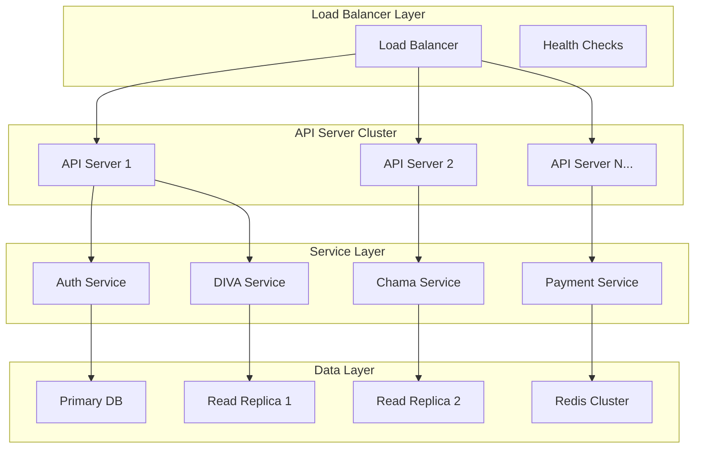
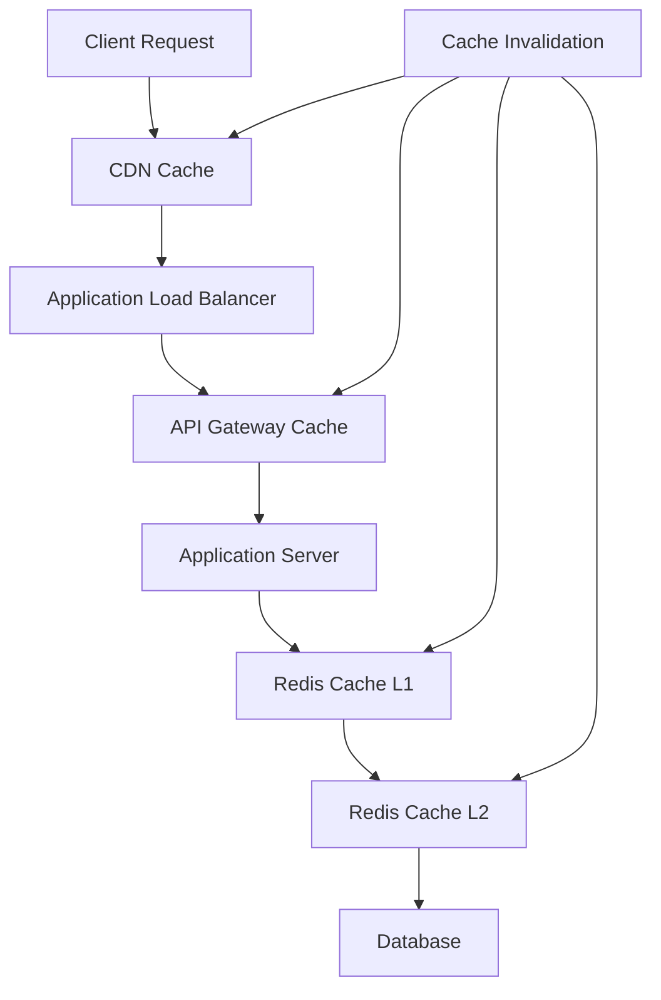

# Scalability Design

AWO Platform is architected for horizontal and vertical scaling to support growth from 50,000 users in Year 1 to over 1 million users across the SADC region by 2030, while maintaining performance and reliability standards.

## Scalability Overview

<Info>
AWO's scalability strategy addresses the unique challenges of the African market including variable internet connectivity, diverse device capabilities, and distributed user bases across multiple countries with different infrastructure maturity levels.
</Info>

### Scaling Dimensions

<CardGroup cols={2}>
  <Card title="User Growth Scaling" icon="users">
    **Target**: 1M+ users by 2030  
    **Challenge**: 20x user growth over 5 years  
    **Approach**: Horizontal scaling with load balancing  
    **Bottlenecks**: Database connections, API throughput
  </Card>
  <Card title="Geographic Scaling" icon="map">
    **Target**: 6+ SADC countries  
    **Challenge**: Multi-region deployment complexity  
    **Approach**: Edge locations and CDN distribution  
    **Bottlenecks**: Data sovereignty, latency
  </Card>
</CardGroup>

<CardGroup cols={2}>
  <Card title="Transaction Volume Scaling" icon="credit-card">
    **Target**: 10M+ transactions monthly  
    **Challenge**: Real-time payment processing  
    **Approach**: Queue-based processing with redundancy  
    **Bottlenecks**: Payment gateway limits, database writes
  </Card>
  <Card title="Data Growth Scaling" icon="database">
    **Target**: 100TB+ data by 2030  
    **Challenge**: Query performance at scale  
    **Approach**: Database sharding and read replicas  
    **Bottlenecks**: Complex queries, reporting performance
  </Card>
</CardGroup>

## Application Layer Scaling

### Horizontal Scaling Architecture



### Auto-Scaling Configuration

**Horizontal Pod Autoscaler (HPA) Settings:**

<CardGroup cols={2}>
  <Card title="CPU-Based Scaling" icon="computer">
    **Trigger**: 70% average CPU utilization  
    **Min Replicas**: 2 per service  
    **Max Replicas**: 20 per service  
    **Scale-up**: Add 2 replicas when threshold exceeded  
    **Scale-down**: Remove 1 replica every 5 minutes when below 40%
  </Card>
  <Card title="Memory-Based Scaling" icon="server">
    **Trigger**: 80% memory utilization  
    **Buffer**: 20% memory headroom maintained  
    **Monitoring**: Real-time memory usage tracking  
    **Alerts**: Memory pressure warnings at 85%
  </Card>
</CardGroup>

<CardGroup cols={2}>
  <Card title="Request-Based Scaling" icon="chart-line">
    **Trigger**: 1000 requests per second per instance  
    **Queue Depth**: Scale when queue depth &gt; 50  
    **Response Time**: Scale when p95 latency &gt; 500ms  
    **Custom Metrics**: DIVA calculation queue length
  </Card>
  <Card title="Regional Scaling" icon="globe">
    **Africa Hours**: Increased capacity 6 AM - 10 PM CAT  
    **Off-Peak**: Reduced capacity with minimum baselines  
    **Event-Driven**: Automatic scaling for promotional events  
    **Predictive**: ML-based capacity planning
  </Card>
</CardGroup>

### Service-Specific Scaling Strategies

```typescript
// Service scaling configuration
interface ServiceScalingConfig {
  authService: {
    baseReplicas: 3;
    maxReplicas: 15;
    scalingMetrics: ['cpu_utilization', 'auth_requests_per_second'];
    specialConsiderations: 'JWT verification CPU intensive';
  };
  
  divaService: {
    baseReplicas: 2;
    maxReplicas: 10;
    scalingMetrics: ['queue_depth', 'calculation_time'];
    specialConsiderations: 'Heavy computation, memory intensive';
  };
  
  chamaService: {
    baseReplicas: 2;
    maxReplicas: 12;
    scalingMetrics: ['active_groups', 'real_time_connections'];
    specialConsiderations: 'WebSocket connections, stateful';
  };
  
  paymentService: {
    baseReplicas: 4;
    maxReplicas: 20;
    scalingMetrics: ['transaction_volume', 'external_api_latency'];
    specialConsiderations: 'Critical path, high availability required';
  };
}
```

## Database Scaling Strategy

### PostgreSQL Scaling Architecture

**Multi-Tier Database Approach:**

<Steps>
  <Step title="Read Replica Strategy">
    **Primary Database**: All write operations  
    **Read Replicas**: 3+ replicas for read-heavy workloads  
    **Geographic Distribution**: Replicas in each target region  
    **Load Balancing**: Smart routing based on query type
  </Step>
  <Step title="Vertical Scaling Limits">
    **Current Capacity**: 16 vCPU, 64GB RAM (Neon serverless)  
    **Scaling Threshold**: 80% resource utilization  
    **Maximum Single Instance**: 32 vCPU, 128GB RAM  
    **Migration Point**: Move to sharded architecture
  </Step>
  <Step title="Horizontal Sharding Preparation">
    **Shard Key**: User ID hash-based partitioning  
    **Shard Count**: Initial 4 shards, expandable to 16  
    **Cross-Shard Queries**: Application-level federation  
    **Migration Strategy**: Online shard migration tools
  </Step>
</Steps>

### Database Performance Optimization

**Query Optimization Strategy:**

<CardGroup cols={2}>
  <Card title="Indexing Strategy" icon="list">
    **Primary Indexes**: All foreign keys and frequently queried fields  
    **Composite Indexes**: Multi-column indexes for complex queries  
    **Partial Indexes**: Filtered indexes for conditional queries  
    **Maintenance**: Automated index analysis and recommendations
  </Card>
  <Card title="Query Performance" icon="bolt">
    **Slow Query Monitoring**: Queries &gt; 100ms logged and analyzed  
    **Connection Pooling**: PgBouncer with 20 connections per CPU  
    **Prepared Statements**: Parameterized queries for performance  
    **Query Cache**: Redis caching for expensive read queries
  </Card>
</CardGroup>

### Data Partitioning Strategy

```sql
-- Time-based partitioning for transactions
CREATE TABLE transactions (
    id UUID PRIMARY KEY,
    user_id UUID NOT NULL,
    amount DECIMAL(10,2),
    created_at TIMESTAMP WITH TIME ZONE NOT NULL
) PARTITION BY RANGE (created_at);

-- Monthly partitions for performance
CREATE TABLE transactions_2025_01 PARTITION OF transactions
    FOR VALUES FROM ('2025-01-01') TO ('2025-02-01');

-- User-based partitioning for DIVA scores
CREATE TABLE diva_scores (
    user_id UUID PRIMARY KEY,
    score INTEGER NOT NULL,
    calculated_at TIMESTAMP WITH TIME ZONE
) PARTITION BY HASH (user_id);

-- 4 initial hash partitions
CREATE TABLE diva_scores_0 PARTITION OF diva_scores
    FOR VALUES WITH (MODULUS 4, REMAINDER 0);
```

## Caching and Performance Scaling

### Multi-Layer Caching Strategy



**Caching Layers:**

<CardGroup cols={2}>
  <Card title="CDN Caching (L0)" icon="globe">
    **Provider**: Cloudflare  
    **Content**: Static assets, API responses (5-60 min TTL)  
    **Regions**: SADC edge locations  
    **Purging**: Automated cache invalidation on deployments
  </Card>
  <Card title="API Gateway Cache (L1)" icon="server">
    **Technology**: NGINX proxy cache  
    **Content**: GET API responses (1-15 min TTL)  
    **Size**: 1GB cache per gateway instance  
    **Strategy**: LRU eviction with cache warming
  </Card>
</CardGroup>

<CardGroup cols={2}>
  <Card title="Application Cache (L2)" icon="computer">
    **Technology**: Redis Cluster  
    **Content**: Session data, computed scores, user profiles  
    **TTL**: Variable (15 min - 24 hours)  
    **Cluster**: 6-node cluster with replication
  </Card>
  <Card title="Database Cache (L3)" icon="database">
    **Technology**: PostgreSQL buffer cache  
    **Content**: Frequently accessed data pages  
    **Size**: 25% of available memory  
    **Optimization**: Automated buffer cache tuning
  </Card>
</CardGroup>

### Redis Cluster Scaling

```typescript
// Redis scaling configuration
interface RedisScalingConfig {
  cluster: {
    nodes: 6;
    masters: 3;
    replicas: 3;
    maxMemory: '8GB per node';
    evictionPolicy: 'allkeys-lru';
  };
  
  sharding: {
    hashSlots: 16384;
    distribution: 'Even distribution across masters';
    rebalancing: 'Automatic slot migration';
  };
  
  monitoring: {
    memoryUsage: 'Alert at 80% memory usage';
    keyspaceHits: 'Monitor cache hit ratio (target: >90%)';
    connectionCount: 'Alert at 80% max connections';
    latency: 'P99 latency < 1ms target';
  };
  
  scaling: {
    verticalScaling: 'Increase memory per node to 16GB';
    horizontalScaling: 'Add master-replica pairs';
    trigger: '85% memory usage or <85% hit ratio';
  };
}
```

## Real-Time System Scaling

### WebSocket Connection Management

**Socket.io Scaling Architecture:**

<Steps>
  <Step title="Connection Distribution">
    **Load Balancing**: Sticky sessions for WebSocket connections  
    **Connection Limits**: 10,000 connections per server instance  
    **Scaling Threshold**: Scale when 8,000 connections reached  
    **Failover**: Automatic reconnection on server failure
  </Step>
  <Step title="Message Broadcasting">
    **Redis Adapter**: Redis pub/sub for cross-server messaging  
    **Room Management**: Efficient room-based message routing  
    **Message Queuing**: Reliable message delivery guarantees  
    **Backpressure**: Connection throttling under high load
  </Step>
  <Step title="Real-Time Analytics">
    **Connection Monitoring**: Real-time connection count tracking  
    **Message Metrics**: Message throughput and latency monitoring  
    **Error Tracking**: WebSocket error rate monitoring  
    **Performance**: Memory usage per connection optimization
  </Step>
</Steps>

### Event Processing Scaling

```typescript
// Event processing configuration
interface EventProcessingScale {
  eventQueue: {
    technology: 'Redis Streams';
    partitions: 8;
    consumers: 'Auto-scaling consumer groups';
    throughput: '10,000 events/second target';
  };
  
  processingStrategy: {
    chamaEvents: 'Real-time processing required';
    divaUpdates: 'Batch processing acceptable (5-minute delay)';
    notifications: 'Near real-time (30-second delay)';
    analytics: 'Batch processing (hourly aggregation)';
  };
  
  scaling: {
    queueDepth: 'Scale consumers when queue > 1000 events';
    processingTime: 'Scale when average processing > 100ms';
    errorRate: 'Scale and alert when error rate > 1%';
  };
}
```

## Regional and Geographic Scaling

### Multi-Region Deployment Strategy

**Regional Infrastructure:**

<CardGroup cols={2}>
  <Card title="Primary Region (South Africa)" icon="server">
    **Location**: Cape Town / Johannesburg  
    **Capacity**: Full platform deployment  
    **Database**: Primary with local read replicas  
    **Users**: South African users (60% of total)
  </Card>
  <Card title="Secondary Regions" icon="globe">
    **Locations**: Botswana, Namibia, Zambia  
    **Capacity**: API gateway + cache + read replica  
    **Database**: Read-only replicas  
    **Users**: Local country users (40% of total)
  </Card>
</CardGroup>

### Data Sovereignty and Compliance

**Regional Data Management:**

<Steps>
  <Step title="Data Residency Requirements">
    **South Africa**: POPIA compliance requires local data storage  
    **Botswana**: Data Protection Act preferences for local storage  
    **Regional Backups**: Cross-border backup for disaster recovery  
    **Compliance**: Regular audit of data location compliance
  </Step>
  <Step title="Cross-Border Data Flows">
    **User Consent**: Explicit consent for cross-border processing  
    **Encryption**: End-to-end encryption for cross-border transfers  
    **Audit Trail**: Comprehensive logging of data movements  
    **Regulatory**: Regular review of changing regulations
  </Step>
</Steps>

### Edge Computing Strategy

```typescript
// Edge deployment configuration
interface EdgeScalingStrategy {
  edgeLocations: {
    tier1: ['Cape Town', 'Johannesburg']; // Full API deployment
    tier2: ['Gaborone', 'Windhoek', 'Lusaka']; // Cache + proxy
    tier3: ['Smaller cities']; // CDN only
  };
  
  cacheStrategy: {
    staticContent: 'Full caching at all edge locations';
    apiResponses: 'Intelligent caching based on user location';
    userProfiles: 'Cache in user\'s home region';
    realTimeData: 'No caching, direct to primary region';
  };
  
  failover: {
    edgeFailure: 'Route traffic to nearest healthy edge';
    regionFailure: 'Failover to primary region';
    crossRegionLatency: 'Acceptable latency increase during failover';
  };
}
```

## Mobile Application Scaling

### Client-Side Performance Optimization

**Mobile Scaling Challenges:**

<CardGroup cols={2}>
  <Card title="Device Diversity" icon="mobile">
    **Range**: From basic Android devices to flagship phones  
    **Memory**: 1GB - 16GB RAM across user base  
    **Storage**: 8GB - 512GB available storage  
    **Network**: 2G/3G/4G/5G variable connectivity
  </Card>
  <Card title="Offline Capability" icon="wifi-off">
    **Local Storage**: 50MB cached data per user  
    **Sync Strategy**: Intelligent sync when connectivity available  
    **Conflict Resolution**: Last-write-wins with user notification  
    **Critical Features**: Core wallet functions work offline
  </Card>
</CardGroup>

### App Bundle Optimization

```typescript
// Mobile optimization configuration
interface MobileOptimizationConfig {
  bundleStrategy: {
    codesplitting: 'Feature-based code splitting';
    lazyLoading: 'Lazy load non-critical screens';
    treeShaking: 'Remove unused dependencies';
    compression: 'Gzip compression for JS bundles';
  };
  
  assetOptimization: {
    images: 'WebP format with JPEG fallback';
    fonts: 'Subset fonts for used characters only';
    icons: 'SVG icons with PNG fallback';
    videos: 'Adaptive bitrate streaming';
  };
  
  performanceTargets: {
    bundleSize: 'Main bundle < 5MB';
    startupTime: 'Cold start < 3 seconds';
    memoryUsage: 'Peak memory < 150MB';
    batteryImpact: 'Minimal background processing';
  };
}
```

## Monitoring and Observability at Scale

### Scalable Monitoring Architecture

**Monitoring Infrastructure:**

<CardGroup cols={3}>
  <Card title="Metrics Collection" icon="chart-line">
    **Technology**: Prometheus + Grafana  
    **Retention**: 15 days high-resolution, 1 year aggregated  
    **Cardinality**: Max 1M unique metric series  
    **Collection**: 15-second intervals for critical metrics
  </Card>
  <Card title="Log Aggregation" icon="file-text">
    **Technology**: ELK Stack (Elasticsearch, Logstash, Kibana)  
    **Volume**: 100GB logs per day at scale  
    **Retention**: 30 days searchable, 1 year archived  
    **Indexing**: Structured logging with JSON format
  </Card>
  <Card title="Distributed Tracing" icon="git-branch">
    **Technology**: Jaeger  
    **Sampling**: 1% of traces at high volume  
    **Retention**: 7 days detailed traces  
    **Correlation**: Request ID tracking across services
  </Card>
</CardGroup>

### Performance Monitoring KPIs

**Scaling Performance Targets:**

<CardGroup cols={2}>
  <Card title="API Performance" icon="zap">
    **Response Time**: P95 &lt; 300ms, P99 &lt; 1s  
    **Throughput**: 10,000 requests/second capability  
    **Error Rate**: &lt; 0.1% for critical endpoints  
    **Availability**: 99.9% uptime (8.76 hours downtime/year)
  </Card>
  <Card title="Database Performance" icon="database">
    **Query Time**: P95 &lt; 100ms, P99 &lt; 500ms  
    **Connection Pool**: &lt; 80% utilization  
    **Replication Lag**: &lt; 1 second for read replicas  
    **Disk I/O**: &lt; 80% utilization
  </Card>
</CardGroup>

## Cost Optimization at Scale

### Resource Cost Management

**Cost Optimization Strategies:**

<Steps>
  <Step title="Right-Sizing Resources">
    **CPU Optimization**: Target 70-80% average utilization  
    **Memory Optimization**: Monitor and adjust memory allocation  
    **Storage Optimization**: Automated data lifecycle policies  
    **Network Optimization**: Regional traffic routing for cost
  </Step>
  <Step title="Reserved Instance Strategy">
    **Commitment**: 1-year reserved instances for predictable workloads  
    **Spot Instances**: Use for batch processing and development  
    **Scaling**: On-demand instances for auto-scaling peaks  
    **Optimization**: Regular review and adjustment of reservations
  </Step>
  <Step title="Data Transfer Optimization">
    **CDN Usage**: Minimize origin server requests  
    **Compression**: Gzip/Brotli compression for all responses  
    **Regional**: Keep traffic within regions when possible  
    **Monitoring**: Track and optimize data transfer costs
  </Step>
</Steps>

### Financial Scaling Model

```typescript
// Cost scaling projections
interface CostScalingModel {
  userGrowthCosts: {
    year1: { users: 50000, monthlyCost: '$15,000' };
    year3: { users: 350000, monthlyCost: '$75,000' };
    year5: { users: 1000000, monthlyCost: '$180,000' };
  };
  
  costBreakdown: {
    infrastructure: '60% (servers, database, storage)';
    networking: '15% (CDN, data transfer)';
    security: '10% (security tools, compliance)';
    monitoring: '5% (observability stack)';
    miscellaneous: '10% (backup, disaster recovery)';
  };
  
  optimizationTargets: {
    costPerUser: 'Target $0.18/user/month at scale';
    revenueRatio: 'Infrastructure cost < 20% of revenue';
    efficiency: 'Cost per transaction < $0.02';
  };
}
```

## Disaster Recovery and Business Continuity

### Scaling Disaster Recovery

**Multi-Region DR Strategy:**

<CardGroup cols={2}>
  <Card title="Active-Passive DR" icon="shield">
    **Primary**: South Africa (Active)  
    **Secondary**: Botswana (Passive)  
    **RTO**: 4 hours (Recovery Time Objective)  
    **RPO**: 15 minutes (Recovery Point Objective)
  </Card>
  <Card title="Cross-Border Backup" icon="hard-drive">
    **Frequency**: Continuous database replication  
    **Storage**: 3 geographic locations minimum  
    **Testing**: Monthly DR testing exercises  
    **Documentation**: Detailed recovery procedures
  </Card>
</CardGroup>

### Scaling Testing Strategy

**Performance Testing at Scale:**

<Steps>
  <Step title="Load Testing">
    **Tools**: k6, JMeter for API load testing  
    **Scenarios**: Normal load, peak load, stress testing  
    **Frequency**: Weekly automated tests, monthly full-scale tests  
    **Metrics**: Response times, error rates, resource utilization
  </Step>
  <Step title="Chaos Engineering">
    **Tools**: Chaos Monkey, Gremlin for failure injection  
    **Scenarios**: Server failures, network partitions, database issues  
    **Schedule**: Monthly chaos experiments  
    **Learning**: Continuous improvement of resilience
  </Step>
  <Step title="Capacity Planning">
    **Modeling**: Predictive capacity modeling based on growth  
    **Testing**: Quarterly capacity validation tests  
    **Procurement**: Proactive infrastructure scaling  
    **Optimization**: Regular performance optimization reviews
  </Step>
</Steps>

---

*This scalability design ensures AWO Platform can efficiently grow from startup scale to serving millions of users across the SADC region while maintaining performance, cost-effectiveness, and regulatory compliance.*

*Last updated: June 2025*  
*Next review: July 2025*