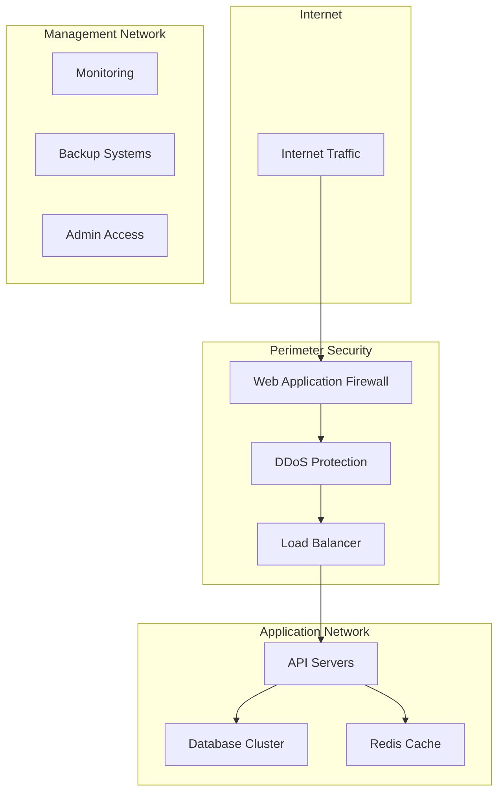

# Security Architecture

AWO Platform implements a comprehensive, defense-in-depth security architecture designed to protect user data, financial transactions, and business operations while ensuring compliance with SADC regional regulations and international standards.

## Security Framework Overview

<Info>
AWO's security architecture follows international best practices including ISO 27001, PCI DSS compliance principles, and SADC-specific regulatory requirements, implementing multiple layers of protection across all platform components.
</Info>

### Security Principles

<CardGroup cols={2}>
  <Card title="Zero Trust Architecture" icon="shield">
    Never trust, always verify - every request is authenticated and authorized regardless of location or context
  </Card>
  <Card title="Defense in Depth" icon="key">
    Multiple security layers ensure that if one control fails, others continue to protect the system
  </Card>
</CardGroup>

<CardGroup cols={2}>
  <Card title="Privacy by Design" icon="eye">
    Privacy controls and data protection built into every system component from the ground up
  </Card>
  <Card title="Compliance First" icon="check">
    All security measures designed to meet or exceed SADC regulatory requirements
  </Card>
</CardGroup>

### Security Layers Architecture

```
┌─────────────────────────────────────────────────────────┐
│                   PERIMETER SECURITY                    │
│  WAF, DDoS Protection, Geographic Filtering           │
├─────────────────────────────────────────────────────────┤
│                 APPLICATION SECURITY                    │
│  Authentication, Authorization, Input Validation       │
├─────────────────────────────────────────────────────────┤
│                   DATA SECURITY                         │
│  Encryption, Tokenization, Data Loss Prevention       │
├─────────────────────────────────────────────────────────┤
│                INFRASTRUCTURE SECURITY                  │
│  Network Segmentation, Access Controls, Monitoring    │
├─────────────────────────────────────────────────────────┤
│                 OPERATIONAL SECURITY                    │
│  Incident Response, Audit Logging, Compliance        │
└─────────────────────────────────────────────────────────┘
```

## Authentication and Identity Management

### Multi-Factor Authentication (MFA) System

**Authentication Factors:**

<Steps>
  <Step title="Knowledge Factor">
    **Primary**: Email/mobile + password  
    **Requirements**: Minimum 12 characters, complexity rules  
    **Protection**: Bcrypt hashing with salt, rate limiting  
    **Recovery**: Secure password reset via multiple channels
  </Step>
  <Step title="Possession Factor">
    **SMS OTP**: Time-based OTP via Twilio  
    **TOTP Apps**: Google Authenticator, Authy support  
    **Push Notifications**: Secure push-based approval  
    **Hardware Tokens**: FIDO2/WebAuthn for premium users
  </Step>
  <Step title="Inherence Factor">
    **Biometric**: Fingerprint, Face ID (mobile devices)  
    **Behavioral**: Typing patterns, device fingerprinting  
    **Location**: Geographic and device-based validation  
    **Risk Assessment**: Continuous authentication based on behavior
  </Step>
</Steps>

### JWT Token Security Architecture

```typescript
// Secure token implementation
interface SecureTokenSystem {
  accessToken: {
    type: 'JWT';
    expiry: '15 minutes';
    algorithm: 'RS256';
    claims: MinimalUserClaims;
    storage: 'Memory only (no localStorage)';
  };
  
  refreshToken: {
    type: 'Secure HTTP-only cookie';
    expiry: '30 days';
    rotation: 'On every refresh';
    storage: 'Encrypted database';
    binding: 'Device fingerprint + IP validation';
  };
  
  sessionManagement: {
    concurrentSessions: 'Limited to 3 devices';
    sessionTermination: 'Immediate on suspicious activity';
    tokenRevocation: 'Real-time blacklist checking';
  };
}
```

**Token Security Measures:**

<CardGroup cols={2}>
  <Card title="Token Generation" icon="key">
    **Algorithm**: RS256 with 2048-bit keys  
    **Key Rotation**: Monthly automated rotation  
    **Entropy**: Cryptographically secure random generation  
    **Signing**: Hardware Security Module (HSM) when possible
  </Card>
  <Card title="Token Validation" icon="check">
    **Signature Verification**: Real-time signature validation  
    **Expiry Checking**: Strict expiration enforcement  
    **Blacklist Checking**: Redis-based token revocation  
    **Claim Validation**: Comprehensive claim verification
  </Card>
</CardGroup>

### Identity Verification (KYC) Security

**Tier-Based Security Model:**

<CardGroup cols={2}>
  <Card title="Tier 1 KYC" icon="user-check">
    **Requirements**: Mobile number + National ID  
    **Verification**: SMS OTP + ID number validation  
    **Data Storage**: Encrypted with field-level encryption  
    **Access Level**: Basic wallet and savings features
  </Card>
  <Card title="Tier 2 KYC" icon="shield-check">
    **Requirements**: Photo ID + Selfie + Bank account  
    **Verification**: Smile ID biometric verification  
    **Data Storage**: Encrypted with additional access controls  
    **Access Level**: Full investment and lending features
  </Card>
</CardGroup>

**Document Security:**
```typescript
// KYC document handling
interface KYCSecurityProtocol {
  documentUpload: {
    encryption: 'Client-side encryption before upload';
    transmission: 'TLS 1.3 with certificate pinning';
    storage: 'AES-256 encrypted at rest';
    access: 'Role-based with audit logging';
  };
  
  biometricProcessing: {
    provider: 'Smile ID (SOC 2 certified)';
    dataMinimization: 'Process and delete raw biometrics';
    results: 'Store only verification outcomes';
    retention: 'Compliance-required periods only';
  };
}
```

## Data Security and Encryption

### Encryption Strategy

**Encryption at Rest:**

<CardGroup cols={2}>
  <Card title="Database Encryption" icon="database">
    **Algorithm**: AES-256-GCM  
    **Key Management**: AWS KMS / Azure Key Vault  
    **Scope**: All sensitive fields (PII, financial data)  
    **Performance**: Optimized queries with encrypted indexes
  </Card>
  <Card title="File Storage Encryption" icon="file">
    **Algorithm**: AES-256-CBC  
    **Key Management**: Separate encryption keys per file type  
    **Scope**: Documents, images, backups  
    **Access**: Decryption only on authorized access
  </Card>
</CardGroup>

**Encryption in Transit:**

<CardGroup cols={2}>
  <Card title="API Communications" icon="wifi">
    **Protocol**: TLS 1.3 minimum  
    **Cipher Suites**: ChaCha20-Poly1305, AES-256-GCM  
    **Certificate Pinning**: Mobile app SSL pinning  
    **HSTS**: Strict Transport Security headers
  </Card>
  <Card title="Internal Communications" icon="circle">
    **Service-to-Service**: mTLS authentication  
    **Database Connections**: SSL/TLS encrypted  
    **Message Queues**: Encrypted message transport  
    **Backup Transfers**: Encrypted backup channels
  </Card>
</CardGroup>

### Field-Level Encryption Implementation

```typescript
// Sensitive data encryption
interface FieldEncryption {
  personalData: {
    fields: ['email', 'phone', 'national_id', 'address'];
    algorithm: 'AES-256-GCM';
    keyDerivation: 'PBKDF2 with user-specific salt';
    searchability: 'Deterministic encryption for indexed fields';
  };
  
  financialData: {
    fields: ['account_numbers', 'transaction_amounts', 'balances'];
    algorithm: 'AES-256-GCM';
    keyRotation: 'Quarterly rotation with versioning';
    auditTrail: 'All encryption/decryption events logged';
  };
  
  keyManagement: {
    storage: 'Hardware Security Module (HSM)';
    backup: 'Distributed key escrow system';
    access: 'Multi-person authorization required';
    monitoring: 'Real-time key usage monitoring';
  };
}
```

### Data Loss Prevention (DLP)

**DLP Controls:**

<Steps>
  <Step title="Data Classification">
    **Categories**: Public, Internal, Confidential, Restricted  
    **Automated Tagging**: ML-based content classification  
    **Policy Enforcement**: Role-based access to classified data  
    **Monitoring**: Data access and usage tracking
  </Step>
  <Step title="Egress Controls">
    **Email Filtering**: Automatic scanning for sensitive data  
    **API Monitoring**: Unusual data access pattern detection  
    **File Transfers**: Encrypted and logged file transfers only  
    **Print/Copy Restrictions**: Limited data export capabilities
  </Step>
  <Step title="Data Anonymization">
    **Analytics**: Anonymized data for business intelligence  
    **Testing**: Synthetic data generation for test environments  
    **Reporting**: Aggregated data with privacy preservation  
    **Compliance**: GDPR/POPIA anonymization standards
  </Step>
</Steps>

## Application Security

### API Security Framework

**API Protection Layers:**

<CardGroup cols={3}>
  <Card title="Rate Limiting" icon="gauge">
    **Implementation**: Redis-based sliding window  
    **Limits**: Per-user, per-endpoint, global limits  
    **Response**: Graceful degradation with retry headers  
    **Monitoring**: Real-time rate limit alerting
  </Card>
  <Card title="Input Validation" icon="filter">
    **Schema Validation**: Zod-based request validation  
    **Sanitization**: SQL injection and XSS prevention  
    **Business Logic**: Domain-specific validation rules  
    **Error Handling**: Secure error responses
  </Card>
  <Card title="Output Security" icon="eye">
    **Data Masking**: Sensitive field masking in responses  
    **Content Security**: Secure response headers  
    **Rate Information**: No internal data exposure  
    **Error Responses**: Minimal information disclosure
  </Card>
</CardGroup>

**API Security Implementation:**
```typescript
// API security middleware stack
interface APISecurityStack {
  helmet: 'Security headers (CSP, HSTS, etc.)';
  cors: 'Strict CORS policy with origin validation';
  rateLimiter: 'Multi-tier rate limiting';
  authentication: 'JWT token validation';
  authorization: 'Role-based access control';
  validation: 'Request schema validation';
  sanitization: 'Input sanitization and filtering';
  logging: 'Comprehensive audit logging';
  monitoring: 'Real-time threat detection';
}
```

### Mobile Application Security

**Mobile Security Controls:**

<CardGroup cols={2}>
  <Card title="App Protection" icon="shield">
    **Code Obfuscation**: JavaScript bundle obfuscation  
    **Certificate Pinning**: SSL certificate validation  
    **Root/Jailbreak Detection**: Device integrity checking  
    **Debug Detection**: Anti-debugging measures
  </Card>
  <Card title="Data Protection" icon="lock">
    **Local Storage**: Encrypted secure storage  
    **Memory Protection**: Sensitive data cleanup  
    **Screen Recording**: Prevention of screen capture  
    **Biometric Integration**: Secure biometric authentication
  </Card>
</CardGroup>

**React Native Security Implementation:**
```typescript
// Mobile security configuration
interface MobileSecurityConfig {
  secureStorage: {
    library: 'react-native-keychain';
    encryption: 'Hardware-backed keystore when available';
    fallback: 'Software encryption for older devices';
  };
  
  networkSecurity: {
    pinning: 'SSL certificate pinning';
    proxy: 'Proxy detection and blocking';
    debugging: 'Network debugging prevention';
  };
  
  runtime: {
    rootDetection: 'JailMonkey library';
    debugging: 'Flipper disabled in production';
    obfuscation: 'Metro bundler obfuscation';
  };
}
```

## Infrastructure Security

### Network Security Architecture



**Network Security Controls:**

<CardGroup cols={2}>
  <Card title="Perimeter Defense" icon="shield">
    **WAF**: Web Application Firewall with OWASP rules  
    **DDoS Protection**: Multi-layer DDoS mitigation  
    **Geographic Filtering**: SADC region IP allowlisting  
    **Bot Protection**: Automated bot detection and blocking
  </Card>
  <Card title="Network Segmentation" icon="wifi">
    **VPC Isolation**: Separate VPCs for different environments  
    **Subnet Segregation**: Public, private, and data subnets  
    **Firewall Rules**: Strict ingress/egress rules  
    **Jump Boxes**: Bastion hosts for administrative access
  </Card>
</CardGroup>

### Infrastructure Access Control

**Access Management:**

<Steps>
  <Step title="Administrative Access">
    **VPN Requirement**: Mandatory VPN for admin access  
    **Multi-Factor Authentication**: MFA for all admin accounts  
    **Privileged Access Management**: Time-limited privileged access  
    **Session Recording**: All administrative sessions recorded
  </Step>
  <Step title="Service-to-Service Security">
    **mTLS**: Mutual TLS for internal communications  
    **Service Mesh**: Istio/Envoy for traffic management  
    **API Gateways**: Centralized API security enforcement  
    **Zero Trust**: No implicit trust between services
  </Step>
  <Step title="Secret Management">
    **Vault Integration**: HashiCorp Vault for secret storage  
    **Dynamic Secrets**: Time-limited database credentials  
    **Encryption Keys**: Hardware Security Module storage  
    **Rotation Policies**: Automated secret rotation
  </Step>
</Steps>

### Container and Orchestration Security

```typescript
// Container security configuration
interface ContainerSecurityConfig {
  imageSecurity: {
    scanning: 'Vulnerability scanning with Trivy/Clair';
    signing: 'Container image signing with Cosign';
    registry: 'Private container registry with RBAC';
    baseImages: 'Distroless or minimal base images';
  };
  
  runtimeSecurity: {
    runAsNonRoot: true;
    readOnlyRootFilesystem: true;
    noPrivilegedContainers: true;
    seccompProfile: 'Restricted seccomp profile';
    appArmorProfile: 'Custom AppArmor profile';
  };
  
  networkPolicies: {
    defaultDeny: 'Deny all traffic by default';
    explicitAllow: 'Explicit allow rules for required traffic';
    egressFiltering: 'Egress traffic filtering';
    ingressControl: 'Strict ingress controls';
  };
}
```

## Financial Transaction Security

### Payment Security Framework

**PCI DSS Compliance Approach:**

<CardGroup cols={2}>
  <Card title="Data Protection" icon="credit-card">
    **Card Data**: No storage of sensitive card data  
    **Tokenization**: Payment tokens instead of card numbers  
    **Encryption**: End-to-end encryption for payment flows  
    **Access Control**: Restricted access to payment systems
  </Card>
  <Card title="Transaction Security" icon="lock">
    **Authentication**: Strong authentication for payments  
    **Authorization**: Real-time transaction authorization  
    **Monitoring**: Fraud detection and prevention  
    **Logging**: Comprehensive transaction audit trails
  </Card>
</CardGroup>

### Fraud Detection and Prevention

**Multi-Layer Fraud Detection:**

<Steps>
  <Step title="Real-Time Transaction Screening">
    **Rule Engine**: Business rule-based screening  
    **Machine Learning**: Behavioral pattern analysis  
    **Velocity Checks**: Transaction frequency and amount limits  
    **Geographic Validation**: Location-based risk assessment
  </Step>
  <Step title="User Behavior Analysis">
    **Device Fingerprinting**: Unique device identification  
    **Behavioral Biometrics**: Typing and usage patterns  
    **Risk Scoring**: Dynamic risk score calculation  
    **Anomaly Detection**: Unusual activity identification
  </Step>
  <Step title="Investigation and Response">
    **Alert System**: Real-time fraud alerts  
    **Investigation Workflow**: Structured fraud investigation  
    **Account Protection**: Automatic account protection measures  
    **Law Enforcement**: Coordination with authorities
  </Step>
</Steps>

```typescript
// Fraud detection system
interface FraudDetectionSystem {
  realTimeScreening: {
    rules: TransactionRuleEngine;
    ml: BehaviorAnalysisModel;
    thresholds: DynamicRiskThresholds;
    response: AutomatedFraudResponse;
  };
  
  riskFactors: {
    transactionAmount: 'Amount-based risk scoring';
    frequency: 'Transaction frequency analysis';
    location: 'Geographic risk assessment';
    device: 'Device fingerprint validation';
    behavior: 'User behavior pattern analysis';
  };
  
  responseActions: {
    lowRisk: 'Transaction approved';
    mediumRisk: 'Additional authentication required';
    highRisk: 'Transaction blocked and investigation triggered';
    criticalRisk: 'Account suspended and immediate review';
  };
}
```

## Compliance and Regulatory Security

### SADC Regional Compliance

**Regulatory Framework Compliance:**

<CardGroup cols={2}>
  <Card title="South Africa" icon="flag">
    **POPIA**: Protection of Personal Information Act  
    **FICA**: Financial Intelligence Centre Act  
    **Electronic Communications Act**: Data protection  
    **Banking Acts**: Financial services regulations
  </Card>
  <Card title="Botswana" icon="flag">
    **Data Protection Act**: Personal data protection  
    **Financial Intelligence Act**: AML/CFT compliance  
    **Banking Act**: Banking service regulations  
    **Consumer Protection Act**: Consumer rights
  </Card>
</CardGroup>

### Data Protection Compliance

**GDPR/POPIA Compliance Implementation:**

<Steps>
  <Step title="Data Processing Lawfulness">
    **Legal Basis**: Consent, contract, legal obligation  
    **Purpose Limitation**: Data used only for stated purposes  
    **Data Minimization**: Collect only necessary data  
    **Accuracy**: Maintain accurate and up-to-date data
  </Step>
  <Step title="Individual Rights">
    **Right to Access**: User data export functionality  
    **Right to Rectification**: Data correction mechanisms  
    **Right to Erasure**: Data deletion capabilities  
    **Right to Portability**: Standard data export formats
  </Step>
  <Step title="Organizational Measures">
    **Privacy by Design**: Built-in privacy protections  
    **Data Protection Impact Assessments**: Regular DPIAs  
    **Privacy Officer**: Dedicated privacy oversight  
    **Breach Notification**: 72-hour breach reporting
  </Step>
</Steps>

### AML/CFT Compliance Security

```typescript
// AML compliance system
interface AMLComplianceSystem {
  customerDueDiligence: {
    screening: 'Sanctions list screening';
    riskAssessment: 'Customer risk profiling';
    ongoingMonitoring: 'Continuous customer monitoring';
    enhancedDD: 'Enhanced due diligence for high-risk customers';
  };
  
  transactionMonitoring: {
    realTimeScreening: 'Real-time transaction analysis';
    patternDetection: 'Suspicious pattern identification';
    thresholdMonitoring: 'Transaction threshold monitoring';
    reporting: 'Suspicious activity reporting (SAR)';
  };
  
  recordKeeping: {
    retention: '5-year record retention minimum';
    encryption: 'Encrypted compliance data storage';
    auditTrail: 'Comprehensive audit trails';
    regulatoryReporting: 'Automated regulatory reporting';
  };
}
```

## Security Monitoring and Incident Response

### Security Operations Center (SOC)

**24/7 Security Monitoring:**

<CardGroup cols={3}>
  <Card title="Threat Detection" icon="radar">
    **SIEM**: Security Information Event Management  
    **Behavioral Analysis**: User and entity behavior analytics  
    **Threat Intelligence**: Real-time threat feed integration  
    **Automated Response**: Immediate threat response
  </Card>
  <Card title="Vulnerability Management" icon="shield">
    **Scanning**: Regular vulnerability assessments  
    **Patch Management**: Automated security patching  
    **Penetration Testing**: Quarterly pen testing  
    **Bug Bounty**: Responsible disclosure program
  </Card>
  <Card title="Compliance Monitoring" icon="clipboard-check">
    **Policy Enforcement**: Automated policy compliance  
    **Audit Logging**: Comprehensive activity logging  
    **Reporting**: Regular compliance reporting  
    **Remediation**: Automated compliance remediation
  </Card>
</CardGroup>

### Incident Response Framework

**Incident Response Process:**

<Steps>
  <Step title="Detection and Analysis">
    **Automated Detection**: SIEM and monitoring alerts  
    **Manual Reporting**: Security incident reporting portal  
    **Initial Assessment**: Rapid incident classification  
    **Escalation**: Incident escalation procedures
  </Step>
  <Step title="Containment and Eradication">
    **Immediate Containment**: Isolate affected systems  
    **Evidence Preservation**: Forensic evidence collection  
    **Root Cause Analysis**: Determine attack vectors  
    **Threat Removal**: Complete threat eradication
  </Step>
  <Step title="Recovery and Lessons Learned">
    **System Recovery**: Secure system restoration  
    **Monitoring**: Enhanced post-incident monitoring  
    **Documentation**: Incident documentation and reporting  
    **Process Improvement**: Security process enhancement
  </Step>
</Steps>

### Security Metrics and KPIs

**Security Performance Indicators:**

<CardGroup cols={2}>
  <Card title="Preventive Metrics" icon="shield">
    **Vulnerability Resolution Time**: Average time to patch  
    **Security Training Completion**: Staff security awareness  
    **Compliance Score**: Regulatory compliance percentage  
    **Risk Assessment Coverage**: Assets under assessment
  </Card>
  <Card title="Detective Metrics" icon="eye">
    **Mean Time to Detection**: Average incident detection time  
    **False Positive Rate**: Security alert accuracy  
    **Threat Coverage**: Threat detection capability  
    **Incident Volume**: Security incident trends
  </Card>
</CardGroup>

### Business Continuity and Disaster Recovery

**Resilience Framework:**

```typescript
// Business continuity configuration
interface BusinessContinuityPlan {
  riskAssessment: {
    businessImpactAnalysis: 'Critical business function identification';
    riskTolerance: 'Acceptable downtime and data loss limits';
    threatAssessment: 'Natural and man-made threat evaluation';
  };
  
  recoveryStrategies: {
    dataBackup: 'Automated daily backups with 7-year retention';
    systemReplication: 'Real-time database replication';
    alternativeSites: 'Multi-region deployment capability';
    staffing: 'Cross-trained staff and remote work capability';
  };
  
  testing: {
    frequency: 'Quarterly disaster recovery testing';
    scenarios: 'Multiple disaster scenario testing';
    documentation: 'Detailed recovery procedures';
    training: 'Regular staff training and drills';
  };
}
```

---

*This comprehensive security architecture ensures AWO Platform maintains the highest security standards while operating across the SADC region, protecting user data and financial transactions through multiple layers of defense and regulatory compliance.*

*Last updated: June 2025*  
*Next review: July 2025*