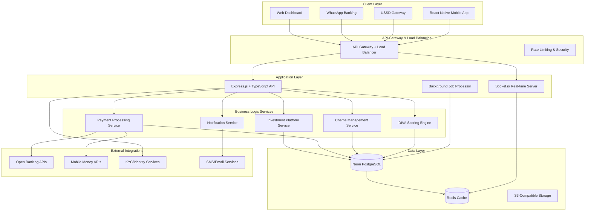

# System Architecture Overview

AWO Platform is designed as a modern, scalable financial services architecture optimized specifically for African markets. Our system prioritizes simplicity, performance, and resilience while supporting complex financial workflows and real-time collaboration.

## High-Level Architecture Diagram



## Architecture Principles

### 1. Simplicity Over Complexity
**Philosophy**: African markets require reliable, maintainable solutions over complex architectures.

- **Single Database**: Neon PostgreSQL for all data storage and calculations
- **Monolithic API**: Express.js backend instead of microservices complexity
- **Rule-Based Logic**: Simple scoring algorithms over AI/ML complexity
- **Direct Integrations**: Minimal middleware layers for better performance

### 2. Africa-First Design Decisions

<CardGroup cols={2}>
  <Card title="Connectivity Resilience" icon="signal">
    Offline-first mobile design, progressive sync, local data caching, and graceful degradation for poor connectivity
  </Card>
  <Card title="Device Optimization" icon="mobile">
    Lightweight apps for mid-range Android devices, minimal battery usage, and efficient data consumption
  </Card>
  <Card title="Alternative Access" icon="phone">
    USSD gateway for feature phones, WhatsApp banking integration, and agent network support
  </Card>
  <Card title="Local Infrastructure" icon="server">
    Edge-optimized hosting, regional data centers, and compliance with local data residency requirements
  </Card>
</CardGroup>

### 3. Financial Services Requirements

**Real-time Processing**: Instant score updates, live chama notifications, and immediate payment confirmations

**Audit Compliance**: Immutable transaction logs, comprehensive activity tracking, and regulatory reporting automation

**Security-First**: End-to-end encryption, multi-factor authentication, and fraud detection at every layer

**Scalability**: Auto-scaling infrastructure supporting growth from thousands to millions of users

## Technology Stack Rationale

### Frontend: React Native with Expo

<Accordion title="Why React Native + Expo?">
**Cross-Platform Efficiency**
- Single codebase for iOS and Android reduces development time by 60%
- Shared components and business logic across platforms
- Consistent user experience regardless of device type

**Expo Advantages for African Markets**
- Over-the-air (OTA) updates bypass app store approval delays
- Simplified development workflow reduces time-to-market
- Built-in features for push notifications, camera, and device APIs
- Excellent tooling for debugging and performance monitoring

**Offline-First Architecture**
- AsyncStorage for local data persistence during connectivity issues
- Background sync when connection restored
- Progressive loading and caching strategies
- Graceful degradation of features when offline
</Accordion>

### Backend: Express.js + TypeScript

<Accordion title="Why Express.js over Alternatives?">
**Simplicity and Speed**
- Faster development cycle compared to NestJS or other frameworks
- Extensive ecosystem and community support
- Easy to debug and maintain for growing team
- Minimal learning curve for new developers

**TypeScript Integration**
- Type safety for financial calculations and data handling
- Better API contract definition and documentation
- Reduced runtime errors in production
- Enhanced developer experience with IDE support

**African Market Optimization**
- Lightweight server footprint reduces hosting costs
- Fast startup times crucial for auto-scaling scenarios
- Simple deployment process for multiple regions
- Easy integration with various payment and banking APIs
</Accordion>

### Database: Neon PostgreSQL (Single Database)

<Accordion title="Why Single Database Architecture?">
**Simplified Operations**
- Single source of truth for all financial data
- Reduced complexity in data synchronization
- Easier backup and disaster recovery procedures
- Lower operational overhead and maintenance costs

**Neon Advantages**
- Serverless auto-scaling matches African usage patterns
- Database branching for safe development and testing
- Global edge locations provide low latency for SADC region
- Built-in backup and point-in-time recovery

**Financial Services Optimization**
- ACID compliance for transaction integrity
- Advanced indexing for complex scoring queries
- PostgreSQL's JSON support for flexible data models
- Excellent performance for analytical workloads
</Accordion>

### Real-time: Socket.io

<Accordion title="Why Socket.io for Real-time Features?">
**African Connectivity Optimization**
- Automatic fallback from WebSocket to HTTP polling
- Connection resilience during network instability
- Efficient bandwidth usage for mobile networks
- Built-in reconnection and error handling

**Chama-Specific Features**
- Real-time group activity notifications
- Live voting and governance updates
- Instant contribution confirmations
- Group chat and communication features

**Scalability Features**
- Room-based messaging for efficient group management
- Redis adapter for horizontal scaling
- Namespace isolation for different features
- Built-in rate limiting and abuse prevention
</Accordion>

## Core Services Architecture

### 1. DIVA Scoring Engine

**Design Philosophy**: Rule-based calculations using PostgreSQL for complex financial analysis

```typescript
// Simplified service architecture
class DivaScoreService {
  async calculateScore(userId: string): Promise<DivaScore> {
    // Fetch user financial data
    const transactions = await this.transactionRepository.getHistory(userId);
    const accounts = await this.accountRepository.getAccounts(userId);
    
    // Calculate individual components
    const discipline = await this.calculateDiscipline(transactions);
    const income = await this.calculateIncome(transactions);
    const velocity = await this.calculateVelocity(transactions);
    const assets = await this.calculateAssets(accounts, transactions);
    
    // Weighted final score
    const overallScore = (
      discipline * 0.30 +
      income * 0.25 +
      velocity * 0.25 +
      assets * 0.20
    );
    
    return {
      overallScore,
      components: { discipline, income, velocity, assets },
      calculatedAt: new Date(),
      nextUpdateDue: addMonths(new Date(), 3)
    };
  }
}
```

**Performance Optimizations**:
- **Materialized Views**: Pre-computed aggregations for common score calculations
- **Incremental Updates**: Only recalculate when new transaction data available
- **Caching Strategy**: Redis caching for frequently accessed scores
- **Background Processing**: Async score recalculation for better user experience

### 2. Chama Management Service

**Group State Management**: Real-time synchronization of group activities across all members

<CardGroup cols={2}>
  <Card title="Contribution Tracking" icon="coins">
    Automated contribution monitoring, payment validation, penalty calculation, and member status updates
  </Card>
  <Card title="Democratic Governance" icon="users">
    Proposal creation, member voting, consensus tracking, and decision implementation with audit trails
  </Card>
</CardGroup>

**Real-time Features**:
- Live contribution notifications to all group members
- Real-time voting updates and result announcements  
- Instant messaging and group communication
- Activity feed with comprehensive group history

### 3. Payment Processing Service

**Multi-Provider Architecture**: Unified interface supporting multiple payment channels

| Provider Type | Primary | Backup | Markets |
|--------------|---------|---------|---------|
| **Pan-African Gateway** | Flutterwave | Paystack | All SADC |
| **Mobile Money (Kenya)** | M-Pesa Direct | Flutterwave | Kenya |
| **Mobile Money (SA)** | Flutterwave | Banking APIs | South Africa |
| **Open Banking** | Stitch | Mono | SA, Nigeria |

**Payment Flow Architecture**:
1. **Initiation**: User initiates payment through mobile app or alternative channel
2. **Routing**: Service determines optimal payment provider based on amount, destination, and user preferences
3. **Processing**: Provider handles payment with real-time status updates via webhooks
4. **Confirmation**: User receives confirmation with updated balances and transaction history
5. **Reconciliation**: Automated reconciliation and accounting updates

### 4. Investment Platform Service

**Portfolio Management**: Automated tier assignment and investment product access control

```sql
-- Example portfolio assignment logic
SELECT 
  user_id,
  diva_score,
  rtsm_score,
  CASE 
    WHEN diva_score < 400 THEN 'Bronze'
    WHEN diva_score < 600 THEN 'Silver'  
    WHEN diva_score < 800 THEN 'Gold'
    ELSE 'Platinum'
  END as portfolio_tier,
  allowed_products
FROM user_portfolios 
WHERE last_updated > NOW() - INTERVAL '3 months';
```

**SME Investment Features**:
- **Due Diligence**: Automated risk assessment and scoring for SME loan applications
- **Investment Limits**: User tier-based investment amount and frequency controls
- **Democratic Voting**: Group investment approval workflows with member consensus
- **Performance Tracking**: Real-time investment performance and portfolio analytics

## Security Architecture

### 1. Defense in Depth Strategy

<Steps>
  <Step title="Network Security">
    Web Application Firewall (WAF), DDoS protection, VPC isolation, and geographic access controls
  </Step>
  <Step title="API Security">
    JWT authentication, rate limiting, input validation, and comprehensive request logging
  </Step>
  <Step title="Data Security">
    AES-256 encryption at rest, TLS 1.3 in transit, and encrypted database connections
  </Step>
  <Step title="Application Security">
    Secure coding practices, regular security audits, and automated vulnerability scanning
  </Step>
</Steps>

### 2. Financial Services Security

**Transaction Integrity**: All financial transactions use database transactions with ACID compliance

**Fraud Detection**: Real-time monitoring for suspicious patterns and automated alerts

**Audit Trails**: Immutable logging of all financial activities with cryptographic hashing

**Access Controls**: Role-based permissions with least privilege principle

## Scalability & Performance

### 1. Auto-Scaling Strategy

**Application Tier**: Horizontal scaling based on CPU and memory metrics
**Database Tier**: Neon's serverless scaling with automatic read replicas
**Cache Tier**: Redis cluster with automatic failover and sharding
**Static Assets**: Global CDN with edge caching for mobile app resources

### 2. Performance Targets

| Metric | Target | Monitoring |
|--------|--------|------------|
| **API Response Time** | &lt;300ms (95th percentile) | Real-time monitoring |
| **Mobile App Startup** | &lt;3 seconds | App performance tracking |
| **Database Queries** | &lt;100ms (95% of queries) | Query performance analysis |
| **Real-time Updates** | &lt;1 second | Socket.io latency monitoring |

### 3. Regional Optimization

**Edge Locations**: Strategic placement of services closer to SADC users
**Data Locality**: Regional data storage to comply with local regulations
**Content Delivery**: CDN optimization for mobile app assets and educational content
**Network Resilience**: Multiple ISP connections and automatic failover

## Monitoring & Observability

### 1. Application Monitoring
- **Real-time Performance**: Response times, error rates, and throughput metrics
- **User Experience**: Mobile app performance, crash reporting, and user session analytics
- **Business Metrics**: DIVA score calculations, chama activity, and investment performance

### 2. Infrastructure Monitoring  
- **System Health**: Server performance, database metrics, and network connectivity
- **Security Monitoring**: Intrusion detection, suspicious activity alerts, and access logging
- **Cost Optimization**: Resource utilization tracking and automated cost alerts

---

Ready to dive deeper into specific components? Continue to [Technology Stack](/architecture/technology-stack) for detailed implementation choices or [Quick Setup](/quick-setup/development-environment) to start building.