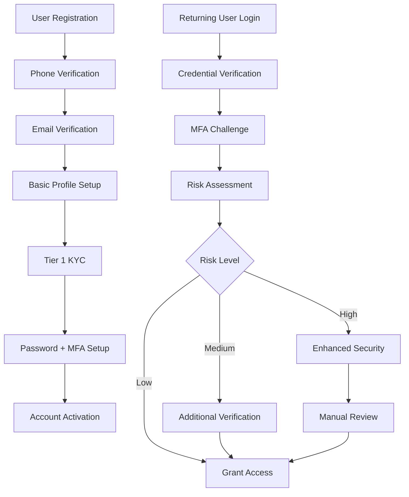

# Authentication

AWO Platform implements a comprehensive authentication system designed for African markets, featuring multi-tier KYC verification, multi-factor authentication, and secure session management optimized for diverse device capabilities and connectivity patterns.

## Authentication Overview

<Info>
AWO's authentication system balances security requirements for financial services with the practical needs of African users, supporting multiple authentication methods, progressive verification levels, and offline capabilities while maintaining compliance with SADC regulatory requirements.
</Info>

### Authentication Architecture



## User Registration Flow

### Multi-Step Registration Process

<Steps>
  <Step title="Initial Registration">
    **Required**: Phone number, email, password  
    **Validation**: Phone format, email format, password strength  
    **Security**: Rate limiting, device fingerprinting  
    **Output**: Pending user account with verification tokens
  </Step>
  <Step title="Phone Verification">
    **Method**: SMS OTP via Twilio  
    **Fallback**: Voice call OTP for areas with SMS issues  
    **Validation**: 6-digit code, 10-minute expiry  
    **Security**: Attempt limiting, phone number validation
  </Step>
  <Step title="Email Verification">
    **Method**: Email link with secure token  
    **Validation**: Token expiry (24 hours), single use  
    **Security**: Anti-phishing measures, domain validation  
    **Fallback**: Resend capability with progressive delays
  </Step>
  <Step title="Basic Profile">
    **Required**: First name, last name, country  
    **Optional**: Date of birth, gender  
    **Validation**: Name format, country code validation  
    **Privacy**: Minimal data collection principle
  </Step>
  <Step title="Tier 1 KYC">
    **Required**: National ID number  
    **Validation**: Country-specific ID format validation  
    **Integration**: Basic identity verification via Smile ID  
    **Outcome**: Account activation with basic features
  </Step>
</Steps>

### Registration Implementation

```typescript
interface RegistrationRequest {
  phoneNumber: string; // E.164 format
  email: string;
  password: string;
  firstName: string;
  lastName: string;
  country: string; // ISO 3166 alpha-3
  dateOfBirth?: Date;
  gender?: 'male' | 'female' | 'non_binary' | 'prefer_not_to_say';
  
  // Consent and agreement
  termsAccepted: boolean;
  privacyPolicyAccepted: boolean;
  marketingConsent: boolean;
  
  // Device and context
  deviceInfo: DeviceInfo;
  referralCode?: string;
  
  // Anti-spam measures
  captchaToken?: string;
  honeypotField?: string; // Should be empty
}

interface RegistrationResponse {
  success: boolean;
  userId?: string;
  verificationRequired: {
    phone: boolean;
    email: boolean;
  };
  nextSteps: string[];
  errors?: ValidationError[];
}

interface DeviceInfo {
  deviceId: string;
  platform: 'ios' | 'android' | 'web';
  deviceModel?: string;
  osVersion?: string;
  appVersion: string;
  screenResolution?: string;
  timezone: string;
  language: string;
}

class RegistrationService {
  async registerUser(request: RegistrationRequest): Promise<RegistrationResponse> {
    // 1. Input validation
    const validation = await this.validateRegistrationInput(request);
    if (!validation.isValid) {
      return { success: false, errors: validation.errors };
    }
    
    // 2. Duplicate check
    const duplicateCheck = await this.checkForDuplicates(request.email, request.phoneNumber);
    if (duplicateCheck.exists) {
      return { success: false, errors: [{ field: duplicateCheck.field, message: 'Already registered' }] };
    }
    
    // 3. Create user account
    const user = await this.createUser(request);
    
    // 4. Send verification messages
    await this.sendPhoneVerification(user.id, request.phoneNumber);
    await this.sendEmailVerification(user.id, request.email);
    
    // 5. Log registration event
    await this.auditLogger.logEvent({
      eventType: 'USER_REGISTRATION',
      userId: user.id,
      details: { method: 'standard', country: request.country }
    });
    
    return {
      success: true,
      userId: user.id,
      verificationRequired: { phone: true, email: true },
      nextSteps: ['verify_phone', 'verify_email', 'complete_profile']
    };
  }
}
```

## Authentication Methods

### Primary Authentication

<CardGroup cols={2}>
  <Card title="Email + Password" icon="message">
    **Usage**: Primary login method  
    **Security**: bcrypt hashing, password complexity requirements  
    **Features**: Remember device, forgot password flow  
    **Validation**: Email format, password strength meter
  </Card>
  <Card title="Phone + PIN" icon="mobile">
    **Usage**: Quick access on mobile  
    **Security**: 6-digit PIN with device binding  
    **Features**: Biometric unlock, auto-lock timeout  
    **Fallback**: Falls back to email + password
  </Card>
</CardGroup>

### Multi-Factor Authentication (MFA)

<CardGroup cols={3}>
  <Card title="SMS OTP" icon="message">
    **Provider**: Twilio SMS service  
    **Code**: 6-digit numeric code  
    **Expiry**: 5 minutes  
    **Backup**: Voice call delivery option
  </Card>
  <Card title="TOTP Apps" icon="shield">
    **Apps**: Google Authenticator, Authy  
    **Standard**: RFC 6238 TOTP  
    **Backup**: Recovery codes provided  
    **Security**: 30-second time window
  </Card>
  <Card title="Biometric" icon="fingerprint">
    **Types**: Fingerprint, Face ID, Voice ID  
    **Platform**: Native device biometrics  
    **Fallback**: PIN or password  
    **Privacy**: Biometric data never leaves device
  </Card>
</CardGroup>

### MFA Implementation

```typescript
interface MFASetup {
  userId: string;
  methods: MFAMethod[];
  primaryMethod: MFAMethodType;
  backupCodes: string[]; // Encrypted
  isEnabled: boolean;
  enforcementLevel: MFAEnforcementLevel;
}

enum MFAMethodType {
  SMS_OTP = 'sms_otp',
  EMAIL_OTP = 'email_otp',
  TOTP = 'totp',
  BIOMETRIC = 'biometric',
  PUSH_NOTIFICATION = 'push_notification'
}

enum MFAEnforcementLevel {
  OPTIONAL = 'optional',
  REQUIRED_FOR_SENSITIVE = 'required_for_sensitive', // Transfers, settings changes
  ALWAYS_REQUIRED = 'always_required'
}

interface MFAMethod {
  type: MFAMethodType;
  isActive: boolean;
  setupDate: Date;
  lastUsed?: Date;
  
  // Method-specific details
  phoneNumber?: string; // For SMS
  emailAddress?: string; // For email OTP
  totpSecret?: string; // For TOTP (encrypted)
  deviceId?: string; // For biometric/push
  
  // Security metadata
  failedAttempts: number;
  lockedUntil?: Date;
}

class MFAService {
  async setupTOTP(userId: string): Promise<TOTPSetupResponse> {
    const secret = this.generateTOTPSecret();
    const qrCodeUrl = this.generateQRCode(userId, secret);
    
    // Store secret temporarily until verification
    await this.storePendingTOTPSetup(userId, secret);
    
    return {
      secret: secret,
      qrCodeUrl: qrCodeUrl,
      backupCodes: this.generateBackupCodes(),
      setupInstructions: this.getSetupInstructions()
    };
  }
  
  async verifyTOTP(userId: string, token: string): Promise<boolean> {
    const pendingSetup = await this.getPendingTOTPSetup(userId);
    if (!pendingSetup) return false;
    
    const isValid = this.verifyTOTPToken(pendingSetup.secret, token);
    
    if (isValid) {
      await this.completeTOTPSetup(userId, pendingSetup.secret);
      await this.deletePendingTOTPSetup(userId);
    }
    
    return isValid;
  }
  
  async challengeMFA(userId: string, method: MFAMethodType): Promise<MFAChallenge> {
    const userMFA = await this.getUserMFA(userId);
    const mfaMethod = userMFA.methods.find(m => m.type === method && m.isActive);
    
    if (!mfaMethod) {
      throw new Error('MFA method not available');
    }
    
    const challengeId = this.generateChallengeId();
    
    switch (method) {
      case MFAMethodType.SMS_OTP:
        await this.sendSMSOTP(userId, mfaMethod.phoneNumber!, challengeId);
        break;
      case MFAMethodType.EMAIL_OTP:
        await this.sendEmailOTP(userId, mfaMethod.emailAddress!, challengeId);
        break;
      case MFAMethodType.PUSH_NOTIFICATION:
        await this.sendPushChallenge(userId, mfaMethod.deviceId!, challengeId);
        break;
    }
    
    return {
      challengeId,
      method,
      expiresAt: new Date(Date.now() + 5 * 60 * 1000) // 5 minutes
    };
  }
}
```

## Login Process

### Standard Login Flow

```typescript
interface LoginRequest {
  identifier: string; // Email or phone number
  password: string;
  
  // Device and session info
  deviceInfo: DeviceInfo;
  rememberDevice: boolean;
  
  // Security context
  ipAddress: string;
  userAgent: string;
  captchaToken?: string; // Required after failed attempts
}

interface LoginResponse {
  success: boolean;
  tokens?: AuthTokens;
  user?: UserInfo;
  mfaRequired?: MFARequired;
  riskAssessment?: RiskAssessment;
  errors?: AuthError[];
}

interface AuthTokens {
  accessToken: string; // JWT, 15-minute expiry
  refreshToken: string; // Secure HTTP-only cookie, 30-day expiry
  tokenType: 'Bearer';
  expiresIn: number; // seconds
}

interface MFARequired {
  challengeId: string;
  availableMethods: MFAMethodType[];
  preferredMethod: MFAMethodType;
  timeRemaining: number; // seconds
}

class AuthenticationService {
  async login(request: LoginRequest): Promise<LoginResponse> {
    try {
      // 1. Rate limiting check
      await this.checkRateLimit(request.identifier, request.ipAddress);
      
      // 2. Find user by identifier
      const user = await this.findUserByIdentifier(request.identifier);
      if (!user) {
        await this.logFailedAttempt(request.identifier, 'user_not_found');
        return { success: false, errors: [{ code: 'INVALID_CREDENTIALS' }] };
      }
      
      // 3. Verify password
      const passwordValid = await this.verifyPassword(request.password, user.passwordHash);
      if (!passwordValid) {
        await this.logFailedAttempt(user.id, 'invalid_password');
        await this.incrementFailedAttempts(user.id);
        return { success: false, errors: [{ code: 'INVALID_CREDENTIALS' }] };
      }
      
      // 4. Check account status
      if (user.status !== 'active') {
        return { success: false, errors: [{ code: 'ACCOUNT_NOT_ACTIVE', message: `Account is ${user.status}` }] };
      }
      
      // 5. Risk assessment
      const riskAssessment = await this.assessLoginRisk(user, request);
      
      // 6. Determine if MFA is required
      const mfaRequired = this.shouldRequireMFA(user, riskAssessment);
      
      if (mfaRequired) {
        const mfaChallenge = await this.initiateMFAChallenge(user.id);
        return {
          success: false,
          mfaRequired: mfaChallenge,
          riskAssessment
        };
      }
      
      // 7. Generate tokens
      const tokens = await this.generateTokens(user.id, request.deviceInfo);
      
      // 8. Create session
      await this.createSession(user.id, tokens.refreshToken, request);
      
      // 9. Update last login
      await this.updateLastLogin(user.id);
      
      // 10. Log successful login
      await this.auditLogger.logEvent({
        eventType: 'LOGIN_SUCCESS',
        userId: user.id,
        details: { method: 'password', riskLevel: riskAssessment.level }
      });
      
      return {
        success: true,
        tokens,
        user: this.sanitizeUserInfo(user),
        riskAssessment
      };
      
    } catch (error) {
      await this.logLoginError(request.identifier, error);
      return { success: false, errors: [{ code: 'SYSTEM_ERROR' }] };
    }
  }
}
```

### Risk-Based Authentication

```typescript
interface RiskAssessment {
  level: RiskLevel;
  score: number; // 0-100
  factors: RiskFactor[];
  recommendations: SecurityRecommendation[];
}

enum RiskLevel {
  LOW = 'low',
  MEDIUM = 'medium',
  HIGH = 'high',
  VERY_HIGH = 'very_high'
}

interface RiskFactor {
  factor: string;
  impact: number; // -10 to +10
  description: string;
  category: 'device' | 'location' | 'behavior' | 'time' | 'network';
}

class RiskAssessmentService {
  async assessLoginRisk(user: User, request: LoginRequest): Promise<RiskAssessment> {
    const factors: RiskFactor[] = [];
    let riskScore = 50; // Base score
    
    // Device familiarity
    const deviceRisk = await this.assessDeviceRisk(user.id, request.deviceInfo);
    factors.push(deviceRisk);
    riskScore += deviceRisk.impact;
    
    // Geographic location
    const locationRisk = await this.assessLocationRisk(user.id, request.ipAddress);
    factors.push(locationRisk);
    riskScore += locationRisk.impact;
    
    // Time patterns
    const timeRisk = this.assessTimeRisk(user.id, new Date());
    factors.push(timeRisk);
    riskScore += timeRisk.impact;
    
    // Behavioral patterns
    const behaviorRisk = await this.assessBehaviorRisk(user.id, request);
    factors.push(behaviorRisk);
    riskScore += behaviorRisk.impact;
    
    // Network analysis
    const networkRisk = await this.assessNetworkRisk(request.ipAddress);
    factors.push(networkRisk);
    riskScore += networkRisk.impact;
    
    // Account history
    const accountRisk = await this.assessAccountRisk(user);
    factors.push(accountRisk);
    riskScore += accountRisk.impact;
    
    // Normalize score
    riskScore = Math.max(0, Math.min(100, riskScore));
    
    const level = this.determineRiskLevel(riskScore);
    const recommendations = this.generateRecommendations(level, factors);
    
    return {
      level,
      score: riskScore,
      factors,
      recommendations
    };
  }
  
  private determineRiskLevel(score: number): RiskLevel {
    if (score < 30) return RiskLevel.LOW;
    if (score < 60) return RiskLevel.MEDIUM;
    if (score < 80) return RiskLevel.HIGH;
    return RiskLevel.VERY_HIGH;
  }
  
  private async assessDeviceRisk(userId: string, deviceInfo: DeviceInfo): Promise<RiskFactor> {
    const knownDevices = await this.getUserDevices(userId);
    const isKnownDevice = knownDevices.some(d => d.deviceId === deviceInfo.deviceId);
    
    if (isKnownDevice) {
      return {
        factor: 'device_familiarity',
        impact: -15, // Reduces risk
        description: 'Login from known device',
        category: 'device'
      };
    } else {
      return {
        factor: 'device_familiarity',
        impact: +20, // Increases risk
        description: 'Login from new device',
        category: 'device'
      };
    }
  }
  
  private async assessLocationRisk(userId: string, ipAddress: string): Promise<RiskFactor> {
    const location = await this.getLocationFromIP(ipAddress);
    const userLocations = await this.getUserLocationHistory(userId);
    
    const isKnownLocation = userLocations.some(loc => 
      this.calculateDistance(loc, location) < 50 // 50km radius
    );
    
    if (isKnownLocation) {
      return {
        factor: 'location_familiarity',
        impact: -10,
        description: `Login from ${location.city}, ${location.country}`,
        category: 'location'
      };
    } else {
      // Check if location is high-risk
      const isHighRiskCountry = this.HIGH_RISK_COUNTRIES.includes(location.country);
      const impact = isHighRiskCountry ? +30 : +15;
      
      return {
        factor: 'location_familiarity',
        impact,
        description: `Login from new location: ${location.city}, ${location.country}`,
        category: 'location'
      };
    }
  }
}
```

## Session Management

### JWT Token Strategy

```typescript
interface JWTPayload {
  // Standard claims
  sub: string; // User ID
  iat: number; // Issued at
  exp: number; // Expires at
  iss: string; // Issuer (AWO Platform)
  aud: string; // Audience
  
  // Custom claims
  sessionId: string;
  deviceId: string;
  kycTier: number;
  portfolioTier: string;
  permissions: string[];
  
  // Security claims
  riskLevel: string;
  mfaVerified: boolean;
  lastPasswordChange: number;
}

class TokenService {
  async generateAccessToken(userId: string, sessionId: string, deviceInfo: DeviceInfo): Promise<string> {
    const user = await this.getUserById(userId);
    const permissions = await this.getUserPermissions(userId);
    
    const payload: JWTPayload = {
      sub: userId,
      iat: Math.floor(Date.now() / 1000),
      exp: Math.floor(Date.now() / 1000) + (15 * 60), // 15 minutes
      iss: 'AWO Platform',
      aud: 'AWO API',
      sessionId,
      deviceId: deviceInfo.deviceId,
      kycTier: user.kycTier,
      portfolioTier: user.portfolioTier,
      permissions,
      riskLevel: 'low', // Updated based on risk assessment
      mfaVerified: false, // Updated after MFA verification
      lastPasswordChange: user.lastPasswordChange?.getTime() || 0
    };
    
    return jwt.sign(payload, this.getSigningKey(), {
      algorithm: 'RS256',
      keyid: this.getCurrentKeyId()
    });
  }
  
  async verifyAccessToken(token: string): Promise<JWTPayload | null> {
    try {
      const decoded = jwt.verify(token, this.getVerificationKey(), {
        algorithms: ['RS256'],
        issuer: 'AWO Platform',
        audience: 'AWO API'
      }) as JWTPayload;
      
      // Additional validation
      await this.validateSession(decoded.sessionId);
      await this.checkTokenBlacklist(token);
      
      return decoded;
    } catch (error) {
      this.logger.warn('Token verification failed', { error: error.message });
      return null;
    }
  }
  
  async refreshAccessToken(refreshToken: string): Promise<AuthTokens | null> {
    const session = await this.getSessionByRefreshToken(refreshToken);
    if (!session || !session.isActive || session.expiresAt < new Date()) {
      return null;
    }
    
    // Generate new tokens
    const newAccessToken = await this.generateAccessToken(
      session.userId, 
      session.id, 
      session.deviceInfo
    );
    
    const newRefreshToken = await this.generateRefreshToken();
    
    // Update session with new refresh token
    await this.updateSession(session.id, {
      refreshTokenHash: await this.hashRefreshToken(newRefreshToken),
      lastActiveAt: new Date()
    });
    
    return {
      accessToken: newAccessToken,
      refreshToken: newRefreshToken,
      tokenType: 'Bearer',
      expiresIn: 15 * 60 // 15 minutes
    };
  }
}
```

### Session Security

```typescript
interface UserSession {
  id: string;
  userId: string;
  refreshTokenHash: string;
  deviceInfo: DeviceInfo;
  
  // Security metadata
  ipAddress: string;
  userAgent: string;
  location?: LocationInfo;
  
  // Session lifecycle
  createdAt: Date;
  lastActiveAt: Date;
  expiresAt: Date;
  
  // Security flags
  isActive: boolean;
  riskLevel: RiskLevel;
  mfaVerified: boolean;
  
  // Device binding
  deviceFingerprint: string;
  trustedDevice: boolean;
}

class SessionService {
  async createSession(userId: string, refreshToken: string, loginRequest: LoginRequest): Promise<UserSession> {
    const deviceFingerprint = this.generateDeviceFingerprint(loginRequest.deviceInfo, loginRequest.userAgent);
    const location = await this.getLocationFromIP(loginRequest.ipAddress);
    
    const session: UserSession = {
      id: this.generateSessionId(),
      userId,
      refreshTokenHash: await this.hashRefreshToken(refreshToken),
      deviceInfo: loginRequest.deviceInfo,
      ipAddress: loginRequest.ipAddress,
      userAgent: loginRequest.userAgent,
      location,
      createdAt: new Date(),
      lastActiveAt: new Date(),
      expiresAt: new Date(Date.now() + 30 * 24 * 60 * 60 * 1000), // 30 days
      isActive: true,
      riskLevel: RiskLevel.LOW,
      mfaVerified: false,
      deviceFingerprint,
      trustedDevice: false
    };
    
    await this.storeSession(session);
    await this.limitConcurrentSessions(userId);
    
    return session;
  }
  
  async limitConcurrentSessions(userId: string): Promise<void> {
    const activeSessions = await this.getActiveSessions(userId);
    const maxSessions = 3; // Configurable limit
    
    if (activeSessions.length > maxSessions) {
      // Revoke oldest sessions
      const sessionsToRevoke = activeSessions
        .sort((a, b) => a.lastActiveAt.getTime() - b.lastActiveAt.getTime())
        .slice(0, activeSessions.length - maxSessions);
      
      for (const session of sessionsToRevoke) {
        await this.revokeSession(session.id, 'concurrent_session_limit');
      }
    }
  }
  
  async validateSession(sessionId: string): Promise<boolean> {
    const session = await this.getSession(sessionId);
    
    if (!session) return false;
    if (!session.isActive) return false;
    if (session.expiresAt < new Date()) {
      await this.revokeSession(sessionId, 'expired');
      return false;
    }
    
    // Update last active time
    await this.updateSessionActivity(sessionId);
    
    return true;
  }
  
  async revokeSession(sessionId: string, reason: string): Promise<void> {
    await this.updateSession(sessionId, {
      isActive: false,
      revokedAt: new Date(),
      revocationReason: reason
    });
    
    // Add refresh token to blacklist
    const session = await this.getSession(sessionId);
    if (session) {
      await this.blacklistRefreshToken(session.refreshTokenHash);
    }
  }
  
  private generateDeviceFingerprint(deviceInfo: DeviceInfo, userAgent: string): string {
    const fingerprint = {
      platform: deviceInfo.platform,
      deviceModel: deviceInfo.deviceModel,
      osVersion: deviceInfo.osVersion,
      screenResolution: deviceInfo.screenResolution,
      timezone: deviceInfo.timezone,
      language: deviceInfo.language,
      userAgent: this.normalizeUserAgent(userAgent)
    };
    
    return crypto
      .createHash('sha256')
      .update(JSON.stringify(fingerprint))
      .digest('hex');
  }
}
```

## Password Security

### Password Requirements and Validation

<CardGroup cols={2}>
  <Card title="Password Requirements" icon="lock">
    **Minimum Length**: 12 characters  
    **Complexity**: Upper, lower, digit, special character  
    **Blacklist**: Common passwords, dictionary words  
    **Personal**: No personal information (name, email, phone)
  </Card>
  <Card title="Security Features" icon="shield">
    **Hashing**: bcrypt with cost factor 12  
    **Salt**: Unique salt per password  
    **Rotation**: Periodic password change reminders  
    **History**: Prevent reuse of last 5 passwords
  </Card>
</CardGroup>

```typescript
interface PasswordPolicy {
  minLength: number;
  maxLength: number;
  requireUppercase: boolean;
  requireLowercase: boolean;
  requireDigits: boolean;
  requireSpecialChars: boolean;
  preventCommonPasswords: boolean;
  preventPersonalInfo: boolean;
  preventPasswordReuse: number; // Number of previous passwords to check
  maxAge: number; // Days before password expires
}

class PasswordService {
  private readonly policy: PasswordPolicy = {
    minLength: 12,
    maxLength: 128,
    requireUppercase: true,
    requireLowercase: true,
    requireDigits: true,
    requireSpecialChars: true,
    preventCommonPasswords: true,
    preventPersonalInfo: true,
    preventPasswordReuse: 5,
    maxAge: 365 // 1 year
  };
  
  async validatePassword(password: string, userInfo?: UserInfo): Promise<PasswordValidationResult> {
    const errors: string[] = [];
    const warnings: string[] = [];
    
    // Length check
    if (password.length < this.policy.minLength) {
      errors.push(`Password must be at least ${this.policy.minLength} characters long`);
    }
    
    if (password.length > this.policy.maxLength) {
      errors.push(`Password must not exceed ${this.policy.maxLength} characters`);
    }
    
    // Character requirements
    if (this.policy.requireUppercase && !/[A-Z]/.test(password)) {
      errors.push('Password must contain at least one uppercase letter');
    }
    
    if (this.policy.requireLowercase && !/[a-z]/.test(password)) {
      errors.push('Password must contain at least one lowercase letter');
    }
    
    if (this.policy.requireDigits && !/\d/.test(password)) {
      errors.push('Password must contain at least one digit');
    }
    
    if (this.policy.requireSpecialChars && !/[!@#$%^&*()_+\-=\[\]{};':"\\|,.<>\/?]/.test(password)) {
      errors.push('Password must contain at least one special character');
    }
    
    // Common password check
    if (this.policy.preventCommonPasswords) {
      const isCommon = await this.isCommonPassword(password);
      if (isCommon) {
        errors.push('Password is too common. Please choose a more unique password');
      }
    }
    
    // Personal information check
    if (this.policy.preventPersonalInfo && userInfo) {
      const containsPersonalInfo = this.containsPersonalInformation(password, userInfo);
      if (containsPersonalInfo.found) {
        errors.push(`Password should not contain personal information: ${containsPersonalInfo.type}`);
      }
    }
    
    // Strength assessment
    const strength = this.assessPasswordStrength(password);
    
    if (strength.score < 3) {
      warnings.push('Consider using a stronger password');
    }
    
    return {
      isValid: errors.length === 0,
      errors,
      warnings,
      strength
    };
  }
  
  private assessPasswordStrength(password: string): PasswordStrength {
    let score = 0;
    const feedback: string[] = [];
    
    // Length scoring
    if (password.length >= 12) score += 1;
    if (password.length >= 16) score += 1;
    if (password.length >= 20) score += 1;
    
    // Character diversity
    if (/[a-z]/.test(password)) score += 1;
    if (/[A-Z]/.test(password)) score += 1;
    if (/\d/.test(password)) score += 1;
    if (/[!@#$%^&*()_+\-=\[\]{};':"\\|,.<>\/?]/.test(password)) score += 1;
    
    // Pattern analysis
    if (!this.hasRepeatingPatterns(password)) score += 1;
    if (!this.hasSequentialPatterns(password)) score += 1;
    
    // Entropy calculation
    const entropy = this.calculateEntropy(password);
    if (entropy > 50) score += 1;
    if (entropy > 75) score += 1;
    
    // Generate feedback
    if (password.length < 16) {
      feedback.push('Consider using a longer password');
    }
    
    if (!/[!@#$%^&*()_+\-=\[\]{};':"\\|,.<>\/?]/.test(password)) {
      feedback.push('Add special characters for better security');
    }
    
    if (this.hasRepeatingPatterns(password)) {
      feedback.push('Avoid repeating patterns');
    }
    
    return {
      score: Math.min(5, score),
      level: this.getStrengthLevel(score),
      feedback,
      entropy
    };
  }
  
  async hashPassword(password: string): Promise<string> {
    const saltRounds = 12; // Cost factor
    return bcrypt.hash(password, saltRounds);
  }
  
  async verifyPassword(password: string, hash: string): Promise<boolean> {
    try {
      return await bcrypt.compare(password, hash);
    } catch (error) {
      this.logger.error('Password verification error', error);
      return false;
    }
  }
}
```

## Device Management

### Device Registration and Trust

```typescript
interface TrustedDevice {
  id: string;
  userId: string;
  deviceId: string;
  deviceName: string;
  deviceInfo: DeviceInfo;
  
  // Trust status
  trustStatus: DeviceTrustStatus;
  trustScore: number; // 0-100
  
  // Registration details
  registrationDate: Date;
  registrationMethod: 'manual' | 'automatic';
  
  // Usage tracking
  lastUsedDate: Date;
  usageCount: number;
  
  // Security features
  biometricEnabled: boolean;
  pinEnabled: boolean;
  autoLockEnabled: boolean;
  autoLockTimeout: number; // minutes
  
  // Geographic tracking
  registrationLocation?: LocationInfo;
  lastKnownLocation?: LocationInfo;
  
  // Status
  isActive: boolean;
  revokedDate?: Date;
  revocationReason?: string;
}

enum DeviceTrustStatus {
  UNKNOWN = 'unknown',
  TRUSTED = 'trusted',
  PARTIALLY_TRUSTED = 'partially_trusted',
  UNTRUSTED = 'untrusted',
  COMPROMISED = 'compromised'
}

class DeviceManagementService {
  async registerDevice(userId: string, deviceInfo: DeviceInfo, loginContext: LoginContext): Promise<TrustedDevice> {
    const existingDevice = await this.findExistingDevice(userId, deviceInfo.deviceId);
    
    if (existingDevice) {
      return await this.updateDeviceUsage(existingDevice.id);
    }
    
    const trustScore = await this.calculateInitialTrustScore(deviceInfo, loginContext);
    
    const device: TrustedDevice = {
      id: this.generateDeviceId(),
      userId,
      deviceId: deviceInfo.deviceId,
      deviceName: this.generateDeviceName(deviceInfo),
      deviceInfo,
      trustStatus: this.determineTrustStatus(trustScore),
      trustScore,
      registrationDate: new Date(),
      registrationMethod: 'automatic',
      lastUsedDate: new Date(),
      usageCount: 1,
      biometricEnabled: deviceInfo.biometricCapable || false,
      pinEnabled: false,
      autoLockEnabled: true,
      autoLockTimeout: 15, // 15 minutes default
      registrationLocation: loginContext.location,
      lastKnownLocation: loginContext.location,
      isActive: true
    };
    
    await this.storeDevice(device);
    await this.notifyDeviceRegistration(userId, device);
    
    return device;
  }
  
  async calculateDeviceTrustScore(device: TrustedDevice): Promise<number> {
    let score = 50; // Base score
    
    // Usage history
    if (device.usageCount > 10) score += 10;
    if (device.usageCount > 50) score += 10;
    
    // Time since registration
    const daysSinceRegistration = (Date.now() - device.registrationDate.getTime()) / (1000 * 60 * 60 * 24);
    if (daysSinceRegistration > 7) score += 10;
    if (daysSinceRegistration > 30) score += 10;
    
    // Security features
    if (device.biometricEnabled) score += 15;
    if (device.pinEnabled) score += 10;
    if (device.autoLockEnabled) score += 5;
    
    // Consistent location usage
    const locationConsistency = await this.assessLocationConsistency(device.id);
    score += locationConsistency * 10; // 0-1 factor
    
    // No security incidents
    const hasSecurityIncidents = await this.hasSecurityIncidents(device.id);
    if (!hasSecurityIncidents) score += 10;
    
    // Regular usage pattern
    const hasRegularUsage = await this.hasRegularUsagePattern(device.id);
    if (hasRegularUsage) score += 10;
    
    return Math.max(0, Math.min(100, score));
  }
  
  async setupDeviceSecurity(deviceId: string, securityOptions: DeviceSecurityOptions): Promise<void> {
    const device = await this.getDevice(deviceId);
    if (!device) throw new Error('Device not found');
    
    const updates: Partial<TrustedDevice> = {};
    
    if (securityOptions.enableBiometric && device.deviceInfo.biometricCapable) {
      updates.biometricEnabled = true;
    }
    
    if (securityOptions.enablePIN) {
      updates.pinEnabled = true;
      // PIN hash would be stored securely on device, not server
    }
    
    if (securityOptions.autoLockTimeout) {
      updates.autoLockEnabled = true;
      updates.autoLockTimeout = securityOptions.autoLockTimeout;
    }
    
    await this.updateDevice(deviceId, updates);
    
    // Recalculate trust score
    const newTrustScore = await this.calculateDeviceTrustScore({ ...device, ...updates });
    await this.updateDevice(deviceId, { 
      trustScore: newTrustScore,
      trustStatus: this.determineTrustStatus(newTrustScore)
    });
  }
}
```

---

*This comprehensive authentication documentation provides the foundation for secure, user-friendly authentication across AWO Platform, balancing security requirements with the practical needs of African users while maintaining compliance with regional regulatory requirements.*

*Last updated: June 2025*  
*Next review: July 2025*