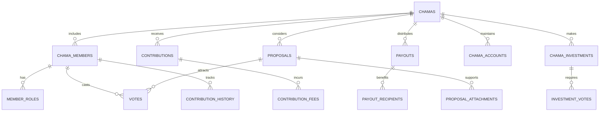

# Chama Models

AWO Platform's Chama models digitize traditional African savings groups (Stokvels/Chamas) with transparent governance, democratic decision-making, and comprehensive financial tracking while preserving the community-driven essence of these traditional practices.

## Chama Architecture Overview

<Info>
Chama models implement sophisticated group financial management with democratic governance, transparent contribution tracking, and immutable audit trails while supporting both traditional rotation systems and modern investment opportunities.
</Info>

### Chama Entity Relationships



## Core Chama Models

### Chama Structure

```typescript
interface Chama {
  id: string; // UUID
  name: string;
  description?: string;
  
  // Chama configuration
  type: ChamaType;
  category: ChamaCategory;
  visibility: ChamaVisibility;
  
  // Financial settings
  contributionAmount: number;
  contributionFrequency: ContributionFrequency;
  currency: Currency;
  
  // Membership rules
  minimumMembers: number;
  maximumMembers: number;
  currentMemberCount: number;
  
  // Governance settings
  governance: ChamaGovernance;
  votingThreshold: number; // Percentage required for decisions
  
  // Status and lifecycle
  status: ChamaStatus;
  lifecycle: ChamaLifecycle;
  
  // Financial tracking
  totalContributions: number;
  totalPayouts: number;
  currentBalance: number;
  investmentValue: number;
  
  // Important dates
  foundedDate: Date;
  nextContributionDate: Date;
  nextPayoutDate?: Date;
  maturityDate?: Date;
  
  // Settings and preferences
  settings: ChamaSettings;
  
  createdAt: Date;
  updatedAt: Date;
  
  // Relationships
  members: ChamaMember[];
  contributions: Contribution[];
  payouts: Payout[];
  proposals: Proposal[];
  investments: ChamaInvestment[];
}

enum ChamaType {
  ROTATING_SAVINGS = 'rotating_savings',
  ACCUMULATING_SAVINGS = 'accumulating_savings',
  INVESTMENT_CLUB = 'investment_club',
  CREDIT_ASSOCIATION = 'credit_association',
  MIXED = 'mixed'
}

enum ChamaCategory {
  FAMILY = 'family',
  FRIENDS = 'friends',
  COLLEAGUES = 'colleagues',
  COMMUNITY = 'community',
  BUSINESS = 'business',
  SPECIAL_PURPOSE = 'special_purpose'
}

enum ChamaVisibility {
  PUBLIC = 'public',
  PRIVATE = 'private',
  INVITE_ONLY = 'invite_only'
}

enum ContributionFrequency {
  WEEKLY = 'weekly',
  BIWEEKLY = 'biweekly',
  MONTHLY = 'monthly',
  QUARTERLY = 'quarterly',
  CUSTOM = 'custom'
}

enum ChamaStatus {
  FORMING = 'forming',
  ACTIVE = 'active',
  PAUSED = 'paused',
  CLOSED = 'closed',
  DISSOLVED = 'dissolved'
}

interface ChamaLifecycle {
  stage: 'formation' | 'contribution' | 'payout' | 'investment' | 'maturity';
  cycleNumber: number;
  daysInCurrentStage: number;
  estimatedStageCompletion?: Date;
}
```

### Chama Governance Model

```typescript
interface ChamaGovernance {
  decisionMaking: DecisionMakingModel;
  leadershipStructure: LeadershipStructure;
  rules: ChamaRules;
  amendments: GovernanceAmendment[];
}

enum DecisionMakingModel {
  DEMOCRATIC = 'democratic', // Majority vote
  CONSENSUS = 'consensus', // Unanimous agreement
  WEIGHTED = 'weighted', // Vote weight by contribution
  DELEGATED = 'delegated' // Committee decides
}

interface LeadershipStructure {
  chairperson?: string; // User ID
  treasurer: string; // User ID (required)
  secretary?: string; // User ID
  committee: string[]; // User IDs
  
  // Term information
  termLength: number; // months
  currentTermStart: Date;
  nextElection: Date;
  
  // Leadership rotation
  rotationEnabled: boolean;
  rotationSchedule?: RotationSchedule;
}

interface RotationSchedule {
  positions: ('chairperson' | 'treasurer' | 'secretary')[];
  frequency: 'monthly' | 'quarterly' | 'annually';
  nextRotation: Date;
}

interface ChamaRules {
  // Contribution rules
  contribution: {
    amount: number;
    tolerance: number; // Percentage variance allowed
    lateFee: number;
    gracePeriod: number; // Days
    missedPaymentLimit: number;
  };
  
  // Payout rules
  payout: {
    method: 'rotation' | 'equal_split' | 'needs_based' | 'investment_return';
    rotationOrder?: string[]; // User IDs in order
    payoutTrigger: PayoutTrigger;
    minimumBalance?: number;
  };
  
  // Membership rules
  membership: {
    approvalRequired: boolean;
    probationPeriod: number; // Days
    exitNoticePeriod: number; // Days
    transferAllowed: boolean;
  };
  
  // Financial rules
  financial: {
    investmentAllowed: boolean;
    loaningAllowed: boolean;
    interestRate?: number;
    maxLoanAmount?: number;
    feeStructure: FeeStructure;
  };
  
  // Meeting rules
  meetings: {
    frequency: 'weekly' | 'monthly' | 'quarterly';
    quorumPercentage: number;
    virtualMeetingsAllowed: boolean;
    recordingRequired: boolean;
  };
}

enum PayoutTrigger {
  SCHEDULED = 'scheduled',
  BALANCE_THRESHOLD = 'balance_threshold',
  MEMBER_REQUEST = 'member_request',
  EMERGENCY = 'emergency',
  MATURITY = 'maturity'
}

interface FeeStructure {
  membershipFee: number;
  transactionFeePercentage: number;
  lateFeeAmount: number;
  withdrawalFeePercentage: number;
  investmentFeePercentage: number;
}
```

### Chama Settings

```typescript
interface ChamaSettings {
  // Notifications
  notifications: {
    contributionReminders: boolean;
    payoutNotifications: boolean;
    meetingReminders: boolean;
    votingNotifications: boolean;
    emergencyAlerts: boolean;
  };
  
  // Privacy
  privacy: {
    memberListVisible: boolean;
    financialDetailsVisible: 'all' | 'summary' | 'leaders_only';
    contributionHistoryVisible: boolean;
    payoutHistoryVisible: boolean;
  };
  
  // Automation
  automation: {
    autoContributions: boolean;
    autoPayouts: boolean;
    autoInvestments: boolean;
    autoReminders: boolean;
  };
  
  // Reporting
  reporting: {
    monthlyStatements: boolean;
    quarterlyReports: boolean;
    annualSummary: boolean;
    memberStatements: boolean;
  };
  
  // Integration
  integration: {
    bankAccountLinked: boolean;
    mobileMoneyEnabled: boolean;
    investmentPlatformLinked: boolean;
    accountingSystemLinked: boolean;
  };
}
```

## Member Management Models

### Chama Member Structure

```typescript
interface ChamaMember {
  id: string; // UUID
  chamaId: string;
  userId: string;
  
  // Membership details
  joinDate: Date;
  memberNumber: number; // Sequential number for rotation
  status: MemberStatus;
  
  // Roles and permissions
  roles: MemberRole[];
  permissions: MemberPermission[];
  
  // Financial tracking
  totalContributions: number;
  outstandingContributions: number;
  totalReceived: number;
  netContribution: number; // Contributed - Received
  
  // Participation metrics
  contributionScore: number; // 0-100 based on punctuality
  participationLevel: ParticipationLevel;
  meetingAttendance: number; // Percentage
  votingParticipation: number; // Percentage
  
  // Payout information
  lastPayoutDate?: Date;
  nextPayoutEligible?: Date;
  payoutOrder?: number; // For rotating payouts
  
  // Warnings and penalties
  warnings: MemberWarning[];
  penalties: MemberPenalty[];
  
  // Notes and comments
  notes?: string;
  
  updatedAt: Date;
}

enum MemberStatus {
  PENDING = 'pending', // Invited but not yet active
  ACTIVE = 'active',
  ON_LEAVE = 'on_leave', // Temporary absence
  SUSPENDED = 'suspended', // Disciplinary action
  EXITED = 'exited', // Left voluntarily
  EXPELLED = 'expelled' // Removed by group
}

enum MemberRole {
  MEMBER = 'member',
  CHAIRPERSON = 'chairperson',
  TREASURER = 'treasurer',
  SECRETARY = 'secretary',
  COMMITTEE_MEMBER = 'committee_member',
  FOUNDER = 'founder'
}

enum MemberPermission {
  VIEW_FINANCIALS = 'view_financials',
  MANAGE_MEMBERS = 'manage_members',
  APPROVE_TRANSACTIONS = 'approve_transactions',
  CREATE_PROPOSALS = 'create_proposals',
  MANAGE_INVESTMENTS = 'manage_investments',
  ACCESS_REPORTS = 'access_reports',
  MODIFY_RULES = 'modify_rules'
}

enum ParticipationLevel {
  LOW = 'low',         // < 60% participation
  MODERATE = 'moderate', // 60-80% participation
  HIGH = 'high',       // 80-95% participation
  EXCELLENT = 'excellent' // > 95% participation
}

interface MemberWarning {
  id: string;
  type: WarningType;
  reason: string;
  issuedBy: string; // User ID
  issuedDate: Date;
  resolved: boolean;
  resolvedDate?: Date;
}

enum WarningType {
  LATE_CONTRIBUTION = 'late_contribution',
  MISSED_CONTRIBUTION = 'missed_contribution',
  POOR_ATTENDANCE = 'poor_attendance',
  INAPPROPRIATE_BEHAVIOR = 'inappropriate_behavior',
  FINANCIAL_IRREGULARITY = 'financial_irregularity'
}

interface MemberPenalty {
  id: string;
  type: PenaltyType;
  amount?: number;
  duration?: number; // Days
  reason: string;
  issuedBy: string; // User ID
  issuedDate: Date;
  status: 'active' | 'served' | 'waived';
}

enum PenaltyType {
  FINE = 'fine',
  SUSPENSION = 'suspension',
  LOSS_OF_PRIVILEGES = 'loss_of_privileges',
  CONTRIBUTION_INCREASE = 'contribution_increase'
}
```

### Member Invitation System

```typescript
interface ChamaInvitation {
  id: string;
  chamaId: string;
  invitedBy: string; // User ID
  
  // Invitation details
  inviteeEmail?: string;
  inviteePhone?: string;
  inviteeUserId?: string; // If inviting existing user
  personalMessage?: string;
  
  // Status tracking
  status: InvitationStatus;
  sentDate: Date;
  expiresDate: Date;
  respondedDate?: Date;
  
  // Response tracking
  viewedDate?: Date;
  responseReason?: string;
  
  // Follow-up
  remindersSent: number;
  lastReminderDate?: Date;
}

enum InvitationStatus {
  PENDING = 'pending',
  VIEWED = 'viewed',
  ACCEPTED = 'accepted',
  DECLINED = 'declined',
  EXPIRED = 'expired',
  CANCELLED = 'cancelled'
}
```

## Contribution Models

### Contribution Tracking

```typescript
interface Contribution {
  id: string; // UUID
  chamaId: string;
  memberId: string;
  
  // Contribution details
  amount: number;
  currency: Currency;
  contributionType: ContributionType;
  
  // Due date and timing
  dueDate: Date;
  paidDate?: Date;
  period: ContributionPeriod;
  
  // Status and processing
  status: ContributionStatus;
  paymentMethod: PaymentMethod;
  transactionId?: string;
  
  // Late payments
  daysLate?: number;
  lateFee?: number;
  
  // Partial payments
  partialPayments: PartialPayment[];
  
  // Notes and references
  notes?: string;
  receiptNumber: string;
  
  // Verification
  verifiedBy?: string; // User ID
  verifiedDate?: Date;
  
  createdAt: Date;
  updatedAt: Date;
}

enum ContributionType {
  REGULAR = 'regular',
  SPECIAL = 'special', // One-off special contributions
  CATCH_UP = 'catch_up', // Making up missed payments
  PENALTY = 'penalty', // Penalty payments
  VOLUNTARY = 'voluntary' // Extra voluntary contributions
}

interface ContributionPeriod {
  year: number;
  month: number;
  week?: number;
  cycle?: number; // For custom cycles
  description: string; // e.g., "January 2025", "Week 3"
}

enum ContributionStatus {
  PENDING = 'pending',
  PARTIAL = 'partial',
  PAID = 'paid',
  LATE = 'late',
  OVERDUE = 'overdue',
  WAIVED = 'waived',
  DISPUTED = 'disputed'
}

interface PartialPayment {
  amount: number;
  paidDate: Date;
  transactionId: string;
  notes?: string;
}
```

### Contribution Schedule

```typescript
interface ContributionSchedule {
  chamaId: string;
  memberId: string;
  
  // Schedule configuration
  frequency: ContributionFrequency;
  amount: number;
  startDate: Date;
  endDate?: Date;
  
  // Generated schedule
  scheduledContributions: ScheduledContribution[];
  
  // Auto-payment settings
  autoPayEnabled: boolean;
  autoPayAccountId?: string;
  autoPayDaysBefore: number;
  
  // Notification settings
  reminderDaysBefore: number[];
  escalationEnabled: boolean;
  
  lastGenerated: Date;
  nextGeneration: Date;
}

interface ScheduledContribution {
  dueDate: Date;
  amount: number;
  period: ContributionPeriod;
  generated: boolean;
  contributionId?: string; // When actually created
}
```

## Payout Models

### Payout Management

```typescript
interface Payout {
  id: string; // UUID
  chamaId: string;
  
  // Payout details
  totalAmount: number;
  currency: Currency;
  payoutType: PayoutType;
  payoutReason: PayoutReason;
  
  // Recipients
  recipients: PayoutRecipient[];
  
  // Timing and scheduling
  scheduledDate: Date;
  processedDate?: Date;
  completedDate?: Date;
  
  // Status and processing
  status: PayoutStatus;
  approvalStatus: ApprovalStatus;
  
  // Approval workflow
  approvals: PayoutApproval[];
  requiredApprovals: number;
  
  // Financial calculations
  sourceBalance: number; // Balance before payout
  remainingBalance: number; // Balance after payout
  fees: PayoutFee[];
  
  // Verification and audit
  authorizedBy: string; // User ID
  processedBy?: string; // User ID
  verificationCode?: string;
  
  // Notes and documentation
  description?: string;
  attachments: PayoutAttachment[];
  
  createdAt: Date;
  updatedAt: Date;
}

enum PayoutType {
  ROTATION = 'rotation', // Regular rotation payout
  DISTRIBUTION = 'distribution', // Equal distribution
  EMERGENCY = 'emergency', // Emergency payout
  LOAN = 'loan', // Member loan
  INVESTMENT_RETURN = 'investment_return', // Investment gains
  FINAL = 'final' // Final dissolution payout
}

enum PayoutReason {
  SCHEDULED_ROTATION = 'scheduled_rotation',
  MEMBER_TURN = 'member_turn',
  EMERGENCY_REQUEST = 'emergency_request',
  INVESTMENT_MATURITY = 'investment_maturity',
  GROUP_DECISION = 'group_decision',
  MEDICAL_EMERGENCY = 'medical_emergency',
  EDUCATION_EXPENSES = 'education_expenses',
  BUSINESS_OPPORTUNITY = 'business_opportunity'
}

enum PayoutStatus {
  PROPOSED = 'proposed',
  PENDING_APPROVAL = 'pending_approval',
  APPROVED = 'approved',
  PROCESSING = 'processing',
  COMPLETED = 'completed',
  FAILED = 'failed',
  CANCELLED = 'cancelled'
}

enum ApprovalStatus {
  PENDING = 'pending',
  APPROVED = 'approved',
  REJECTED = 'rejected'
}

interface PayoutRecipient {
  memberId: string;
  amount: number;
  percentage: number; // Of total payout
  accountId: string; // Where to send money
  status: 'pending' | 'processed' | 'completed' | 'failed';
  transactionId?: string;
  processedDate?: Date;
  failureReason?: string;
}

interface PayoutApproval {
  memberId: string;
  status: ApprovalStatus;
  approvalDate?: Date;
  comments?: string;
  signature?: string; // Digital signature
}

interface PayoutFee {
  type: 'processing' | 'transfer' | 'administrative';
  amount: number;
  description: string;
}

interface PayoutAttachment {
  id: string;
  filename: string;
  fileType: string;
  fileSize: number;
  uploadedBy: string;
  uploadedDate: Date;
  description?: string;
}
```

### Payout Schedule

```typescript
interface PayoutSchedule {
  chamaId: string;
  
  // Schedule configuration
  scheduleType: 'rotation' | 'fixed_interval' | 'milestone_based';
  frequency?: 'monthly' | 'quarterly' | 'annually';
  
  // Rotation specific
  rotationOrder?: string[]; // Member IDs in order
  currentRotationIndex?: number;
  
  // Fixed interval specific
  intervalDays?: number;
  nextScheduledDate?: Date;
  
  // Milestone specific
  milestones?: PayoutMilestone[];
  
  // Generated payouts
  scheduledPayouts: ScheduledPayout[];
  
  lastGenerated: Date;
  nextGeneration: Date;
}

interface PayoutMilestone {
  id: string;
  description: string;
  targetAmount: number;
  targetDate?: Date;
  achieved: boolean;
  achievedDate?: Date;
}

interface ScheduledPayout {
  scheduledDate: Date;
  estimatedAmount: number;
  recipientId?: string; // For rotation payouts
  type: PayoutType;
  generated: boolean;
  payoutId?: string; // When actually created
}
```

## Governance and Voting Models

### Proposal System

```typescript
interface Proposal {
  id: string; // UUID
  chamaId: string;
  proposedBy: string; // User ID
  
  // Proposal details
  title: string;
  description: string;
  proposalType: ProposalType;
  category: ProposalCategory;
  
  // Financial implications
  financialImpact?: FinancialImpact;
  budgetRequired?: number;
  
  // Voting configuration
  votingMethod: VotingMethod;
  votingPeriod: VotingPeriod;
  requiredQuorum: number; // Percentage
  passThreshold: number; // Percentage to pass
  
  // Status and timeline
  status: ProposalStatus;
  submittedDate: Date;
  votingStartDate: Date;
  votingEndDate: Date;
  implementationDate?: Date;
  
  // Voting results
  votes: Vote[];
  votingSummary: VotingSummary;
  
  // Implementation
  implementationPlan?: string;
  implementationStatus?: ImplementationStatus;
  
  // Attachments and documentation
  attachments: ProposalAttachment[];
  
  // Discussion
  allowDiscussion: boolean;
  comments: ProposalComment[];
  
  createdAt: Date;
  updatedAt: Date;
}

enum ProposalType {
  RULE_CHANGE = 'rule_change',
  CONTRIBUTION_CHANGE = 'contribution_change',
  MEMBER_ADMISSION = 'member_admission',
  MEMBER_REMOVAL = 'member_removal',
  INVESTMENT_DECISION = 'investment_decision',
  PAYOUT_REQUEST = 'payout_request',
  LEADERSHIP_CHANGE = 'leadership_change',
  MEETING_SCHEDULE = 'meeting_schedule',
  SPECIAL_ASSESSMENT = 'special_assessment',
  GROUP_DISSOLUTION = 'group_dissolution'
}

enum ProposalCategory {
  GOVERNANCE = 'governance',
  FINANCIAL = 'financial',
  MEMBERSHIP = 'membership',
  OPERATIONS = 'operations',
  EMERGENCY = 'emergency'
}

enum VotingMethod {
  SIMPLE_MAJORITY = 'simple_majority',
  SUPER_MAJORITY = 'super_majority',
  UNANIMOUS = 'unanimous',
  WEIGHTED_BY_CONTRIBUTION = 'weighted_by_contribution'
}

interface VotingPeriod {
  startDate: Date;
  endDate: Date;
  extensionAllowed: boolean;
  maxExtensionDays: number;
}

enum ProposalStatus {
  DRAFT = 'draft',
  SUBMITTED = 'submitted',
  VOTING = 'voting',
  PASSED = 'passed',
  REJECTED = 'rejected',
  IMPLEMENTED = 'implemented',
  CANCELLED = 'cancelled'
}

interface FinancialImpact {
  impactType: 'increase_contributions' | 'decrease_contributions' | 'special_levy' | 'investment' | 'expense';
  amount: number;
  frequency?: 'one_time' | 'recurring';
  duration?: number; // Months for recurring
}

interface VotingSummary {
  totalEligibleVoters: number;
  totalVotesCast: number;
  participationRate: number; // Percentage
  
  voteCounts: {
    yes: number;
    no: number;
    abstain: number;
  };
  
  votePercentages: {
    yes: number;
    no: number;
    abstain: number;
  };
  
  quorumMet: boolean;
  passThresholdMet: boolean;
  finalResult: 'passed' | 'rejected' | 'pending';
}

enum ImplementationStatus {
  PENDING = 'pending',
  IN_PROGRESS = 'in_progress',
  COMPLETED = 'completed',
  DELAYED = 'delayed',
  CANCELLED = 'cancelled'
}
```

### Voting System

```typescript
interface Vote {
  id: string; // UUID
  proposalId: string;
  memberId: string;
  
  // Vote details
  voteChoice: VoteChoice;
  weight: number; // Vote weight (normally 1)
  
  // Timing
  votedDate: Date;
  lastModifiedDate?: Date; // If vote was changed
  
  // Verification
  verified: boolean;
  verificationMethod: 'digital_signature' | 'biometric' | 'pin' | 'password';
  
  // Comments and reasoning
  comments?: string;
  reasoning?: string;
  
  // Privacy
  anonymous: boolean;
  
  // Audit trail
  ipAddress?: string;
  deviceInfo?: string;
}

enum VoteChoice {
  YES = 'yes',
  NO = 'no',
  ABSTAIN = 'abstain'
}

interface ProposalComment {
  id: string;
  proposalId: string;
  memberId: string;
  content: string;
  parentCommentId?: string; // For replies
  
  // Moderation
  flagged: boolean;
  hidden: boolean;
  moderatedBy?: string;
  
  postedDate: Date;
  editedDate?: Date;
}

interface ProposalAttachment {
  id: string;
  proposalId: string;
  filename: string;
  fileType: string;
  fileSize: number;
  uploadedBy: string;
  uploadedDate: Date;
  description?: string;
  downloadCount: number;
}
```

## Chama Investment Models

### Investment Management

```typescript
interface ChamaInvestment {
  id: string; // UUID
  chamaId: string;
  
  // Investment details
  investmentType: InvestmentType;
  instrumentName: string;
  amount: number;
  currency: Currency;
  
  // Investment provider
  provider: string;
  providerInvestmentId: string;
  
  // Timeline
  investmentDate: Date;
  maturityDate?: Date;
  
  // Performance
  currentValue: number;
  totalReturn: number;
  returnPercentage: number;
  
  // Risk and categorization
  riskLevel: 'low' | 'medium' | 'high';
  assetClass: AssetClass;
  
  // Decision making
  proposalId?: string; // If decided by proposal
  approvedBy: string[]; // Member IDs who approved
  
  // Status
  status: InvestmentStatus;
  
  // Distributions
  distributions: InvestmentDistribution[];
  
  // Documentation
  documents: InvestmentDocument[];
  
  createdAt: Date;
  updatedAt: Date;
}

enum InvestmentType {
  MONEY_MARKET = 'money_market',
  FIXED_DEPOSIT = 'fixed_deposit',
  TREASURY_BILLS = 'treasury_bills',
  GOVERNMENT_BONDS = 'government_bonds',
  UNIT_TRUSTS = 'unit_trusts',
  ETF = 'etf',
  SME_DEBT = 'sme_debt',
  REAL_ESTATE = 'real_estate',
  COMMODITY = 'commodity'
}

enum AssetClass {
  CASH = 'cash',
  FIXED_INCOME = 'fixed_income',
  EQUITY = 'equity',
  ALTERNATIVE = 'alternative',
  MIXED = 'mixed'
}

enum InvestmentStatus {
  PROPOSED = 'proposed',
  APPROVED = 'approved',
  INVESTED = 'invested',
  ACTIVE = 'active',
  MATURED = 'matured',
  REDEEMED = 'redeemed',
  DEFAULTED = 'defaulted'
}

interface InvestmentDistribution {
  id: string;
  amount: number;
  distributionType: 'interest' | 'dividend' | 'capital_gain' | 'return_of_capital';
  distributionDate: Date;
  reinvested: boolean;
  taxWithheld?: number;
}

interface InvestmentDocument {
  id: string;
  documentType: 'certificate' | 'statement' | 'prospectus' | 'contract' | 'tax_certificate';
  filename: string;
  uploadedDate: Date;
  uploadedBy: string;
}
```

### Investment Voting

```typescript
interface InvestmentVote {
  id: string;
  chamaInvestmentId: string;
  proposalId: string;
  memberId: string;
  
  // Vote specifics
  voteType: InvestmentVoteType;
  amount?: number; // For amount-based decisions
  choice: string; // Free-form choice
  
  // Weight and influence
  contributionWeight: number; // Based on member's contributions
  votingWeight: number; // Calculated voting weight
  
  votedDate: Date;
  comments?: string;
}

enum InvestmentVoteType {
  INVEST_OR_NOT = 'invest_or_not',
  INVESTMENT_AMOUNT = 'investment_amount',
  INVESTMENT_OPTION = 'investment_option',
  REDEMPTION_TIMING = 'redemption_timing',
  DISTRIBUTION_METHOD = 'distribution_method'
}
```

## Financial Reporting Models

### Chama Financial Reports

```typescript
interface ChamaFinancialReport {
  id: string;
  chamaId: string;
  
  // Report metadata
  reportType: ReportType;
  reportPeriod: ReportPeriod;
  generatedDate: Date;
  generatedBy: string; // User ID
  
  // Financial summary
  summary: FinancialSummary;
  
  // Detailed breakdowns
  memberContributions: MemberContributionSummary[];
  payoutHistory: PayoutSummary[];
  investmentPerformance: InvestmentPerformance[];
  
  // Metrics and analytics
  metrics: ChamaMetrics;
  
  // Compliance and audit
  auditTrail: AuditEntry[];
  complianceStatus: ComplianceStatus;
  
  // Distribution
  recipients: ReportRecipient[];
  distributionDate: Date;
  
  // File storage
  pdfUrl?: string;
  excelUrl?: string;
}

enum ReportType {
  MONTHLY_STATEMENT = 'monthly_statement',
  QUARTERLY_REPORT = 'quarterly_report',
  ANNUAL_SUMMARY = 'annual_summary',
  MEMBER_STATEMENT = 'member_statement',
  INVESTMENT_REPORT = 'investment_report',
  AUDIT_REPORT = 'audit_report'
}

interface ReportPeriod {
  startDate: Date;
  endDate: Date;
  description: string; // e.g., "Q1 2025", "January 2025"
}

interface FinancialSummary {
  openingBalance: number;
  totalContributions: number;
  totalPayouts: number;
  totalInvestments: number;
  totalFees: number;
  totalReturns: number;
  closingBalance: number;
  netGrowth: number;
  growthPercentage: number;
}

interface MemberContributionSummary {
  memberId: string;
  memberName: string;
  expectedContributions: number;
  actualContributions: number;
  lateFees: number;
  complianceRate: number; // Percentage
  payoutsReceived: number;
  netPosition: number;
}

interface PayoutSummary {
  payoutId: string;
  payoutDate: Date;
  payoutType: PayoutType;
  totalAmount: number;
  recipientCount: number;
  averageAmount: number;
}

interface InvestmentPerformance {
  investmentId: string;
  instrumentName: string;
  investmentAmount: number;
  currentValue: number;
  totalReturn: number;
  returnPercentage: number;
  performancePeriod: string;
}

interface ChamaMetrics {
  membershipMetrics: {
    totalMembers: number;
    activeMembers: number;
    averageContribution: number;
    contributionComplianceRate: number;
  };
  
  financialMetrics: {
    totalAssets: number;
    liquidAssets: number;
    investedAssets: number;
    assetGrowthRate: number;
    returnOnInvestment: number;
  };
  
  operationalMetrics: {
    meetingAttendanceRate: number;
    proposalApprovalRate: number;
    averageVotingParticipation: number;
    disputeCount: number;
  };
}

interface ComplianceStatus {
  regulatoryCompliance: boolean;
  auditStatus: 'current' | 'overdue' | 'in_progress';
  outstandingIssues: string[];
  lastAuditDate: Date;
  nextAuditDue: Date;
}

interface ReportRecipient {
  memberId: string;
  deliveryMethod: 'email' | 'sms' | 'app_notification' | 'postal';
  deliveryAddress: string;
  delivered: boolean;
  deliveredDate?: Date;
}
```

## Analytics and Insights

### Chama Analytics

```typescript
interface ChamaAnalytics {
  chamaId: string;
  analysisDate: Date;
  analysisPeriod: AnalysisPeriod;
  
  // Performance analytics
  performance: {
    contributionTrends: TrendAnalysis;
    payoutEfficiency: EfficiencyMetrics;
    investmentPerformance: InvestmentAnalytics;
    memberEngagement: EngagementMetrics;
  };
  
  // Risk analytics
  riskAssessment: {
    memberDefaultRisk: RiskScore[];
    liquidityRisk: number;
    concentrationRisk: number;
    operationalRisk: number;
  };
  
  // Predictive analytics
  predictions: {
    nextMonthContributions: number;
    expectedMemberGrowth: number;
    projectedBalance: number;
    riskEvents: PredictedRisk[];
  };
  
  // Benchmarking
  benchmarks: {
    similarChamas: BenchmarkComparison;
    industryAverages: IndustryBenchmark;
    bestPractices: BestPracticeRecommendation[];
  };
}

interface TrendAnalysis {
  trend: 'increasing' | 'decreasing' | 'stable' | 'volatile';
  trendStrength: number; // 0-100
  projectedDirection: 'up' | 'down' | 'stable';
  seasonalityDetected: boolean;
  anomalies: Anomaly[];
}

interface EfficiencyMetrics {
  averageProcessingTime: number; // Hours
  automationRate: number; // Percentage
  errorRate: number; // Percentage
  memberSatisfaction: number; // 1-5 scale
}

interface EngagementMetrics {
  participationRate: number;
  communicationFrequency: number;
  initiativeCount: number;
  leadershipRotation: number;
}

interface RiskScore {
  memberId: string;
  riskLevel: 'low' | 'medium' | 'high';
  riskFactors: string[];
  recommendedActions: string[];
}

interface PredictedRisk {
  riskType: string;
  probability: number; // 0-100
  impact: 'low' | 'medium' | 'high';
  timeframe: string;
  mitigationSuggestions: string[];
}
```

---

*This comprehensive Chama models documentation provides the foundation for digitizing traditional African savings groups while preserving their community-driven essence and enhancing them with modern financial management, transparency, and governance capabilities.*

*Last updated: June 2025*  
*Next review: July 2025*