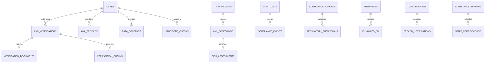

# Compliance Models

AWO Platform's compliance models ensure adherence to regulatory requirements across SADC countries, implementing comprehensive KYC/AML procedures, data protection controls, and audit trails while supporting business growth and user trust.

## Compliance Architecture Overview

<Info>
Compliance models implement a multi-layered approach to regulatory adherence, covering identity verification, transaction monitoring, data protection, and audit requirements across diverse SADC regulatory environments while maintaining operational efficiency.
</Info>

### Compliance Entity Relationships



## KYC (Know Your Customer) Models

### KYC Verification Framework

```typescript
interface KYCVerification {
  id: string; // UUID
  userId: string;
  
  // Verification tier and status
  tier: KYCTier;
  status: KYCStatus;
  overallRiskRating: RiskRating;
  
  // Verification process tracking
  initiatedDate: Date;
  completedDate?: Date;
  expiryDate?: Date;
  nextReviewDate: Date;
  
  // Verification components
  identityVerification: IdentityVerification;
  addressVerification: AddressVerification;
  sourceOfFunds: SourceOfFundsVerification;
  enhancedDueDiligence?: EnhancedDueDiligence;
  
  // Provider and method
  provider: KYCProvider;
  verificationMethod: VerificationMethod[];
  
  // Results and scoring
  verificationScore: number; // 0-100 confidence score
  biometricMatch: number; // 0-100 facial recognition confidence
  documentAuthenticity: number; // 0-100 document verification confidence
  
  // Risk factors and flags
  riskFactors: RiskFactor[];
  complianceFlags: ComplianceFlag[];
  
  // Review and approval
  reviewedBy?: string; // Staff member ID
  reviewNotes?: string;
  approvedBy?: string;
  approvalDate?: Date;
  
  // Documentation
  documents: KYCDocument[];
  verificationReport: VerificationReport;
  
  // Regulatory compliance
  regulatoryRequirements: RegulatoryRequirement[];
  complianceNotes: string[];
  
  createdAt: Date;
  updatedAt: Date;
}

enum KYCTier {
  TIER_1 = 'tier_1', // Basic verification - phone + ID number
  TIER_2 = 'tier_2'  // Enhanced verification - photo ID + biometric
}

enum KYCStatus {
  NOT_STARTED = 'not_started',
  IN_PROGRESS = 'in_progress',
  PENDING_REVIEW = 'pending_review',
  APPROVED = 'approved',
  REJECTED = 'rejected',
  EXPIRED = 'expired',
  SUSPENDED = 'suspended',
  REQUIRES_UPDATE = 'requires_update'
}

enum RiskRating {
  LOW = 'low',
  MEDIUM = 'medium',
  HIGH = 'high',
  VERY_HIGH = 'very_high',
  PROHIBITED = 'prohibited'
}

enum KYCProvider {
  SMILE_ID = 'smile_id',
  ONFIDO = 'onfido',
  MANUAL_REVIEW = 'manual_review',
  THIRD_PARTY = 'third_party'
}

enum VerificationMethod {
  DOCUMENT_VERIFICATION = 'document_verification',
  BIOMETRIC_VERIFICATION = 'biometric_verification',
  DATABASE_VERIFICATION = 'database_verification',
  SMS_VERIFICATION = 'sms_verification',
  ADDRESS_VERIFICATION = 'address_verification',
  BANK_VERIFICATION = 'bank_verification'
}
```

### Identity Verification

```typescript
interface IdentityVerification {
  // Personal information verification
  personalDetails: PersonalDetailsVerification;
  
  // Document verification
  primaryDocument: DocumentVerification;
  secondaryDocument?: DocumentVerification;
  
  // Biometric verification
  biometricVerification?: BiometricVerification;
  
  // Cross-reference checks
  databaseChecks: DatabaseCheck[];
  
  // Verification outcome
  identityConfirmed: boolean;
  confidenceLevel: number;
  verificationDate: Date;
  
  // Issues and discrepancies
  discrepancies: IdentityDiscrepancy[];
  resolutionRequired: boolean;
}

interface PersonalDetailsVerification {
  fullName: NameVerification;
  dateOfBirth: DateVerification;
  nationality: NationalityVerification;
  gender?: GenderVerification;
  
  // Verification status
  allFieldsVerified: boolean;
  partialVerification: boolean;
  verificationScore: number;
}

interface NameVerification {
  providedName: string;
  documentName: string;
  fuzzyMatch: boolean;
  matchScore: number; // 0-100
  discrepancies: string[];
  verified: boolean;
}

interface DateVerification {
  providedDate: Date;
  documentDate: Date;
  exactMatch: boolean;
  ageVerified: boolean;
  minimumAgeCompliant: boolean;
  verified: boolean;
}

interface DocumentVerification {
  documentType: DocumentType;
  documentNumber: string;
  issueDate: Date;
  expiryDate: Date;
  issuingAuthority: string;
  
  // Verification results
  authenticityVerified: boolean;
  validityVerified: boolean;
  expiryStatus: ExpiryStatus;
  
  // Image analysis
  imageQuality: ImageQuality;
  tampering: TamperingDetection;
  
  // Extracted data
  extractedData: ExtractedDocumentData;
  dataExtractedSuccessfully: boolean;
  
  verificationDate: Date;
  verificationProvider: string;
}

enum DocumentType {
  NATIONAL_ID = 'national_id',
  PASSPORT = 'passport',
  DRIVERS_LICENSE = 'drivers_license',
  VOTER_ID = 'voter_id',
  REFUGEE_ID = 'refugee_id',
  ASYLUM_SEEKER_PERMIT = 'asylum_seeker_permit'
}

enum ExpiryStatus {
  VALID = 'valid',
  EXPIRED = 'expired',
  EXPIRING_SOON = 'expiring_soon'
}

interface BiometricVerification {
  faceMatch: FaceMatchResult;
  livenessCheck: LivenessCheckResult;
  verificationDate: Date;
  provider: string;
}

interface FaceMatchResult {
  matchScore: number; // 0-100
  matchConfidence: 'high' | 'medium' | 'low';
  matched: boolean;
  qualityScore: number;
}

interface LivenessCheckResult {
  livenessScore: number; // 0-100
  livenessConfirmed: boolean;
  spoofingDetected: boolean;
  qualityChecks: LivenessQualityCheck[];
}

interface LivenessQualityCheck {
  checkType: 'eye_movement' | 'head_movement' | 'facial_expression' | 'lighting' | 'background';
  passed: boolean;
  score: number;
}
```

### Address Verification

```typescript
interface AddressVerification {
  // Address details
  providedAddress: Address;
  verifiedAddress?: Address;
  
  // Verification methods
  verificationMethods: AddressVerificationMethod[];
  
  // Verification results
  addressConfirmed: boolean;
  partialVerification: boolean;
  confidenceLevel: number;
  
  // Supporting documents
  proofOfAddress: ProofOfAddressDocument[];
  
  // Geographic validation
  geographicValidation: GeographicValidation;
  
  verificationDate: Date;
  provider?: string;
}

interface Address {
  streetAddress: string;
  city: string;
  province: string;
  postalCode: string;
  country: string;
  
  // Additional details
  apartmentNumber?: string;
  buildingName?: string;
  suburb?: string;
  
  // Validation
  standardized: boolean;
  deliverable: boolean;
  residential: boolean;
}

enum AddressVerificationMethod {
  UTILITY_BILL = 'utility_bill',
  BANK_STATEMENT = 'bank_statement',
  MUNICIPAL_RATES = 'municipal_rates',
  LEASE_AGREEMENT = 'lease_agreement',
  POSTAL_VERIFICATION = 'postal_verification',
  GEOLOCATION = 'geolocation',
  DATABASE_MATCH = 'database_match'
}

interface ProofOfAddressDocument {
  documentType: AddressVerificationMethod;
  issueDate: Date;
  documentAge: number; // Days
  acceptableAge: boolean;
  documentVerified: boolean;
  providerName: string;
  accountHolder: string;
  addressMatch: boolean;
}

interface GeographicValidation {
  countryValidated: boolean;
  regionValidated: boolean;
  postalCodeValidated: boolean;
  coordinatesProvided: boolean;
  coordinates?: {
    latitude: number;
    longitude: number;
    accuracy: number;
  };
}
```

### Source of Funds Verification

```typescript
interface SourceOfFundsVerification {
  // Declared sources
  declaredSources: SourceOfFunds[];
  
  // Verification status
  verificationRequired: boolean;
  verificationCompleted: boolean;
  verificationDate?: Date;
  
  // Supporting documentation
  supportingDocuments: SourceOfFundsDocument[];
  
  // Analysis results
  consistencyAnalysis: ConsistencyAnalysis;
  riskAssessment: SourceOfFundsRisk;
  
  // Ongoing monitoring
  monitoringRequired: boolean;
  monitoringFrequency?: 'monthly' | 'quarterly' | 'annually';
  lastMonitoringDate?: Date;
}

interface SourceOfFunds {
  sourceType: SourceOfFundsType;
  description: string;
  estimatedAmount: number;
  frequency: 'one_time' | 'regular' | 'irregular';
  
  // Verification details
  verified: boolean;
  verificationMethod: string;
  verificationDate?: Date;
  
  // Risk assessment
  riskLevel: RiskRating;
  riskFactors: string[];
}

enum SourceOfFundsType {
  EMPLOYMENT_INCOME = 'employment_income',
  BUSINESS_INCOME = 'business_income',
  INVESTMENT_RETURNS = 'investment_returns',
  RENTAL_INCOME = 'rental_income',
  PENSION = 'pension',
  INHERITANCE = 'inheritance',
  GIFT = 'gift',
  LOAN = 'loan',
  SALE_OF_ASSETS = 'sale_of_assets',
  INSURANCE_PAYOUT = 'insurance_payout',
  OTHER = 'other'
}

interface SourceOfFundsDocument {
  documentType: SourceOfFundsDocumentType;
  filename: string;
  uploadDate: Date;
  verified: boolean;
  verificationNotes?: string;
}

enum SourceOfFundsDocumentType {
  PAYSLIP = 'payslip',
  EMPLOYMENT_CONTRACT = 'employment_contract',
  BANK_STATEMENTS = 'bank_statements',
  TAX_RETURNS = 'tax_returns',
  BUSINESS_REGISTRATION = 'business_registration',
  FINANCIAL_STATEMENTS = 'financial_statements',
  INVESTMENT_STATEMENTS = 'investment_statements',
  PROPERTY_DOCUMENTS = 'property_documents',
  INHERITANCE_DOCUMENTS = 'inheritance_documents'
}

interface ConsistencyAnalysis {
  incomeVsActivity: boolean;
  transactionPatterns: boolean;
  lifestyleConsistency: boolean;
  geographicConsistency: boolean;
  overallConsistency: number; // 0-100 score
  inconsistencies: string[];
}

interface SourceOfFundsRisk {
  overallRisk: RiskRating;
  riskFactors: {
    highCashIntensity: boolean;
    politicallyExposedPerson: boolean;
    highRiskJurisdiction: boolean;
    complexOwnershipStructure: boolean;
    unexplainedWealth: boolean;
  };
  mitigationMeasures: string[];
}
```

## AML (Anti-Money Laundering) Models

### AML Profile and Monitoring

```typescript
interface AMLProfile {
  id: string;
  userId: string;
  
  // Risk classification
  riskRating: AMLRiskRating;
  riskScore: number; // 0-100
  riskFactors: AMLRiskFactor[];
  
  // Customer categorization
  customerType: CustomerType;
  relationshipRisk: RelationshipRisk;
  
  // PEP (Politically Exposed Person) status
  pepStatus: PEPStatus;
  pepDetails?: PEPDetails;
  
  // Sanctions screening
  sanctionsStatus: SanctionsStatus;
  sanctionsChecks: SanctionsCheck[];
  
  // Monitoring configuration
  monitoringLevel: MonitoringLevel;
  monitoringParameters: MonitoringParameters;
  
  // Transaction monitoring
  transactionLimits: AMLTransactionLimits;
  velocityRules: VelocityRule[];
  
  // Review and updates
  lastReviewDate: Date;
  nextReviewDate: Date;
  reviewFrequency: ReviewFrequency;
  
  // Suspicious activity
  suspiciousActivityReports: SARReference[];
  investigationHistory: Investigation[];
  
  createdAt: Date;
  updatedAt: Date;
}

enum AMLRiskRating {
  LOW = 'low',
  MEDIUM = 'medium',
  HIGH = 'high',
  VERY_HIGH = 'very_high'
}

enum CustomerType {
  INDIVIDUAL = 'individual',
  SMALL_BUSINESS = 'small_business',
  CORPORATE = 'corporate',
  NON_PROFIT = 'non_profit',
  FINANCIAL_INSTITUTION = 'financial_institution'
}

enum RelationshipRisk {
  STANDARD = 'standard',
  ENHANCED = 'enhanced',
  SIMPLIFIED = 'simplified',
  PROHIBITED = 'prohibited'
}

enum PEPStatus {
  NOT_PEP = 'not_pep',
  DOMESTIC_PEP = 'domestic_pep',
  FOREIGN_PEP = 'foreign_pep',
  INTERNATIONAL_PEP = 'international_pep',
  FAMILY_MEMBER = 'family_member',
  CLOSE_ASSOCIATE = 'close_associate'
}

enum SanctionsStatus {
  CLEAR = 'clear',
  POTENTIAL_MATCH = 'potential_match',
  CONFIRMED_MATCH = 'confirmed_match',
  FALSE_POSITIVE = 'false_positive',
  UNDER_REVIEW = 'under_review'
}

enum MonitoringLevel {
  STANDARD = 'standard',
  ENHANCED = 'enhanced',
  INTENSIVE = 'intensive'
}

interface AMLRiskFactor {
  factor: string;
  weight: number;
  description: string;
  category: 'customer' | 'product' | 'geographic' | 'delivery_channel';
  severity: 'low' | 'medium' | 'high';
}

interface PEPDetails {
  pepType: PEPStatus;
  position: string;
  organization: string;
  country: string;
  startDate: Date;
  endDate?: Date;
  sourceOfInformation: string;
  lastVerified: Date;
}

interface SanctionsCheck {
  id: string;
  checkDate: Date;
  provider: string;
  listChecked: string[];
  matchFound: boolean;
  matches: SanctionsMatch[];
  falsePositive: boolean;
  reviewedBy?: string;
  reviewDate?: Date;
}

interface SanctionsMatch {
  listName: string;
  matchType: 'exact' | 'fuzzy' | 'partial';
  matchScore: number;
  matchedName: string;
  additionalInfo: string;
  sanctionType: string;
  effectiveDate: Date;
  removalDate?: Date;
}
```

### Transaction Monitoring

```typescript
interface TransactionMonitoring {
  id: string;
  transactionId: string;
  userId: string;
  
  // Monitoring details
  monitoringDate: Date;
  monitoringRules: MonitoringRule[];
  
  // Risk assessment
  riskScore: number; // 0-100
  riskFactors: TransactionRiskFactor[];
  
  // Alert generation
  alertsGenerated: MonitoringAlert[];
  alertLevel: AlertLevel;
  
  // Analysis results
  patternAnalysis: PatternAnalysis;
  behaviorAnalysis: BehaviorAnalysis;
  
  // Disposition
  disposition: MonitoringDisposition;
  reviewedBy?: string;
  reviewDate?: Date;
  reviewNotes?: string;
  
  // Escalation
  escalated: boolean;
  escalationReason?: string;
  escalationDate?: Date;
  
  createdAt: Date;
  updatedAt: Date;
}

interface MonitoringRule {
  ruleId: string;
  ruleName: string;
  ruleType: MonitoringRuleType;
  threshold: number;
  triggered: boolean;
  triggerValue?: number;
  description: string;
}

enum MonitoringRuleType {
  TRANSACTION_AMOUNT = 'transaction_amount',
  DAILY_VELOCITY = 'daily_velocity',
  MONTHLY_VELOCITY = 'monthly_velocity',
  GEOGRAPHIC_ANOMALY = 'geographic_anomaly',
  TIME_ANOMALY = 'time_anomaly',
  COUNTERPARTY_RISK = 'counterparty_risk',
  ROUND_AMOUNT = 'round_amount',
  STRUCTURING = 'structuring',
  RAPID_MOVEMENT = 'rapid_movement',
  DORMANT_ACCOUNT = 'dormant_account'
}

interface TransactionRiskFactor {
  factor: string;
  value: number | string;
  riskContribution: number;
  description: string;
}

interface MonitoringAlert {
  id: string;
  alertType: AlertType;
  severity: AlertSeverity;
  description: string;
  ruleTriggered: string;
  automaticDisposition?: boolean;
  requiresReview: boolean;
}

enum AlertType {
  THRESHOLD_BREACH = 'threshold_breach',
  PATTERN_DEVIATION = 'pattern_deviation',
  VELOCITY_ALERT = 'velocity_alert',
  SANCTIONS_HIT = 'sanctions_hit',
  PEP_ACTIVITY = 'pep_activity',
  GEOGRAPHIC_RISK = 'geographic_risk',
  STRUCTURING = 'structuring',
  UNUSUAL_ACTIVITY = 'unusual_activity'
}

enum AlertLevel {
  LOW = 'low',
  MEDIUM = 'medium',
  HIGH = 'high',
  CRITICAL = 'critical'
}

enum AlertSeverity {
  INFO = 'info',
  WARNING = 'warning',
  CRITICAL = 'critical',
  EMERGENCY = 'emergency'
}

enum MonitoringDisposition {
  NO_ACTION = 'no_action',
  CONTINUE_MONITORING = 'continue_monitoring',
  ENHANCED_MONITORING = 'enhanced_monitoring',
  INVESTIGATION_REQUIRED = 'investigation_required',
  SAR_FILED = 'sar_filed',
  ACCOUNT_CLOSURE = 'account_closure'
}

interface PatternAnalysis {
  unusualPatterns: UnusualPattern[];
  normalBehavior: boolean;
  deviationScore: number;
  comparisonPeriod: string;
}

interface UnusualPattern {
  patternType: string;
  description: string;
  frequency: number;
  significance: 'low' | 'medium' | 'high';
  timeframe: string;
}

interface BehaviorAnalysis {
  baselineEstablished: boolean;
  behaviorChange: boolean;
  changeSignificance: number;
  changeDirection: 'increase' | 'decrease' | 'both';
  changeDate?: Date;
  possibleReasons: string[];
}
```

### Suspicious Activity Reporting

```typescript
interface SuspiciousActivityReport {
  id: string;
  sarNumber: string;
  
  // Subject information
  subjectUserId: string;
  subjectType: 'customer' | 'transaction' | 'activity_pattern';
  
  // Reporting details
  reportingOfficer: string;
  reportingDate: Date;
  submissionDate?: Date;
  regulatoryAuthority: string;
  
  // Suspicious activity details
  suspiciousActivity: SuspiciousActivityDetails;
  
  // Supporting information
  transactionIds: string[];
  evidenceDocuments: SARDocument[];
  
  // Investigation
  investigationSummary: string;
  investigationFindings: InvestigationFinding[];
  
  // Regulatory response
  regulatoryResponse?: RegulatoryResponse;
  
  // Status tracking
  status: SARStatus;
  
  // Confidentiality
  confidentialityLevel: ConfidentialityLevel;
  accessRestrictions: string[];
  
  createdAt: Date;
  updatedAt: Date;
}

interface SuspiciousActivityDetails {
  activityType: SuspiciousActivityType;
  description: string;
  suspicionReason: string;
  
  // Financial details
  totalAmount: number;
  currency: string;
  timeframe: DateRange;
  
  // Risk assessment
  riskLevel: RiskRating;
  potentialCrimes: string[];
  
  // Geographic factors
  jurisdictionsInvolved: string[];
  highRiskJurisdictions: string[];
  
  // Counterparties
  suspiciousCounterparties: string[];
  
  // Patterns
  patternDescription: string;
  frequencyOfActivity: string;
  
  // Previous activity
  priorSuspiciousActivity: boolean;
  relationshipToPriorActivity?: string;
}

enum SuspiciousActivityType {
  UNUSUAL_TRANSACTION_PATTERN = 'unusual_transaction_pattern',
  STRUCTURING = 'structuring',
  RAPID_MOVEMENT_OF_FUNDS = 'rapid_movement_of_funds',
  TRANSACTIONS_WITH_HIGH_RISK_COUNTRIES = 'transactions_with_high_risk_countries',
  TRANSACTIONS_INCONSISTENT_WITH_BUSINESS = 'transactions_inconsistent_with_business',
  ATTEMPTED_CIRCUMVENTION = 'attempted_circumvention',
  IDENTITY_VERIFICATION_ISSUES = 'identity_verification_issues',
  SANCTIONS_EVASION = 'sanctions_evasion',
  TERRORIST_FINANCING = 'terrorist_financing',
  OTHER_SUSPICIOUS_ACTIVITY = 'other_suspicious_activity'
}

enum SARStatus {
  DRAFT = 'draft',
  UNDER_REVIEW = 'under_review',
  APPROVED = 'approved',
  SUBMITTED = 'submitted',
  ACKNOWLEDGED = 'acknowledged',
  UNDER_INVESTIGATION = 'under_investigation',
  CLOSED = 'closed'
}

enum ConfidentialityLevel {
  RESTRICTED = 'restricted',
  CONFIDENTIAL = 'confidential',
  SECRET = 'secret'
}

interface InvestigationFinding {
  findingType: string;
  description: string;
  evidence: string[];
  significance: 'low' | 'medium' | 'high';
  investigator: string;
  dateFound: Date;
}

interface RegulatoryResponse {
  responseDate: Date;
  responseType: 'acknowledgment' | 'investigation_opened' | 'no_action' | 'request_for_information';
  responseDetails: string;
  followUpRequired: boolean;
  followUpDate?: Date;
}
```

## Data Protection and Privacy Models

### Data Consent Management

```typescript
interface DataConsent {
  id: string;
  userId: string;
  
  // Consent categories
  consentTypes: ConsentRecord[];
  
  // Legal basis
  legalBasis: DataProcessingLegalBasis;
  jurisdiction: string;
  applicableLaws: string[];
  
  // Consent history
  consentHistory: ConsentHistoryRecord[];
  
  // Data subject rights
  rightsExercised: DataSubjectRightExercise[];
  
  // Consent expiry and renewal
  expiryDate?: Date;
  renewalRequired: boolean;
  lastRenewalDate?: Date;
  
  // Withdrawal
  withdrawalAllowed: boolean;
  partialWithdrawalAllowed: boolean;
  
  // Consent evidence
  consentEvidence: ConsentEvidence[];
  
  // Privacy policy acknowledgment
  privacyPolicyVersion: string;
  privacyPolicyAcceptedDate: Date;
  
  createdAt: Date;
  updatedAt: Date;
}

interface ConsentRecord {
  consentType: ConsentType;
  granted: boolean;
  grantedDate?: Date;
  withdrawnDate?: Date;
  purpose: string;
  dataCategories: DataCategory[];
  
  // Specific conditions
  conditions: ConsentCondition[];
  
  // Expiry
  hasExpiry: boolean;
  expiryDate?: Date;
  
  // Source of consent
  consentSource: ConsentSource;
  consentMethod: ConsentMethod;
}

enum ConsentType {
  DATA_PROCESSING = 'data_processing',
  MARKETING_COMMUNICATIONS = 'marketing_communications',
  DATA_SHARING_PARTNERS = 'data_sharing_partners',
  ANALYTICS_COOKIES = 'analytics_cookies',
  PROFILING = 'profiling',
  AUTOMATED_DECISION_MAKING = 'automated_decision_making',
  LOCATION_TRACKING = 'location_tracking',
  CROSS_BORDER_TRANSFER = 'cross_border_transfer'
}

enum DataCategory {
  PERSONAL_IDENTIFIERS = 'personal_identifiers',
  FINANCIAL_DATA = 'financial_data',
  TRANSACTION_DATA = 'transaction_data',
  BEHAVIORAL_DATA = 'behavioral_data',
  LOCATION_DATA = 'location_data',
  DEVICE_DATA = 'device_data',
  COMMUNICATION_DATA = 'communication_data',
  BIOMETRIC_DATA = 'biometric_data'
}

enum DataProcessingLegalBasis {
  CONSENT = 'consent',
  CONTRACT = 'contract',
  LEGAL_OBLIGATION = 'legal_obligation',
  VITAL_INTERESTS = 'vital_interests',
  PUBLIC_TASK = 'public_task',
  LEGITIMATE_INTERESTS = 'legitimate_interests'
}

enum ConsentSource {
  REGISTRATION = 'registration',
  SETTINGS_UPDATE = 'settings_update',
  FEATURE_ACTIVATION = 'feature_activation',
  POLICY_UPDATE = 'policy_update',
  CUSTOMER_SERVICE = 'customer_service'
}

enum ConsentMethod {
  EXPLICIT_CHECKBOX = 'explicit_checkbox',
  ELECTRONIC_SIGNATURE = 'electronic_signature',
  VERBAL_CONFIRMATION = 'verbal_confirmation',
  IMPLIED_CONSENT = 'implied_consent',
  OPT_IN = 'opt_in',
  OPT_OUT = 'opt_out'
}

interface ConsentCondition {
  condition: string;
  required: boolean;
  met: boolean;
  verificationDate?: Date;
}

interface ConsentEvidence {
  evidenceType: 'screenshot' | 'form_submission' | 'email_confirmation' | 'recorded_call' | 'signed_document';
  evidenceData: string; // File path or data
  timestamp: Date;
  ipAddress?: string;
  userAgent?: string;
}
```

### Data Subject Rights Management

```typescript
interface DataSubjectRightExercise {
  id: string;
  userId: string;
  
  // Request details
  rightType: DataSubjectRight;
  requestDate: Date;
  requestMethod: RequestMethod;
  
  // Request description
  description: string;
  specificDataRequested?: string[];
  
  // Identity verification
  identityVerified: boolean;
  verificationMethod: string;
  verificationDate?: Date;
  
  // Processing
  status: RequestStatus;
  assignedTo?: string;
  processingStartDate?: Date;
  completionDate?: Date;
  
  // Response
  response: DataSubjectRightResponse;
  
  // Deadlines
  responseDeadline: Date;
  extensionRequested: boolean;
  extensionReason?: string;
  extendedDeadline?: Date;
  
  // Complexity assessment
  complexityLevel: ComplexityLevel;
  requiresLegalReview: boolean;
  requiresTechnicalReview: boolean;
  
  // Third party involvement
  thirdPartiesInvolved: ThirdPartyInvolvement[];
  
  // Fees
  feeCharged: boolean;
  feeAmount?: number;
  feeJustification?: string;
  
  createdAt: Date;
  updatedAt: Date;
}

enum DataSubjectRight {
  ACCESS = 'access', // Right to access personal data
  RECTIFICATION = 'rectification', // Right to rectify inaccurate data
  ERASURE = 'erasure', // Right to be forgotten
  RESTRICTION = 'restriction', // Right to restrict processing
  PORTABILITY = 'portability', // Right to data portability
  OBJECTION = 'objection', // Right to object to processing
  AUTOMATED_DECISION_MAKING = 'automated_decision_making' // Rights related to automated decision-making
}

enum RequestMethod {
  ONLINE_FORM = 'online_form',
  EMAIL = 'email',
  POSTAL_MAIL = 'postal_mail',
  PHONE_CALL = 'phone_call',
  IN_PERSON = 'in_person'
}

enum RequestStatus {
  RECEIVED = 'received',
  IDENTITY_VERIFICATION = 'identity_verification',
  IN_PROGRESS = 'in_progress',
  LEGAL_REVIEW = 'legal_review',
  TECHNICAL_REVIEW = 'technical_review',
  COMPLETED = 'completed',
  REJECTED = 'rejected',
  PARTIALLY_FULFILLED = 'partially_fulfilled'
}

enum ComplexityLevel {
  SIMPLE = 'simple',
  MODERATE = 'moderate',
  COMPLEX = 'complex',
  VERY_COMPLEX = 'very_complex'
}

interface DataSubjectRightResponse {
  responseType: ResponseType;
  responseMethod: ResponseMethod;
  responseDate: Date;
  
  // Content
  summary: string;
  detailedResponse: string;
  
  // Data provided (for access requests)
  dataExport?: DataExport;
  
  // Actions taken
  actionsTaken: string[];
  
  // Refusal reasons (if applicable)
  refusalReasons?: RefusalReason[];
  
  // Follow-up
  followUpRequired: boolean;
  followUpDate?: Date;
}

enum ResponseType {
  FULL_COMPLIANCE = 'full_compliance',
  PARTIAL_COMPLIANCE = 'partial_compliance',
  REFUSAL = 'refusal',
  CLARIFICATION_NEEDED = 'clarification_needed'
}

enum ResponseMethod {
  EMAIL = 'email',
  SECURE_PORTAL = 'secure_portal',
  POSTAL_MAIL = 'postal_mail',
  ENCRYPTED_FILE = 'encrypted_file'
}

interface DataExport {
  exportFormat: 'JSON' | 'CSV' | 'PDF' | 'XML';
  fileSize: number;
  fileName: string;
  downloadLink: string;
  encryptionUsed: boolean;
  expiryDate: Date;
  downloadCount: number;
}

enum RefusalReason {
  IDENTITY_NOT_VERIFIED = 'identity_not_verified',
  REQUEST_MANIFESTLY_UNFOUNDED = 'request_manifestly_unfounded',
  REQUEST_EXCESSIVE = 'request_excessive',
  LEGAL_OBLIGATION = 'legal_obligation',
  PUBLIC_INTEREST = 'public_interest',
  THIRD_PARTY_RIGHTS = 'third_party_rights',
  TECHNICAL_IMPOSSIBILITY = 'technical_impossibility'
}
```

## Audit and Compliance Reporting

### Audit Trail Management

```typescript
interface AuditLog {
  id: string;
  
  // Event identification
  eventType: AuditEventType;
  eventCategory: EventCategory;
  eventDescription: string;
  
  // Actor information
  actorType: ActorType;
  actorId: string;
  actorDetails: ActorDetails;
  
  // Target information
  targetType: TargetType;
  targetId: string;
  targetDetails?: TargetDetails;
  
  // Action details
  action: string;
  actionResult: ActionResult;
  
  // Data changes
  oldValues?: Record<string, any>;
  newValues?: Record<string, any>;
  changedFields?: string[];
  
  // Context information
  sessionId?: string;
  requestId?: string;
  ipAddress?: string;
  userAgent?: string;
  deviceInfo?: DeviceInfo;
  location?: LocationInfo;
  
  // System information
  systemComponent: string;
  applicationVersion: string;
  environment: 'production' | 'staging' | 'development';
  
  // Compliance tracking
  complianceFlags: ComplianceFlag[];
  regulatoryRelevance: RegulatoryRelevance[];
  
  // Risk and security
  riskLevel: RiskLevel;
  securityRelevant: boolean;
  
  // Timing
  timestamp: Date;
  processingTime?: number; // milliseconds
  
  // Additional metadata
  metadata?: Record<string, any>;
  
  createdAt: Date;
}

enum AuditEventType {
  // Authentication events
  LOGIN_SUCCESS = 'login_success',
  LOGIN_FAILURE = 'login_failure',
  LOGOUT = 'logout',
  PASSWORD_CHANGE = 'password_change',
  MFA_ENABLED = 'mfa_enabled',
  
  // User management
  USER_CREATED = 'user_created',
  USER_UPDATED = 'user_updated',
  USER_SUSPENDED = 'user_suspended',
  USER_DELETED = 'user_deleted',
  
  // Financial transactions
  TRANSACTION_CREATED = 'transaction_created',
  TRANSACTION_UPDATED = 'transaction_updated',
  TRANSACTION_CANCELLED = 'transaction_cancelled',
  
  // KYC events
  KYC_INITIATED = 'kyc_initiated',
  KYC_COMPLETED = 'kyc_completed',
  KYC_REJECTED = 'kyc_rejected',
  
  // Data access
  DATA_ACCESS = 'data_access',
  DATA_EXPORT = 'data_export',
  DATA_DELETION = 'data_deletion',
  
  // System events
  SYSTEM_ERROR = 'system_error',
  CONFIGURATION_CHANGE = 'configuration_change',
  BACKUP_CREATED = 'backup_created',
  
  // Compliance events
  CONSENT_GRANTED = 'consent_granted',
  CONSENT_WITHDRAWN = 'consent_withdrawn',
  SAR_FILED = 'sar_filed',
  REGULATORY_REPORT_SUBMITTED = 'regulatory_report_submitted'
}

enum EventCategory {
  AUTHENTICATION = 'authentication',
  USER_MANAGEMENT = 'user_management',
  FINANCIAL = 'financial',
  COMPLIANCE = 'compliance',
  DATA_PROTECTION = 'data_protection',
  SECURITY = 'security',
  SYSTEM = 'system',
  ADMINISTRATIVE = 'administrative'
}

enum ActorType {
  USER = 'user',
  SYSTEM = 'system',
  ADMIN = 'admin',
  API_CLIENT = 'api_client',
  AUTOMATED_PROCESS = 'automated_process'
}

enum TargetType {
  USER = 'user',
  TRANSACTION = 'transaction',
  ACCOUNT = 'account',
  DOCUMENT = 'document',
  CONFIGURATION = 'configuration',
  REPORT = 'report'
}

enum ActionResult {
  SUCCESS = 'success',
  FAILURE = 'failure',
  PARTIAL_SUCCESS = 'partial_success',
  CANCELLED = 'cancelled',
  ERROR = 'error'
}

enum RiskLevel {
  LOW = 'low',
  MEDIUM = 'medium',
  HIGH = 'high',
  CRITICAL = 'critical'
}

interface ComplianceFlag {
  flagType: string;
  description: string;
  severity: 'info' | 'warning' | 'critical';
  requiresAction: boolean;
}

interface RegulatoryRelevance {
  regulation: string;
  jurisdiction: string;
  relevanceLevel: 'high' | 'medium' | 'low';
  reportingRequired: boolean;
}
```

### Compliance Reporting

```typescript
interface ComplianceReport {
  id: string;
  
  // Report identification
  reportType: ComplianceReportType;
  reportName: string;
  reportPeriod: ReportPeriod;
  
  // Regulatory details
  regulatoryAuthority: string;
  jurisdiction: string;
  regulation: string;
  submissionRequirement: SubmissionRequirement;
  
  // Report content
  reportData: ComplianceReportData;
  
  // Preparation details
  preparedBy: string;
  preparationDate: Date;
  reviewedBy?: string[];
  reviewDate?: Date;
  approvedBy?: string;
  approvalDate?: Date;
  
  // Submission details
  submissionStatus: SubmissionStatus;
  submissionDate?: Date;
  submissionMethod: SubmissionMethod;
  submissionReference?: string;
  
  // Response tracking
  acknowledgmentReceived: boolean;
  acknowledgmentDate?: Date;
  regulatoryFeedback?: string;
  
  // File management
  reportFile: ReportFile;
  supportingDocuments: SupportingDocument[];
  
  // Deadlines
  dueDate: Date;
  submissionDeadline: Date;
  
  // Quality assurance
  qualityChecks: QualityCheck[];
  validationErrors: ValidationError[];
  
  createdAt: Date;
  updatedAt: Date;
}

enum ComplianceReportType {
  AML_TRANSACTION_REPORT = 'aml_transaction_report',
  SUSPICIOUS_ACTIVITY_REPORT = 'suspicious_activity_report',
  CURRENCY_TRANSACTION_REPORT = 'currency_transaction_report',
  CUSTOMER_DUE_DILIGENCE_REPORT = 'customer_due_diligence_report',
  DATA_PROTECTION_COMPLIANCE = 'data_protection_compliance',
  OPERATIONAL_RISK_REPORT = 'operational_risk_report',
  CAPITAL_ADEQUACY_REPORT = 'capital_adequacy_report',
  REGULATORY_CAPITAL_REPORT = 'regulatory_capital_report'
}

enum SubmissionRequirement {
  MANDATORY = 'mandatory',
  CONDITIONAL = 'conditional',
  VOLUNTARY = 'voluntary'
}

enum SubmissionStatus {
  DRAFT = 'draft',
  IN_PREPARATION = 'in_preparation',
  UNDER_REVIEW = 'under_review',
  APPROVED = 'approved',
  SUBMITTED = 'submitted',
  ACKNOWLEDGED = 'acknowledged',
  REJECTED = 'rejected',
  RESUBMISSION_REQUIRED = 'resubmission_required'
}

enum SubmissionMethod {
  ONLINE_PORTAL = 'online_portal',
  EMAIL = 'email',
  POSTAL_MAIL = 'postal_mail',
  SECURE_FILE_TRANSFER = 'secure_file_transfer',
  API_SUBMISSION = 'api_submission'
}

interface ComplianceReportData {
  summaryMetrics: SummaryMetrics;
  detailedData: DetailedReportData;
  analysisAndCommentary: string;
  
  // Period comparisons
  periodComparisons?: PeriodComparison[];
  
  // Risk assessments
  riskAssessments?: RiskAssessment[];
  
  // Recommendations
  recommendations?: string[];
  
  // Exceptions and issues
  exceptions?: ComplianceException[];
}

interface SummaryMetrics {
  totalCustomers: number;
  newCustomers: number;
  highRiskCustomers: number;
  totalTransactions: number;
  totalTransactionValue: number;
  suspiciousActivityReports: number;
  
  // Specific to report type
  additionalMetrics: Record<string, number>;
}

interface DetailedReportData {
  dataType: string;
  format: 'tabular' | 'structured' | 'narrative';
  data: any; // Report-specific data structure
  dataQuality: DataQualityAssessment;
}

interface PeriodComparison {
  metric: string;
  currentPeriod: number;
  previousPeriod: number;
  change: number;
  changePercentage: number;
  explanation?: string;
}

interface ComplianceException {
  exceptionType: string;
  description: string;
  impact: 'low' | 'medium' | 'high';
  mitigationActions: string[];
  timeline: string;
  responsible: string;
}

interface QualityCheck {
  checkType: string;
  passed: boolean;
  description: string;
  checkDate: Date;
  checkedBy: string;
}

interface ValidationError {
  errorType: string;
  field?: string;
  errorMessage: string;
  severity: 'warning' | 'error' | 'critical';
  resolved: boolean;
  resolutionDate?: Date;
}
```

---

*This comprehensive compliance models documentation provides the foundation for maintaining regulatory adherence across the diverse SADC regulatory landscape while supporting AWO Platform's growth and maintaining user trust through transparent, auditable, and compliant operations.*

*Last updated: June 2025*  
*Next review: July 2025*