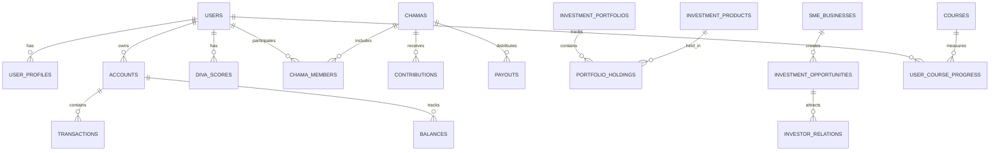

# Database Schema

AWO Platform uses a comprehensive PostgreSQL schema designed to support financial services, user management, Chama operations, and investment tracking while ensuring data integrity, security, and scalability.

## Schema Overview

<Info>
The database schema is organized into logical namespaces (schemas) to separate concerns and improve maintainability. All sensitive data is encrypted at the field level, and audit trails are maintained for compliance.
</Info>

### Schema Organization

```sql
-- Core business schemas
CREATE SCHEMA users;          -- User management and authentication
CREATE SCHEMA financial;      -- Financial accounts and transactions
CREATE SCHEMA community;      -- Chama and group management
CREATE SCHEMA investments;    -- Investment portfolios and products
CREATE SCHEMA business;       -- SME businesses and opportunities
CREATE SCHEMA education;      -- Learning content and progress
CREATE SCHEMA compliance;     -- KYC, AML, and audit data
CREATE SCHEMA system;         -- System configuration and logs
```

### Database Design Principles

<CardGroup cols={2}>
  <Card title="Data Integrity" icon="shield">
    **Foreign Keys**: Strict referential integrity  
    **Constraints**: Business rule enforcement at DB level  
    **Transactions**: ACID compliance for financial operations  
    **Validation**: Check constraints for data quality
  </Card>
  <Card title="Security & Privacy" icon="lock">
    **Encryption**: Field-level encryption for sensitive data  
    **Access Control**: Row-level security for multi-tenancy  
    **Audit Trails**: Comprehensive change tracking  
    **Data Masking**: Anonymization for development/testing
  </Card>
</CardGroup>

<CardGroup cols={2}>
  <Card title="Performance" icon="bolt">
    **Indexing**: Strategic indexes for common queries  
    **Partitioning**: Time-based partitioning for large tables  
    **Materialized Views**: Pre-computed aggregations  
    **Query Optimization**: Optimized for SADC access patterns
  </Card>
  <Card title="Scalability" icon="chart-line">
    **Horizontal Scaling**: Prepared for sharding by user_id  
    **Read Replicas**: Regional read replicas for performance  
    **Archive Strategy**: Data lifecycle management  
    **Backup Strategy**: Point-in-time recovery capability
  </Card>
</CardGroup>

## Core Entity Relationships

### High-Level Entity Diagram



## Primary Tables Structure

### User Management Tables

```sql
-- Core user table
CREATE TABLE users.users (
    id UUID PRIMARY KEY DEFAULT gen_random_uuid(),
    email VARCHAR(255) UNIQUE NOT NULL,
    phone_number VARCHAR(20) UNIQUE NOT NULL,
    password_hash VARCHAR(255) NOT NULL,
    status VARCHAR(20) DEFAULT 'pending' CHECK (status IN ('pending', 'active', 'suspended', 'closed')),
    kyc_tier INTEGER DEFAULT 1 CHECK (kyc_tier IN (1, 2)),
    created_at TIMESTAMP WITH TIME ZONE DEFAULT NOW(),
    updated_at TIMESTAMP WITH TIME ZONE DEFAULT NOW(),
    last_login_at TIMESTAMP WITH TIME ZONE,
    email_verified_at TIMESTAMP WITH TIME ZONE,
    phone_verified_at TIMESTAMP WITH TIME ZONE
);

-- User profile information
CREATE TABLE users.user_profiles (
    user_id UUID PRIMARY KEY REFERENCES users.users(id) ON DELETE CASCADE,
    first_name VARCHAR(100) NOT NULL,
    last_name VARCHAR(100) NOT NULL,
    date_of_birth DATE,
    gender VARCHAR(20) CHECK (gender IN ('female', 'male', 'non_binary', 'prefer_not_to_say')),
    nationality VARCHAR(3), -- ISO 3166 country codes
    national_id_number TEXT, -- Encrypted
    address_line1 TEXT, -- Encrypted
    address_line2 TEXT, -- Encrypted
    city VARCHAR(100),
    province_state VARCHAR(100),
    postal_code VARCHAR(20),
    country VARCHAR(3) NOT NULL, -- ISO 3166 country codes
    preferred_language VARCHAR(10) DEFAULT 'en',
    timezone VARCHAR(50) DEFAULT 'Africa/Johannesburg',
    profile_picture_url TEXT,
    created_at TIMESTAMP WITH TIME ZONE DEFAULT NOW(),
    updated_at TIMESTAMP WITH TIME ZONE DEFAULT NOW()
);

-- User authentication sessions
CREATE TABLE users.user_sessions (
    id UUID PRIMARY KEY DEFAULT gen_random_uuid(),
    user_id UUID NOT NULL REFERENCES users.users(id) ON DELETE CASCADE,
    refresh_token_hash VARCHAR(255) NOT NULL,
    device_fingerprint VARCHAR(255),
    ip_address INET,
    user_agent TEXT,
    expires_at TIMESTAMP WITH TIME ZONE NOT NULL,
    created_at TIMESTAMP WITH TIME ZONE DEFAULT NOW(),
    revoked_at TIMESTAMP WITH TIME ZONE,
    is_active BOOLEAN GENERATED ALWAYS AS (revoked_at IS NULL AND expires_at > NOW()) STORED
);

-- User device registrations for push notifications
CREATE TABLE users.user_devices (
    id UUID PRIMARY KEY DEFAULT gen_random_uuid(),
    user_id UUID NOT NULL REFERENCES users.users(id) ON DELETE CASCADE,
    device_token VARCHAR(255) NOT NULL,
    platform VARCHAR(20) NOT NULL CHECK (platform IN ('ios', 'android', 'web')),
    device_model VARCHAR(100),
    os_version VARCHAR(50),
    app_version VARCHAR(50),
    is_active BOOLEAN DEFAULT true,
    created_at TIMESTAMP WITH TIME ZONE DEFAULT NOW(),
    updated_at TIMESTAMP WITH TIME ZONE DEFAULT NOW(),
    UNIQUE(user_id, device_token)
);
```

### Financial Tables

```sql
-- User financial accounts
CREATE TABLE financial.accounts (
    id UUID PRIMARY KEY DEFAULT gen_random_uuid(),
    user_id UUID NOT NULL REFERENCES users.users(id),
    account_type VARCHAR(50) NOT NULL CHECK (account_type IN ('awo_wallet', 'bank_account', 'mobile_money')),
    account_name VARCHAR(100) NOT NULL,
    account_number TEXT, -- Encrypted
    provider VARCHAR(100), -- Bank name, mobile money provider, etc.
    provider_code VARCHAR(20), -- Bank code, USSD code, etc.
    currency VARCHAR(3) DEFAULT 'ZAR',
    is_primary BOOLEAN DEFAULT false,
    is_active BOOLEAN DEFAULT true,
    linked_at TIMESTAMP WITH TIME ZONE DEFAULT NOW(),
    last_sync_at TIMESTAMP WITH TIME ZONE,
    external_account_id TEXT, -- Provider's account ID
    metadata JSONB, -- Provider-specific data
    created_at TIMESTAMP WITH TIME ZONE DEFAULT NOW(),
    updated_at TIMESTAMP WITH TIME ZONE DEFAULT NOW()
);

-- Account balances (current and historical)
CREATE TABLE financial.balances (
    id UUID PRIMARY KEY DEFAULT gen_random_uuid(),
    account_id UUID NOT NULL REFERENCES financial.accounts(id),
    balance_amount DECIMAL(15,2) NOT NULL DEFAULT 0.00,
    available_amount DECIMAL(15,2) NOT NULL DEFAULT 0.00,
    pending_amount DECIMAL(15,2) NOT NULL DEFAULT 0.00,
    currency VARCHAR(3) NOT NULL DEFAULT 'ZAR',
    as_of_date TIMESTAMP WITH TIME ZONE DEFAULT NOW(),
    created_at TIMESTAMP WITH TIME ZONE DEFAULT NOW(),
    UNIQUE(account_id, as_of_date)
);

-- All financial transactions
CREATE TABLE financial.transactions (
    id UUID PRIMARY KEY DEFAULT gen_random_uuid(),
    account_id UUID NOT NULL REFERENCES financial.accounts(id),
    transaction_type VARCHAR(50) NOT NULL CHECK (transaction_type IN (
        'deposit', 'withdrawal', 'transfer_in', 'transfer_out', 
        'investment_buy', 'investment_sell', 'chama_contribution', 
        'chama_payout', 'fee', 'interest', 'cashback'
    )),
    amount DECIMAL(15,2) NOT NULL,
    currency VARCHAR(3) NOT NULL DEFAULT 'ZAR',
    description TEXT NOT NULL,
    reference_number VARCHAR(100) UNIQUE,
    external_reference VARCHAR(100), -- Provider's transaction ID
    status VARCHAR(20) DEFAULT 'pending' CHECK (status IN ('pending', 'completed', 'failed', 'cancelled')),
    category VARCHAR(50), -- spending/income categorization
    subcategory VARCHAR(50),
    counterparty_name VARCHAR(255),
    counterparty_account VARCHAR(255),
    location JSONB, -- transaction location data
    merchant_info JSONB, -- merchant details for purchases
    processed_at TIMESTAMP WITH TIME ZONE,
    created_at TIMESTAMP WITH TIME ZONE DEFAULT NOW(),
    updated_at TIMESTAMP WITH TIME ZONE DEFAULT NOW()
) PARTITION BY RANGE (created_at);

-- Monthly partitions for transactions
CREATE TABLE financial.transactions_2025_01 PARTITION OF financial.transactions
    FOR VALUES FROM ('2025-01-01') TO ('2025-02-01');
-- Additional monthly partitions created dynamically

-- DIVA scores and components
CREATE TABLE financial.diva_scores (
    id UUID PRIMARY KEY DEFAULT gen_random_uuid(),
    user_id UUID NOT NULL REFERENCES users.users(id),
    overall_score INTEGER NOT NULL CHECK (overall_score >= 0 AND overall_score <= 1000),
    discipline_score INTEGER NOT NULL CHECK (discipline_score >= 0 AND discipline_score <= 1000),
    income_score INTEGER NOT NULL CHECK (income_score >= 0 AND income_score <= 1000),
    velocity_score INTEGER NOT NULL CHECK (velocity_score >= 0 AND velocity_score <= 1000),
    assets_score INTEGER NOT NULL CHECK (assets_score >= 0 AND assets_score <= 1000),
    portfolio_tier VARCHAR(20) NOT NULL CHECK (portfolio_tier IN ('bronze', 'silver', 'gold', 'platinum')),
    calculation_version VARCHAR(10) NOT NULL, -- algorithm version
    next_update_due DATE NOT NULL,
    factors JSONB, -- detailed calculation factors
    insights JSONB, -- personalized insights and recommendations
    calculated_at TIMESTAMP WITH TIME ZONE DEFAULT NOW(),
    created_at TIMESTAMP WITH TIME ZONE DEFAULT NOW()
);

-- Risk tolerance assessment (RTSM)
CREATE TABLE financial.risk_profiles (
    id UUID PRIMARY KEY DEFAULT gen_random_uuid(),
    user_id UUID NOT NULL REFERENCES users.users(id),
    risk_tolerance VARCHAR(20) NOT NULL CHECK (risk_tolerance IN ('very_low', 'low', 'moderate', 'high', 'very_high')),
    investment_timeline VARCHAR(20) NOT NULL CHECK (investment_timeline IN ('short', 'medium', 'long')),
    questionnaire_responses JSONB NOT NULL,
    behavioral_adjustments JSONB, -- adjustments based on actual behavior
    confidence_score INTEGER CHECK (confidence_score >= 0 AND confidence_score <= 100),
    assessment_version VARCHAR(10) NOT NULL,
    reassessment_due DATE NOT NULL,
    created_at TIMESTAMP WITH TIME ZONE DEFAULT NOW(),
    updated_at TIMESTAMP WITH TIME ZONE DEFAULT NOW()
);
```

### Indexing Strategy

**Primary Performance Indexes:**

```sql
-- User lookup indexes
CREATE INDEX idx_users_email ON users.users(email);
CREATE INDEX idx_users_phone ON users.users(phone_number);
CREATE INDEX idx_users_status ON users.users(status) WHERE status = 'active';

-- Financial data indexes
CREATE INDEX idx_accounts_user_id ON financial.accounts(user_id);
CREATE INDEX idx_accounts_type_active ON financial.accounts(account_type, is_active) WHERE is_active = true;
CREATE INDEX idx_transactions_account_date ON financial.transactions(account_id, created_at DESC);
CREATE INDEX idx_transactions_reference ON financial.transactions(reference_number) WHERE reference_number IS NOT NULL;
CREATE INDEX idx_transactions_external_ref ON financial.transactions(external_reference) WHERE external_reference IS NOT NULL;
CREATE INDEX idx_transactions_status ON financial.transactions(status);
CREATE INDEX idx_transactions_type_date ON financial.transactions(transaction_type, created_at DESC);

-- DIVA score indexes
CREATE INDEX idx_diva_scores_user_latest ON financial.diva_scores(user_id, calculated_at DESC);
CREATE INDEX idx_diva_scores_tier ON financial.diva_scores(portfolio_tier);
CREATE INDEX idx_diva_scores_update_due ON financial.diva_scores(next_update_due) WHERE next_update_due <= CURRENT_DATE;

-- Session management indexes
CREATE INDEX idx_sessions_user_active ON users.user_sessions(user_id, is_active) WHERE is_active = true;
CREATE INDEX idx_sessions_token_hash ON users.user_sessions(refresh_token_hash);
CREATE INDEX idx_sessions_expires ON users.user_sessions(expires_at) WHERE expires_at > NOW();
```

### Data Types and Constraints

**Custom Data Types:**

```sql
-- Custom types for better data integrity
CREATE TYPE user_status AS ENUM ('pending', 'active', 'suspended', 'closed');
CREATE TYPE transaction_status AS ENUM ('pending', 'completed', 'failed', 'cancelled');
CREATE TYPE portfolio_tier AS ENUM ('bronze', 'silver', 'gold', 'platinum');
CREATE TYPE account_type AS ENUM ('awo_wallet', 'bank_account', 'mobile_money');

-- Currency validation
CREATE DOMAIN currency_code AS VARCHAR(3) 
    CHECK (VALUE ~ '^[A-Z]{3}$');

-- Amount validation for financial data
CREATE DOMAIN money_amount AS DECIMAL(15,2) 
    CHECK (VALUE >= -999999999999.99 AND VALUE <= 999999999999.99);

-- Phone number validation
CREATE DOMAIN phone_number AS VARCHAR(20)
    CHECK (VALUE ~ '^\+[1-9]\d{1,14}$');
```

### Encryption and Security

**Field-Level Encryption Implementation:**

```sql
-- Encryption extension setup
CREATE EXTENSION IF NOT EXISTS pgcrypto;

-- Encryption functions for sensitive data
CREATE OR REPLACE FUNCTION encrypt_pii(data TEXT)
RETURNS TEXT AS $$
BEGIN
    RETURN CASE 
        WHEN data IS NULL THEN NULL
        ELSE encode(pgp_sym_encrypt(data, current_setting('app.encryption_key')), 'base64')
    END;
END;
$$ LANGUAGE plpgsql SECURITY DEFINER;

CREATE OR REPLACE FUNCTION decrypt_pii(encrypted_data TEXT)
RETURNS TEXT AS $$
BEGIN
    RETURN CASE 
        WHEN encrypted_data IS NULL THEN NULL
        ELSE pgp_sym_decrypt(decode(encrypted_data, 'base64'), current_setting('app.encryption_key'))
    END;
END;
$$ LANGUAGE plpgsql SECURITY DEFINER;

-- Trigger to automatically encrypt sensitive fields
CREATE OR REPLACE FUNCTION encrypt_sensitive_data()
RETURNS TRIGGER AS $$
BEGIN
    -- Encrypt sensitive fields before insert/update
    IF TG_TABLE_NAME = 'user_profiles' THEN
        NEW.national_id_number = encrypt_pii(NEW.national_id_number);
        NEW.address_line1 = encrypt_pii(NEW.address_line1);
        NEW.address_line2 = encrypt_pii(NEW.address_line2);
    ELSIF TG_TABLE_NAME = 'accounts' THEN
        NEW.account_number = encrypt_pii(NEW.account_number);
    END IF;
    
    RETURN NEW;
END;
$$ LANGUAGE plpgsql SECURITY DEFINER;

-- Apply encryption triggers
CREATE TRIGGER encrypt_user_profiles
    BEFORE INSERT OR UPDATE ON users.user_profiles
    FOR EACH ROW EXECUTE FUNCTION encrypt_sensitive_data();

CREATE TRIGGER encrypt_account_data
    BEFORE INSERT OR UPDATE ON financial.accounts
    FOR EACH ROW EXECUTE FUNCTION encrypt_sensitive_data();
```

### Audit Trail Implementation

**Comprehensive Audit Logging:**

```sql
-- Audit log table for all data changes
CREATE TABLE system.audit_logs (
    id UUID PRIMARY KEY DEFAULT gen_random_uuid(),
    table_name VARCHAR(100) NOT NULL,
    record_id UUID NOT NULL,
    action VARCHAR(20) NOT NULL CHECK (action IN ('INSERT', 'UPDATE', 'DELETE')),
    old_values JSONB,
    new_values JSONB,
    changed_fields TEXT[],
    user_id UUID REFERENCES users.users(id),
    session_id UUID,
    ip_address INET,
    user_agent TEXT,
    application_context JSONB,
    created_at TIMESTAMP WITH TIME ZONE DEFAULT NOW()
) PARTITION BY RANGE (created_at);

-- Monthly audit log partitions
CREATE TABLE system.audit_logs_2025_01 PARTITION OF system.audit_logs
    FOR VALUES FROM ('2025-01-01') TO ('2025-02-01');

-- Generic audit trigger function
CREATE OR REPLACE FUNCTION create_audit_log()
RETURNS TRIGGER AS $$
DECLARE
    old_data JSONB;
    new_data JSONB;
    changed_fields TEXT[];
BEGIN
    -- Skip audit for certain tables
    IF TG_TABLE_NAME IN ('audit_logs', 'user_sessions') THEN
        RETURN COALESCE(NEW, OLD);
    END IF;

    IF TG_OP = 'DELETE' THEN
        old_data = to_jsonb(OLD);
        INSERT INTO system.audit_logs (table_name, record_id, action, old_values, user_id)
        VALUES (TG_TABLE_NAME, OLD.id, TG_OP, old_data, current_setting('app.current_user_id', true)::UUID);
        RETURN OLD;
    ELSIF TG_OP = 'UPDATE' THEN
        old_data = to_jsonb(OLD);
        new_data = to_jsonb(NEW);
        
        -- Identify changed fields
        SELECT array_agg(key) INTO changed_fields
        FROM jsonb_each(new_data) 
        WHERE (new_data ->> key) IS DISTINCT FROM (old_data ->> key);
        
        INSERT INTO system.audit_logs (table_name, record_id, action, old_values, new_values, changed_fields, user_id)
        VALUES (TG_TABLE_NAME, NEW.id, TG_OP, old_data, new_data, changed_fields, current_setting('app.current_user_id', true)::UUID);
        RETURN NEW;
    ELSIF TG_OP = 'INSERT' THEN
        new_data = to_jsonb(NEW);
        INSERT INTO system.audit_logs (table_name, record_id, action, new_values, user_id)
        VALUES (TG_TABLE_NAME, NEW.id, TG_OP, new_data, current_setting('app.current_user_id', true)::UUID);
        RETURN NEW;
    END IF;
    
    RETURN NULL;
END;
$$ LANGUAGE plpgsql SECURITY DEFINER;

-- Apply audit triggers to key tables
CREATE TRIGGER audit_users_trigger
    AFTER INSERT OR UPDATE OR DELETE ON users.users
    FOR EACH ROW EXECUTE FUNCTION create_audit_log();

CREATE TRIGGER audit_user_profiles_trigger
    AFTER INSERT OR UPDATE OR DELETE ON users.user_profiles
    FOR EACH ROW EXECUTE FUNCTION create_audit_log();

CREATE TRIGGER audit_accounts_trigger
    AFTER INSERT OR UPDATE OR DELETE ON financial.accounts
    FOR EACH ROW EXECUTE FUNCTION create_audit_log();

CREATE TRIGGER audit_transactions_trigger
    AFTER INSERT OR UPDATE OR DELETE ON financial.transactions
    FOR EACH ROW EXECUTE FUNCTION create_audit_log();
```

### Performance Views and Materialized Views

**Optimized Query Views:**

```sql
-- Current user balances view
CREATE VIEW financial.current_balances AS
SELECT DISTINCT ON (account_id)
    account_id,
    balance_amount,
    available_amount,
    pending_amount,
    currency,
    as_of_date
FROM financial.balances
ORDER BY account_id, as_of_date DESC;

-- Latest DIVA scores view
CREATE VIEW financial.latest_diva_scores AS
SELECT DISTINCT ON (user_id)
    user_id,
    overall_score,
    discipline_score,
    income_score,
    velocity_score,
    assets_score,
    portfolio_tier,
    next_update_due,
    calculated_at
FROM financial.diva_scores
ORDER BY user_id, calculated_at DESC;

-- User financial summary materialized view
CREATE MATERIALIZED VIEW financial.user_financial_summary AS
SELECT 
    u.id as user_id,
    u.email,
    up.first_name,
    up.last_name,
    up.country,
    ds.overall_score,
    ds.portfolio_tier,
    COUNT(a.id) as account_count,
    SUM(CASE WHEN a.account_type = 'awo_wallet' THEN cb.balance_amount ELSE 0 END) as wallet_balance,
    SUM(cb.balance_amount) as total_balance,
    COUNT(DISTINCT DATE(t.created_at)) as active_days_last_30,
    MAX(t.created_at) as last_transaction_date
FROM users.users u
LEFT JOIN users.user_profiles up ON u.id = up.user_id
LEFT JOIN financial.latest_diva_scores ds ON u.id = ds.user_id
LEFT JOIN financial.accounts a ON u.id = a.user_id AND a.is_active = true
LEFT JOIN financial.current_balances cb ON a.id = cb.account_id
LEFT JOIN financial.transactions t ON a.id = t.account_id 
    AND t.created_at >= NOW() - INTERVAL '30 days'
    AND t.status = 'completed'
WHERE u.status = 'active'
GROUP BY u.id, u.email, up.first_name, up.last_name, up.country, ds.overall_score, ds.portfolio_tier;

-- Refresh materialized view hourly
CREATE INDEX ON financial.user_financial_summary(user_id);
CREATE INDEX ON financial.user_financial_summary(portfolio_tier);
CREATE INDEX ON financial.user_financial_summary(country);
```

### Data Validation and Integrity

**Business Rule Constraints:**

```sql
-- User constraints
ALTER TABLE users.users ADD CONSTRAINT check_email_format 
    CHECK (email ~* '^[A-Za-z0-9._%+-]+@[A-Za-z0-9.-]+\.[A-Za-z]{2,}$');

-- Financial constraints
ALTER TABLE financial.accounts ADD CONSTRAINT check_primary_account_limit
    CHECK (NOT (is_primary = true AND account_type != 'awo_wallet'));

ALTER TABLE financial.transactions ADD CONSTRAINT check_amount_not_zero
    CHECK (amount != 0.00);

ALTER TABLE financial.balances ADD CONSTRAINT check_balance_consistency
    CHECK (balance_amount >= 0 AND available_amount >= 0 AND pending_amount >= 0);

-- DIVA score constraints
ALTER TABLE financial.diva_scores ADD CONSTRAINT check_score_calculation
    CHECK (
        overall_score = ROUND(
            (discipline_score * 0.30 + income_score * 0.25 + 
             velocity_score * 0.25 + assets_score * 0.20)
        )
    );
```

### Database Maintenance

**Automated Maintenance Tasks:**

```sql
-- Partition management function
CREATE OR REPLACE FUNCTION manage_partitions()
RETURNS void AS $$
DECLARE
    current_month DATE;
    next_month DATE;
    table_name TEXT;
BEGIN
    current_month := date_trunc('month', CURRENT_DATE);
    next_month := current_month + INTERVAL '1 month';
    
    -- Create next month's partitions
    FOR table_name IN VALUES ('financial.transactions'), ('system.audit_logs') LOOP
        EXECUTE format('CREATE TABLE IF NOT EXISTS %s_%s PARTITION OF %s 
                       FOR VALUES FROM (%L) TO (%L)',
                      table_name, to_char(next_month, 'YYYY_MM'),
                      table_name, next_month, next_month + INTERVAL '1 month');
    END LOOP;
    
    -- Archive old partitions (older than 7 years)
    -- Implementation depends on archival strategy
END;
$$ LANGUAGE plpgsql;

-- Schedule partition management
SELECT cron.schedule('partition-management', '0 0 25 * *', 'SELECT manage_partitions();');
```

---

*This database schema provides a robust foundation for AWO Platform's data storage needs, ensuring data integrity, security, and performance while supporting the platform's growth across the SADC region.*

*Last updated: June 2025*  
*Next review: July 2025*