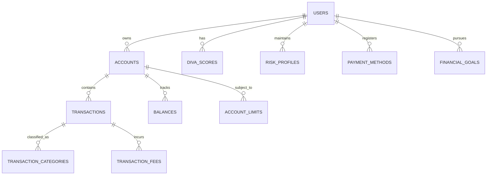

# Financial Models

AWO Platform's financial models are designed to handle complex financial operations including multi-currency accounts, DIVA scoring, transaction processing, and investment tracking while ensuring regulatory compliance and data integrity.

## Financial Data Architecture

<Info>
Financial models implement robust data structures that support real-time transaction processing, comprehensive audit trails, and sophisticated financial analytics while maintaining ACID compliance for all monetary operations.
</Info>

### Financial Entity Relationships



## Account Management Models

### Account Structure

```typescript
interface Account {
  id: string; // UUID
  userId: string;
  accountType: AccountType;
  accountName: string;
  accountNumber?: string; // Encrypted for bank accounts
  provider?: string; // Bank name, mobile money provider
  providerCode?: string; // Bank code, USSD code
  currency: Currency;
  
  // Account status and settings
  isPrimary: boolean;
  isActive: boolean;
  isVerified: boolean;
  
  // External integration
  externalAccountId?: string; // Provider's account ID
  linkingData?: AccountLinkingData;
  lastSyncAt?: Date;
  
  // Metadata and tracking
  metadata?: Record<string, any>;
  linkedAt: Date;
  createdAt: Date;
  updatedAt: Date;
}

enum AccountType {
  AWO_WALLET = 'awo_wallet',
  BANK_ACCOUNT = 'bank_account',
  MOBILE_MONEY = 'mobile_money',
  SAVINGS_ACCOUNT = 'savings_account',
  INVESTMENT_ACCOUNT = 'investment_account'
}

enum Currency {
  ZAR = 'ZAR', // South African Rand
  BWP = 'BWP', // Botswana Pula  
  NAD = 'NAD', // Namibian Dollar
  ZMW = 'ZMW', // Zambian Kwacha
  USD = 'USD'  // US Dollar (for cross-border)
}
```

### Account Balance Management

```typescript
interface Balance {
  id: string;
  accountId: string;
  balanceAmount: number; // Total balance
  availableAmount: number; // Available for transactions
  pendingAmount: number; // Pending transactions
  reservedAmount: number; // Reserved for investments/Chama
  currency: Currency;
  asOfDate: Date;
  createdAt: Date;
  
  // Balance breakdown
  breakdown?: {
    wallet: number;
    savings: number;
    investments: number;
    chama: number;
    pending: number;
  };
}

interface BalanceHistory {
  accountId: string;
  date: Date;
  openingBalance: number;
  closingBalance: number;
  totalCredits: number;
  totalDebits: number;
  currency: Currency;
  transactionCount: number;
}
```

### Account Limits and Controls

```typescript
interface AccountLimits {
  accountId: string;
  limitType: LimitType;
  
  // Transaction limits
  dailyTransactionLimit: number;
  monthlyTransactionLimit: number;
  singleTransactionLimit: number;
  
  // Balance limits
  maximumBalance?: number;
  minimumBalance?: number;
  
  // Velocity controls
  transactionsPerDay: number;
  transactionsPerHour: number;
  
  // KYC-based limits
  kycTierLimits: {
    tier1: TransactionLimits;
    tier2: TransactionLimits;
  };
  
  // Temporary adjustments
  temporaryIncrease?: {
    newLimit: number;
    expiresAt: Date;
    reason: string;
  };
  
  effectiveFrom: Date;
  expiresAt?: Date;
  updatedAt: Date;
}

interface TransactionLimits {
  dailyLimit: number;
  monthlyLimit: number;
  singleTransactionLimit: number;
  allowedTransactionTypes: TransactionType[];
}

enum LimitType {
  REGULATORY = 'regulatory',
  RISK_BASED = 'risk_based',
  USER_DEFINED = 'user_defined',
  TEMPORARY = 'temporary'
}
```

## Transaction Models

### Core Transaction Structure

```typescript
interface Transaction {
  id: string; // UUID
  accountId: string;
  transactionType: TransactionType;
  amount: number;
  currency: Currency;
  
  // Transaction details
  description: string;
  referenceNumber: string; // Unique transaction reference
  externalReference?: string; // Provider's transaction ID
  status: TransactionStatus;
  
  // Counterparty information
  counterparty?: {
    name?: string;
    accountNumber?: string;
    bankCode?: string;
    type: 'internal' | 'external';
  };
  
  // Categorization
  category: TransactionCategory;
  subcategory?: string;
  tags?: string[];
  
  // Location and context
  location?: GeographicLocation;
  deviceInfo?: DeviceInfo;
  merchantInfo?: MerchantInfo;
  
  // Processing information
  processedAt?: Date;
  settledAt?: Date;
  valueDate: Date;
  
  // Fees and charges
  fees?: TransactionFee[];
  
  // Audit and compliance
  complianceFlags?: string[];
  riskScore?: number;
  
  createdAt: Date;
  updatedAt: Date;
}

enum TransactionType {
  DEPOSIT = 'deposit',
  WITHDRAWAL = 'withdrawal',
  TRANSFER_IN = 'transfer_in',
  TRANSFER_OUT = 'transfer_out',
  P2P_SEND = 'p2p_send',
  P2P_RECEIVE = 'p2p_receive',
  INVESTMENT_BUY = 'investment_buy',
  INVESTMENT_SELL = 'investment_sell',
  CHAMA_CONTRIBUTION = 'chama_contribution',
  CHAMA_PAYOUT = 'chama_payout',
  FEE = 'fee',
  INTEREST = 'interest',
  CASHBACK = 'cashback',
  REFUND = 'refund',
  REVERSAL = 'reversal'
}

enum TransactionStatus {
  PENDING = 'pending',
  PROCESSING = 'processing',
  COMPLETED = 'completed',
  FAILED = 'failed',
  CANCELLED = 'cancelled',
  REVERSED = 'reversed'
}

enum TransactionCategory {
  INCOME = 'income',
  FOOD_DRINK = 'food_drink',
  TRANSPORT = 'transport',
  SHOPPING = 'shopping',
  BILLS_UTILITIES = 'bills_utilities',
  ENTERTAINMENT = 'entertainment',
  HEALTHCARE = 'healthcare',
  EDUCATION = 'education',
  SAVINGS = 'savings',
  INVESTMENTS = 'investments',
  CHAMA = 'chama',
  TRANSFERS = 'transfers',
  FEES = 'fees',
  OTHER = 'other'
}
```

### Transaction Fee Model

```typescript
interface TransactionFee {
  id: string;
  transactionId: string;
  feeType: FeeType;
  amount: number;
  currency: Currency;
  description: string;
  
  // Fee calculation
  calculationMethod: 'fixed' | 'percentage' | 'tiered';
  rate?: number; // For percentage-based fees
  tier?: FeeTier; // For tiered fees
  
  // Fee collection
  status: 'pending' | 'collected' | 'waived' | 'refunded';
  collectedAt?: Date;
  
  // Regulatory and compliance
  taxIncluded: boolean;
  vatAmount?: number;
  regulatoryCode?: string;
  
  createdAt: Date;
}

enum FeeType {
  TRANSACTION_FEE = 'transaction_fee',
  FOREIGN_EXCHANGE = 'foreign_exchange',
  WITHDRAWAL_FEE = 'withdrawal_fee',
  DEPOSIT_FEE = 'deposit_fee',
  INVESTMENT_FEE = 'investment_fee',
  CHAMA_FEE = 'chama_fee',
  PROCESSING_FEE = 'processing_fee',
  COMPLIANCE_FEE = 'compliance_fee'
}

interface FeeTier {
  minAmount: number;
  maxAmount: number;
  feeAmount: number;
  feePercentage?: number;
}
```

### Payment Method Models

```typescript
interface PaymentMethod {
  id: string;
  userId: string;
  type: PaymentMethodType;
  
  // Method details
  details: PaymentMethodDetails;
  displayName: string;
  
  // Status and verification
  isActive: boolean;
  isVerified: boolean;
  isPrimary: boolean;
  
  // Security
  tokenized: boolean;
  token?: string; // Tokenized representation
  lastFour?: string; // Last 4 digits for display
  
  // Provider information
  provider: string;
  providerAccountId?: string;
  
  // Usage tracking
  lastUsedAt?: Date;
  usageCount: number;
  
  // Expiry and limits
  expiresAt?: Date;
  dailyLimit?: number;
  monthlyLimit?: number;
  
  createdAt: Date;
  updatedAt: Date;
}

enum PaymentMethodType {
  BANK_ACCOUNT = 'bank_account',
  MOBILE_MONEY = 'mobile_money',
  DEBIT_CARD = 'debit_card',
  CREDIT_CARD = 'credit_card',
  CRYPTO_WALLET = 'crypto_wallet'
}

type PaymentMethodDetails = 
  | BankAccountDetails
  | MobileMoneyDetails
  | CardDetails
  | CryptoWalletDetails;

interface BankAccountDetails {
  bankName: string;
  bankCode: string;
  accountNumber: string; // Encrypted
  accountType: 'checking' | 'savings';
  branchCode?: string;
}

interface MobileMoneyDetails {
  provider: 'mpesa' | 'mtn_momo' | 'airtel_money' | 'orange_money';
  phoneNumber: string; // Encrypted
  accountName: string;
}

interface CardDetails {
  cardNumber: string; // Encrypted, only store token in production
  expiryMonth: number;
  expiryYear: number;
  cardholderName: string;
  cardType: 'visa' | 'mastercard' | 'american_express';
  issuerBank: string;
}
```

## DIVA Scoring Models

### DIVA Score Structure

```typescript
interface DivaScore {
  id: string;
  userId: string;
  
  // Overall score and components
  overallScore: number; // 0-1000 scale
  disciplineScore: number; // 30% weight
  incomeScore: number; // 25% weight
  velocityScore: number; // 25% weight
  assetsScore: number; // 20% weight
  
  // Portfolio assignment
  portfolioTier: PortfolioTier;
  previousTier?: PortfolioTier;
  tierChangeDate?: Date;
  
  // Calculation metadata
  calculationVersion: string;
  dataQuality: number; // 0-100 confidence in data
  nextUpdateDue: Date;
  
  // Score factors and insights
  factors: DivaFactors;
  insights: DivaInsights;
  recommendations: DivaRecommendation[];
  
  // Historical context
  monthlyChange?: number;
  quarterlyChange?: number;
  trend: 'improving' | 'stable' | 'declining';
  
  calculatedAt: Date;
  createdAt: Date;
}

enum PortfolioTier {
  BRONZE = 'bronze',     // 0-399 points
  SILVER = 'silver',     // 400-649 points
  GOLD = 'gold',         // 650-849 points
  PLATINUM = 'platinum'  // 850-1000 points
}

interface DivaFactors {
  discipline: {
    paymentPunctuality: number; // 0-100
    overdraftAvoidance: number; // 0-100
    savingsRegularity: number; // 0-100
    budgetAdherence: number; // 0-100
    debtManagement: number; // 0-100
  };
  
  income: {
    stability: number; // 0-100
    growth: number; // 0-100
    diversification: number; // 0-100
    predictability: number; // 0-100
    adequacy: number; // 0-100
  };
  
  velocity: {
    cashFlowTiming: number; // 0-100
    transactionEfficiency: number; // 0-100
    moneyUtilization: number; // 0-100
    paymentSpeed: number; // 0-100
  };
  
  assets: {
    savingsRate: number; // 0-100
    investmentBalance: number; // 0-100
    assetDiversification: number; // 0-100
    netWorthGrowth: number; // 0-100
    liquidityRatio: number; // 0-100
  };
}

interface DivaInsights {
  strengths: string[];
  weaknesses: string[];
  opportunities: string[];
  risks: string[];
  
  // Peer comparison
  percentile: number; // 0-100 percentile ranking
  peerGroup: string; // age/location/income peer group
  
  // Trend analysis
  improvingAreas: string[];
  decliningAreas: string[];
  stableAreas: string[];
}

interface DivaRecommendation {
  category: 'discipline' | 'income' | 'velocity' | 'assets';
  priority: 'high' | 'medium' | 'low';
  title: string;
  description: string;
  actionItems: string[];
  estimatedImpact: number; // Points improvement potential
  timeframe: string; // e.g., "2-3 months"
  
  // Tracking
  status: 'pending' | 'in_progress' | 'completed' | 'dismissed';
  createdAt: Date;
  completedAt?: Date;
}
```

### Risk Profile Models

```typescript
interface RiskProfile {
  id: string;
  userId: string;
  
  // Risk assessment results
  riskTolerance: RiskTolerance;
  investmentTimeline: InvestmentTimeline;
  riskCapacity: RiskCapacity;
  
  // Assessment data
  questionnaireResponses: RTSMResponse[];
  behavioralAdjustments: BehavioralAdjustment[];
  
  // Confidence and validation
  confidenceScore: number; // 0-100
  assessmentVersion: string;
  reassessmentDue: Date;
  
  // Portfolio implications
  recommendedAllocation: AssetAllocation;
  maxRiskExposure: number; // Percentage
  
  createdAt: Date;
  updatedAt: Date;
}

enum RiskTolerance {
  VERY_LOW = 'very_low',
  LOW = 'low',
  MODERATE = 'moderate',
  HIGH = 'high',
  VERY_HIGH = 'very_high'
}

enum InvestmentTimeline {
  SHORT = 'short',   // < 2 years
  MEDIUM = 'medium', // 2-5 years
  LONG = 'long'      // > 5 years
}

enum RiskCapacity {
  LIMITED = 'limited',
  MODERATE = 'moderate',
  HIGH = 'high'
}

interface RTSMResponse {
  questionId: string;
  question: string;
  response: string | number;
  weight: number;
  category: 'risk_tolerance' | 'time_horizon' | 'knowledge' | 'experience';
}

interface BehavioralAdjustment {
  factor: string;
  adjustment: number; // -10 to +10 adjustment to base score
  reason: string;
  observationPeriod: string;
  confidence: number;
}

interface AssetAllocation {
  conservative: number; // 0-100 percentage
  moderate: number;
  aggressive: number;
  alternative: number;
  cash: number;
}
```

## Financial Goal Models

### Goal Tracking System

```typescript
interface FinancialGoal {
  id: string;
  userId: string;
  
  // Goal definition
  title: string;
  description?: string;
  goalType: GoalType;
  category: GoalCategory;
  
  // Financial targets
  targetAmount: number;
  currentAmount: number;
  currency: Currency;
  
  // Timeline
  targetDate: Date;
  startDate: Date;
  
  // Progress tracking
  progress: number; // 0-100 percentage
  status: GoalStatus;
  
  // Automation
  autoSavingsEnabled: boolean;
  autoSavingsAmount?: number;
  autoSavingsFrequency?: 'daily' | 'weekly' | 'monthly';
  
  // Strategy
  savingsStrategy: SavingsStrategy;
  investmentAllocation?: AssetAllocation;
  
  // Milestones
  milestones: GoalMilestone[];
  
  // Updates and history
  lastContribution?: Date;
  lastUpdate: Date;
  createdAt: Date;
}

enum GoalType {
  EMERGENCY_FUND = 'emergency_fund',
  SAVINGS = 'savings',
  INVESTMENT = 'investment',
  RETIREMENT = 'retirement',
  EDUCATION = 'education',
  HOUSE_DEPOSIT = 'house_deposit',
  VACATION = 'vacation',
  BUSINESS = 'business',
  WEDDING = 'wedding',
  CUSTOM = 'custom'
}

enum GoalCategory {
  SHORT_TERM = 'short_term',   // < 1 year
  MEDIUM_TERM = 'medium_term', // 1-5 years
  LONG_TERM = 'long_term'      // > 5 years
}

enum GoalStatus {
  ACTIVE = 'active',
  PAUSED = 'paused',
  COMPLETED = 'completed',
  CANCELLED = 'cancelled'
}

interface SavingsStrategy {
  method: 'fixed_amount' | 'percentage_income' | 'round_up' | 'hybrid';
  amount?: number;
  percentage?: number;
  roundUpEnabled?: boolean;
  investmentComponent?: number; // Percentage to invest vs. save
}

interface GoalMilestone {
  id: string;
  title: string;
  targetAmount: number;
  targetDate: Date;
  achieved: boolean;
  achievedDate?: Date;
  reward?: string;
}
```

## Exchange Rate and Currency Models

### Multi-Currency Support

```typescript
interface ExchangeRate {
  id: string;
  fromCurrency: Currency;
  toCurrency: Currency;
  rate: number;
  inverseRate: number;
  
  // Rate metadata
  provider: string; // e.g., 'xe.com', 'bank_rate'
  rateType: 'spot' | 'buying' | 'selling' | 'mid';
  spread?: number; // Bid-ask spread
  
  // Validity
  validFrom: Date;
  validTo: Date;
  lastUpdated: Date;
  
  // Historical tracking
  dailyChange: number;
  weeklyChange: number;
  monthlyChange: number;
}

interface CurrencyConversion {
  id: string;
  transactionId?: string;
  
  // Conversion details
  fromAmount: number;
  fromCurrency: Currency;
  toAmount: number;
  toCurrency: Currency;
  
  // Rate used
  exchangeRate: number;
  exchangeRateId: string;
  
  // Fees
  conversionFee: number;
  feePercentage: number;
  
  // Processing
  status: 'pending' | 'completed' | 'failed';
  processedAt?: Date;
  
  createdAt: Date;
}
```

## Financial Analytics Models

### Performance Metrics

```typescript
interface FinancialMetrics {
  userId: string;
  period: AnalyticsPeriod;
  
  // Income metrics
  totalIncome: number;
  averageMonthlyIncome: number;
  incomeGrowth: number; // Percentage change
  incomeStability: number; // Coefficient of variation
  
  // Expense metrics
  totalExpenses: number;
  averageMonthlyExpenses: number;
  expenseGrowth: number;
  
  // Savings metrics
  totalSavings: number;
  savingsRate: number; // Percentage of income
  savingsGrowth: number;
  
  // Investment metrics
  totalInvestments: number;
  investmentReturn: number;
  portfolioValue: number;
  
  // Ratios and indicators
  debtToIncomeRatio?: number;
  liquidityRatio: number;
  expenseRatio: number;
  
  // Cash flow
  netCashFlow: number;
  operatingCashFlow: number;
  
  calculatedAt: Date;
}

enum AnalyticsPeriod {
  MONTHLY = 'monthly',
  QUARTERLY = 'quarterly',
  YEARLY = 'yearly'
}

interface SpendingPattern {
  userId: string;
  category: TransactionCategory;
  period: AnalyticsPeriod;
  
  // Spending analysis
  totalAmount: number;
  transactionCount: number;
  averageTransaction: number;
  
  // Pattern analysis
  frequency: 'daily' | 'weekly' | 'monthly' | 'irregular';
  seasonality?: SeasonalityPattern;
  trend: 'increasing' | 'decreasing' | 'stable';
  
  // Budgeting
  budgetAmount?: number;
  budgetVariance?: number;
  budgetUtilization?: number; // Percentage
  
  // Predictions
  predictedNextMonth?: number;
  confidence?: number;
  
  analyzedAt: Date;
}

interface SeasonalityPattern {
  pattern: 'monthly' | 'quarterly' | 'seasonal';
  peaks: number[]; // Month numbers or quarters
  valleys: number[];
  amplitude: number; // Variance from average
}
```

## Validation and Business Rules

### Financial Data Validation

```typescript
class FinancialValidation {
  static validateTransaction(transaction: Partial<Transaction>): ValidationResult {
    const errors: string[] = [];
    
    // Amount validation
    if (!transaction.amount || transaction.amount <= 0) {
      errors.push('Transaction amount must be positive');
    }
    
    if (transaction.amount && transaction.amount > 1000000) {
      errors.push('Transaction amount exceeds maximum limit');
    }
    
    // Currency validation
    if (!Object.values(Currency).includes(transaction.currency as Currency)) {
      errors.push('Invalid currency code');
    }
    
    // Reference number validation
    if (!transaction.referenceNumber || !/^[A-Z0-9]{8,20}$/.test(transaction.referenceNumber)) {
      errors.push('Invalid reference number format');
    }
    
    return {
      isValid: errors.length === 0,
      errors
    };
  }
  
  static validateBalance(balance: Partial<Balance>): ValidationResult {
    const errors: string[] = [];
    
    // Balance consistency
    if (balance.balanceAmount !== undefined && 
        balance.availableAmount !== undefined && 
        balance.pendingAmount !== undefined) {
      
      const calculated = balance.availableAmount + balance.pendingAmount;
      if (Math.abs(balance.balanceAmount - calculated) > 0.01) {
        errors.push('Balance amounts are inconsistent');
      }
    }
    
    // Non-negative amounts
    if (balance.availableAmount !== undefined && balance.availableAmount < 0) {
      errors.push('Available amount cannot be negative');
    }
    
    return {
      isValid: errors.length === 0,
      errors
    };
  }
  
  static validateDivaScore(score: Partial<DivaScore>): ValidationResult {
    const errors: string[] = [];
    
    // Score range validation
    const scoreFields = ['overallScore', 'disciplineScore', 'incomeScore', 'velocityScore', 'assetsScore'];
    
    scoreFields.forEach(field => {
      const value = (score as any)[field];
      if (value !== undefined && (value < 0 || value > 1000)) {
        errors.push(`${field} must be between 0 and 1000`);
      }
    });
    
    // Weighted average validation
    if (score.overallScore !== undefined && 
        score.disciplineScore !== undefined &&
        score.incomeScore !== undefined &&
        score.velocityScore !== undefined &&
        score.assetsScore !== undefined) {
      
      const calculated = Math.round(
        (score.disciplineScore * 0.30) +
        (score.incomeScore * 0.25) +
        (score.velocityScore * 0.25) +
        (score.assetsScore * 0.20)
      );
      
      if (Math.abs(score.overallScore - calculated) > 1) {
        errors.push('Overall score does not match weighted components');
      }
    }
    
    return {
      isValid: errors.length === 0,
      errors
    };
  }
}

interface ValidationResult {
  isValid: boolean;
  errors: string[];
  warnings?: string[];
}
```

## Integration with External Systems

### Banking Integration Models

```typescript
interface BankConnection {
  id: string;
  userId: string;
  bankCode: string;
  bankName: string;
  
  // Connection details
  provider: 'stitch' | 'mono' | 'direct';
  connectionId: string; // Provider's connection ID
  accessToken: string; // Encrypted
  refreshToken?: string; // Encrypted
  
  // Status and health
  status: 'active' | 'inactive' | 'error' | 'reauthorization_required';
  lastSuccessfulSync: Date;
  lastError?: string;
  
  // Permissions and scope
  permissions: BankPermission[];
  consentExpiresAt?: Date;
  
  // Sync configuration
  autoSyncEnabled: boolean;
  syncFrequency: 'real_time' | 'hourly' | 'daily';
  
  connectedAt: Date;
  updatedAt: Date;
}

enum BankPermission {
  READ_ACCOUNTS = 'read_accounts',
  READ_TRANSACTIONS = 'read_transactions',
  READ_BALANCES = 'read_balances',
  INITIATE_PAYMENTS = 'initiate_payments'
}

interface SyncJob {
  id: string;
  bankConnectionId: string;
  syncType: 'full' | 'incremental';
  
  // Job status
  status: 'pending' | 'running' | 'completed' | 'failed';
  startedAt?: Date;
  completedAt?: Date;
  
  // Results
  accountsSynced: number;
  transactionsSynced: number;
  balancesSynced: number;
  errors: SyncError[];
  
  // Performance
  duration?: number; // milliseconds
  apiCallsUsed: number;
  
  createdAt: Date;
}

interface SyncError {
  errorCode: string;
  errorMessage: string;
  entityType: 'account' | 'transaction' | 'balance';
  entityId?: string;
  retryable: boolean;
  retryCount: number;
}
```

---

*This comprehensive financial models documentation provides the foundation for secure, compliant, and scalable financial data management across AWO Platform, supporting complex financial operations while maintaining the highest standards of data integrity and regulatory compliance across the SADC region.*

*Last updated: June 2025*  
*Next review: July 2025*