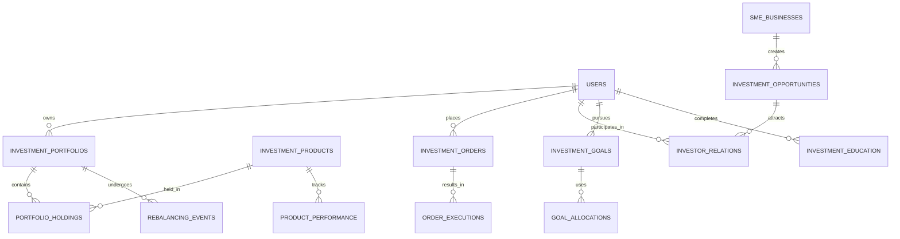

# Investment Models

AWO Platform's investment models support a comprehensive tiered investment system with portfolio management, SME debt marketplace, and performance tracking designed specifically for African women's investment needs and risk profiles.

## Investment Architecture Overview

<Info>
Investment models implement a sophisticated tiered system that automatically assigns users to Bronze, Silver, Gold, or Platinum portfolios based on their DIVA scores and risk tolerance, while providing access to both traditional investment products and innovative SME debt opportunities.
</Info>

### Investment Entity Relationships



## Portfolio Management Models

### Portfolio Structure

```typescript
interface InvestmentPortfolio {
  id: string; // UUID
  userId: string;
  
  // Portfolio classification
  tier: PortfolioTier;
  riskProfile: RiskProfile;
  investmentStrategy: InvestmentStrategy;
  
  // Portfolio values
  totalValue: number;
  availableCash: number;
  investedValue: number;
  currency: Currency;
  
  // Asset allocation
  targetAllocation: AssetAllocation;
  currentAllocation: AssetAllocation;
  allocationDrift: AllocationDrift;
  
  // Holdings
  holdings: PortfolioHolding[];
  
  // Performance
  performance: PortfolioPerformance;
  
  // Rebalancing
  lastRebalance: Date;
  nextRebalance: Date;
  rebalancingEnabled: boolean;
  rebalancingThreshold: number; // Percentage drift
  
  // Restrictions and limits
  investmentLimits: InvestmentLimits;
  restrictions: InvestmentRestriction[];
  
  // Management
  managementStyle: 'passive' | 'active' | 'hybrid';
  autoInvestEnabled: boolean;
  
  createdAt: Date;
  updatedAt: Date;
}

enum PortfolioTier {
  BRONZE = 'bronze',     // DIVA 0-399, conservative investments
  SILVER = 'silver',     // DIVA 400-649, balanced approach
  GOLD = 'gold',         // DIVA 650-849, growth investments
  PLATINUM = 'platinum'  // DIVA 850-1000, full access
}

interface RiskProfile {
  riskTolerance: 'very_low' | 'low' | 'moderate' | 'high' | 'very_high';
  timeHorizon: 'short' | 'medium' | 'long';
  riskCapacity: 'limited' | 'moderate' | 'high';
  experienceLevel: 'beginner' | 'intermediate' | 'advanced' | 'expert';
}

enum InvestmentStrategy {
  CONSERVATIVE = 'conservative',
  BALANCED = 'balanced',
  GROWTH = 'growth',
  AGGRESSIVE = 'aggressive',
  INCOME_FOCUSED = 'income_focused',
  ESG_FOCUSED = 'esg_focused',
  SADC_FOCUSED = 'sadc_focused'
}

interface AssetAllocation {
  cash: number;           // Percentage
  bonds: number;          // Government and corporate bonds
  equity: number;         // Stocks and equity funds
  alternatives: number;   // REITs, commodities, SME debt
  international: number;  // International investments
  
  // Detailed breakdown
  breakdown: {
    governmentBonds: number;
    corporateBonds: number;
    localEquity: number;
    internationalEquity: number;
    moneyMarket: number;
    realEstate: number;
    smeDebt: number;
    commodities: number;
  };
}

interface AllocationDrift {
  totalDrift: number; // Overall drift percentage
  driftByAssetClass: Record<string, number>;
  rebalanceRequired: boolean;
  driftSinceLastRebalance: number;
}
```

### Portfolio Holdings

```typescript
interface PortfolioHolding {
  id: string;
  portfolioId: string;
  productId: string;
  
  // Holding details
  quantity: number;
  averageCost: number;
  currentPrice: number;
  marketValue: number;
  
  // Performance
  unrealizedGain: number;
  unrealizedGainPercentage: number;
  realizedGain: number;
  totalReturn: number;
  
  // Allocation
  targetAllocation: number; // Percentage of portfolio
  currentAllocation: number; // Actual percentage
  allocationDrift: number;
  
  // Dates and tracking
  firstPurchaseDate: Date;
  lastPurchaseDate: Date;
  lastValuationDate: Date;
  
  // Cost basis tracking
  costBasisMethod: 'FIFO' | 'LIFO' | 'weighted_average';
  costBasisLots: CostBasisLot[];
  
  // Income tracking
  dividendsReceived: number;
  interestReceived: number;
  totalIncome: number;
  
  // Risk metrics
  beta?: number;
  volatility?: number;
  sharpeRatio?: number;
  
  updatedAt: Date;
}

interface CostBasisLot {
  id: string;
  quantity: number;
  costPerShare: number;
  purchaseDate: Date;
  transactionId: string;
  disposed: boolean;
  disposalDate?: Date;
}
```

### Portfolio Performance

```typescript
interface PortfolioPerformance {
  portfolioId: string;
  asOfDate: Date;
  
  // Returns
  dailyReturn: number;
  weeklyReturn: number;
  monthlyReturn: number;
  quarterlyReturn: number;
  yearlyReturn: number;
  inceptionReturn: number;
  
  // Annualized returns
  annualizedReturn1Year: number;
  annualizedReturn3Year: number;
  annualizedReturn5Year: number;
  
  // Risk metrics
  volatility: number;
  sharpeRatio: number;
  maxDrawdown: number;
  beta: number;
  alpha: number;
  
  // Benchmark comparison
  benchmarkReturn: number;
  excessReturn: number;
  trackingError: number;
  informationRatio: number;
  
  // Portfolio-specific metrics
  diversificationRatio: number;
  concentrationRisk: number;
  
  // Income metrics
  dividendYield: number;
  interestIncome: number;
  totalYield: number;
  
  calculatedAt: Date;
}

interface PerformanceHistory {
  portfolioId: string;
  date: Date;
  
  // Values
  totalValue: number;
  netDeposits: number;
  netWithdrawals: number;
  
  // Returns
  dailyReturn: number;
  cumulativeReturn: number;
  
  // Benchmark
  benchmarkValue: number;
  relativeReturn: number;
  
  // Asset allocation
  allocation: AssetAllocation;
}
```

## Investment Product Models

### Product Catalog

```typescript
interface InvestmentProduct {
  id: string; // UUID
  
  // Product identification
  symbol: string;
  name: string;
  description: string;
  productType: ProductType;
  assetClass: AssetClass;
  
  // Provider information
  provider: InvestmentProvider;
  providerProductId: string;
  
  // Pricing and valuation
  currentPrice: number;
  currency: Currency;
  minimumInvestment: number;
  minimumAdditionalInvestment: number;
  
  // Costs and fees
  managementFee: number; // Annual percentage
  performanceFee?: number;
  entryFee?: number;
  exitFee?: number;
  ongoingCharges: number;
  
  // Risk and classification
  riskRating: RiskRating;
  volatilityRating: VolatilityRating;
  creditRating?: string;
  
  // Availability and restrictions
  availableToTiers: PortfolioTier[];
  minimumRiskTolerance: string;
  jurisdictionRestrictions: string[];
  
  // Product details
  inceptionDate: Date;
  maturityDate?: Date;
  dividendFrequency?: DividendFrequency;
  
  // ESG and sustainability
  esgRating?: ESGRating;
  sustainabilityFocus?: string[];
  
  // Performance
  performance: ProductPerformance;
  
  // Documentation
  factSheetUrl?: string;
  prospectusUrl?: string;
  keyInformationDocumentUrl?: string;
  
  // Status
  isActive: boolean;
  isRecommended: boolean;
  
  lastUpdated: Date;
  createdAt: Date;
}

enum ProductType {
  MONEY_MARKET = 'money_market',
  TREASURY_BILLS = 'treasury_bills',
  GOVERNMENT_BONDS = 'government_bonds',
  CORPORATE_BONDS = 'corporate_bonds',
  EQUITY_FUND = 'equity_fund',
  INDEX_FUND = 'index_fund',
  ETF = 'etf',
  BALANCED_FUND = 'balanced_fund',
  REIT = 'reit',
  COMMODITY_FUND = 'commodity_fund',
  SME_DEBT = 'sme_debt',
  STRUCTURED_PRODUCT = 'structured_product'
}

enum AssetClass {
  CASH = 'cash',
  FIXED_INCOME = 'fixed_income',
  EQUITY = 'equity',
  REAL_ESTATE = 'real_estate',
  COMMODITIES = 'commodities',
  ALTERNATIVES = 'alternatives',
  MIXED = 'mixed'
}

enum RiskRating {
  VERY_LOW = 1,
  LOW = 2,
  MODERATE = 3,
  HIGH = 4,
  VERY_HIGH = 5
}

enum VolatilityRating {
  STABLE = 'stable',
  LOW_VOLATILITY = 'low_volatility',
  MODERATE_VOLATILITY = 'moderate_volatility',
  HIGH_VOLATILITY = 'high_volatility',
  VERY_HIGH_VOLATILITY = 'very_high_volatility'
}

enum DividendFrequency {
  MONTHLY = 'monthly',
  QUARTERLY = 'quarterly',
  SEMI_ANNUALLY = 'semi_annually',
  ANNUALLY = 'annually',
  IRREGULAR = 'irregular'
}

interface ESGRating {
  overallScore: number; // 0-100
  environmentalScore: number;
  socialScore: number;
  governanceScore: number;
  provider: string;
  lastUpdated: Date;
}

interface InvestmentProvider {
  id: string;
  name: string;
  type: 'asset_manager' | 'bank' | 'insurance' | 'broker' | 'platform';
  country: string;
  regulatoryLicense: string;
  contactInfo: ContactInfo;
  integrationDetails: ProviderIntegration;
}

interface ProviderIntegration {
  apiEndpoint: string;
  authenticationMethod: string;
  supportedOperations: string[];
  dataUpdateFrequency: string;
  lastDataUpdate: Date;
}
```

### Product Performance

```typescript
interface ProductPerformance {
  productId: string;
  asOfDate: Date;
  
  // Price performance
  priceChange1Day: number;
  priceChange1Week: number;
  priceChange1Month: number;
  priceChange3Month: number;
  priceChange6Month: number;
  priceChange1Year: number;
  priceChange3Year: number;
  priceChange5Year: number;
  inceptionReturn: number;
  
  // Risk-adjusted performance
  sharpeRatio1Year: number;
  sharpeRatio3Year: number;
  volatility1Year: number;
  volatility3Year: number;
  maxDrawdown: number;
  
  // Income performance
  dividendYield: number;
  distributionYield: number;
  totalYield: number;
  
  // Relative performance
  benchmarkReturn1Year: number;
  excessReturn1Year: number;
  trackingError: number;
  
  // Rankings and ratings
  categoryRanking?: number;
  categoryPercentile?: number;
  morningstarRating?: number;
  
  lastUpdated: Date;
}

interface ProductPriceHistory {
  productId: string;
  date: Date;
  openPrice: number;
  highPrice: number;
  lowPrice: number;
  closePrice: number;
  volume?: number;
  adjustedPrice: number; // Adjusted for splits, dividends
  
  // Calculated metrics
  dailyReturn: number;
  volatility: number;
}
```

## Order Management Models

### Investment Orders

```typescript
interface InvestmentOrder {
  id: string; // UUID
  portfolioId: string;
  productId: string;
  
  // Order details
  orderType: OrderType;
  orderSide: OrderSide;
  quantity?: number;
  amount?: number; // For value-based orders
  limitPrice?: number;
  
  // Order management
  status: OrderStatus;
  timeInForce: TimeInForce;
  
  // Execution details
  submittedAt: Date;
  executedAt?: Date;
  cancelledAt?: Date;
  
  // Execution results
  executions: OrderExecution[];
  totalExecutedQuantity: number;
  averageExecutionPrice: number;
  totalExecutedValue: number;
  
  // Fees and costs
  fees: OrderFee[];
  totalFees: number;
  
  // Settlement
  settlementDate: Date;
  settlementStatus: SettlementStatus;
  
  // Validation and compliance
  validationChecks: ValidationCheck[];
  complianceApproved: boolean;
  
  // Error handling
  rejectionReason?: string;
  errorMessage?: string;
  
  // Source and context
  source: OrderSource;
  parentOrderId?: string; // For child orders
  
  createdAt: Date;
  updatedAt: Date;
}

enum OrderType {
  MARKET = 'market',
  LIMIT = 'limit',
  STOP = 'stop',
  STOP_LIMIT = 'stop_limit',
  VALUE_BASED = 'value_based' // Invest specific Rand amount
}

enum OrderSide {
  BUY = 'buy',
  SELL = 'sell'
}

enum OrderStatus {
  PENDING = 'pending',
  SUBMITTED = 'submitted',
  PARTIALLY_FILLED = 'partially_filled',
  FILLED = 'filled',
  CANCELLED = 'cancelled',
  REJECTED = 'rejected',
  EXPIRED = 'expired'
}

enum TimeInForce {
  DAY = 'day',
  GOOD_TILL_CANCELLED = 'good_till_cancelled',
  IMMEDIATE_OR_CANCEL = 'immediate_or_cancel',
  FILL_OR_KILL = 'fill_or_kill'
}

enum SettlementStatus {
  PENDING = 'pending',
  SETTLED = 'settled',
  FAILED = 'failed'
}

enum OrderSource {
  USER_MANUAL = 'user_manual',
  AUTO_INVEST = 'auto_invest',
  REBALANCING = 'rebalancing',
  GOAL_BASED = 'goal_based',
  CHAMA = 'chama'
}

interface OrderExecution {
  id: string;
  orderId: string;
  
  executionTime: Date;
  executedQuantity: number;
  executionPrice: number;
  executionValue: number;
  
  // Market data
  marketPrice: number;
  bid: number;
  ask: number;
  
  // Execution venue
  venue: string;
  venueOrderId: string;
  
  // Settlement
  settlementDate: Date;
  tradeDate: Date;
}

interface OrderFee {
  type: FeeType;
  amount: number;
  percentage?: number;
  description: string;
  
  // Tax implications
  taxable: boolean;
  taxAmount?: number;
}

enum FeeType {
  COMMISSION = 'commission',
  MANAGEMENT_FEE = 'management_fee',
  PLATFORM_FEE = 'platform_fee',
  TRANSACTION_FEE = 'transaction_fee',
  REGULATORY_FEE = 'regulatory_fee',
  TAX = 'tax'
}

interface ValidationCheck {
  checkType: string;
  passed: boolean;
  message?: string;
  timestamp: Date;
}
```

## SME Investment Models

### SME Business Structure

```typescript
interface SMEBusiness {
  id: string; // UUID
  
  // Business identification
  businessName: string;
  registrationNumber: string;
  taxNumber: string;
  
  // Business details
  industry: Industry;
  sector: BusinessSector;
  businessType: BusinessType;
  foundedDate: Date;
  
  // Location
  country: string;
  province: string;
  city: string;
  operatingLocations: string[];
  
  // Ownership and leadership
  ownershipStructure: OwnershipStructure;
  keyPersonnel: KeyPersonnel[];
  boardMembers: BoardMember[];
  
  // Financial information
  financialProfile: SMEFinancialProfile;
  
  // Business model
  businessModel: string;
  valueProposition: string;
  targetMarket: string;
  competitiveAdvantage: string;
  
  // Verification and compliance
  verificationStatus: VerificationStatus;
  complianceChecks: ComplianceCheck[];
  
  // Documentation
  documents: BusinessDocument[];
  
  // Platform metadata
  onboardedDate: Date;
  status: BusinessStatus;
  
  createdAt: Date;
  updatedAt: Date;
}

enum Industry {
  AGRICULTURE = 'agriculture',
  MANUFACTURING = 'manufacturing',
  RETAIL = 'retail',
  SERVICES = 'services',
  TECHNOLOGY = 'technology',
  HEALTHCARE = 'healthcare',
  EDUCATION = 'education',
  HOSPITALITY = 'hospitality',
  CONSTRUCTION = 'construction',
  TRANSPORT = 'transport',
  FINANCE = 'finance',
  CREATIVE = 'creative'
}

enum BusinessSector {
  FORMAL = 'formal',
  INFORMAL = 'informal',
  COOPERATIVE = 'cooperative',
  SOCIAL_ENTERPRISE = 'social_enterprise'
}

enum BusinessType {
  SOLE_PROPRIETORSHIP = 'sole_proprietorship',
  PARTNERSHIP = 'partnership',
  PRIVATE_COMPANY = 'private_company',
  CLOSE_CORPORATION = 'close_corporation',
  COOPERATIVE = 'cooperative',
  NPO = 'npo'
}

interface OwnershipStructure {
  ownershipType: BusinessType;
  owners: BusinessOwner[];
  womenOwnershipPercentage: number;
  isWomenLed: boolean;
  isWomenMajorityOwned: boolean;
}

interface BusinessOwner {
  name: string;
  ownershipPercentage: number;
  role: string;
  isActive: boolean;
  gender?: 'male' | 'female' | 'other';
}

interface KeyPersonnel {
  name: string;
  position: string;
  experience: number; // Years
  qualifications: string[];
  linkedInProfile?: string;
}

interface SMEFinancialProfile {
  // Revenue and profitability
  annualRevenue: number;
  monthlyRevenue: number;
  profitMargin: number;
  
  // Financial statements
  assets: number;
  liabilities: number;
  equity: number;
  
  // Cash flow
  operatingCashFlow: number;
  freeCashFlow: number;
  
  // Credit history
  creditScore?: number;
  creditHistory: CreditHistoryItem[];
  
  // Banking relationship
  primaryBank: string;
  bankingHistory: number; // Years
  
  // Financial ratios
  debtToEquityRatio: number;
  currentRatio: number;
  returnOnAssets: number;
  
  lastUpdated: Date;
}

interface CreditHistoryItem {
  lenderName: string;
  amount: number;
  purpose: string;
  status: 'current' | 'paid' | 'defaulted' | 'restructured';
  startDate: Date;
  endDate?: Date;
}

enum VerificationStatus {
  PENDING = 'pending',
  IN_PROGRESS = 'in_progress',
  VERIFIED = 'verified',
  REJECTED = 'rejected',
  REQUIRES_UPDATE = 'requires_update'
}

enum BusinessStatus {
  ACTIVE = 'active',
  DORMANT = 'dormant',
  SUSPENDED = 'suspended',
  CLOSED = 'closed'
}
```

### Investment Opportunities

```typescript
interface InvestmentOpportunity {
  id: string; // UUID
  businessId: string;
  
  // Opportunity details
  title: string;
  description: string;
  opportunityType: OpportunityType;
  
  // Financial terms
  totalFundingRequired: number;
  minimumInvestment: number;
  maximumInvestment: number;
  currency: Currency;
  
  // Return structure
  returnType: ReturnType;
  expectedReturn: number; // Annual percentage
  paymentFrequency: PaymentFrequency;
  term: number; // Months
  
  // Security and collateral
  securityType: SecurityType;
  collateral: CollateralItem[];
  guarantee: GuaranteeDetails;
  
  // Risk assessment
  riskRating: RiskRating;
  riskFactors: string[];
  mitigationMeasures: string[];
  
  // Fundraising details
  targetAmount: number;
  raisedAmount: number;
  investorCount: number;
  fundingDeadline: Date;
  
  // Status and lifecycle
  status: OpportunityStatus;
  fundingStage: FundingStage;
  
  // Use of funds
  useOfFunds: UseOfFundsBreakdown;
  
  // Investment terms
  terms: InvestmentTerms;
  
  // Due diligence
  dueDiligence: DueDiligenceReport;
  
  // Documentation
  documents: OpportunityDocument[];
  
  // Platform features
  featuredOpportunity: boolean;
  recommendedForTiers: PortfolioTier[];
  
  createdAt: Date;
  updatedAt: Date;
  closedAt?: Date;
}

enum OpportunityType {
  WORKING_CAPITAL = 'working_capital',
  EQUIPMENT_FINANCING = 'equipment_financing',
  EXPANSION_FUNDING = 'expansion_funding',
  INVENTORY_FINANCING = 'inventory_financing',
  SEASONAL_FUNDING = 'seasonal_funding',
  BRIDGE_FINANCING = 'bridge_financing',
  REFINANCING = 'refinancing'
}

enum ReturnType {
  FIXED_INTEREST = 'fixed_interest',
  VARIABLE_INTEREST = 'variable_interest',
  PROFIT_SHARING = 'profit_sharing',
  REVENUE_SHARING = 'revenue_sharing',
  EQUITY_PARTICIPATION = 'equity_participation'
}

enum PaymentFrequency {
  MONTHLY = 'monthly',
  QUARTERLY = 'quarterly',
  SEMI_ANNUALLY = 'semi_annually',
  ANNUALLY = 'annually',
  AT_MATURITY = 'at_maturity'
}

enum SecurityType {
  UNSECURED = 'unsecured',
  ASSET_BACKED = 'asset_backed',
  PERSONAL_GUARANTEE = 'personal_guarantee',
  CORPORATE_GUARANTEE = 'corporate_guarantee',
  COLLATERAL_SECURED = 'collateral_secured'
}

enum OpportunityStatus {
  DRAFT = 'draft',
  UNDER_REVIEW = 'under_review',
  APPROVED = 'approved',
  FUNDRAISING = 'fundraising',
  FUNDED = 'funded',
  ACTIVE = 'active',
  COMPLETED = 'completed',
  DEFAULTED = 'defaulted',
  CANCELLED = 'cancelled'
}

enum FundingStage {
  PRE_LAUNCH = 'pre_launch',
  EARLY_FUNDING = 'early_funding',
  ACTIVE_FUNDING = 'active_funding',
  LATE_FUNDING = 'late_funding',
  OVERSUBSCRIBED = 'oversubscribed',
  CLOSED = 'closed'
}

interface UseOfFundsBreakdown {
  workingCapital?: number;
  equipment?: number;
  inventory?: number;
  marketing?: number;
  expansion?: number;
  debtRepayment?: number;
  other?: number;
  otherDescription?: string;
}

interface CollateralItem {
  type: string;
  description: string;
  estimatedValue: number;
  valuationDate: Date;
  valuationMethod: string;
}

interface GuaranteeDetails {
  hasGuarantee: boolean;
  guarantorType?: 'personal' | 'corporate' | 'institutional';
  guarantorName?: string;
  guaranteeAmount?: number;
  guaranteeTerms?: string;
}

interface InvestmentTerms {
  minimumTerm: number; // Months
  maximumTerm: number; // Months
  earlyRepaymentAllowed: boolean;
  earlyRepaymentPenalty?: number;
  defaultInterestRate: number;
  lateFeeStructure: LateFeeStructure;
}

interface LateFeeStructure {
  gracePeriod: number; // Days
  lateFeePercentage: number;
  compoundingFrequency: 'daily' | 'monthly';
  maximumLateFee?: number;
}
```

### Investor Relations

```typescript
interface InvestorRelation {
  id: string; // UUID
  opportunityId: string;
  investorId: string; // User ID
  
  // Investment details
  investmentAmount: number;
  investmentDate: Date;
  expectedReturn: number;
  maturityDate: Date;
  
  // Investment tracking
  principalRemaining: number;
  interestEarned: number;
  totalReturned: number;
  
  // Payment schedule
  paymentSchedule: PaymentScheduleItem[];
  
  // Performance
  actualReturn: number;
  returnToDate: number;
  daysOutstanding: number;
  
  // Status
  status: InvestmentRelationStatus;
  
  // Risk and monitoring
  riskStatus: 'performing' | 'watch' | 'substandard' | 'doubtful' | 'loss';
  lastPaymentDate?: Date;
  daysInArrears: number;
  
  // Communication
  updates: InvestorUpdate[];
  documents: InvestorDocument[];
  
  // Exit
  exitDate?: Date;
  exitReason?: string;
  recoveryAmount?: number;
  
  createdAt: Date;
  updatedAt: Date;
}

enum InvestmentRelationStatus {
  ACTIVE = 'active',
  COMPLETED = 'completed',
  DEFAULTED = 'defaulted',
  RESTRUCTURED = 'restructured',
  WRITTEN_OFF = 'written_off'
}

interface PaymentScheduleItem {
  id: string;
  dueDate: Date;
  principalAmount: number;
  interestAmount: number;
  totalAmount: number;
  status: 'scheduled' | 'paid' | 'overdue' | 'partial';
  paidDate?: Date;
  paidAmount?: number;
  lateFee?: number;
}

interface InvestorUpdate {
  id: string;
  updateType: 'payment' | 'business_update' | 'risk_alert' | 'milestone';
  title: string;
  content: string;
  publishedDate: Date;
  attachments: string[];
}

interface InvestorDocument {
  id: string;
  documentType: 'contract' | 'statement' | 'report' | 'certificate';
  filename: string;
  uploadedDate: Date;
  description?: string;
}
```

## Investment Goals and Planning

### Goal-Based Investing

```typescript
interface InvestmentGoal {
  id: string; // UUID
  userId: string;
  
  // Goal definition
  title: string;
  description?: string;
  goalType: InvestmentGoalType;
  category: GoalCategory;
  
  // Financial targets
  targetAmount: number;
  currentAmount: number;
  currency: Currency;
  
  // Timeline
  targetDate: Date;
  timeHorizon: number; // Years
  startDate: Date;
  
  // Strategy
  investmentStrategy: InvestmentStrategy;
  riskTolerance: string;
  
  // Allocation and automation
  targetAllocation: AssetAllocation;
  monthlyContribution: number;
  autoInvestEnabled: boolean;
  
  // Progress tracking
  progress: number; // 0-100 percentage
  onTrack: boolean;
  projectedCompletionDate: Date;
  
  // Performance
  totalContributions: number;
  totalGains: number;
  annualizedReturn: number;
  
  // Recommendations
  recommendations: GoalRecommendation[];
  
  // Status
  status: GoalStatus;
  priority: GoalPriority;
  
  createdAt: Date;
  updatedAt: Date;
}

enum InvestmentGoalType {
  RETIREMENT = 'retirement',
  EMERGENCY_FUND = 'emergency_fund',
  HOUSE_DEPOSIT = 'house_deposit',
  EDUCATION = 'education',
  BUSINESS_FUNDING = 'business_funding',
  VACATION = 'vacation',
  WEDDING = 'wedding',
  GENERAL_WEALTH = 'general_wealth',
  PASSIVE_INCOME = 'passive_income'
}

enum GoalCategory {
  ESSENTIAL = 'essential',
  IMPORTANT = 'important',
  ASPIRATIONAL = 'aspirational'
}

enum GoalStatus {
  PLANNING = 'planning',
  ACTIVE = 'active',
  ON_TRACK = 'on_track',
  BEHIND = 'behind',
  AHEAD = 'ahead',
  PAUSED = 'paused',
  COMPLETED = 'completed',
  CANCELLED = 'cancelled'
}

enum GoalPriority {
  HIGH = 'high',
  MEDIUM = 'medium',
  LOW = 'low'
}

interface GoalRecommendation {
  type: 'increase_contribution' | 'adjust_allocation' | 'extend_timeline' | 'reduce_target';
  description: string;
  impact: string;
  priority: 'high' | 'medium' | 'low';
  actionRequired: boolean;
}

interface GoalAllocation {
  goalId: string;
  productId: string;
  targetAllocation: number; // Percentage
  currentAllocation: number;
  rebalanceThreshold: number;
}
```

## Investment Analytics and Reporting

### Performance Analytics

```typescript
interface InvestmentAnalytics {
  userId: string;
  portfolioId: string;
  analysisDate: Date;
  
  // Performance summary
  performanceSummary: {
    totalValue: number;
    totalGain: number;
    totalGainPercentage: number;
    realizedGain: number;
    unrealizedGain: number;
    
    // Time-weighted returns
    return1Month: number;
    return3Month: number;
    return6Month: number;
    return1Year: number;
    returnSinceInception: number;
    
    // Money-weighted returns
    irr: number; // Internal Rate of Return
    
    // Risk metrics
    volatility: number;
    sharpeRatio: number;
    maxDrawdown: number;
  };
  
  // Asset class performance
  assetClassPerformance: AssetClassPerformance[];
  
  // Attribution analysis
  attribution: {
    assetAllocation: number; // Return from asset allocation
    security: number; // Return from security selection
    interaction: number; // Interaction effect
    total: number; // Total attribution
  };
  
  // Risk analysis
  riskAnalysis: {
    portfolioRisk: number;
    concentrationRisk: number;
    currencyRisk: number;
    creditRisk: number;
    liquidityRisk: number;
  };
  
  // Benchmarking
  benchmarkComparison: {
    benchmarkReturn: number;
    excessReturn: number;
    trackingError: number;
    informationRatio: number;
    upCapture: number;
    downCapture: number;
  };
  
  // Goal progress
  goalProgress: GoalProgressSummary[];
  
  calculatedAt: Date;
}

interface AssetClassPerformance {
  assetClass: AssetClass;
  allocation: number;
  value: number;
  return1Month: number;
  return1Year: number;
  contributionToReturn: number;
}

interface GoalProgressSummary {
  goalId: string;
  goalName: string;
  targetAmount: number;
  currentAmount: number;
  progress: number;
  onTrack: boolean;
  monthsRemaining: number;
  requiredMonthlyContribution: number;
}
```

### Investment Reports

```typescript
interface InvestmentReport {
  id: string;
  userId: string;
  portfolioId?: string;
  
  // Report metadata
  reportType: InvestmentReportType;
  reportPeriod: ReportPeriod;
  generatedDate: Date;
  
  // Content
  summary: InvestmentSummary;
  holdings: HoldingDetail[];
  transactions: TransactionSummary[];
  performance: PerformanceReport;
  allocation: AllocationReport;
  
  // Recommendations
  recommendations: InvestmentRecommendation[];
  
  // Compliance and tax
  taxInformation: TaxSummary;
  complianceNotes: string[];
  
  // Distribution
  format: 'pdf' | 'excel' | 'json';
  fileUrl?: string;
  emailSent: boolean;
  
  createdAt: Date;
}

enum InvestmentReportType {
  MONTHLY_STATEMENT = 'monthly_statement',
  QUARTERLY_REPORT = 'quarterly_report',
  ANNUAL_SUMMARY = 'annual_summary',
  TAX_SUMMARY = 'tax_summary',
  PERFORMANCE_REPORT = 'performance_report',
  GOAL_PROGRESS = 'goal_progress'
}

interface InvestmentSummary {
  totalValue: number;
  netDeposits: number;
  totalGain: number;
  totalGainPercentage: number;
  
  periodContributions: number;
  periodWithdrawals: number;
  periodGain: number;
  
  allocationSummary: AssetAllocation;
}

interface HoldingDetail {
  productName: string;
  symbol: string;
  quantity: number;
  averageCost: number;
  currentPrice: number;
  marketValue: number;
  allocation: number;
  gain: number;
  gainPercentage: number;
}

interface TransactionSummary {
  date: Date;
  type: 'buy' | 'sell' | 'dividend' | 'fee';
  productName: string;
  quantity?: number;
  price?: number;
  amount: number;
  fees: number;
}

interface InvestmentRecommendation {
  type: 'rebalance' | 'increase_contribution' | 'diversify' | 'reduce_risk';
  priority: 'high' | 'medium' | 'low';
  description: string;
  rationale: string;
  expectedImpact: string;
  actionRequired: boolean;
}

interface TaxSummary {
  taxYear: number;
  dividendIncome: number;
  interestIncome: number;
  capitalGains: number;
  capitalLosses: number;
  netCapitalGain: number;
  taxWithheld: number;
  
  // Tax-advantaged accounts
  retirementContributions: number;
  taxFreeContributions: number;
}
```

---

*This comprehensive investment models documentation provides the foundation for sophisticated investment management, portfolio optimization, and SME debt marketplace functionality, enabling AWO Platform to deliver personalized investment solutions tailored to African women's financial goals and risk profiles.*

*Last updated: June 2025*  
*Next review: July 2025*