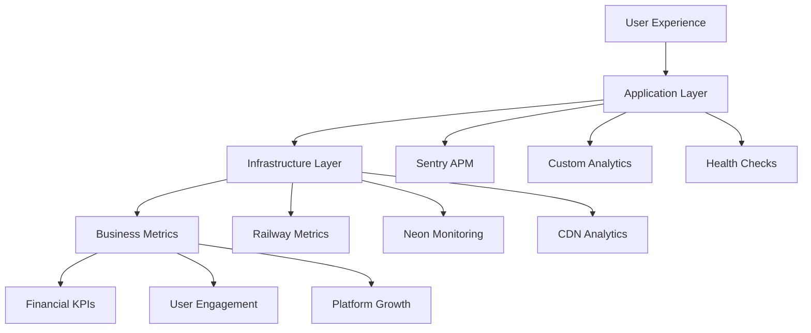

# Monitoring Setup - Deployment

## Overview

AWO Platform's monitoring strategy provides comprehensive observability across application performance, infrastructure health, and business metrics. This guide covers setting up production-grade monitoring to ensure reliable financial services for African users with proactive issue detection and resolution.

<Info>
Our monitoring setup emphasizes real-time visibility, intelligent alerting, and business impact tracking to maintain high availability and optimal user experience across the SADC region.
</Info>

## Monitoring Architecture

### Monitoring Stack Overview

**Core Monitoring Components**:
<CardGroup cols={2}>
  <Card title="Application Monitoring" icon="code">
    **Sentry**: Error tracking and performance monitoring  
    **Custom Metrics**: Business KPIs and user behavior  
    **Health Checks**: Service availability monitoring  
    **APM**: Application performance insights
  </Card>
  <Card title="Infrastructure Monitoring" icon="server">
    **Railway/Render**: Built-in platform monitoring  
    **Neon**: Database performance and health  
    **Cloudflare**: CDN and security analytics  
    **Uptime Monitoring**: External service monitoring
  </Card>
</CardGroup>

**Monitoring Layers**:


## Application Performance Monitoring

### Sentry Configuration

**Backend Sentry Setup**:
```javascript
// config/sentry.js
const Sentry = require('@sentry/node');
const { nodeProfilingIntegration } = require('@sentry/profiling-node');

// Initialize Sentry
Sentry.init({
  dsn: process.env.SENTRY_DSN,
  environment: process.env.NODE_ENV,
  
  // Performance monitoring
  tracesSampleRate: process.env.NODE_ENV === 'production' ? 0.1 : 1.0,
  
  // Profiling
  profilesSampleRate: process.env.NODE_ENV === 'production' ? 0.1 : 1.0,
  integrations: [
    nodeProfilingIntegration(),
    new Sentry.Integrations.Http({ tracing: true }),
    new Sentry.Integrations.Express({ app: require('../app') })
  ],
  
  // Error filtering
  beforeSend: (event, hint) => {
    // Filter out non-critical errors in development
    if (process.env.NODE_ENV === 'development' && event.level === 'warning') {
      return null;
    }
    
    // Add user context for financial services compliance
    if (event.user) {
      event.user = {
        id: event.user.id,
        // Remove PII while keeping debugging context
        ip_address: '{{auto}}'
      };
    }
    
    return event;
  },
  
  // Release tracking
  release: process.env.SENTRY_RELEASE || 'development',
  
  // Custom tags
  initialScope: {
    tags: {
      component: 'backend',
      region: process.env.DEPLOYMENT_REGION || 'us-east',
      version: process.env.npm_package_version
    }
  }
});

// Express middleware
const setupSentryMiddleware = (app) => {
  // Request handler must be first
  app.use(Sentry.Handlers.requestHandler());
  
  // Tracing handler
  app.use(Sentry.Handlers.tracingHandler());
  
  // Error handler must be last
  app.use(Sentry.Handlers.errorHandler());
};

module.exports = { Sentry, setupSentryMiddleware };
```

**Mobile Sentry Setup**:
```javascript
// mobile/config/sentry.js
import * as Sentry from '@sentry/react-native';

Sentry.init({
  dsn: process.env.EXPO_PUBLIC_SENTRY_DSN,
  environment: process.env.EXPO_PUBLIC_ENVIRONMENT,
  
  // Performance monitoring
  tracesSampleRate: __DEV__ ? 1.0 : 0.1,
  
  // Session tracking
  enableAutoSessionTracking: true,
  
  // Native crash tracking
  enableNativeFramesTracking: true,
  enableOutOfMemoryTracking: true,
  
  // React Native specific
  enableAutoPerformanceTracing: true,
  
  // User privacy for financial app
  beforeSend: (event) => {
    // Remove sensitive data
    if (event.user) {
      event.user = {
        id: event.user.id,
        // Remove PII
        email: null,
        username: null
      };
    }
    
    // Filter sensitive breadcrumbs
    if (event.breadcrumbs) {
      event.breadcrumbs = event.breadcrumbs.filter(breadcrumb => {
        return !breadcrumb.message?.includes('password') &&
               !breadcrumb.message?.includes('token') &&
               !breadcrumb.message?.includes('pin');
      });
    }
    
    return event;
  },
  
  integrations: [
    new Sentry.ReactNativeTracing({
      routingInstrumentation: new Sentry.ReactNavigationInstrumentation(),
      enableUserInteractionTracing: true,
      enableNativeFramesTracking: true
    })
  ]
});

export default Sentry;
```

### Custom Performance Monitoring

**Performance Metrics Collection**:
```javascript
// monitoring/performance.js
const EventEmitter = require('events');

class PerformanceMonitor extends EventEmitter {
  constructor() {
    super();
    this.metrics = new Map();
    this.startTime = Date.now();
  }

  // Track API endpoint performance
  trackAPICall(endpoint, method, duration, statusCode) {
    const key = `${method}:${endpoint}`;
    
    if (!this.metrics.has(key)) {
      this.metrics.set(key, {
        count: 0,
        totalDuration: 0,
        errors: 0,
        lastCall: null
      });
    }
    
    const metric = this.metrics.get(key);
    metric.count++;
    metric.totalDuration += duration;
    metric.lastCall = new Date().toISOString();
    
    if (statusCode >= 400) {
      metric.errors++;
    }
    
    // Emit alert for slow requests
    if (duration > 5000) {
      this.emit('slow-request', {
        endpoint: key,
        duration,
        statusCode
      });
    }
    
    // Emit alert for high error rate
    const errorRate = metric.errors / metric.count;
    if (errorRate > 0.1 && metric.count > 10) {
      this.emit('high-error-rate', {
        endpoint: key,
        errorRate,
        count: metric.count
      });
    }
  }

  // Track business metrics
  trackBusinessMetric(metric, value, tags = {}) {
    const event = {
      metric,
      value,
      tags: {
        ...tags,
        environment: process.env.NODE_ENV,
        timestamp: new Date().toISOString()
      }
    };
    
    // Send to analytics service
    this.emit('business-metric', event);
    
    // Log important business events
    if (['user_registration', 'chama_created', 'investment_made'].includes(metric)) {
      console.log(`📊 Business Metric: ${metric} = ${value}`, tags);
    }
  }

  // Get performance summary
  getMetrics() {
    const summary = {};
    
    for (const [endpoint, data] of this.metrics.entries()) {
      summary[endpoint] = {
        ...data,
        averageDuration: data.totalDuration / data.count,
        errorRate: data.errors / data.count,
        requestsPerMinute: data.count / ((Date.now() - this.startTime) / 60000)
      };
    }
    
    return summary;
  }

  // Reset metrics
  reset() {
    this.metrics.clear();
    this.startTime = Date.now();
  }
}

const performanceMonitor = new PerformanceMonitor();

// Set up event handlers
performanceMonitor.on('slow-request', async (data) => {
  console.warn('🐌 Slow request detected:', data);
  
  // Send alert
  if (process.env.SLACK_WEBHOOK_URL) {
    await sendSlackAlert(`Slow request: ${data.endpoint} took ${data.duration}ms`);
  }
});

performanceMonitor.on('high-error-rate', async (data) => {
  console.error('🚨 High error rate detected:', data);
  
  // Send critical alert
  if (process.env.SLACK_WEBHOOK_URL) {
    await sendSlackAlert(
      `🚨 High error rate: ${data.endpoint} has ${Math.round(data.errorRate * 100)}% error rate`
    );
  }
});

module.exports = { performanceMonitor };
```

### Express Middleware Integration

**Performance Tracking Middleware**:
```javascript
// middleware/monitoring.js
const { performanceMonitor } = require('../monitoring/performance');
const { Sentry } = require('../config/sentry');

// Request performance tracking
const performanceMiddleware = (req, res, next) => {
  const startTime = Date.now();
  
  // Add request ID for tracing
  req.requestId = require('crypto').randomUUID();
  res.setHeader('X-Request-ID', req.requestId);
  
  // Track request start
  Sentry.addBreadcrumb({
    message: `${req.method} ${req.path}`,
    category: 'http',
    data: {
      url: req.url,
      method: req.method,
      requestId: req.requestId
    }
  });

  // Override res.end to capture metrics
  const originalEnd = res.end;
  res.end = function(...args) {
    const duration = Date.now() - startTime;
    const endpoint = req.route?.path || req.path;
    
    // Track performance metrics
    performanceMonitor.trackAPICall(
      endpoint,
      req.method,
      duration,
      res.statusCode
    );
    
    // Add performance data to Sentry
    Sentry.addBreadcrumb({
      message: `Request completed`,
      category: 'http',
      data: {
        duration,
        statusCode: res.statusCode,
        requestId: req.requestId
      }
    });
    
    originalEnd.apply(this, args);
  };
  
  next();
};

// Business metrics middleware for financial operations
const businessMetricsMiddleware = (req, res, next) => {
  const originalJson = res.json;
  
  res.json = function(data) {
    // Track successful business operations
    if (res.statusCode >= 200 && res.statusCode < 300) {
      const route = req.route?.path;
      
      switch (route) {
        case '/api/auth/register':
          performanceMonitor.trackBusinessMetric('user_registration', 1, {
            country: req.body?.country,
            kyc_level: req.body?.kyc_level
          });
          break;
          
        case '/api/chamas':
          if (req.method === 'POST') {
            performanceMonitor.trackBusinessMetric('chama_created', 1, {
              contribution_amount: req.body?.contribution_amount,
              frequency: req.body?.contribution_frequency
            });
          }
          break;
          
        case '/api/investments':
          if (req.method === 'POST') {
            performanceMonitor.trackBusinessMetric('investment_made', req.body?.amount, {
              investment_type: req.body?.investment_type,
              portfolio_tier: req.user?.portfolio_tier
            });
          }
          break;
      }
    }
    
    originalJson.call(this, data);
  };
  
  next();
};

module.exports = {
  performanceMiddleware,
  businessMetricsMiddleware
};
```

## Health Check Monitoring

### Comprehensive Health Checks

**Health Check Implementation**:
```javascript
// routes/health.js
const express = require('express');
const router = express.Router();
const { pool } = require('../config/database');
const redis = require('../config/redis');

class HealthChecker {
  constructor() {
    this.checks = new Map();
    this.registerChecks();
  }

  registerCheck(name, checkFunction, timeout = 5000) {
    this.checks.set(name, { checkFunction, timeout });
  }

  async runCheck(name, checkData) {
    const startTime = Date.now();
    
    try {
      const result = await Promise.race([
        checkData.checkFunction(),
        new Promise((_, reject) => 
          setTimeout(() => reject(new Error('Check timeout')), checkData.timeout)
        )
      ]);
      
      return {
        status: 'healthy',
        responseTime: Date.now() - startTime,
        details: result
      };
    } catch (error) {
      return {
        status: 'unhealthy',
        responseTime: Date.now() - startTime,
        error: error.message
      };
    }
  }

  registerChecks() {
    // Database check
    this.registerCheck('database', async () => {
      const result = await pool.query('SELECT version(), now() as timestamp');
      return {
        version: result.rows[0].version.split(' ')[1],
        timestamp: result.rows[0].timestamp,
        connections: {
          total: pool.totalCount,
          idle: pool.idleCount,
          waiting: pool.waitingCount
        }
      };
    });

    // Redis check (if configured)
    if (redis) {
      this.registerCheck('redis', async () => {
        const info = await redis.info('memory');
        return {
          status: 'connected',
          memory: info.split('\r\n')
            .find(line => line.startsWith('used_memory_human:'))
            ?.split(':')[1]
        };
      });
    }

    // External API checks
    this.registerCheck('stitch_api', async () => {
      const response = await fetch('https://api.stitch.money/health', {
        timeout: 3000
      });
      return {
        status: response.ok ? 'available' : 'unavailable',
        statusCode: response.status
      };
    }, 3000);

    this.registerCheck('flutterwave_api', async () => {
      const response = await fetch('https://api.flutterwave.com/health', {
        timeout: 3000
      });
      return {
        status: response.ok ? 'available' : 'unavailable',
        statusCode: response.status
      };
    }, 3000);

    // File system check
    this.registerCheck('filesystem', async () => {
      const fs = require('fs').promises;
      const testFile = '/tmp/health-check-test';
      
      await fs.writeFile(testFile, 'test');
      await fs.readFile(testFile);
      await fs.unlink(testFile);
      
      return { status: 'writable' };
    });
  }

  async checkAll() {
    const results = {};
    const promises = [];
    
    for (const [name, checkData] of this.checks.entries()) {
      promises.push(
        this.runCheck(name, checkData).then(result => {
          results[name] = result;
        })
      );
    }
    
    await Promise.all(promises);
    
    // Determine overall health
    const hasUnhealthy = Object.values(results).some(r => r.status === 'unhealthy');
    const overallStatus = hasUnhealthy ? 'unhealthy' : 'healthy';
    
    return {
      status: overallStatus,
      timestamp: new Date().toISOString(),
      version: process.env.npm_package_version,
      environment: process.env.NODE_ENV,
      uptime: process.uptime(),
      checks: results
    };
  }
}

const healthChecker = new HealthChecker();

// Basic health endpoint
router.get('/', async (req, res) => {
  try {
    const health = await healthChecker.checkAll();
    
    res.status(health.status === 'healthy' ? 200 : 503).json(health);
  } catch (error) {
    res.status(503).json({
      status: 'unhealthy',
      error: error.message,
      timestamp: new Date().toISOString()
    });
  }
});

// Detailed health check for monitoring services
router.get('/detailed', async (req, res) => {
  const health = await healthChecker.checkAll();
  
  // Add system metrics
  health.system = {
    memory: process.memoryUsage(),
    cpu: process.cpuUsage(),
    platform: process.platform,
    nodeVersion: process.version
  };
  
  res.status(health.status === 'healthy' ? 200 : 503).json(health);
});

// Readiness probe (for orchestration)
router.get('/ready', async (req, res) => {
  // Check only critical dependencies
  const criticalChecks = ['database'];
  const results = {};
  
  for (const checkName of criticalChecks) {
    const checkData = healthChecker.checks.get(checkName);
    if (checkData) {
      results[checkName] = await healthChecker.runCheck(checkName, checkData);
    }
  }
  
  const isReady = Object.values(results).every(r => r.status === 'healthy');
  
  res.status(isReady ? 200 : 503).json({
    ready: isReady,
    checks: results
  });
});

// Liveness probe (for orchestration)
router.get('/live', (req, res) => {
  // Simple check that the process is running
  res.status(200).json({
    alive: true,
    timestamp: new Date().toISOString(),
    uptime: process.uptime()
  });
});

module.exports = router;
```

## Infrastructure Monitoring

### Platform-Specific Monitoring

**Railway Monitoring Setup**:
```javascript
// monitoring/railway.js
class RailwayMonitor {
  constructor(apiKey) {
    this.apiKey = apiKey;
    this.baseUrl = 'https://backboard.railway.app/graphql';
  }

  async getServiceMetrics(serviceId) {
    const query = `
      query GetServiceMetrics($serviceId: String!) {
        service(id: $serviceId) {
          id
          name
          deployments(first: 5) {
            edges {
              node {
                id
                status
                createdAt
                meta
              }
            }
          }
          metrics {
            cpu
            memory
            network
          }
        }
      }
    `;

    const response = await fetch(this.baseUrl, {
      method: 'POST',
      headers: {
        'Authorization': `Bearer ${this.apiKey}`,
        'Content-Type': 'application/json'
      },
      body: JSON.stringify({
        query,
        variables: { serviceId }
      })
    });

    return response.json();
  }

  async getProjectHealth(projectId) {
    const query = `
      query GetProjectHealth($projectId: String!) {
        project(id: $projectId) {
          id
          name
          services {
            edges {
              node {
                id
                name
                deployments(first: 1) {
                  edges {
                    node {
                      status
                      url
                    }
                  }
                }
              }
            }
          }
        }
      }
    `;

    const response = await fetch(this.baseUrl, {
      method: 'POST',
      headers: {
        'Authorization': `Bearer ${this.apiKey}`,
        'Content-Type': 'application/json'
      },
      body: JSON.stringify({
        query,
        variables: { projectId }
      })
    });

    return response.json();
  }
}

module.exports = { RailwayMonitor };
```

**Neon Database Monitoring**:
```javascript
// monitoring/neon.js
const { Pool } = require('pg');

class NeonMonitor {
  constructor(connectionString) {
    this.pool = new Pool({ connectionString });
  }

  async getDatabaseMetrics() {
    const metrics = {};

    try {
      // Database size and growth
      const sizeQuery = await this.pool.query(`
        SELECT 
          pg_size_pretty(pg_database_size(current_database())) as database_size,
          pg_database_size(current_database()) as database_size_bytes
      `);
      metrics.size = sizeQuery.rows[0];

      // Table sizes
      const tableSizes = await this.pool.query(`
        SELECT 
          schemaname,
          tablename,
          pg_size_pretty(pg_total_relation_size(schemaname||'.'||tablename)) as size,
          pg_total_relation_size(schemaname||'.'||tablename) as size_bytes
        FROM pg_tables 
        WHERE schemaname = 'public'
        ORDER BY size_bytes DESC
        LIMIT 10
      `);
      metrics.tableSizes = tableSizes.rows;

      // Connection statistics
      const connections = await this.pool.query(`
        SELECT 
          count(*) as total_connections,
          count(*) FILTER (WHERE state = 'active') as active_connections,
          count(*) FILTER (WHERE state = 'idle') as idle_connections,
          count(*) FILTER (WHERE state = 'idle in transaction') as idle_in_transaction
        FROM pg_stat_activity
        WHERE datname = current_database()
      `);
      metrics.connections = connections.rows[0];

      // Query performance
      const slowQueries = await this.pool.query(`
        SELECT 
          query,
          calls,
          total_exec_time,
          mean_exec_time,
          rows,
          100.0 * shared_blks_hit / nullif(shared_blks_hit + shared_blks_read, 0) AS hit_percent
        FROM pg_stat_statements
        WHERE query NOT LIKE '%pg_stat_statements%'
          AND query NOT LIKE '%pg_stat_activity%'
        ORDER BY mean_exec_time DESC
        LIMIT 10
      `);
      metrics.slowQueries = slowQueries.rows;

      // Index usage
      const indexUsage = await this.pool.query(`
        SELECT 
          schemaname,
          tablename,
          indexname,
          idx_tup_read,
          idx_tup_fetch,
          idx_scan
        FROM pg_stat_user_indexes
        WHERE idx_scan = 0
          AND schemaname = 'public'
        ORDER BY schemaname, tablename
      `);
      metrics.unusedIndexes = indexUsage.rows;

      return metrics;
    } catch (error) {
      console.error('Error collecting Neon metrics:', error);
      throw error;
    }
  }

  async getPerformanceAlerts() {
    const alerts = [];

    try {
      // Check for long-running queries
      const longQueries = await this.pool.query(`
        SELECT 
          pid,
          now() - pg_stat_activity.query_start AS duration,
          query
        FROM pg_stat_activity
        WHERE (now() - pg_stat_activity.query_start) > interval '5 minutes'
          AND state = 'active'
          AND query NOT LIKE '%pg_stat_activity%'
      `);

      if (longQueries.rows.length > 0) {
        alerts.push({
          type: 'long_running_queries',
          severity: 'warning',
          count: longQueries.rows.length,
          details: longQueries.rows
        });
      }

      // Check connection usage
      const connectionCheck = await this.pool.query(`
        SELECT 
          count(*) as current_connections,
          setting::int as max_connections,
          (count(*)::float / setting::int) * 100 as usage_percent
        FROM pg_stat_activity, pg_settings
        WHERE pg_settings.name = 'max_connections'
      `);

      const usage = connectionCheck.rows[0].usage_percent;
      if (usage > 80) {
        alerts.push({
          type: 'high_connection_usage',
          severity: usage > 90 ? 'critical' : 'warning',
          usage: Math.round(usage),
          current: connectionCheck.rows[0].current_connections,
          max: connectionCheck.rows[0].max_connections
        });
      }

      return alerts;
    } catch (error) {
      console.error('Error checking performance alerts:', error);
      return [];
    }
  }
}

module.exports = { NeonMonitor };
```

## Business Metrics Tracking

### Financial KPIs Dashboard

**Business Metrics Collector**:
```javascript
// monitoring/business-metrics.js
const { pool } = require('../config/database');

class BusinessMetricsCollector {
  constructor() {
    this.metrics = {};
  }

  async collectDailyMetrics() {
    const today = new Date().toISOString().split('T')[0];
    
    // User metrics
    const userMetrics = await this.getUserMetrics(today);
    
    // Financial metrics
    const financialMetrics = await this.getFinancialMetrics(today);
    
    // Chama metrics
    const chamaMetrics = await this.getChamaMetrics(today);
    
    // Investment metrics
    const investmentMetrics = await this.getInvestmentMetrics(today);

    this.metrics[today] = {
      timestamp: new Date().toISOString(),
      users: userMetrics,
      financial: financialMetrics,
      chamas: chamaMetrics,
      investments: investmentMetrics
    };

    return this.metrics[today];
  }

  async getUserMetrics(date) {
    const queries = {
      totalUsers: `
        SELECT COUNT(*) as count 
        FROM users 
        WHERE created_at::date <= $1
      `,
      
      newUsers: `
        SELECT COUNT(*) as count 
        FROM users 
        WHERE created_at::date = $1
      `,
      
      activeUsers: `
        SELECT COUNT(DISTINCT user_id) as count
        FROM transactions 
        WHERE created_at::date = $1
      `,
      
      kycDistribution: `
        SELECT 
          kyc_level,
          COUNT(*) as count
        FROM users 
        WHERE created_at::date <= $1
        GROUP BY kyc_level
      `,
      
      countryDistribution: `
        SELECT 
          up.country_code,
          COUNT(*) as count
        FROM users u
        JOIN user_profiles up ON u.id = up.user_id
        WHERE u.created_at::date <= $1
        GROUP BY up.country_code
        ORDER BY count DESC
      `
    };

    const results = {};
    for (const [key, query] of Object.entries(queries)) {
      const result = await pool.query(query, [date]);
      results[key] = key === 'kycDistribution' || key === 'countryDistribution' 
        ? result.rows 
        : parseInt(result.rows[0].count);
    }

    return results;
  }

  async getFinancialMetrics(date) {
    const queries = {
      totalTransactionVolume: `
        SELECT 
          COALESCE(SUM(amount), 0) as total,
          COUNT(*) as count
        FROM transactions 
        WHERE created_at::date = $1 
          AND status = 'completed'
      `,
      
      averageTransactionSize: `
        SELECT 
          COALESCE(AVG(amount), 0) as average
        FROM transactions 
        WHERE created_at::date = $1 
          AND status = 'completed'
      `,
      
      transactionsByType: `
        SELECT 
          transaction_type,
          COUNT(*) as count,
          SUM(amount) as volume
        FROM transactions 
        WHERE created_at::date = $1 
          AND status = 'completed'
        GROUP BY transaction_type
      `,
      
      paymentMethodDistribution: `
        SELECT 
          payment_method,
          COUNT(*) as count,
          SUM(amount) as volume
        FROM transactions 
        WHERE created_at::date = $1 
          AND status = 'completed'
          AND payment_method IS NOT NULL
        GROUP BY payment_method
      `
    };

    const results = {};
    for (const [key, query] of Object.entries(queries)) {
      const result = await pool.query(query, [date]);
      
      if (key === 'totalTransactionVolume') {
        results.totalVolume = parseFloat(result.rows[0].total);
        results.transactionCount = parseInt(result.rows[0].count);
      } else if (key === 'averageTransactionSize') {
        results.averageSize = parseFloat(result.rows[0].average);
      } else {
        results[key] = result.rows;
      }
    }

    return results;
  }

  async getChamaMetrics(date) {
    const queries = {
      totalChamas: `
        SELECT COUNT(*) as count 
        FROM chamas 
        WHERE created_at::date <= $1
      `,
      
      newChamas: `
        SELECT COUNT(*) as count 
        FROM chamas 
        WHERE created_at::date = $1
      `,
      
      activeChamas: `
        SELECT COUNT(DISTINCT cm.chama_id) as count
        FROM chama_memberships cm
        JOIN transactions t ON cm.user_id = t.user_id
        WHERE t.created_at::date = $1
          AND t.transaction_type = 'chama_contribution'
      `,
      
      averageMembers: `
        SELECT AVG(current_members) as average
        FROM chamas 
        WHERE created_at::date <= $1
          AND is_active = true
      `,
      
      contributionVolume: `
        SELECT 
          SUM(amount) as total_contributions
        FROM transactions 
        WHERE transaction_type = 'chama_contribution'
          AND created_at::date = $1
          AND status = 'completed'
      `
    };

    const results = {};
    for (const [key, query] of Object.entries(queries)) {
      const result = await pool.query(query, [date]);
      
      if (key === 'contributionVolume') {
        results.totalContributions = parseFloat(result.rows[0].total_contributions || 0);
      } else {
        results[key] = parseFloat(result.rows[0].count || result.rows[0].average || 0);
      }
    }

    return results;
  }

  async getInvestmentMetrics(date) {
    const queries = {
      totalInvestments: `
        SELECT 
          COUNT(*) as count,
          SUM(amount) as total_amount
        FROM investments 
        WHERE investment_date::date <= $1
      `,
      
      newInvestments: `
        SELECT 
          COUNT(*) as count,
          SUM(amount) as total_amount
        FROM investments 
        WHERE investment_date::date = $1
      `,
      
      portfolioDistribution: `
        SELECT 
          ds.portfolio_tier,
          COUNT(i.*) as investment_count,
          SUM(i.amount) as total_invested
        FROM investments i
        JOIN users u ON i.user_id = u.id
        JOIN diva_scores ds ON u.id = ds.user_id
        WHERE i.investment_date::date <= $1
        GROUP BY ds.portfolio_tier
      `,
      
      investmentReturns: `
        SELECT 
          SUM(returns) as total_returns,
          AVG(returns) as average_returns
        FROM investments 
        WHERE investment_date::date <= $1
          AND status = 'active'
      `
    };

    const results = {};
    for (const [key, query] of Object.entries(queries)) {
      const result = await pool.query(query, [date]);
      
      if (key === 'totalInvestments' || key === 'newInvestments') {
        results[key.replace('Investments', '')] = {
          count: parseInt(result.rows[0].count),
          amount: parseFloat(result.rows[0].total_amount || 0)
        };
      } else if (key === 'portfolioDistribution') {
        results[key] = result.rows;
      } else {
        results.totalReturns = parseFloat(result.rows[0].total_returns || 0);
        results.averageReturns = parseFloat(result.rows[0].average_returns || 0);
      }
    }

    return results;
  }

  async generateDashboard() {
    const metrics = await this.collectDailyMetrics();
    
    return {
      summary: {
        totalUsers: metrics.users.totalUsers,
        newUsersToday: metrics.users.newUsers,
        activeUsersToday: metrics.users.activeUsers,
        totalTransactionVolume: metrics.financial.totalVolume,
        totalChamas: metrics.chamas.totalChamas,
        totalInvestments: metrics.investments.total.amount
      },
      growth: {
        userGrowthRate: await this.calculateGrowthRate('users', 7),
        chamaGrowthRate: await this.calculateGrowthRate('chamas', 7),
        investmentGrowthRate: await this.calculateGrowthRate('investments', 7)
      },
      health: {
        averageTransactionSize: metrics.financial.averageSize,
        kycCompletionRate: this.calculateKycCompletionRate(metrics.users.kycDistribution),
        chamaParticipationRate: await this.calculateChamaParticipationRate()
      }
    };
  }

  calculateKycCompletionRate(kycDistribution) {
    const total = kycDistribution.reduce((sum, item) => sum + item.count, 0);
    const kycLevel2Plus = kycDistribution
      .filter(item => item.kyc_level >= 2)
      .reduce((sum, item) => sum + item.count, 0);
    
    return total > 0 ? Math.round((kycLevel2Plus / total) * 100) : 0;
  }

  async calculateChamaParticipationRate() {
    const result = await pool.query(`
      SELECT 
        (SELECT COUNT(*) FROM users WHERE is_active = true) as total_users,
        (SELECT COUNT(DISTINCT user_id) FROM chama_memberships WHERE is_active = true) as chama_users
    `);
    
    const { total_users, chama_users } = result.rows[0];
    return total_users > 0 ? Math.round((chama_users / total_users) * 100) : 0;
  }

  async calculateGrowthRate(metric, days) {
    // Implementation for calculating growth rates
    // This would compare current period vs previous period
    return 0; // Placeholder
  }
}

module.exports = { BusinessMetricsCollector };
```

## Alert Configuration

### Alert Management System

**Alert Manager Implementation**:
```javascript
// monitoring/alerts.js
const EventEmitter = require('events');

class AlertManager extends EventEmitter {
  constructor() {
    super();
    this.alertChannels = new Map();
    this.alertRules = new Map();
    this.alertHistory = [];
    
    this.setupDefaultRules();
    this.setupChannels();
  }

  // Register alert channels
  addChannel(name, handler) {
    this.alertChannels.set(name, handler);
  }

  // Add alert rule
  addRule(name, condition, severity = 'warning', cooldown = 300000) {
    this.alertRules.set(name, {
      condition,
      severity,
      cooldown,
      lastTriggered: 0
    });
  }

  // Check metric against rules
  async checkMetric(metricName, value, context = {}) {
    for (const [ruleName, rule] of this.alertRules.entries()) {
      if (ruleName.startsWith(metricName)) {
        const isTriggered = await rule.condition(value, context);
        
        if (isTriggered && this.shouldTriggerAlert(ruleName, rule)) {
          await this.triggerAlert(ruleName, {
            metric: metricName,
            value,
            context,
            severity: rule.severity
          });
        }
      }
    }
  }

  shouldTriggerAlert(ruleName, rule) {
    const now = Date.now();
    return (now - rule.lastTriggered) > rule.cooldown;
  }

  async triggerAlert(ruleName, alertData) {
    const alert = {
      id: require('crypto').randomUUID(),
      rule: ruleName,
      timestamp: new Date().toISOString(),
      ...alertData
    };

    // Update last triggered time
    this.alertRules.get(ruleName).lastTriggered = Date.now();
    
    // Add to history
    this.alertHistory.push(alert);
    
    // Keep only last 1000 alerts
    if (this.alertHistory.length > 1000) {
      this.alertHistory = this.alertHistory.slice(-1000);
    }

    // Send to all channels
    for (const [channelName, handler] of this.alertChannels.entries()) {
      try {
        await handler(alert);
      } catch (error) {
        console.error(`Failed to send alert via ${channelName}:`, error);
      }
    }

    this.emit('alert', alert);
  }

  setupDefaultRules() {
    // Response time alerts
    this.addRule('response_time_high', (value) => value > 5000, 'warning');
    this.addRule('response_time_critical', (value) => value > 10000, 'critical');

    // Error rate alerts
    this.addRule('error_rate_high', (value) => value > 0.05, 'warning');
    this.addRule('error_rate_critical', (value) => value > 0.1, 'critical');

    // Database connection alerts
    this.addRule('db_connections_high', (value) => value > 80, 'warning');
    this.addRule('db_connections_critical', (value) => value > 95, 'critical');

    // Business metric alerts
    this.addRule('new_user_registration_low', (value, context) => {
      const hour = new Date().getHours();
      // Alert if no registrations during business hours
      return hour >= 8 && hour <= 20 && value === 0;
    }, 'warning', 3600000); // 1 hour cooldown

    // Transaction volume alerts
    this.addRule('transaction_volume_anomaly', (value, context) => {
      // Alert if transaction volume drops significantly
      const previousHour = context.previousHourVolume || 0;
      return previousHour > 0 && value < (previousHour * 0.3);
    }, 'warning');
  }

  setupChannels() {
    // Slack channel
    if (process.env.SLACK_WEBHOOK_URL) {
      this.addChannel('slack', async (alert) => {
        const color = {
          'info': '#36a64f',
          'warning': '#ff9800',
          'critical': '#f44336'
        }[alert.severity] || '#2196f3';

        const payload = {
          attachments: [{
            color,
            title: `🚨 ${alert.rule.toUpperCase()}`,
            text: `Alert triggered for ${alert.metric}`,
            fields: [
              {
                title: 'Value',
                value: alert.value,
                short: true
              },
              {
                title: 'Severity',
                value: alert.severity,
                short: true
              },
              {
                title: 'Time',
                value: alert.timestamp,
                short: false
              }
            ],
            footer: 'AWO Platform Monitoring',
            ts: Math.floor(Date.now() / 1000)
          }]
        };

        await fetch(process.env.SLACK_WEBHOOK_URL, {
          method: 'POST',
          headers: { 'Content-Type': 'application/json' },
          body: JSON.stringify(payload)
        });
      });
    }

    // Email channel (if configured)
    if (process.env.SENDGRID_API_KEY) {
      this.addChannel('email', async (alert) => {
        // Email implementation
        console.log('Email alert would be sent:', alert);
      });
    }

    // Console logging for development
    this.addChannel('console', async (alert) => {
      const emoji = {
        'info': 'ℹ️',
        'warning': '⚠️',
        'critical': '🚨'
      }[alert.severity] || 'ℹ️';

      console.log(`${emoji} ALERT [${alert.severity.toUpperCase()}]: ${alert.rule}`);
      console.log(`Metric: ${alert.metric} = ${alert.value}`);
      console.log(`Time: ${alert.timestamp}`);
      console.log('---');
    });
  }

  getAlertHistory(limit = 50) {
    return this.alertHistory.slice(-limit).reverse();
  }

  getActiveRules() {
    return Array.from(this.alertRules.entries()).map(([name, rule]) => ({
      name,
      severity: rule.severity,
      cooldown: rule.cooldown,
      lastTriggered: rule.lastTriggered
    }));
  }
}

const alertManager = new AlertManager();

module.exports = { alertManager };
```

## Log Management

### Structured Logging

**Winston Logger Configuration**:
```javascript
// config/logger.js
const winston = require('winston');
const path = require('path');

// Custom log format for financial services
const financialLogFormat = winston.format.combine(
  winston.format.timestamp(),
  winston.format.errors({ stack: true }),
  winston.format.json(),
  winston.format.printf(({ timestamp, level, message, ...meta }) => {
    return JSON.stringify({
      timestamp,
      level,
      message,
      service: 'awo-backend',
      environment: process.env.NODE_ENV,
      version: process.env.npm_package_version,
      requestId: meta.requestId,
      userId: meta.userId,
      action: meta.action,
      resource: meta.resource,
      ...meta
    });
  })
);

// Create logger
const logger = winston.createLogger({
  level: process.env.LOG_LEVEL || 'info',
  format: financialLogFormat,
  defaultMeta: { 
    service: 'awo-backend',
    environment: process.env.NODE_ENV 
  },
  transports: [
    // Error log
    new winston.transports.File({ 
      filename: path.join(__dirname, '../logs/error.log'), 
      level: 'error',
      maxsize: 10485760, // 10MB
      maxFiles: 5
    }),
    
    // Combined log
    new winston.transports.File({ 
      filename: path.join(__dirname, '../logs/combined.log'),
      maxsize: 10485760, // 10MB
      maxFiles: 10
    }),
    
    // Audit log for financial operations
    new winston.transports.File({
      filename: path.join(__dirname, '../logs/audit.log'),
      level: 'info',
      format: winston.format.combine(
        winston.format.timestamp(),
        winston.format.json()
      ),
      maxsize: 10485760, // 10MB
      maxFiles: 30 // Keep 30 days
    })
  ]
});

// Console logging for development
if (process.env.NODE_ENV !== 'production') {
  logger.add(new winston.transports.Console({
    format: winston.format.combine(
      winston.format.colorize(),
      winston.format.simple()
    )
  }));
}

// Audit logging helper
const auditLog = (action, resource, userId, details = {}) => {
  logger.info('AUDIT', {
    action,
    resource,
    userId,
    details,
    timestamp: new Date().toISOString()
  });
};

module.exports = { logger, auditLog };
```

## Dashboard and Visualization

### Monitoring Dashboard

**Express Dashboard Route**:
```javascript
// routes/dashboard.js
const express = require('express');
const router = express.Router();
const { BusinessMetricsCollector } = require('../monitoring/business-metrics');
const { performanceMonitor } = require('../monitoring/performance');
const { alertManager } = require('../monitoring/alerts');
const { NeonMonitor } = require('../monitoring/neon');

const metricsCollector = new BusinessMetricsCollector();
const neonMonitor = new NeonMonitor(process.env.DATABASE_URL);

// Main dashboard endpoint
router.get('/', async (req, res) => {
  try {
    const [
      businessMetrics,
      performanceMetrics,
      databaseMetrics,
      alertHistory
    ] = await Promise.all([
      metricsCollector.generateDashboard(),
      performanceMonitor.getMetrics(),
      neonMonitor.getDatabaseMetrics(),
      alertManager.getAlertHistory(20)
    ]);

    const dashboard = {
      timestamp: new Date().toISOString(),
      business: businessMetrics,
      performance: {
        endpoints: Object.entries(performanceMetrics).map(([endpoint, data]) => ({
          endpoint,
          ...data
        })).slice(0, 10) // Top 10 endpoints
      },
      database: {
        size: databaseMetrics.size,
        connections: databaseMetrics.connections,
        slowQueries: databaseMetrics.slowQueries.slice(0, 5)
      },
      alerts: alertHistory,
      system: {
        uptime: process.uptime(),
        memory: process.memoryUsage(),
        environment: process.env.NODE_ENV,
        version: process.env.npm_package_version
      }
    };

    res.json(dashboard);
  } catch (error) {
    console.error('Dashboard error:', error);
    res.status(500).json({ error: 'Failed to generate dashboard' });
  }
});

// Performance metrics endpoint
router.get('/performance', (req, res) => {
  const metrics = performanceMonitor.getMetrics();
  res.json(metrics);
});

// Business metrics endpoint
router.get('/business', async (req, res) => {
  try {
    const metrics = await metricsCollector.collectDailyMetrics();
    res.json(metrics);
  } catch (error) {
    res.status(500).json({ error: 'Failed to collect business metrics' });
  }
});

// Database metrics endpoint
router.get('/database', async (req, res) => {
  try {
    const metrics = await neonMonitor.getDatabaseMetrics();
    const alerts = await neonMonitor.getPerformanceAlerts();
    
    res.json({ metrics, alerts });
  } catch (error) {
    res.status(500).json({ error: 'Failed to collect database metrics' });
  }
});

// Alerts endpoint
router.get('/alerts', (req, res) => {
  const history = alertManager.getAlertHistory(100);
  const rules = alertManager.getActiveRules();
  
  res.json({ history, rules });
});

module.exports = router;
```

## Incident Response

### Incident Management

**Incident Response Procedures**:
```javascript
// monitoring/incident-response.js
class IncidentManager {
  constructor() {
    this.incidents = new Map();
    this.escalationRules = new Map();
    this.setupEscalationRules();
  }

  setupEscalationRules() {
    // Database down - critical
    this.escalationRules.set('database_down', {
      severity: 'critical',
      escalateAfter: 300000, // 5 minutes
      notify: ['engineering-lead', 'on-call', 'cto']
    });

    // High error rate - warning to critical
    this.escalationRules.set('high_error_rate', {
      severity: 'warning',
      escalateAfter: 900000, // 15 minutes
      escalateTo: 'critical',
      notify: ['on-call', 'engineering-lead']
    });

    // Payment failures - critical
    this.escalationRules.set('payment_failures', {
      severity: 'critical',
      escalateAfter: 180000, // 3 minutes
      notify: ['on-call', 'engineering-lead', 'product-lead']
    });
  }

  async createIncident(type, description, metadata = {}) {
    const incident = {
      id: require('crypto').randomUUID(),
      type,
      description,
      severity: this.escalationRules.get(type)?.severity || 'warning',
      status: 'open',
      createdAt: new Date().toISOString(),
      updatedAt: new Date().toISOString(),
      metadata,
      timeline: [{
        timestamp: new Date().toISOString(),
        action: 'incident_created',
        description: `Incident created: ${description}`
      }]
    };

    this.incidents.set(incident.id, incident);
    await this.notifyIncident(incident);
    
    // Set escalation timer
    if (this.escalationRules.has(type)) {
      setTimeout(() => {
        this.escalateIncident(incident.id);
      }, this.escalationRules.get(type).escalateAfter);
    }

    return incident;
  }

  async updateIncident(incidentId, update) {
    const incident = this.incidents.get(incidentId);
    if (!incident) return null;

    Object.assign(incident, update);
    incident.updatedAt = new Date().toISOString();
    
    incident.timeline.push({
      timestamp: new Date().toISOString(),
      action: 'incident_updated',
      description: `Status: ${incident.status}, ${update.description || ''}`
    });

    await this.notifyIncidentUpdate(incident);
    return incident;
  }

  async resolveIncident(incidentId, resolution) {
    const incident = await this.updateIncident(incidentId, {
      status: 'resolved',
      resolution,
      resolvedAt: new Date().toISOString(),
      description: resolution
    });

    if (incident) {
      await this.notifyIncidentResolution(incident);
    }

    return incident;
  }

  async escalateIncident(incidentId) {
    const incident = this.incidents.get(incidentId);
    if (!incident || incident.status !== 'open') return;

    const rule = this.escalationRules.get(incident.type);
    if (rule?.escalateTo) {
      incident.severity = rule.escalateTo;
      incident.timeline.push({
        timestamp: new Date().toISOString(),
        action: 'incident_escalated',
        description: `Escalated to ${rule.escalateTo} severity`
      });

      await this.notifyEscalation(incident);
    }
  }

  async notifyIncident(incident) {
    const rule = this.escalationRules.get(incident.type);
    if (!rule) return;

    const message = `🚨 INCIDENT: ${incident.description}\n` +
                   `Severity: ${incident.severity.toUpperCase()}\n` +
                   `Type: ${incident.type}\n` +
                   `ID: ${incident.id}`;

    // Send to configured notification channels
    await this.sendNotification(message, rule.notify);
  }

  async notifyIncidentUpdate(incident) {
    const message = `📝 INCIDENT UPDATE: ${incident.description}\n` +
                   `Status: ${incident.status.toUpperCase()}\n` +
                   `ID: ${incident.id}`;

    await this.sendNotification(message, ['on-call']);
  }

  async notifyIncidentResolution(incident) {
    const duration = new Date(incident.resolvedAt) - new Date(incident.createdAt);
    const durationMinutes = Math.round(duration / 60000);

    const message = `✅ INCIDENT RESOLVED: ${incident.description}\n` +
                   `Resolution: ${incident.resolution}\n` +
                   `Duration: ${durationMinutes} minutes\n` +
                   `ID: ${incident.id}`;

    await this.sendNotification(message, ['engineering-team']);
  }

  async sendNotification(message, recipients) {
    // Implementation would send to actual notification channels
    console.log('INCIDENT NOTIFICATION:', message);
    console.log('Recipients:', recipients);
  }

  getActiveIncidents() {
    return Array.from(this.incidents.values())
      .filter(incident => incident.status === 'open')
      .sort((a, b) => new Date(b.createdAt) - new Date(a.createdAt));
  }

  getIncidentHistory(limit = 50) {
    return Array.from(this.incidents.values())
      .sort((a, b) => new Date(b.createdAt) - new Date(a.createdAt))
      .slice(0, limit);
  }
}

const incidentManager = new IncidentManager();

module.exports = { incidentManager };
```

## Deployment Integration

### Monitoring in CI/CD

**Deploy with Monitoring**:
```yaml
# .github/workflows/deploy-with-monitoring.yml
name: Deploy with Monitoring Setup

on:
  workflow_call:
    inputs:
      environment:
        required: true
        type: string

jobs:
  deploy-monitoring:
    runs-on: ubuntu-latest
    steps:
      - name: Checkout
        uses: actions/checkout@v3

      - name: Deploy Application
        run: |
          # Deploy application
          railway deploy --environment ${{ inputs.environment }}

      - name: Configure Monitoring
        run: |
          # Set up Sentry release
          curl -sL https://sentry.io/get-cli/ | bash
          sentry-cli releases new ${{ github.sha }}
          sentry-cli releases deploys ${{ github.sha }} new -e ${{ inputs.environment }}

      - name: Update Health Checks
        run: |
          # Update external monitoring services
          curl -X POST "${{ secrets.UPTIME_WEBHOOK_URL }}" \
            -H "Content-Type: application/json" \
            -d '{"version": "${{ github.sha }}", "environment": "${{ inputs.environment }}"}'

      - name: Run Smoke Tests
        run: |
          # Wait for deployment
          sleep 60
          
          # Run health checks
          npm run health-check:${{ inputs.environment }}
          
          # Run smoke tests
          npm run test:smoke:${{ inputs.environment }}

      - name: Notify Deployment
        uses: 8398a7/action-slack@v3
        with:
          status: ${{ job.status }}
          channel: '#deployments'
          text: 'Deployment to ${{ inputs.environment }} completed with monitoring setup'
        env:
          SLACK_WEBHOOK_URL: ${{ secrets.SLACK_WEBHOOK_URL }}
```

---

*This monitoring setup guide provides comprehensive instructions for implementing production-grade monitoring across AWO Platform's entire stack, ensuring reliable financial services with proactive issue detection and resolution for African users.*

*Last updated: June 2025*  
*Next review: Dec 2025*