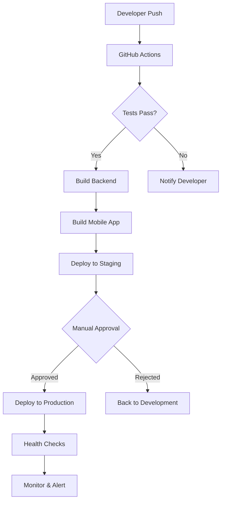

# Overview - Deployment

## Deployment Strategy

AWO Platform follows a modern, cloud-native deployment strategy designed for rapid iteration, high availability, and cost efficiency across the SADC region. Our deployment approach emphasizes simplicity, automation, and scalability to support the platform's growth from MVP to serving millions of African users.

<Info>
Our deployment strategy prioritizes developer velocity, operational simplicity, and cost optimization while maintaining enterprise-grade security and compliance for financial services.
</Info>

## Core Deployment Principles

### 1. Infrastructure as Code
- **Configuration Management**: All infrastructure defined in code
- **Version Control**: Infrastructure changes tracked in Git
- **Reproducible Environments**: Identical environments across dev/staging/production
- **Automated Provisioning**: One-click environment creation

### 2. Cloud-First Architecture
- **Serverless-First**: Utilize serverless technologies where possible
- **Managed Services**: Prefer managed services over self-hosted solutions
- **Auto-Scaling**: Automatic resource scaling based on demand
- **Global Distribution**: CDN and edge locations for SADC users

### 3. Continuous Deployment
- **Automated Pipelines**: CI/CD for all applications and services
- **Zero-Downtime Deployments**: Rolling updates without service interruption
- **Feature Flags**: Gradual feature rollouts and quick rollbacks
- **Environment Parity**: Consistent behavior across all environments

## Deployment Architecture

### High-Level Deployment Flow



### Environment Strategy

<CardGroup cols={3}>
  <Card title="Development" icon="code">
    **Purpose**: Individual developer work  
    **Infrastructure**: Local Docker + Neon branches  
    **Deployment**: Manual/on-demand  
    **Data**: Synthetic test data
  </Card>
  <Card title="Staging" icon="flask">
    **Purpose**: Integration testing & QA  
    **Infrastructure**: Railway/Render staging  
    **Deployment**: Automatic on main branch  
    **Data**: Production-like anonymized data
  </Card>
  <Card title="Production" icon="rocket">
    **Purpose**: Live user traffic  
    **Infrastructure**: Railway/Render production  
    **Deployment**: Manual approval required  
    **Data**: Real user data with full compliance
  </Card>
</CardGroup>

## Technology Stack Deployment

### Backend Deployment (Express.js)

**Primary Platform**: Railway (recommended) / Render (alternative)

**Key Features**:
- **Zero Configuration**: Automatic detection of Node.js applications
- **Git Integration**: Direct deployment from GitHub repositories
- **Environment Variables**: Secure secrets management
- **Automatic SSL**: HTTPS endpoints with custom domains
- **Health Checks**: Built-in application monitoring

**Deployment Triggers**:
- **Staging**: Automatic on push to `main` branch
- **Production**: Manual deployment with approval workflow
- **Hotfixes**: Fast-track deployment for critical fixes

### Mobile App Deployment (React Native + Expo)

**Primary Platform**: Expo Application Services (EAS)

**Build Types**:
<CardGroup cols={3}>
  <Card title="Development Builds" icon="hammer">
    **Purpose**: Local testing with custom native code  
    **Target**: Development team  
    **Distribution**: QR code, Expo Orbit  
    **Frequency**: On-demand
  </Card>
  <Card title="Preview Builds" icon="eye">
    **Purpose**: Internal testing and stakeholder review  
    **Target**: QA team, stakeholders  
    **Distribution**: Internal distribution  
    **Frequency**: Weekly releases
  </Card>
  <Card title="Production Builds" icon="store">
    **Purpose**: App store submission  
    **Target**: End users  
    **Distribution**: Apple App Store, Google Play  
    **Frequency**: Bi-weekly releases
  </Card>
</CardGroup>

### Database Deployment (Neon PostgreSQL)

**Architecture**: Serverless PostgreSQL with global edge locations

**Environment Strategy**:
- **Development**: Individual Neon branches per developer
- **Staging**: Dedicated Neon project with production-like data
- **Production**: High-availability Neon setup with read replicas

**Key Features**:
- **Instant Scaling**: Automatic resource allocation
- **Branching**: Database branches for feature development
- **Point-in-Time Recovery**: 30-day recovery window
- **Global Distribution**: Edge locations across Africa

## Deployment Environments

### Development Environment

**Characteristics**:
- **Local Development**: Docker Compose for local services
- **Database Branching**: Personal Neon branches
- **Hot Reloading**: Instant code updates
- **Debug Mode**: Enhanced logging and debugging tools

**Setup Requirements**:
```bash
# Development environment setup
npm install -g eas-cli railway
git clone https://github.com/awo-platform/awo-core
cd awo-core && npm install
railway login && neonctl auth
```

### Staging Environment

**Characteristics**:
- **Production Parity**: Identical to production configuration
- **Automated Deployment**: Deploy on main branch push
- **Load Testing**: Performance and stress testing
- **Integration Testing**: End-to-end test suite execution

**URL Structure**:
- **Backend API**: `https://api-staging.awo-platform.com`
- **Admin Dashboard**: `https://admin-staging.awo-platform.com`
- **Documentation**: `https://docs-staging.awo-platform.com`

### Production Environment

**Characteristics**:
- **High Availability**: Multi-region deployment
- **Performance Optimized**: CDN, caching, compression
- **Security Hardened**: WAF, DDoS protection, monitoring
- **Compliance Ready**: GDPR/POPIA compliant infrastructure

**URL Structure**:
- **Backend API**: `https://api.awo-platform.com`
- **Admin Dashboard**: `https://admin.awo-platform.com`
- **Documentation**: `https://docs.awo-platform.com`
- **Mobile App**: Available on app stores

## Security & Compliance Deployment

### Security Considerations

**Infrastructure Security**:
<CardGroup cols={2}>
  <Card title="Network Security" icon="shield">
    **VPC Configuration**: Isolated network environments  
    **WAF Protection**: Web Application Firewall  
    **DDoS Mitigation**: Cloudflare protection  
    **SSL/TLS**: End-to-end encryption
  </Card>
  <Card title="Access Control" icon="key">
    **IAM Policies**: Role-based access control  
    **MFA Required**: Multi-factor authentication  
    **Audit Logging**: Comprehensive access logs  
    **Secrets Management**: Encrypted environment variables
  </Card>
</CardGroup>

**Application Security**:
- **Security Headers**: OWASP security headers implementation
- **Rate Limiting**: API abuse prevention
- **Input Validation**: Comprehensive input sanitization
- **Dependency Scanning**: Automated vulnerability scanning

### Compliance Deployment

**GDPR/POPIA Compliance**:
- **Data Residency**: SADC region data storage
- **Encryption**: AES-256 data encryption
- **Audit Trails**: Comprehensive activity logging
- **Data Retention**: Automated data lifecycle management

**Financial Services Compliance**:
- **PCI DSS**: Payment card data security
- **SOX Compliance**: Financial reporting controls
- **Regulatory Reporting**: Automated compliance reporting
- **Incident Response**: Automated security incident handling

## Monitoring & Observability

### Application Performance Monitoring

**Core Metrics**:
<CardGroup cols={3}>
  <Card title="Performance" icon="gauge">
    **Response Time**: API endpoint latency  
    **Throughput**: Requests per second  
    **Error Rate**: 4xx/5xx error percentage  
    **Availability**: System uptime tracking
  </Card>
  <Card title="Infrastructure" icon="server">
    **CPU Usage**: Server resource utilization  
    **Memory Usage**: RAM consumption patterns  
    **Database Performance**: Query execution times  
    **Network Latency**: Cross-region communication
  </Card>
  <Card title="Business" icon="chart-bar">
    **User Activity**: Daily/monthly active users  
    **Transaction Volume**: Payment processing metrics  
    **Feature Usage**: Feature adoption rates  
    **Revenue Metrics**: Business KPI tracking
  </Card>
</CardGroup>

**Monitoring Stack**:
- **Error Tracking**: Sentry for application errors
- **Performance Monitoring**: Sentry performance monitoring
- **Infrastructure Monitoring**: Built-in platform monitoring
- **Log Management**: Centralized logging with Winston
- **Alerting**: Real-time alerts via Slack, email, SMS

### Health Checks & Alerts

**Health Check Strategy**:
```javascript
// Example health check endpoint
app.get('/health', async (req, res) => {
  const checks = {
    database: await checkDatabase(),
    redis: await checkRedis(),
    external_apis: await checkExternalAPIs(),
    timestamp: new Date().toISOString()
  };
  
  const isHealthy = Object.values(checks).every(check => 
    check.status === 'healthy'
  );
  
  res.status(isHealthy ? 200 : 503).json(checks);
});
```

**Alert Thresholds**:
- **Critical**: 5xx errors &gt; 1%, Response time &gt; 5s
- **Warning**: 4xx errors &gt; 5%, Response time &gt; 2s
- **Info**: Deployment events, scaling events

## Disaster Recovery & Business Continuity

### Backup Strategy

**Database Backups**:
- **Automated Backups**: Neon automatic daily backups
- **Point-in-Time Recovery**: 30-day recovery window
- **Cross-Region Backups**: Backup replication to multiple regions
- **Backup Testing**: Monthly backup restoration tests

**Application Backups**:
- **Code Repository**: Git with multiple remotes
- **Configuration**: Infrastructure as Code in version control
- **Static Assets**: CDN with multiple edge locations
- **Secrets**: Encrypted backup of environment variables

### Disaster Recovery Plan

**Recovery Time Objectives (RTO)**:
<CardGroup cols={2}>
  <Card title="Database Recovery" icon="database">
    **Target RTO**: &lt; 2 hours  
    **Method**: Neon point-in-time recovery  
    **Testing**: Monthly DR drills
  </Card>
  <Card title="Application Recovery" icon="refresh">
    **Target RTO**: &lt; 30 minutes  
    **Method**: Automated redeployment  
    **Testing**: Quarterly failover tests
  </Card>
</CardGroup>

**Recovery Procedures**:
1. **Incident Detection**: Automated monitoring alerts
2. **Team Notification**: On-call engineer notification
3. **Impact Assessment**: Evaluate scope and severity
4. **Recovery Execution**: Follow documented procedures
5. **Service Restoration**: Verify full functionality
6. **Post-Incident Review**: Document lessons learned

## Scaling Strategy

### Horizontal Scaling

**Application Scaling**:
- **Auto-Scaling**: Automatic instance scaling based on CPU/memory
- **Load Balancing**: Traffic distribution across instances
- **Database Scaling**: Neon automatic scaling
- **CDN Scaling**: Global edge location expansion

**Geographic Scaling**:
- **SADC Expansion**: Priority markets (SA, Kenya, Nigeria, Ghana)
- **Edge Locations**: Regional CDN presence
- **Data Residency**: Comply with local data protection laws
- **Currency Support**: Multi-currency transaction processing

### Performance Optimization

**Backend Optimization**:
- **Caching Strategy**: Redis for session and computed data
- **Database Optimization**: Query optimization and indexing
- **API Optimization**: Response compression and pagination
- **Asset Optimization**: Static asset compression and CDN

**Mobile Optimization**:
- **Bundle Size**: Code splitting and lazy loading
- **Offline Support**: Local data caching and sync
- **Network Efficiency**: Request batching and optimization
- **Performance Monitoring**: Real-time performance tracking

## Cost Optimization

### Infrastructure Costs

**Cost Management Strategy**:
<CardGroup cols={2}>
  <Card title="Serverless First" icon="cloud">
    **Pay-per-use**: Only pay for actual resource consumption  
    **Auto-scaling**: Automatic resource optimization  
    **No idle costs**: Resources scale to zero when not used
  </Card>
  <Card title="Resource Monitoring" icon="chart-line">
    **Usage Tracking**: Real-time resource utilization monitoring  
    **Cost Alerts**: Automated budget alerts and notifications  
    **Optimization Reports**: Regular cost optimization recommendations
  </Card>
</CardGroup>

**Cost Breakdown**:
- **Database**: Neon serverless PostgreSQL (~$50-200/month)
- **Backend Hosting**: Railway/Render (~$20-100/month)
- **CDN**: Cloudflare (~$20-50/month)
- **Monitoring**: Sentry (~$25-100/month)
- **Mobile Distribution**: EAS (~$25-100/month)

### Cost Optimization Tactics

**Development Phase**:
- **Shared Staging**: Single staging environment for all developers
- **Neon Branching**: Database branches instead of separate instances
- **Auto-Sleep**: Automatic resource hibernation during off-hours

**Production Phase**:
- **Performance Monitoring**: Identify and eliminate resource waste
- **Traffic-Based Scaling**: Scale resources based on actual usage
- **Reserved Instances**: Long-term commitments for predictable workloads

## Deployment Automation

### CI/CD Pipeline Configuration

**GitHub Actions Workflow**:
```yaml
name: Deploy AWO Platform
on:
  push:
    branches: [main]
  pull_request:
    branches: [main]

jobs:
  test:
    runs-on: ubuntu-latest
    steps:
      - uses: actions/checkout@v3
      - name: Setup Node.js
        uses: actions/setup-node@v3
        with:
          node-version: '18'
      - name: Install dependencies
        run: npm ci
      - name: Run tests
        run: npm test
      - name: Run security audit
        run: npm audit

  deploy-staging:
    needs: test
    if: github.ref == 'refs/heads/main'
    runs-on: ubuntu-latest
    steps:
      - name: Deploy to Railway Staging
        run: railway deploy --service staging
      - name: Run health checks
        run: npm run health-check:staging

  deploy-production:
    needs: test
    if: github.event_name == 'workflow_dispatch'
    runs-on: ubuntu-latest
    environment: production
    steps:
      - name: Deploy to Railway Production
        run: railway deploy --service production
      - name: Run health checks
        run: npm run health-check:production
```

### Deployment Scripts

**Automated Deployment**:
- **Pre-deployment Checks**: Dependency updates, security scans
- **Blue-Green Deployment**: Zero-downtime production deployments
- **Health Verification**: Automated post-deployment testing
- **Rollback Capability**: One-click rollback to previous version

**Manual Deployment Steps**:
1. **Code Review**: Peer review of all changes
2. **Staging Verification**: Test in staging environment
3. **Deployment Approval**: Product owner approval
4. **Production Deployment**: Automated deployment execution
5. **Monitoring**: Real-time monitoring post-deployment

## Getting Started

### Quick Deployment Guide

<Steps>
  <Step title="Environment Setup">
    Install required tools: Node.js, Git, Railway CLI, EAS CLI
  </Step>
  <Step title="Repository Setup">
    Clone AWO repositories and configure environment variables
  </Step>
  <Step title="Database Setup">
    Create Neon project and configure database connections
  </Step>
  <Step title="Backend Deployment">
    Deploy Express.js application to Railway staging
  </Step>
  <Step title="Mobile Build">
    Create Expo development build for testing
  </Step>
  <Step title="Production Deployment">
    Deploy to production after staging verification
  </Step>
</Steps>

### Essential Commands

```bash
# Development setup
npm install -g @railway/cli eas-cli
railway login
eas login

# Backend deployment
railway deploy --service awo-backend-staging
railway deploy --service awo-backend-production

# Mobile app deployment
eas build --platform all --profile preview
eas submit --platform all

# Database management
neonctl branches create --name feature/new-feature
neonctl connection-string main

# Monitoring
npm run health-check
npm run performance-test
```

---

*This deployment overview provides the foundation for AWO Platform's production deployment strategy, emphasizing simplicity, automation, and scalability to support rapid growth across the SADC region.*

*Last updated: June 2025*  
*Next review: Dec 2025*