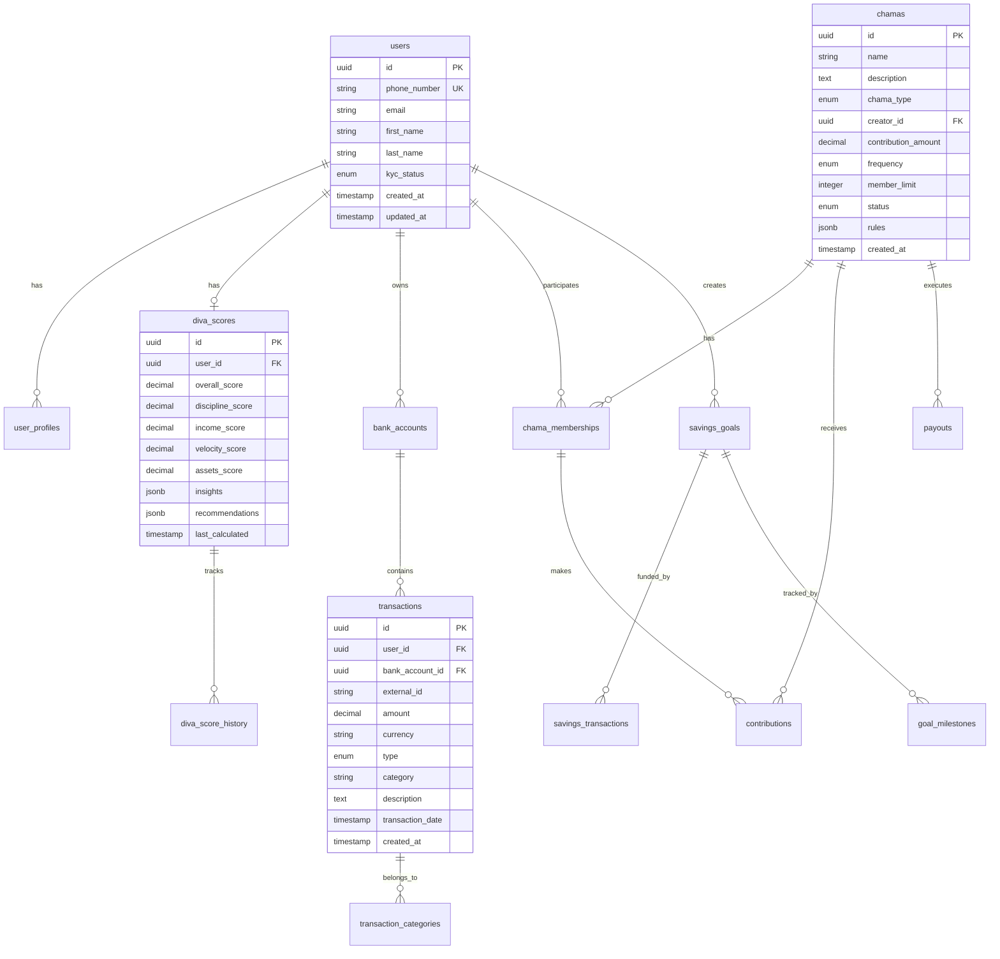
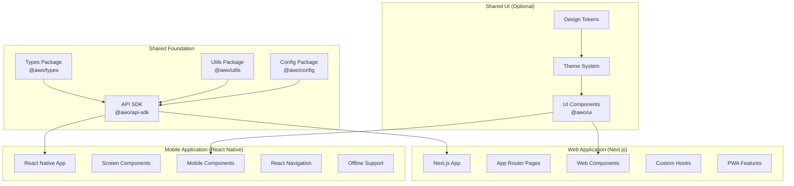
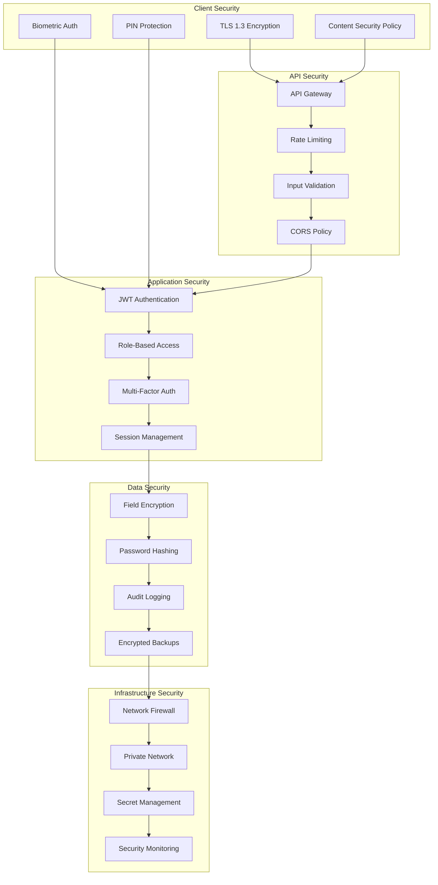
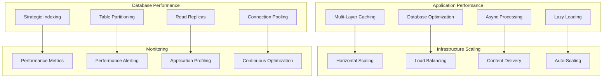
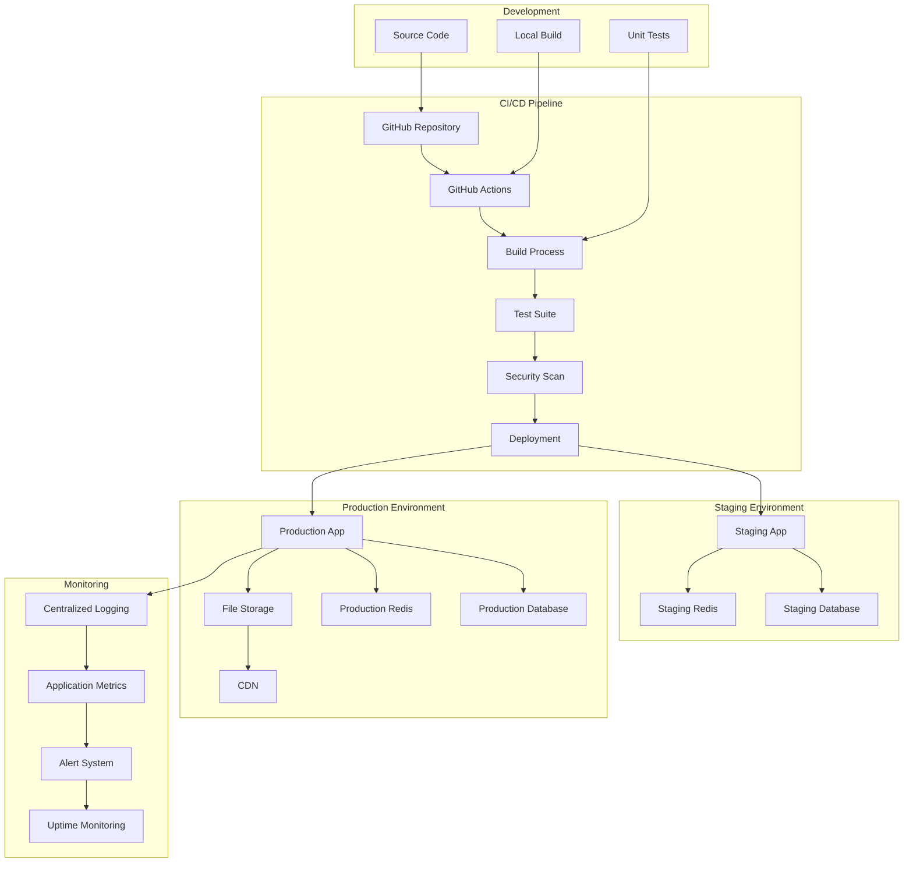

# Architecture Overview

This document provides a comprehensive overview of the AWO platform architecture, covering system design, technical decisions, and implementation patterns optimized for rapid development and efficient scaling.

## Architecture Principles

<CardGroup cols={2}>
  <Card title="Modular Monolith Design" icon="building-blocks">
    Single deployable unit with clear module boundaries for maintainability and evolution
  </Card>
  <Card title="Monorepo Structure" icon="folder-tree">
    Shared codebase with packages for types, utilities, and components across all applications
  </Card>
  <Card title="Progressive Architecture" icon="chart-line">
    Start simple, extract services only when complexity or scale demands it
  </Card>
  <Card title="Financial-First Design" icon="shield-check">
    ACID transactions and data consistency prioritized for financial operations
  </Card>
</CardGroup>

## System Architecture Overview

### High-Level Architecture

```mermaid
graph TB
    subgraph "Clients"
        WEB[Next.js Web App<br/>PWA]
        MOBILE[React Native App<br/>Expo]
        USSD[USSD Interface<br/>Feature Phones]
    end

    subgraph "Shared Packages (Monorepo)"
        TYPES[Shared Types<br/>@awo/types]
        SDK[API SDK Client<br/>@awo/api-sdk]
        UI[UI Components<br/>@awo/ui]
        UTILS[Utilities<br/>@awo/utils]
        CONFIG[Configuration<br/>@awo/config]
    end

    subgraph "AWO Backend (NestJS Monolith)"
        GATEWAY[API Gateway Layer]
        
        subgraph "Core Modules"
            AUTH[Auth Module]
            USERS[Users Module]
            DIVA[DIVA Module]
            CHAMA[Chama Module]
            BANKING[Banking Module]
            PAYMENTS[Payments Module]
            SAVINGS[Savings Module]
            EDUCATION[Education Module]
            NOTIFICATIONS[Notifications Module]
            ANALYTICS[Analytics Module]
        end
        
        subgraph "Shared Services"
            VALIDATION[Validation Service]
            ENCRYPTION[Encryption Service]
            AUDIT[Audit Service]
            QUEUE[Queue Service]
        end
    end

    subgraph "Data Layer"
        PG[(PostgreSQL<br/>Primary Database)]
        REDIS[(Redis<br/>Cache & Sessions)]
        S3[(S3<br/>File Storage)]
    end

    subgraph "External Integrations"
        BANK_API[Banking APIs<br/>Stitch, Mono]
        PAYMENT_API[Payment APIs<br/>Flutterwave, M-Pesa]
        KYC_API[KYC Providers<br/>Smile ID]
        SMS_API[SMS/Email<br/>Twilio, SendGrid]
    end

    subgraph "Infrastructure"
        DOCKER[Docker Containers]
        CI_CD[GitHub Actions<br/>CI/CD]
        MONITORING[Monitoring<br/>Sentry, Prometheus]
        DEPLOYMENT[Deployment<br/>Railway/Render]
    end

    WEB --> SDK
    MOBILE --> SDK
    USSD --> GATEWAY
    
    SDK --> GATEWAY
    SDK --> TYPES
    SDK --> UTILS
    
    GATEWAY --> AUTH
    GATEWAY --> USERS
    GATEWAY --> DIVA
    GATEWAY --> CHAMA
    GATEWAY --> BANKING
    GATEWAY --> PAYMENTS
    GATEWAY --> SAVINGS
    GATEWAY --> EDUCATION
    GATEWAY --> NOTIFICATIONS
    GATEWAY --> ANALYTICS
    
    AUTH --> VALIDATION
    USERS --> ENCRYPTION
    DIVA --> AUDIT
    CHAMA --> QUEUE
    
    AUTH --> PG
    USERS --> PG
    DIVA --> PG
    CHAMA --> PG
    BANKING --> PG
    PAYMENTS --> PG
    SAVINGS --> PG
    EDUCATION --> PG
    NOTIFICATIONS --> REDIS
    ANALYTICS --> PG
    
    VALIDATION --> REDIS
    ENCRYPTION --> REDIS
    QUEUE --> REDIS
    
    USERS --> S3
    EDUCATION --> S3
    
    BANKING --> BANK_API
    PAYMENTS --> PAYMENT_API
    USERS --> KYC_API
    NOTIFICATIONS --> SMS_API
    
    GATEWAY --> DOCKER
    DOCKER --> CI_CD
    CI_CD --> MONITORING
    MONITORING --> DEPLOYMENT
```

### Monorepo Structure

```mermaid
graph TD
    ROOT[awo-platform/]
    
    subgraph "Applications"
        APPS[apps/]
        BACKEND[backend/<br/>NestJS API]
        WEB_APP[web/<br/>Next.js PWA]
        MOBILE_APP[mobile/<br/>React Native]
    end
    
    subgraph "Shared Packages"
        PACKAGES[packages/]
        PKG_TYPES[types/<br/>@awo/types]
        PKG_SDK[api-sdk/<br/>@awo/api-sdk]
        PKG_UI[ui/<br/>@awo/ui]
        PKG_UTILS[utils/<br/>@awo/utils]
        PKG_CONFIG[config/<br/>@awo/config]
    end
    
    subgraph "Development Tools"
        TOOLS[tools/]
        DATABASE[database/<br/>migrations & seeds]
        SCRIPTS[scripts/<br/>build & deploy]
    end
    
    subgraph "Documentation"
        DOCS[docs/]
        API_DOCS[api/<br/>API documentation]
        DEV_DOCS[development/<br/>setup guides]
    end
    
    ROOT --> APPS
    ROOT --> PACKAGES
    ROOT --> TOOLS
    ROOT --> DOCS
    
    APPS --> BACKEND
    APPS --> WEB_APP
    APPS --> MOBILE_APP
    
    PACKAGES --> PKG_TYPES
    PACKAGES --> PKG_SDK
    PACKAGES --> PKG_UI
    PACKAGES --> PKG_UTILS
    PACKAGES --> PKG_CONFIG
    
    TOOLS --> DATABASE
    TOOLS --> SCRIPTS
    
    DOCS --> API_DOCS
    DOCS --> DEV_DOCS
    
    BACKEND --> PKG_TYPES
    WEB_APP --> PKG_SDK
    MOBILE_APP --> PKG_SDK
    PKG_SDK --> PKG_TYPES
    PKG_UI --> PKG_TYPES
```

## Modular Monolith Architecture

### Module Structure & Dependencies

<Tabs>
  <Tab title="Core Modules">
    ```mermaid
    graph TD
        subgraph "Authentication Layer"
            AUTH[Auth Module]
            AUTH_GUARD[Auth Guards]
            JWT[JWT Service]
        end
        
        subgraph "User Management"
            USERS[Users Module]
            PROFILE[Profile Service]
            KYC[KYC Service]
            PREFERENCES[Preferences Service]
        end
        
        subgraph "Financial Core"
            DIVA[DIVA Module]
            SCORE_ENGINE[Score Engine]
            INSIGHTS[Insights Service]
            RECOMMENDATIONS[Recommendations Service]
        end
        
        subgraph "Banking Integration"
            BANKING[Banking Module]
            ACCOUNT_LINKING[Account Linking]
            TRANSACTION_SYNC[Transaction Sync]
            CATEGORIZATION[Transaction Categorization]
        end
        
        subgraph "Community Features"
            CHAMA[Chama Module]
            GROUP_MGMT[Group Management]
            CONTRIBUTIONS[Contributions Service]
            PAYOUTS[Payouts Service]
            VOTING[Voting Service]
        end
        
        AUTH --> USERS
        USERS --> DIVA
        USERS --> BANKING
        USERS --> CHAMA
        BANKING --> DIVA
        CHAMA --> DIVA
    ```

    **Module Characteristics:**
    - **Single Responsibility**: Each module handles a specific domain
    - **Clear Interfaces**: Well-defined service contracts
    - **Dependency Injection**: NestJS container management
    - **Event-Driven**: Internal events for loose coupling
    - **Testable**: Isolated testing with mocks
  </Tab>
  <Tab title="Service Layer">
    ```typescript
    // Module structure example
    export interface ChamaServiceInterface {
      // Core operations
      createChama(data: CreateChamaDto): Promise<Chama>;
      joinChama(chamaId: string, userId: string): Promise<ChamaMembership>;
      makeContribution(data: ContributionDto): Promise<Contribution>;
      
      // Query operations
      getChamaById(id: string): Promise<Chama>;
      getUserChamas(userId: string): Promise<Chama[]>;
      getChamaContributions(chamaId: string): Promise<Contribution[]>;
      
      // Business operations
      calculateNextPayout(chamaId: string): Promise<PayoutCalculation>;
      processScheduledPayouts(): Promise<PayoutResult[]>;
      updateChamaSettings(id: string, settings: ChamaSettings): Promise<Chama>;
    }

    // Module implementation
    @Module({
      imports: [
        TypeOrmModule.forFeature([
          ChamaEntity,
          ChamaMembershipEntity,
          ContributionEntity,
          PayoutEntity
        ]),
        NotificationsModule,
        PaymentsModule,
      ],
      providers: [
        ChamaService,
        ContributionService,
        PayoutService,
        ChamaValidationService,
        {
          provide: 'CHAMA_SERVICE',
          useClass: ChamaService,
        },
      ],
      controllers: [ChamaController],
      exports: ['CHAMA_SERVICE'],
    })
    export class ChamaModule {}
    ```

    **Service Patterns:**
    - **Repository Pattern**: Data access abstraction
    - **Factory Pattern**: Complex object creation
    - **Strategy Pattern**: Algorithm selection (payment methods)
    - **Observer Pattern**: Event handling
    - **Command Pattern**: Operation encapsulation
  </Tab>
  <Tab title="Data Access">
    ```typescript
    // Database schema organization
    export const DATABASE_SCHEMAS = {
      users: 'users',
      financial: 'financial', 
      chamas: 'chamas',
      transactions: 'transactions',
      education: 'education',
      notifications: 'notifications',
      audit: 'audit'
    } as const;

    // Entity definitions with schema separation
    @Entity('users', { schema: DATABASE_SCHEMAS.users })
    export class UserEntity {
      @PrimaryGeneratedColumn('uuid')
      id: string;

      @Column({ unique: true })
      phoneNumber: string;

      @Column({ nullable: true })
      email: string;

      @CreateDateColumn()
      createdAt: Date;

      @UpdateDateColumn()
      updatedAt: Date;

      // Relationships
      @OneToOne(() => DivaScoreEntity, score => score.user)
      divaScore: DivaScoreEntity;

      @OneToMany(() => ChamaMembershipEntity, membership => membership.user)
      chamaMemeberships: ChamaMembershipEntity[];
    }

    @Entity('diva_scores', { schema: DATABASE_SCHEMAS.financial })
    export class DivaScoreEntity {
      @PrimaryGeneratedColumn('uuid')
      id: string;

      @Column('uuid')
      userId: string;

      @Column('decimal', { precision: 5, scale: 2 })
      overallScore: number;

      @Column('decimal', { precision: 5, scale: 2 })
      disciplineScore: number;

      @Column('decimal', { precision: 5, scale: 2 })
      incomeScore: number;

      @Column('decimal', { precision: 5, scale: 2 })
      velocityScore: number;

      @Column('decimal', { precision: 5, scale: 2 })
      assetsScore: number;

      @Column('jsonb')
      insights: DivaInsight[];

      @Column('jsonb')
      recommendations: DivaRecommendation[];

      @UpdateDateColumn()
      lastCalculated: Date;

      // Relationships
      @OneToOne(() => UserEntity, user => user.divaScore)
      @JoinColumn()
      user: UserEntity;
    }
    ```
  </Tab>
</Tabs>

## Database Architecture

### Schema Design



### Database Configuration

<Tabs>
  <Tab title="Schema Organization">
    ```sql
    -- Create schemas for logical separation
    CREATE SCHEMA users;
    CREATE SCHEMA financial;
    CREATE SCHEMA chamas;
    CREATE SCHEMA transactions;
    CREATE SCHEMA education;
    CREATE SCHEMA notifications;
    CREATE SCHEMA audit;

    -- Grant permissions
    GRANT USAGE ON SCHEMA users TO awo_app;
    GRANT USAGE ON SCHEMA financial TO awo_app;
    GRANT USAGE ON SCHEMA chamas TO awo_app;
    GRANT USAGE ON SCHEMA transactions TO awo_app;
    GRANT USAGE ON SCHEMA education TO awo_app;
    GRANT USAGE ON SCHEMA notifications TO awo_app;
    GRANT USAGE ON SCHEMA audit TO awo_app;

    -- Create tables with proper schema assignment
    CREATE TABLE users.users (
        id UUID PRIMARY KEY DEFAULT gen_random_uuid(),
        phone_number VARCHAR(20) UNIQUE NOT NULL,
        email VARCHAR(255) UNIQUE,
        first_name VARCHAR(100) NOT NULL,
        last_name VARCHAR(100) NOT NULL,
        date_of_birth DATE,
        gender CHAR(1) CHECK (gender IN ('M', 'F', 'O')),
        country CHAR(2) NOT NULL,
        city VARCHAR(100),
        kyc_status VARCHAR(20) DEFAULT 'PENDING',
        kyc_level INTEGER DEFAULT 1,
        created_at TIMESTAMP DEFAULT CURRENT_TIMESTAMP,
        updated_at TIMESTAMP DEFAULT CURRENT_TIMESTAMP
    );

    CREATE TABLE financial.diva_scores (
        id UUID PRIMARY KEY DEFAULT gen_random_uuid(),
        user_id UUID NOT NULL REFERENCES users.users(id),
        overall_score DECIMAL(5,2) NOT NULL DEFAULT 0,
        discipline_score DECIMAL(5,2) NOT NULL DEFAULT 0,
        income_score DECIMAL(5,2) NOT NULL DEFAULT 0,
        velocity_score DECIMAL(5,2) NOT NULL DEFAULT 0,
        assets_score DECIMAL(5,2) NOT NULL DEFAULT 0,
        insights JSONB DEFAULT '[]',
        recommendations JSONB DEFAULT '[]',
        last_calculated TIMESTAMP DEFAULT CURRENT_TIMESTAMP,
        created_at TIMESTAMP DEFAULT CURRENT_TIMESTAMP,
        updated_at TIMESTAMP DEFAULT CURRENT_TIMESTAMP
    );
    ```
  </Tab>
  <Tab title="Indexing Strategy">
    ```sql
    -- User-focused indexes
    CREATE INDEX idx_users_phone ON users.users(phone_number);
    CREATE INDEX idx_users_email ON users.users(email) WHERE email IS NOT NULL;
    CREATE INDEX idx_users_country_city ON users.users(country, city);
    CREATE INDEX idx_users_kyc_status ON users.users(kyc_status);

    -- Transaction indexes for DIVA calculations
    CREATE INDEX idx_transactions_user_date ON transactions.transactions(user_id, transaction_date DESC);
    CREATE INDEX idx_transactions_category ON transactions.transactions(category) WHERE category IS NOT NULL;
    CREATE INDEX idx_transactions_amount_range ON transactions.transactions(user_id, amount) WHERE amount > 0;

    -- Chama-related indexes
    CREATE INDEX idx_chama_memberships_user ON chamas.chama_memberships(user_id);
    CREATE INDEX idx_chama_memberships_chama ON chamas.chama_memberships(chama_id);
    CREATE INDEX idx_contributions_chama_date ON chamas.contributions(chama_id, created_at DESC);
    CREATE INDEX idx_contributions_user_status ON chamas.contributions(user_id, status);

    -- DIVA score indexes
    CREATE INDEX idx_diva_scores_user ON financial.diva_scores(user_id);
    CREATE INDEX idx_diva_scores_overall ON financial.diva_scores(overall_score DESC);
    CREATE INDEX idx_diva_scores_last_calc ON financial.diva_scores(last_calculated);

    -- Composite indexes for common queries
    CREATE INDEX idx_user_chama_active ON chamas.chama_memberships(user_id, status) WHERE status = 'ACTIVE';
    CREATE INDEX idx_transaction_categorization ON transactions.transactions(user_id, category, transaction_date) WHERE category IS NOT NULL;
    ```
  </Tab>
  <Tab title="Performance Optimization">
    ```sql
    -- Partitioning for large tables
    CREATE TABLE transactions.transactions (
        id UUID NOT NULL,
        user_id UUID NOT NULL,
        transaction_date DATE NOT NULL,
        amount DECIMAL(15,2) NOT NULL,
        -- other columns...
        PRIMARY KEY (id, transaction_date)
    ) PARTITION BY RANGE (transaction_date);

    -- Create monthly partitions
    CREATE TABLE transactions.transactions_2025_01 PARTITION OF transactions.transactions
        FOR VALUES FROM ('2025-01-01') TO ('2025-02-01');
    CREATE TABLE transactions.transactions_2025_02 PARTITION OF transactions.transactions
        FOR VALUES FROM ('2025-02-01') TO ('2025-03-01');
    CREATE TABLE transactions.transactions_2025_03 PARTITION OF transactions.transactions
        FOR VALUES FROM ('2025-03-01') TO ('2025-04-01');

    -- Materialized views for analytics
    CREATE MATERIALIZED VIEW financial.user_financial_summary AS
    SELECT 
        u.id as user_id,
        u.country,
        ds.overall_score,
        COUNT(t.id) as transaction_count,
        SUM(CASE WHEN t.amount > 0 THEN t.amount ELSE 0 END) as total_income,
        SUM(CASE WHEN t.amount < 0 THEN ABS(t.amount) ELSE 0 END) as total_expenses,
        COUNT(DISTINCT cm.chama_id) as active_chamas
    FROM users.users u
    LEFT JOIN financial.diva_scores ds ON u.id = ds.user_id
    LEFT JOIN transactions.transactions t ON u.id = t.user_id 
        AND t.transaction_date >= CURRENT_DATE - INTERVAL '30 days'
    LEFT JOIN chamas.chama_memberships cm ON u.id = cm.user_id 
        AND cm.status = 'ACTIVE'
    GROUP BY u.id, u.country, ds.overall_score;

    -- Create refresh function
    CREATE OR REPLACE FUNCTION refresh_financial_summary()
    RETURNS void AS $$
    BEGIN
        REFRESH MATERIALIZED VIEW CONCURRENTLY financial.user_financial_summary;
    END;
    $$ LANGUAGE plpgsql;

    -- Schedule refresh (requires pg_cron extension)
    SELECT cron.schedule('refresh-financial-summary', '0 2 * * *', 'SELECT refresh_financial_summary();');
    ```
  </Tab>
</Tabs>

## Technology Stack

### Backend Technology Choices

<Tabs>
  <Tab title="Core Framework">
    ```typescript
    // NestJS application structure
    @Module({
      imports: [
        // Configuration
        ConfigModule.forRoot({
          isGlobal: true,
          validationSchema: Joi.object({
            NODE_ENV: Joi.string().valid('development', 'staging', 'production').default('development'),
            PORT: Joi.number().default(3000),
            DATABASE_URL: Joi.string().required(),
            REDIS_URL: Joi.string().required(),
            JWT_SECRET: Joi.string().required(),
          }),
        }),
        
        // Database
        TypeOrmModule.forRootAsync({
          useFactory: (configService: ConfigService) => ({
            type: 'postgres',
            url: configService.get('DATABASE_URL'),
            autoLoadEntities: true,
            synchronize: configService.get('NODE_ENV') === 'development',
            logging: configService.get('NODE_ENV') === 'development',
            migrations: ['dist/migrations/*.js'],
            migrationsRun: true,
          }),
          inject: [ConfigService],
        }),
        
        // Caching
        CacheModule.registerAsync({
          useFactory: (configService: ConfigService) => ({
            store: redisStore,
            socket: {
              host: configService.get('REDIS_HOST'),
              port: configService.get('REDIS_PORT'),
            },
            ttl: 300, // 5 minutes default
          }),
          inject: [ConfigService],
        }),
        
        // Core modules
        AuthModule,
        UsersModule,
        DivaModule,
        ChamaModule,
        BankingModule,
        PaymentsModule,
        SavingsModule,
        EducationModule,
        NotificationsModule,
        AnalyticsModule,
      ],
      providers: [
        // Global services
        ValidationService,
        EncryptionService,
        AuditService,
        QueueService,
        
        // Global guards
        {
          provide: APP_GUARD,
          useClass: JwtAuthGuard,
        },
        {
          provide: APP_GUARD,
          useClass: RolesGuard,
        },
        
        // Global interceptors
        {
          provide: APP_INTERCEPTOR,
          useClass: LoggingInterceptor,
        },
        {
          provide: APP_INTERCEPTOR,
          useClass: TransformInterceptor,
        },
        
        // Global pipes
        {
          provide: APP_PIPE,
          useClass: ValidationPipe,
        },
      ],
    })
    export class AppModule {}
    ```

    **Key Features:**
    - **Dependency Injection**: Built-in IoC container
    - **Decorators**: Metadata-driven development
    - **Modular Architecture**: Clean separation of concerns
    - **TypeScript First**: Full TypeScript support
    - **Enterprise Ready**: Guards, interceptors, pipes, filters
  </Tab>
  <Tab title="Database Integration">
    ```typescript
    // TypeORM configuration with multiple schemas
    import { TypeOrmModuleOptions } from '@nestjs/typeorm';

    export const typeOrmConfig: TypeOrmModuleOptions = {
      type: 'postgres',
      host: process.env.DB_HOST,
      port: parseInt(process.env.DB_PORT, 10),
      username: process.env.DB_USERNAME,
      password: process.env.DB_PASSWORD,
      database: process.env.DB_DATABASE,
      
      // Entity management
      entities: [
        // Users schema
        UserEntity,
        UserProfileEntity,
        
        // Financial schema
        DivaScoreEntity,
        DivaScoreHistoryEntity,
        BankAccountEntity,
        
        // Chamas schema
        ChamaEntity,
        ChamaMembershipEntity,
        ContributionEntity,
        PayoutEntity,
        
        // Transactions schema
        TransactionEntity,
        TransactionCategoryEntity,
        
        // Education schema
        CourseEntity,
        LessonEntity,
        UserProgressEntity,
      ],
      
      // Migration settings
      migrations: ['dist/migrations/*.js'],
      migrationsTableName: 'typeorm_migrations',
      migrationsRun: process.env.NODE_ENV === 'production',
      
      // Development settings
      synchronize: process.env.NODE_ENV === 'development',
      logging: process.env.NODE_ENV === 'development' ? 'all' : ['error'],
      
      // Performance settings
      extra: {
        connectionLimit: 10,
        acquireTimeout: 60000,
        timeout: 60000,
      },
      
      // Schema separation
      schema: process.env.DB_SCHEMA || 'public',
    };

    // Repository pattern implementation
    @Injectable()
    export class ChamaRepository {
      constructor(
        @InjectRepository(ChamaEntity)
        private chamaRepo: Repository<ChamaEntity>,
        
        @InjectRepository(ChamaMembershipEntity)
        private membershipRepo: Repository<ChamaMembershipEntity>,
      ) {}

      async findUserChamas(userId: string): Promise<Chama[]> {
        return this.chamaRepo
          .createQueryBuilder('chama')
          .innerJoin('chama.memberships', 'membership')
          .where('membership.userId = :userId', { userId })
          .andWhere('membership.status = :status', { status: 'ACTIVE' })
          .orderBy('chama.createdAt', 'DESC')
          .getMany();
      }

      async createChama(data: CreateChamaDto, creatorId: string): Promise<Chama> {
        return this.chamaRepo.manager.transaction(async manager => {
          // Create chama
          const chama = manager.create(ChamaEntity, {
            ...data,
            creatorId,
            status: 'FORMING',
          });
          await manager.save(chama);

          // Add creator as admin member
          const membership = manager.create(ChamaMembershipEntity, {
            chamaId: chama.id,
            userId: creatorId,
            role: 'ADMIN',
            status: 'ACTIVE',
            joinedAt: new Date(),
          });
          await manager.save(membership);

          return chama;
        });
      }
    }
    ```
  </Tab>
  <Tab title="Caching Strategy">
    ```typescript
    // Redis caching implementation
    @Injectable()
    export class CacheService {
      constructor(
        @Inject(CACHE_MANAGER)
        private cacheManager: Cache,
      ) {}

      // Generic cache methods
      async get<T>(key: string): Promise<T | null> {
        return this.cacheManager.get<T>(key);
      }

      async set<T>(key: string, value: T, ttl?: number): Promise<void> {
        await this.cacheManager.set(key, value, ttl);
      }

      async del(key: string): Promise<void> {
        await this.cacheManager.del(key);
      }

      async invalidatePattern(pattern: string): Promise<void> {
        const keys = await this.cacheManager.store.keys(pattern);
        if (keys.length > 0) {
          await Promise.all(keys.map(key => this.del(key)));
        }
      }

      // Domain-specific cache methods
      async getCachedDivaScore(userId: string): Promise<DivaScore | null> {
        return this.get<DivaScore>(`diva:score:${userId}`);
      }

      async setCachedDivaScore(userId: string, score: DivaScore, ttl = 3600): Promise<void> {
        await this.set(`diva:score:${userId}`, score, ttl);
      }

      async invalidateUserCache(userId: string): Promise<void> {
        await this.invalidatePattern(`*:${userId}:*`);
        await this.invalidatePattern(`*:user:${userId}`);
      }

      async getCachedUserChamas(userId: string): Promise<Chama[] | null> {
        return this.get<Chama[]>(`user:${userId}:chamas`);
      }

      async setCachedUserChamas(userId: string, chamas: Chama[], ttl = 1800): Promise<void> {
        await this.set(`user:${userId}:chamas`, chamas, ttl);
      }
    }

    // Cache decorator for automatic caching
    export function Cacheable(keyGenerator: (args: any[]) => string, ttl = 300) {
      return function (target: any, propertyKey: string, descriptor: PropertyDescriptor) {
        const originalMethod = descriptor.value;

        descriptor.value = async function (...args: any[]) {
          const cacheService: CacheService = this.cacheService;
          const cacheKey = keyGenerator(args);

          // Try to get from cache
          const cached = await cacheService.get(cacheKey);
          if (cached) {
            return cached;
          }

          // Execute original method
          const result = await originalMethod.apply(this, args);

          // Cache the result
          await cacheService.set(cacheKey, result, ttl);

          return result;
        };

        return descriptor;
      };
    }

    // Usage example
    @Injectable()
    export class DivaService {
      constructor(private cacheService: CacheService) {}

      @Cacheable((args) => `diva:score:${args[0]}`, 3600)
      async calculateDivaScore(userId: string): Promise<DivaScore> {
        // Expensive calculation here
        return this.performDivaCalculation(userId);
      }
    }
    ```
  </Tab>
</Tabs>

## Frontend Architecture

### Multi-Platform Strategy



### Frontend Technology Stack

<Tabs>
  <Tab title="Web Application (Next.js)">
    ```typescript
    // Next.js app structure with App Router
    // app/layout.tsx
    import { Providers } from './providers';
    import { Inter } from 'next/font/google';
    import './globals.css';

    const inter = Inter({ subsets: ['latin'] });

    export default function RootLayout({
      children,
    }: {
      children: React.ReactNode;
    }) {
      return (
        <html lang="en">
          <body className={inter.className}>
            <Providers>
              {children}
            </Providers>
          </body>
        </html>
      );
    }

    // app/providers.tsx
    'use client';
    import { QueryClient, QueryClientProvider } from '@tanstack/react-query';
    import { ThemeProvider } from '@mui/material/styles';
    import { CssBaseline } from '@mui/material';
    import { theme } from '@awo/config';
    import { APIProvider } from '@awo/api-sdk';

    const queryClient = new QueryClient({
      defaultOptions: {
        queries: {
          staleTime: 5 * 60 * 1000, // 5 minutes
          refetchOnWindowFocus: false,
        },
      },
    });

    export function Providers({ children }: { children: React.ReactNode }) {
      return (
        <QueryClientProvider client={queryClient}>
          <ThemeProvider theme={theme}>
            <CssBaseline />
            <APIProvider baseURL="/api">
              {children}
            </APIProvider>
          </ThemeProvider>
        </QueryClientProvider>
      );
    }

    // Example dashboard page
    // app/dashboard/page.tsx
    import { DashboardView } from '@/components/dashboard/DashboardView';
    import { auth } from '@/lib/auth';
    import { redirect } from 'next/navigation';

    export default async function DashboardPage() {
      const user = await auth();
      
      if (!user) {
        redirect('/login');
      }

      return <DashboardView user={user} />;
    }

    // PWA configuration
    // next.config.js
    const withPWA = require('next-pwa')({
      dest: 'public',
      disable: process.env.NODE_ENV === 'development',
      register: true,
      skipWaiting: true,
    });

    module.exports = withPWA({
      experimental: {
        appDir: true,
      },
      images: {
        domains: ['awo-platform.s3.amazonaws.com'],
      },
    });
    ```

    **Key Features:**
    - **App Router**: Latest Next.js routing system
    - **Server Components**: Improved performance
    - **Progressive Web App**: Offline support
    - **TypeScript**: Full type safety
    - **Material-UI**: Consistent design system
  </Tab>
  <Tab title="Mobile Application (React Native)">
    ```typescript
    // React Native app structure
    // App.tsx
    import React from 'react';
    import { NavigationContainer } from '@react-navigation/native';
    import { QueryClient, QueryClientProvider } from '@tanstack/react-query';
    import { AuthProvider } from '@/contexts/AuthContext';
    import { ThemeProvider } from '@/contexts/ThemeContext';
    import { RootNavigator } from '@/navigation/RootNavigator';
    import { StatusBar } from 'expo-status-bar';

    const queryClient = new QueryClient({
      defaultOptions: {
        queries: {
          staleTime: 5 * 60 * 1000,
          retry: 2,
        },
      },
    });

    export default function App() {
      return (
        <QueryClientProvider client={queryClient}>
          <ThemeProvider>
            <AuthProvider>
              <NavigationContainer>
                <RootNavigator />
                <StatusBar style="auto" />
              </NavigationContainer>
            </AuthProvider>
          </ThemeProvider>
        </QueryClientProvider>
      );
    }

    // Navigation structure
    // navigation/RootNavigator.tsx
    import { createNativeStackNavigator } from '@react-navigation/native-stack';
    import { createBottomTabNavigator } from '@react-navigation/bottom-tabs';
    import { useAuth } from '@/hooks/useAuth';
    import { AuthStackNavigator } from './AuthStackNavigator';
    import { MainTabNavigator } from './MainTabNavigator';

    const Stack = createNativeStackNavigator();

    export function RootNavigator() {
      const { user, isLoading } = useAuth();

      if (isLoading) {
        return <LoadingScreen />;
      }

      return (
        <Stack.Navigator screenOptions={{ headerShown: false }}>
          {user ? (
            <Stack.Screen name="Main" component={MainTabNavigator} />
          ) : (
            <Stack.Screen name="Auth" component={AuthStackNavigator} />
          )}
        </Stack.Navigator>
      );
    }

    // Main tab navigation
    // navigation/MainTabNavigator.tsx
    import { createBottomTabNavigator } from '@react-navigation/bottom-tabs';
    import { DashboardScreen } from '@/screens/DashboardScreen';
    import { ChamasScreen } from '@/screens/ChamasScreen';
    import { SavingsScreen } from '@/screens/SavingsScreen';
    import { ProfileScreen } from '@/screens/ProfileScreen';
    import { TabBarIcon } from '@/components/navigation/TabBarIcon';

    const Tab = createBottomTabNavigator();

    export function MainTabNavigator() {
      return (
        <Tab.Navigator
          screenOptions={{
            tabBarActiveTintColor: '#E63946',
            tabBarInactiveTintColor: '#6B7280',
            headerShown: false,
          }}
        >
          <Tab.Screen
            name="Dashboard"
            component={DashboardScreen}
            options={{
              tabBarIcon: ({ color, size }) => (
                <TabBarIcon name="home" color={color} size={size} />
              ),
            }}
          />
          <Tab.Screen
            name="Chamas"
            component={ChamasScreen}
            options={{
              tabBarIcon: ({ color, size }) => (
                <TabBarIcon name="group" color={color} size={size} />
              ),
            }}
          />
          <Tab.Screen
            name="Savings"
            component={SavingsScreen}
            options={{
              tabBarIcon: ({ color, size }) => (
                <TabBarIcon name="savings" color={color} size={size} />
              ),
            }}
          />
          <Tab.Screen
            name="Profile"
            component={ProfileScreen}
            options={{
              tabBarIcon: ({ color, size }) => (
                <TabBarIcon name="person" color={color} size={size} />
              ),
            }}
          />
        </Tab.Navigator>
      );
    }

    // Offline support
    // hooks/useOfflineSync.ts
    import { useEffect } from 'react';
    import { useNetInfo } from '@react-native-async-storage/async-storage';
    import { useQueryClient } from '@tanstack/react-query';
    import { syncOfflineData } from '@/services/offlineSync';

    export function useOfflineSync() {
      const netInfo = useNetInfo();
      const queryClient = useQueryClient();

      useEffect(() => {
        if (netInfo.isConnected && netInfo.isInternetReachable) {
          // Sync offline data when connection is restored
          syncOfflineData(queryClient);
        }
      }, [netInfo.isConnected, netInfo.isInternetReachable, queryClient]);

      return {
        isOnline: netInfo.isConnected && netInfo.isInternetReachable,
        isOffline: !netInfo.isConnected || !netInfo.isInternetReachable,
      };
    }
    ```

    **Key Features:**
    - **Expo**: Simplified React Native development
    - **React Navigation**: Native navigation patterns
    - **Offline Support**: Data synchronization
    - **Push Notifications**: Expo notifications
    - **OTA Updates**: Instant app updates
  </Tab>
  <Tab title="Shared Packages">
    ```typescript
    // packages/api-sdk/src/client.ts
    import axios, { AxiosInstance, AxiosRequestConfig } from 'axios';
    import { CreateAuthTokenRequest, User } from '@awo/types';

    export class AWOAPIClient {
      private client: AxiosInstance;
      private token: string | null = null;

      constructor(baseURL: string) {
        this.client = axios.create({
          baseURL,
          timeout: 10000,
          headers: {
            'Content-Type': 'application/json',
          },
        });

        this.setupInterceptors();
      }

      private setupInterceptors() {
        // Request interceptor for auth token
        this.client.interceptors.request.use((config) => {
          if (this.token) {
            config.headers.Authorization = `Bearer ${this.token}`;
          }
          return config;
        });

        // Response interceptor for error handling
        this.client.interceptors.response.use(
          (response) => response,
          (error) => {
            if (error.response?.status === 401) {
              this.token = null;
              // Redirect to login or refresh token
            }
            return Promise.reject(error);
          }
        );
      }

      setAuthToken(token: string) {
        this.token = token;
      }

      // Auth methods
      async login(data: CreateAuthTokenRequest) {
        const response = await this.client.post('/auth/login', data);
        this.setAuthToken(response.data.accessToken);
        return response.data;
      }

      async getProfile(): Promise<User> {
        const response = await this.client.get('/users/profile');
        return response.data;
      }

      // DIVA methods
      async getDivaScore(userId: string) {
        const response = await this.client.get(`/diva/users/${userId}/score`);
        return response.data;
      }

      // Chama methods
      async getUserChamas(userId: string) {
        const response = await this.client.get(`/chamas/users/${userId}`);
        return response.data;
      }

      async createChama(data: CreateChamaRequest) {
        const response = await this.client.post('/chamas', data);
        return response.data;
      }
    }

    // packages/types/src/user.ts
    export interface User {
      id: string;
      phoneNumber: string;
      email?: string;
      firstName: string;
      lastName: string;
      dateOfBirth?: Date;
      gender?: 'M' | 'F' | 'O';
      country: string;
      city?: string;
      kycStatus: KYCStatus;
      kycLevel: number;
      createdAt: Date;
      updatedAt: Date;
    }

    export type KYCStatus = 'PENDING' | 'VERIFIED' | 'REJECTED' | 'EXPIRED';

    export interface CreateUserRequest {
      phoneNumber: string;
      firstName: string;
      lastName: string;
      country: string;
      email?: string;
      dateOfBirth?: Date;
      gender?: 'M' | 'F' | 'O';
    }

    // packages/utils/src/validation.ts
    import { z } from 'zod';

    export const phoneNumberSchema = z.string().regex(
      /^\+[1-9]\d{1,14}$/,
      'Invalid phone number format'
    );

    export const emailSchema = z.string().email('Invalid email format');

    export const nameSchema = z.string()
      .min(2, 'Name must be at least 2 characters')
      .max(50, 'Name must not exceed 50 characters')
      .regex(/^[a-zA-Z\s'-]+$/, 'Name contains invalid characters');

    export const createUserSchema = z.object({
      phoneNumber: phoneNumberSchema,
      firstName: nameSchema,
      lastName: nameSchema,
      email: emailSchema.optional(),
      country: z.string().length(2, 'Country must be a 2-letter ISO code'),
      dateOfBirth: z.date().optional(),
      gender: z.enum(['M', 'F', 'O']).optional(),
    });

    export type CreateUserData = z.infer<typeof createUserSchema>;
    ```
  </Tab>
</Tabs>

## Security Architecture

### Multi-Layer Security



### Security Implementation

<Tabs>
  <Tab title="Authentication & Authorization">
    ```typescript
    // JWT authentication strategy
    @Injectable()
    export class JwtStrategy extends PassportStrategy(Strategy) {
      constructor(private configService: ConfigService) {
        super({
          jwtFromRequest: ExtractJwt.fromAuthHeaderAsBearerToken(),
          ignoreExpiration: false,
          secretOrKey: configService.get('JWT_SECRET'),
        });
      }

      async validate(payload: JwtPayload): Promise<User> {
        const user = await this.userService.findById(payload.sub);
        if (!user || user.status !== 'ACTIVE') {
          throw new UnauthorizedException('User not found or inactive');
        }
        return user;
      }
    }

    // Role-based access control
    export enum UserRole {
      USER = 'USER',
      CHAMA_ADMIN = 'CHAMA_ADMIN',
      SUPPORT_AGENT = 'SUPPORT_AGENT',
      ADMIN = 'ADMIN',
    }

    export enum Permission {
      // User permissions
      READ_OWN_PROFILE = 'READ_OWN_PROFILE',
      UPDATE_OWN_PROFILE = 'UPDATE_OWN_PROFILE',
      
      // Chama permissions
      CREATE_CHAMA = 'CREATE_CHAMA',
      MANAGE_CHAMA_MEMBERS = 'MANAGE_CHAMA_MEMBERS',
      PROCESS_CHAMA_PAYOUTS = 'PROCESS_CHAMA_PAYOUTS',
      
      // Financial permissions
      VIEW_FINANCIAL_DATA = 'VIEW_FINANCIAL_DATA',
      PROCESS_PAYMENTS = 'PROCESS_PAYMENTS',
      
      // Admin permissions
      MANAGE_USERS = 'MANAGE_USERS',
      VIEW_SYSTEM_METRICS = 'VIEW_SYSTEM_METRICS',
    }

    const ROLE_PERMISSIONS: Record<UserRole, Permission[]> = {
      [UserRole.USER]: [
        Permission.READ_OWN_PROFILE,
        Permission.UPDATE_OWN_PROFILE,
        Permission.CREATE_CHAMA,
        Permission.VIEW_FINANCIAL_DATA,
      ],
      [UserRole.CHAMA_ADMIN]: [
        ...ROLE_PERMISSIONS[UserRole.USER],
        Permission.MANAGE_CHAMA_MEMBERS,
        Permission.PROCESS_CHAMA_PAYOUTS,
      ],
      [UserRole.SUPPORT_AGENT]: [
        Permission.READ_OWN_PROFILE,
        Permission.VIEW_FINANCIAL_DATA,
        Permission.MANAGE_USERS,
      ],
      [UserRole.ADMIN]: Object.values(Permission),
    };

    // Authorization guard
    @Injectable()
    export class PermissionsGuard implements CanActivate {
      constructor(private reflector: Reflector) {}

      canActivate(context: ExecutionContext): boolean {
        const requiredPermissions = this.reflector.getAllAndOverride<Permission[]>(
          'permissions',
          [context.getHandler(), context.getClass()]
        );

        if (!requiredPermissions) {
          return true;
        }

        const request = context.switchToHttp().getRequest();
        const user = request.user;

        if (!user) {
          return false;
        }

        const userPermissions = ROLE_PERMISSIONS[user.role] || [];
        return requiredPermissions.every(permission => 
          userPermissions.includes(permission)
        );
      }
    }

    // Usage in controllers
    @Controller('chamas')
    @UseGuards(JwtAuthGuard, PermissionsGuard)
    export class ChamaController {
      @Post()
      @RequirePermissions(Permission.CREATE_CHAMA)
      async createChama(@Body() createChamaDto: CreateChamaDto, @User() user: UserEntity) {
        return this.chamaService.createChama(createChamaDto, user.id);
      }

      @Put(':id/members')
      @RequirePermissions(Permission.MANAGE_CHAMA_MEMBERS)
      async manageChamaMembers(@Param('id') chamaId: string, @Body() dto: ManageMembersDto) {
        return this.chamaService.manageMembers(chamaId, dto);
      }
    }
    ```
  </Tab>
  <Tab title="Data Protection">
    ```typescript
    // Field-level encryption service
    @Injectable()
    export class EncryptionService {
      private algorithm = 'aes-256-gcm';
      private keyDerivation = 'pbkdf2';

      constructor(
        @Inject('ENCRYPTION_KEY') private masterKey: string,
        @Inject('ENCRYPTION_SALT') private salt: string,
      ) {}

      private deriveKey(purpose: string): Buffer {
        return crypto.pbkdf2Sync(
          this.masterKey,
          this.salt + purpose,
          100000,
          32,
          'sha256'
        );
      }

      async encryptField(plaintext: string, fieldName: string): Promise<string> {
        const key = this.deriveKey(fieldName);
        const iv = crypto.randomBytes(16);
        const cipher = crypto.createCipher(this.algorithm, key);
        
        cipher.setAAD(Buffer.from(fieldName));
        
        let encrypted = cipher.update(plaintext, 'utf8', 'hex');
        encrypted += cipher.final('hex');
        
        const authTag = cipher.getAuthTag();
        
        return JSON.stringify({
          iv: iv.toString('hex'),
          encrypted,
          authTag: authTag.toString('hex'),
        });
      }

      async decryptField(encryptedData: string, fieldName: string): Promise<string> {
        const { iv, encrypted, authTag } = JSON.parse(encryptedData);
        const key = this.deriveKey(fieldName);
        
        const decipher = crypto.createDecipher(this.algorithm, key);
        decipher.setAuthTag(Buffer.from(authTag, 'hex'));
        decipher.setAAD(Buffer.from(fieldName));
        
        let decrypted = decipher.update(encrypted, 'hex', 'utf8');
        decrypted += decipher.final('utf8');
        
        return decrypted;
      }
    }

    // Encrypted entity transformer
    export class EncryptedTransformer implements ValueTransformer {
      constructor(
        private encryptionService: EncryptionService,
        private fieldName: string,
      ) {}

      to(plaintext: string): Promise<string> {
        if (!plaintext) return plaintext;
        return this.encryptionService.encryptField(plaintext, this.fieldName);
      }

      from(encrypted: string): Promise<string> {
        if (!encrypted) return encrypted;
        return this.encryptionService.decryptField(encrypted, this.fieldName);
      }
    }

    // Usage in entities
    @Entity('users', { schema: 'users' })
    export class UserEntity {
      @PrimaryGeneratedColumn('uuid')
      id: string;

      @Column({ unique: true })
      phoneNumber: string;

      @Column({
        transformer: new EncryptedTransformer(new EncryptionService(), 'email')
      })
      email: string;

      @Column({
        transformer: new EncryptedTransformer(new EncryptionService(), 'firstName')
      })
      firstName: string;

      @Column({
        transformer: new EncryptedTransformer(new EncryptionService(), 'lastName')
      })
      lastName: string;
    }

    // PII anonymization for analytics
    @Injectable()
    export class AnonymizationService {
      private hashSalt = process.env.ANONYMIZATION_SALT;

      anonymizeUser(user: UserEntity): AnonymizedUser {
        return {
          hashedId: this.hashId(user.id),
          ageGroup: this.getAgeGroup(user.dateOfBirth),
          country: user.country,
          city: this.anonymizeCity(user.city),
          joinedMonth: format(user.createdAt, 'yyyy-MM'),
          kycLevel: user.kycLevel,
          // Remove all PII
          phoneNumber: undefined,
          email: undefined,
          firstName: undefined,
          lastName: undefined,
          dateOfBirth: undefined,
        };
      }

      private hashId(id: string): string {
        return crypto
          .createHash('sha256')
          .update(id + this.hashSalt)
          .digest('hex')
          .substring(0, 16);
      }

      private getAgeGroup(birthDate?: Date): string {
        if (!birthDate) return 'unknown';
        
        const age = differenceInYears(new Date(), birthDate);
        if (age < 25) return '18-24';
        if (age < 35) return '25-34';
        if (age < 45) return '35-44';
        if (age < 55) return '45-54';
        return '55+';
      }

      private anonymizeCity(city?: string): string {
        if (!city) return 'unknown';
        
        // Only return city for major cities, otherwise return region
        const majorCities = ['Cape Town', 'Johannesburg', 'Durban', 'Nairobi', 'Lagos'];
        return majorCities.includes(city) ? city : 'other';
      }
    }
    ```
  </Tab>
  <Tab title="Input Validation & Sanitization">
    ```typescript
    // Comprehensive validation service
    @Injectable()
    export class ValidationService {
      private readonly phoneRegex = /^\+[1-9]\d{1,14}$/;
      private readonly emailRegex = /^[^\s@]+@[^\s@]+\.[^\s@]+$/;
      private readonly nameRegex = /^[a-zA-Z\s'-]{2,50}$/;

      validatePhoneNumber(phone: string): ValidationResult {
        const cleaned = phone.replace(/\s/g, '');
        
        if (!this.phoneRegex.test(cleaned)) {
          return {
            isValid: false,
            errors: ['Invalid phone number format. Must be in international format (+1234567890)'],
          };
        }

        return { isValid: true, sanitized: cleaned };
      }

      validateEmail(email: string): ValidationResult {
        const cleaned = email.trim().toLowerCase();
        
        if (!this.emailRegex.test(cleaned)) {
          return {
            isValid: false,
            errors: ['Invalid email format'],
          };
        }

        return { isValid: true, sanitized: cleaned };
      }

      validateName(name: string): ValidationResult {
        const cleaned = name.trim();
        
        if (!this.nameRegex.test(cleaned)) {
          return {
            isValid: false,
            errors: ['Name must be 2-50 characters and contain only letters, spaces, hyphens, and apostrophes'],
          };
        }

        return { isValid: true, sanitized: cleaned };
      }

      sanitizeInput(input: string): string {
        return input
          .trim()
          .replace(/<script\b[^<]*(?:(?!<\/script>)<[^<]*)*<\/script>/gi, '') // Remove script tags
          .replace(/[<>]/g, '') // Remove angle brackets
          .replace(/javascript:/gi, '') // Remove javascript: protocol
          .replace(/on\w+\s*=/gi, ''); // Remove event handlers
      }

      validateAmount(amount: number, min = 0, max = 1000000): ValidationResult {
        if (typeof amount !== 'number' || isNaN(amount)) {
          return {
            isValid: false,
            errors: ['Amount must be a valid number'],
          };
        }

        if (amount < min) {
          return {
            isValid: false,
            errors: [`Amount must be at least ${min}`],
          };
        }

        if (amount > max) {
          return {
            isValid: false,
            errors: [`Amount must not exceed ${max}`],
          };
        }

        // Round to 2 decimal places
        const sanitized = Math.round(amount * 100) / 100;
        
        return { isValid: true, sanitized };
      }
    }

    // Custom validation decorators
    export function IsValidPhoneNumber(validationOptions?: ValidationOptions) {
      return function (object: Object, propertyName: string) {
        registerDecorator({
          name: 'isValidPhoneNumber',
          target: object.constructor,
          propertyName: propertyName,
          options: validationOptions,
          validator: {
            validate(value: any) {
              if (typeof value !== 'string') return false;
              return /^\+[1-9]\d{1,14}$/.test(value);
            },
            defaultMessage() {
              return 'Phone number must be in international format (+1234567890)';
            },
          },
        });
      };
    }

    export function IsValidAmount(min = 0, max = 1000000, validationOptions?: ValidationOptions) {
      return function (object: Object, propertyName: string) {
        registerDecorator({
          name: 'isValidAmount',
          target: object.constructor,
          propertyName: propertyName,
          constraints: [min, max],
          options: validationOptions,
          validator: {
            validate(value: any, args: ValidationArguments) {
              const [min, max] = args.constraints;
              return typeof value === 'number' && !isNaN(value) && value >= min && value <= max;
            },
            defaultMessage(args: ValidationArguments) {
              const [min, max] = args.constraints;
              return `Amount must be between ${min} and ${max}`;
            },
          },
        });
      };
    }

    // DTO with validation
    export class CreateChamaDto {
      @IsString()
      @Length(3, 100)
      @Transform(({ value }) => value.trim())
      name: string;

      @IsString()
      @Length(10, 500)
      @Transform(({ value }) => value.trim())
      description: string;

      @IsEnum(ChamaType)
      type: ChamaType;

      @IsValidAmount(100, 100000)
      @Transform(({ value }) => parseFloat(value))
      contributionAmount: number;

      @IsEnum(ContributionFrequency)
      frequency: ContributionFrequency;

      @IsInt()
      @Min(2)
      @Max(50)
      memberLimit: number;
    }
    ```
  </Tab>
</Tabs>

## Performance & Scalability

### Optimization Strategies



### Performance Implementation

<Tabs>
  <Tab title="Caching Strategy">
    ```typescript
    // Multi-layer caching implementation
    @Injectable()
    export class PerformanceCacheService {
      private memoryCache = new Map<string, { data: any; expires: number }>();
      
      constructor(
        @Inject(CACHE_MANAGER) private redisCache: Cache,
        private configService: ConfigService,
      ) {
        // Clean up expired memory cache entries every 5 minutes
        setInterval(() => this.cleanupMemoryCache(), 5 * 60 * 1000);
      }

      async get<T>(key: string): Promise<T | null> {
        // L1: Memory cache (fastest)
        const memoryResult = this.getFromMemory<T>(key);
        if (memoryResult) return memoryResult;

        // L2: Redis cache (fast)
        const redisResult = await this.redisCache.get<T>(key);
        if (redisResult) {
          // Store in memory for next access
          this.setInMemory(key, redisResult, 300); // 5 minutes
          return redisResult;
        }

        return null;
      }

      async set<T>(key: string, value: T, ttl = 300): Promise<void> {
        // Store in both layers
        await this.redisCache.set(key, value, ttl);
        this.setInMemory(key, value, Math.min(ttl, 300));
      }

      private getFromMemory<T>(key: string): T | null {
        const entry = this.memoryCache.get(key);
        if (!entry) return null;
        
        if (Date.now() > entry.expires) {
          this.memoryCache.delete(key);
          return null;
        }
        
        return entry.data;
      }

      private setInMemory<T>(key: string, data: T, ttl: number): void {
        this.memoryCache.set(key, {
          data,
          expires: Date.now() + (ttl * 1000),
        });
      }

      private cleanupMemoryCache(): void {
        const now = Date.now();
        for (const [key, entry] of this.memoryCache.entries()) {
          if (now > entry.expires) {
            this.memoryCache.delete(key);
          }
        }
      }
    }

    // Caching decorator for automatic method caching
    export function CacheResult(
      keyGenerator: (...args: any[]) => string,
      ttl = 300,
      useMemoryCache = true
    ) {
      return function (target: any, propertyKey: string, descriptor: PropertyDescriptor) {
        const originalMethod = descriptor.value;

        descriptor.value = async function (...args: any[]) {
          const cacheService: PerformanceCacheService = this.cacheService;
          const cacheKey = `${target.constructor.name}:${propertyKey}:${keyGenerator(...args)}`;

          // Try cache first
          const cached = await cacheService.get(cacheKey);
          if (cached !== null) {
            return cached;
          }

          // Execute method
          const result = await originalMethod.apply(this, args);

          // Cache result
          await cacheService.set(cacheKey, result, ttl);

          return result;
        };
      };
    }

    // Usage example
    @Injectable()
    export class DivaService {
      constructor(private cacheService: PerformanceCacheService) {}

      @CacheResult((userId) => userId, 3600) // Cache for 1 hour
      async getDivaScore(userId: string): Promise<DivaScore> {
        return this.calculateDivaScore(userId);
      }

      @CacheResult((userId, period) => `${userId}:${period}`, 1800) // Cache for 30 minutes
      async getDivaHistory(userId: string, period: string): Promise<DivaScoreHistory[]> {
        return this.getDivaScoreHistory(userId, period);
      }
    }
    ```
  </Tab>
  <Tab title="Database Optimization">
    ```typescript
    // Database performance optimization service
    @Injectable()
    export class DatabaseOptimizationService {
      constructor(
        @InjectRepository(TransactionEntity)
        private transactionRepo: Repository<TransactionEntity>,
        @InjectRepository(DivaScoreEntity)
        private divaScoreRepo: Repository<DivaScoreEntity>,
      ) {}

      // Optimized transaction queries with pagination
      async getUserTransactions(
        userId: string,
        options: PaginationOptions & FilterOptions
      ): Promise<PaginatedResult<Transaction>> {
        const { page = 1, limit = 20, category, fromDate, toDate } = options;
        
        const queryBuilder = this.transactionRepo
          .createQueryBuilder('transaction')
          .where('transaction.userId = :userId', { userId })
          .orderBy('transaction.transactionDate', 'DESC');

        // Apply filters efficiently
        if (category) {
          queryBuilder.andWhere('transaction.category = :category', { category });
        }

        if (fromDate) {
          queryBuilder.andWhere('transaction.transactionDate >= :fromDate', { fromDate });
        }

        if (toDate) {
          queryBuilder.andWhere('transaction.transactionDate <= :toDate', { toDate });
        }

        // Use cursor-based pagination for better performance
        const offset = (page - 1) * limit;
        queryBuilder.skip(offset).take(limit);

        // Get results and count in parallel
        const [transactions, total] = await Promise.all([
          queryBuilder.getMany(),
          queryBuilder.getCount(),
        ]);

        return {
          data: transactions,
          total,
          page,
          limit,
          pages: Math.ceil(total / limit),
        };
      }

      // Bulk operations for better performance
      async bulkUpdateDivaScores(updates: DivaScoreUpdate[]): Promise<void> {
        // Use transaction for consistency
        await this.divaScoreRepo.manager.transaction(async manager => {
          // Batch updates in chunks of 100
          const chunkSize = 100;
          for (let i = 0; i < updates.length; i += chunkSize) {
            const chunk = updates.slice(i, i + chunkSize);
            
            const updatePromises = chunk.map(update =>
              manager.update(DivaScoreEntity, { userId: update.userId }, {
                overallScore: update.overallScore,
                disciplineScore: update.disciplineScore,
                incomeScore: update.incomeScore,
                velocityScore: update.velocityScore,
                assetsScore: update.assetsScore,
                lastCalculated: new Date(),
              })
            );
            
            await Promise.all(updatePromises);
          }
        });
      }

      // Optimized aggregation queries
      async getUserFinancialSummary(userId: string): Promise<FinancialSummary> {
        const query = `
          WITH monthly_stats AS (
            SELECT 
              DATE_TRUNC('month', transaction_date) as month,
              SUM(CASE WHEN amount > 0 THEN amount ELSE 0 END) as income,
              SUM(CASE WHEN amount < 0 THEN ABS(amount) ELSE 0 END) as expenses,
              COUNT(*) as transaction_count
            FROM transactions.transactions 
            WHERE user_id = $1 
              AND transaction_date >= CURRENT_DATE - INTERVAL '12 months'
            GROUP BY DATE_TRUNC('month', transaction_date)
          ),
          category_breakdown AS (
            SELECT 
              category,
              SUM(ABS(amount)) as total_amount,
              COUNT(*) as count
            FROM transactions.transactions 
            WHERE user_id = $1 
              AND amount < 0 
              AND transaction_date >= CURRENT_DATE - INTERVAL '3 months'
            GROUP BY category
            ORDER BY total_amount DESC
            LIMIT 10
          )
          SELECT 
            (SELECT json_agg(monthly_stats) FROM monthly_stats) as monthly_trends,
            (SELECT json_agg(category_breakdown) FROM category_breakdown) as top_categories,
            (SELECT overall_score FROM financial.diva_scores WHERE user_id = $1) as diva_score
        `;

        const result = await this.transactionRepo.query(query, [userId]);
        return result[0];
      }

      // Connection pool optimization
      async optimizeConnectionPool(): Promise<void> {
        const dataSource = this.transactionRepo.manager.connection;
        
        // Monitor connection pool usage
        const poolSize = dataSource.driver.master.pool?.size || 0;
        const activeConnections = dataSource.driver.master.pool?.acquired || 0;
        const waitingConnections = dataSource.driver.master.pool?.pending || 0;

        console.log({
          poolSize,
          activeConnections,
          waitingConnections,
          utilizationRate: activeConnections / poolSize,
        });

        // Alert if utilization is high
        if (activeConnections / poolSize > 0.8) {
          console.warn('Database connection pool utilization is high:', {
            active: activeConnections,
            total: poolSize,
          });
        }
      }
    }

    // Database performance monitoring
    @Injectable()
    export class DatabaseMonitoringService {
      private readonly logger = new Logger(DatabaseMonitoringService.name);

      @Cron('*/5 * * * *') // Every 5 minutes
      async monitorSlowQueries(): Promise<void> {
        const slowQueries = await this.getSlowQueries();
        
        if (slowQueries.length > 0) {
          this.logger.warn(`Found ${slowQueries.length} slow queries`, {
            queries: slowQueries.map(q => ({
              query: q.query.substring(0, 100),
              duration: q.duration,
              calls: q.calls,
            })),
          });
        }
      }

      private async getSlowQueries(): Promise<SlowQuery[]> {
        const query = `
          SELECT 
            query,
            mean_exec_time as duration,
            calls,
            total_exec_time,
            rows as avg_rows
          FROM pg_stat_statements 
          WHERE mean_exec_time > 1000 -- Queries taking more than 1 second
          ORDER BY mean_exec_time DESC 
          LIMIT 10
        `;

        try {
          return await this.transactionRepo.query(query);
        } catch (error) {
          // pg_stat_statements extension might not be installed
          this.logger.debug('pg_stat_statements not available');
          return [];
        }
      }
    }
    ```
  </Tab>
  <Tab title="Application Performance">
    ```typescript
    // Performance monitoring and optimization
    @Injectable()
    export class PerformanceService {
      private readonly logger = new Logger(PerformanceService.name);
      private metrics = new Map<string, PerformanceMetric>();

      // Method execution time decorator
      measurePerformance(metricName: string) {
        return function (target: any, propertyKey: string, descriptor: PropertyDescriptor) {
          const originalMethod = descriptor.value;

          descriptor.value = async function (...args: any[]) {
            const start = performance.now();
            
            try {
              const result = await originalMethod.apply(this, args);
              const duration = performance.now() - start;
              
              // Record metric
              const perfService: PerformanceService = this.performanceService;
              perfService.recordMetric(metricName, duration);
              
              return result;
            } catch (error) {
              const duration = performance.now() - start;
              this.performanceService?.recordMetric(`${metricName}_error`, duration);
              throw error;
            }
          };
        };
      }

      recordMetric(name: string, duration: number): void {
        const existing = this.metrics.get(name) || {
          count: 0,
          totalTime: 0,
          minTime: Infinity,
          maxTime: 0,
          avgTime: 0,
        };

        existing.count++;
        existing.totalTime += duration;
        existing.minTime = Math.min(existing.minTime, duration);
        existing.maxTime = Math.max(existing.maxTime, duration);
        existing.avgTime = existing.totalTime / existing.count;

        this.metrics.set(name, existing);

        // Log slow operations
        if (duration > 1000) { // Log operations taking more than 1 second
          this.logger.warn(`Slow operation detected: ${name}`, {
            duration: `${duration.toFixed(2)}ms`,
            average: `${existing.avgTime.toFixed(2)}ms`,
          });
        }
      }

      getMetrics(): Record<string, PerformanceMetric> {
        return Object.fromEntries(this.metrics);
      }

      @Cron('0 */5 * * * *') // Every 5 minutes
      logPerformanceReport(): void {
        const metrics = this.getMetrics();
        const slowOperations = Object.entries(metrics)
          .filter(([, metric]) => metric.avgTime > 500)
          .sort(([, a], [, b]) => b.avgTime - a.avgTime);

        if (slowOperations.length > 0) {
          this.logger.warn('Performance report - slow operations:', {
            operations: slowOperations.map(([name, metric]) => ({
              name,
              avgTime: `${metric.avgTime.toFixed(2)}ms`,
              maxTime: `${metric.maxTime.toFixed(2)}ms`,
              count: metric.count,
            })),
          });
        }
      }

      // Memory usage monitoring
      @Cron('*/2 * * * *') // Every 2 minutes
      monitorMemoryUsage(): void {
        const usage = process.memoryUsage();
        const usageInMB = {
          rss: Math.round(usage.rss / 1024 / 1024),
          heapUsed: Math.round(usage.heapUsed / 1024 / 1024),
          heapTotal: Math.round(usage.heapTotal / 1024 / 1024),
          external: Math.round(usage.external / 1024 / 1024),
        };

        // Alert if memory usage is high
        if (usageInMB.heapUsed > 500) { // Alert if using more than 500MB
          this.logger.warn('High memory usage detected:', usageInMB);
        }

        // Record metric for monitoring
        this.recordMetric('memory_heap_used_mb', usageInMB.heapUsed);
      }
    }

    // Usage in services
    @Injectable()
    export class DivaService {
      constructor(private performanceService: PerformanceService) {}

      @measurePerformance('diva_score_calculation')
      async calculateDivaScore(userId: string): Promise<DivaScore> {
        // Complex calculation logic here
        const transactions = await this.getTransactions(userId);
        const score = await this.performCalculation(transactions);
        return score;
      }

      @measurePerformance('diva_batch_calculation')
      async calculateBatchDivaScores(userIds: string[]): Promise<DivaScore[]> {
        // Process in parallel with concurrency limit
        const concurrency = 5;
        const results: DivaScore[] = [];
        
        for (let i = 0; i < userIds.length; i += concurrency) {
          const batch = userIds.slice(i, i + concurrency);
          const batchResults = await Promise.all(
            batch.map(userId => this.calculateDivaScore(userId))
          );
          results.push(...batchResults);
        }
        
        return results;
      }
    }

    interface PerformanceMetric {
      count: number;
      totalTime: number;
      minTime: number;
      maxTime: number;
      avgTime: number;
    }
    ```
  </Tab>
</Tabs>

## Infrastructure & Deployment

### Deployment Architecture



## Architecture Decision Records (ADRs)

### Updated Architectural Decisions

<AccordionGroup>
  <Accordion title="ADR-001: Modular Monolith Architecture">
    **Status**: Pending\
    **Date**: 2025-05-30\
    **Supersedes**: Previous microservices decision

    **Context**: As a solo developer building a financial platform, we need an architecture that enables rapid development while maintaining the ability to scale and evolve.

    **Decision**: Adopt a modular monolith architecture with clear module boundaries and shared database.

    **Consequences**:
    - ✅ Faster development and iteration cycles
    - ✅ ACID transactions for financial operations
    - ✅ Simplified deployment and debugging
    - ✅ Single codebase with shared types and utilities
    - ✅ Lower infrastructure costs
    - ❌ Requires discipline to maintain module boundaries
    - ❌ Cannot scale individual components independently initially

    **Migration Path**: Extract services when specific pain points arise (performance, scaling, team boundaries).
  </Accordion>
  
  <Accordion title="ADR-002: Monorepo Structure">
    **Status**: Pending\
    **Date**: 2025-05-30

    **Context**: Need to share code, types, and business logic across web, mobile, and backend applications while maintaining development efficiency.

    **Decision**: Use a monorepo structure with shared packages for types, API client, utilities, and UI components.

    **Consequences**:
    - ✅ Shared types ensure consistency across stack
    - ✅ Atomic changes across multiple applications
    - ✅ Code reuse and centralized utilities
    - ✅ Single CI/CD pipeline for all applications
    - ❌ Larger repository size (manageable with current team size)
    - ❌ Requires good tooling (Turborepo) for efficient builds

    **Tools**: Turborepo for build orchestration, TypeScript for type safety.
  </Accordion>
  
  <Accordion title="ADR-003: Single Database with Schema Separation">
    **Status**: Pending\
    **Date**: 2025-05-30

    **Context**: Need to balance data consistency requirements with architectural flexibility for future evolution.

    **Decision**: Use PostgreSQL as primary database with logical schema separation by domain.

    **Consequences**:
    - ✅ ACID transactions across all financial operations
    - ✅ Simplified data consistency and foreign key constraints
    - ✅ Easier reporting and analytics across domains
    - ✅ Lower complexity and operational overhead
    - ❌ Potential performance bottlenecks as scale increases
    - ❌ Coupling between modules through shared database

    **Migration Path**: Extract specific schemas to separate databases when performance or scaling demands it.
  </Accordion>
  
  <Accordion title="ADR-004: NestJS Backend Framework">
    **Status**: Contemplation\
    **Date**: 2025-05-30

    **Context**: Need a backend framework that supports modular architecture, TypeScript, and enterprise features.

    **Decision**: Use NestJS as the backend framework with TypeORM for database access.

    **Consequences**:
    - ✅ Built-in support for modular architecture
    - ✅ TypeScript-first with decorators and dependency injection
    - ✅ Enterprise features (guards, interceptors, pipes)
    - ✅ Strong ecosystem and community
    - ✅ Easy testing and mocking capabilities
    - ❌ Learning curve for developers unfamiliar with Angular-style architecture
    - ❌ More opinionated than Express.js

    **Alternatives Considered**: Express.js (rejected due to lack of structure), Fastify (rejected due to smaller ecosystem).
  </Accordion>
  
  <Accordion title="ADR-005: Progressive Service Extraction">
    **Status**: Contemplation\
    **Date**: 2025-05-30

    **Context**: Need a strategy for evolving from monolith to microservices as the platform scales.

    **Decision**: Extract services progressively based on specific criteria: performance bottlenecks, different scaling needs, team boundaries, or technology requirements.

    **Extraction Criteria**:
    - Service consumes >70% of system resources
    - Different technology stack would be beneficial
    - Independent team needs to own the domain
    - Compliance or security isolation required

    **First Candidates for Extraction**:
    1. DIVA Score Engine (CPU-intensive calculations)
    2. Notification Service (high volume, different scaling pattern)
    3. Payment Processing (compliance isolation)

    **Consequences**:
    - ✅ Gradual complexity increase as team and platform grow
    - ✅ Data-driven decisions for service extraction
    - ✅ Maintains development velocity during growth
    - ❌ Requires ongoing monitoring to identify extraction candidates
  </Accordion>
</AccordionGroup>

## Future Architecture Considerations

<CardGroup cols={2}>
  <Card title="Service Extraction Strategy" icon="puzzle-piece">
    **Evolution Path:**
    - Monitor performance and scaling bottlenecks
    - Extract DIVA Score Engine when calculations become CPU-intensive
    - Extract Notification Service for high-volume messaging
    - Maintain API compatibility during transitions
  </Card>
  
  <Card title="Multi-Region Expansion" icon="globe">
    **Geographic Scaling:**
    - Regional database replicas for better latency
    - Country-specific compliance modules
    - CDN optimization for mobile applications
    - Data residency compliance
  </Card>
  
  <Card title="AI/ML Integration" icon="brain">
    **Intelligence Features:**
    - Advanced DIVA score insights
    - Predictive financial analytics
    - Fraud detection algorithms
    - Personalized recommendations engine
  </Card>
  
  <Card title="Mobile-First Optimization" icon="mobile">
    **Mobile Performance:**
    - Offline-first architecture
    - Progressive data loading
    - Background synchronization
    - Push notification optimization
  </Card>
</CardGroup>

---

**Architecture Evolution**: This architecture is designed to evolve with the platform's growth, maintaining simplicity while providing clear paths for scaling and feature expansion.

**Review Cycle**: Architecture decisions are reviewed monthly during the first year, then quarterly as the platform matures.

**Last Updated**: May 30, 2025\
**Next Review**: August 30, 2025