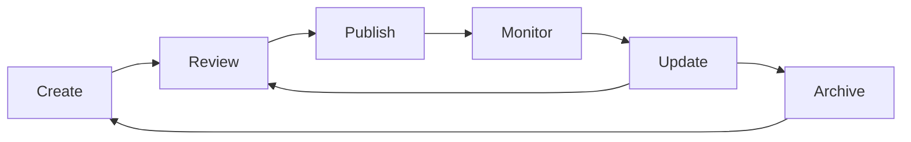

# Markdown & Documentation Standards

This guide covers the markdown conventions, writing style, and documentation standards used across the AWO platform documentation.

## Documentation Philosophy

<CardGroup cols={2}>
  <Card title="User-Centric" icon="users">
    Write for the user's journey and needs, not internal structure
  </Card>
  <Card title="Scannable" icon="eye">
    Use headings, lists, and visual elements for easy scanning
  </Card>
  <Card title="Actionable" icon="play">
    Provide clear next steps and practical examples
  </Card>
  <Card title="Maintainable" icon="refresh">
    Keep content up-to-date and remove outdated information
  </Card>
</CardGroup>

## Markdown Syntax Standards

### Headers & Structure

<Tabs>
  <Tab title="Header Hierarchy">
    ```markdown
    # Page Title (H1) - Only one per page
    
    ## Major Section (H2) - Main content divisions
    
    ### Subsection (H3) - Sub-topics within sections
    
    #### Detail Level (H4) - Specific points or examples
    
    ##### Rarely Used (H5) - Avoid if possible
    
    ###### Never Use (H6) - Too deep for most documentation
    ```
    
    **Best Practices:**
    - Use sentence case for headers: "Getting started" not "Getting Started"
    - Be descriptive: "Setting up authentication" not "Setup"
    - Keep headers concise but informative
    - Don't skip header levels (H2 → H4)
  </Tab>
  
  <Tab title="Table of Contents">
    ```markdown
    # Long Document Title
    
    ## Table of Contents
    
    1. [Getting Started](#getting-started)
    2. [Configuration](#configuration)
       - [Basic Setup](#basic-setup)
       - [Advanced Options](#advanced-options)
    3. [Examples](#examples)
    4. [Troubleshooting](#troubleshooting)
    
    ## Getting Started
    
    Content starts here...
    ```
    
    **Auto-generated TOCs (preferred):**
    ```mdx
    <TOC />
    ```
  </Tab>
  
  <Tab title="Document Structure">
    ```markdown
    # Document Title
    
    Brief introduction paragraph explaining what this document covers.
    
    <CardGroup cols={2}>
      <Card title="Quick Overview" icon="zap">
        What you'll learn in 2-3 sentences
      </Card>
      <Card title="Prerequisites" icon="list">
        What you need before starting
      </Card>
    </CardGroup>
    
    ## Main Content Sections
    
    ### Subsection with Examples
    
    Explanation followed by code examples.
    
    ## Next Steps
    
    <Steps>
      <Step title="What to do next">
        Clear action items
      </Step>
    </Steps>
    
    ## Related Resources
    
    Links to related documentation.
    ```
  </Tab>
</Tabs>

### Text Formatting

<Tabs>
  <Tab title="Emphasis & Highlighting">
    ```markdown
    **Bold text** for important terms and UI elements
    *Italic text* for emphasis and foreign terms
    `Inline code` for code snippets, file names, and technical terms
    
    > **Note**: Use notes for important information
    > **Warning**: Use warnings for potential issues
    > **Tip**: Use tips for helpful suggestions
    
    ~~Strike through~~ for deprecated features
    
    <!-- Comments for internal notes -->
    ```
    
    **Examples:**
    - Click the **Save** button to continue
    - The `config.json` file contains your settings
    - Use the *DIVA Score API* to calculate financial health
  </Tab>
  
  <Tab title="Lists & Bullet Points">
    ```markdown
    ## Unordered Lists
    
    - First item
    - Second item
      - Nested item
      - Another nested item
    - Third item
    
    ## Ordered Lists
    
    1. First step
    2. Second step
       1. Sub-step
       2. Another sub-step
    3. Third step
    
    ## Task Lists
    
    - [x] Completed task
    - [ ] Incomplete task
    - [ ] Another task
    ```
    
    **Best Practices:**
    - Use parallel structure in lists
    - Keep list items concise
    - Use numbers for sequential steps
    - Use bullets for non-sequential items
  </Tab>
  
  <Tab title="Links & References">
    ```markdown
    ## Internal Links
    [Getting Started](/quickstart)
    [API Reference](/api-reference/introduction)
    
    ## External Links
    [React Navigation](https://reactnavigation.org/)
    [NestJS Documentation](https://nestjs.com/)
    
    ## Reference-style Links
    Check out the [AWO Platform][1] for more information.
    Read about [DIVA Scoring][diva] in our documentation.
    
    [1]: https://awo-platform.com
    [diva]: /essentials/diva-score
    
    ## Anchor Links
    [Jump to examples](#examples)
    ```
    
    **Link Guidelines:**
    - Use descriptive link text, not "click here"
    - Open external links in new tabs when appropriate
    - Verify links work before publishing
  </Tab>
</Tabs>

### Code Documentation

<Tabs>
  <Tab title="Code Blocks">
    ````markdown
    ## Inline Code
    Use `backticks` for inline code references.
    
    ## Code Blocks with Language
    ```typescript
    interface User {
      id: string;
      name: string;
      email: string;
    }
    ```
    
    ## Code Blocks with Titles
    ```typescript title="types/User.ts"
    export interface User {
      id: string;
      name: string;
      email: string;
    }
    ```
    
    ## Highlighted Lines
    ```typescript {2,4-6}
    interface User {
      id: string;        // highlighted
      name: string;
      email: string;     // highlighted
      createdAt: Date;   // highlighted
      updatedAt: Date;   // highlighted
    }
    ```
    ````
  </Tab>
  
  <Tab title="Multi-Language Examples">
    ````markdown
    <CodeGroup>
    ```javascript JavaScript
    const response = await fetch('/api/users');
    const data = await response.json();
    ```
    
    ```python Python
    response = requests.get('/api/users')
    data = response.json()
    ```
    
    ```curl cURL
    curl -X GET https://api.awo-platform.com/v1/users \
      -H "Authorization: Bearer $TOKEN"
    ```
    </CodeGroup>
    ````
  </Tab>
  
  <Tab title="Interactive Examples">
    ````markdown
    ## API Request Example
    
    ```bash
    curl -X POST https://api.awo-platform.com/v1/diva-score \
      -H "Content-Type: application/json" \
      -H "Authorization: Bearer YOUR_TOKEN" \
      -d '{
        "userId": "123e4567-e89b-12d3-a456-426614174000"
      }'
    ```
    
    **Response:**
    ```json
    {
      "success": true,
      "data": {
        "overallScore": 750,
        "components": {
          "discipline": 800,
          "income": 700,
          "velocity": 750,
          "assets": 750
        }
      }
    }
    ```
    ````
  </Tab>
</Tabs>

## AWO-Specific Components

### Enhanced MDX Components

<Tabs>
  <Tab title="Cards & Callouts">
    ```mdx
    <CardGroup cols={2}>
      <Card title="Quick Start" href="/quickstart" icon="rocket">
        Get up and running in 10 minutes
      </Card>
      <Card title="API Reference" href="/api-reference" icon="code">
        Complete API documentation
      </Card>
    </CardGroup>
    
    <Note>
      This is important information that users should be aware of.
    </Note>
    
    <Warning>
      This action cannot be undone. Proceed with caution.
    </Warning>
    
    <Tip>
      Pro tip: Use keyboard shortcuts to navigate faster!
    </Tip>
    ```
  </Tab>
  
  <Tab title="Steps & Processes">
    ```mdx
    <Steps>
      <Step title="Install Dependencies">
        Run `npm install` to install all required packages
      </Step>
      <Step title="Configure Environment">
        Copy `.env.example` to `.env` and update values
      </Step>
      <Step title="Start Development Server">
        Run `npm run dev` to start the development server
      </Step>
    </Steps>
    ```
  </Tab>
  
  <Tab title="Tabs & Accordions">
    ```mdx
    <Tabs>
      <Tab title="React Native">
        ```typescript
        import { View, Text } from 'react-native';
        
        export const HelloWorld = () => (
          <View>
            <Text>Hello, World!</Text>
          </View>
        );
        ```
      </Tab>
      <Tab title="React Web">
        ```typescript
        import React from 'react';
        
        export const HelloWorld = () => (
          <div>
            <h1>Hello, World!</h1>
          </div>
        );
        ```
      </Tab>
    </Tabs>
    
    <AccordionGroup>
      <Accordion title="Common Issues">
        Solutions to frequently encountered problems
      </Accordion>
      <Accordion title="Advanced Configuration">
        Complex setup scenarios and customization options
      </Accordion>
    </AccordionGroup>
    ```
  </Tab>
</Tabs>

### Data Visualization

```mdx
## Financial Data Examples

<FrameBox>
  <div style={{padding: '20px', background: '#f8f9fa', borderRadius: '8px'}}>
    <h3>DIVA Score Breakdown</h3>
    <ul>
      <li><strong>Discipline:</strong> 800/1000</li>
      <li><strong>Income:</strong> 700/1000</li>
      <li><strong>Velocity:</strong> 750/1000</li>
      <li><strong>Assets:</strong> 750/1000</li>
    </ul>
    <p><strong>Overall Score:</strong> 750/1000</p>
  </div>
</FrameBox>

## API Response Format

<ResponseField name="success" type="boolean">
  Indicates if the request was successful
</ResponseField>

<ResponseField name="data" type="object">
  Contains the response payload
  
  <Expandable title="data properties">
    <ResponseField name="divaScore" type="number">
      The calculated DIVA score (0-1000)
    </ResponseField>
    
    <ResponseField name="components" type="object">
      Breakdown of score components
    </ResponseField>
  </Expandable>
</ResponseField>
```

## Writing Style Guide

### Voice & Tone

<Tabs>
  <Tab title="Writing Principles">
    **Conversational but Professional**
    - Write as if explaining to a colleague
    - Use "you" to address the reader directly
    - Avoid overly formal or academic language
    
    **Clear and Concise**
    - Use simple, direct sentences
    - Avoid jargon without explanation
    - Break up long paragraphs
    
    **Helpful and Encouraging**
    - Anticipate user questions and concerns
    - Provide context for why something matters
    - Celebrate user progress and achievements
  </Tab>
  
  <Tab title="Examples">
    **✅ Good Examples:**
    ```markdown
    You'll need to configure your API keys before making requests.
    
    Let's start by setting up your development environment.
    
    Once you've completed these steps, you're ready to calculate 
    your first DIVA score!
    ```
    
    **❌ Poor Examples:**
    ```markdown
    API key configuration is required prior to request execution.
    
    The development environment setup process should be initiated.
    
    Upon completion of the aforementioned procedures, DIVA score 
    calculation functionality will be available.
    ```
  </Tab>
  
  <Tab title="Technical Terms">
    **Introduce Before Using**
    ```markdown
    The DIVA score (Discipline, Income, Velocity, Assets) measures 
    your financial health. This score helps you understand...
    ```
    
    **Use Consistent Terminology**
    - DIVA Score (not DIVA score or diva score)
    - Chama (not chama or CHAMA)
    - API endpoint (not API call or endpoint)
    
    **Provide Context**
    ```markdown
    We use JWT tokens for authentication. These tokens expire 
    after 24 hours, so you'll need to refresh them regularly.
    ```
  </Tab>
</Tabs>

### Content Structure

<AccordionGroup>
  <Accordion title="Lead with Value">
    **Start with what the user will achieve**
    ```markdown
    # Setting Up Bank Connections
    
    Connect your bank account to AWO so we can analyze your 
    transactions and calculate your DIVA score automatically.
    
    In this guide, you'll:
    - Link your bank account securely
    - Verify the connection
    - Start getting personalized financial insights
    ```
  </Accordion>
  
  <Accordion title="Provide Context">
    **Explain the "why" behind instructions**
    ```markdown
    ## Why Connect Your Bank?
    
    Connecting your bank account allows AWO to:
    - Calculate your DIVA score based on real transaction data
    - Provide personalized financial insights
    - Track your progress toward financial goals
    
    Your data is encrypted and never shared with third parties.
    ```
  </Accordion>
  
  <Accordion title="Use Scannable Formats">
    **Break up dense content**
    ```markdown
    ## Before You Start
    
    Make sure you have:
    - [ ] A supported bank account
    - [ ] Your online banking credentials
    - [ ] A few minutes to complete the setup
    
    ## Supported Banks
    
    | Country | Banks |
    |---------|-------|
    | South Africa | Standard Bank, FNB, ABSA, Nedbank |
    | Kenya | KCB, Equity Bank, Co-op Bank |
    | Nigeria | GTBank, Access Bank, Zenith Bank |
    ```
  </Accordion>
</AccordionGroup>

## Documentation Types

### API Documentation

````markdown
# DIVA Score API

Calculate and retrieve DIVA scores for authenticated users.

## Base URL

```
https://api.awo-platform.com/v1
```

## Get DIVA Score

Retrieves the current DIVA score for the authenticated user.

**Endpoint:** `GET /diva-score`

**Headers:**
- `Authorization: Bearer <token>` (required)
- `Content-Type: application/json`

**Response:**

<CodeGroup>
```json Success (200)
{
  "success": true,
  "data": {
    "overallScore": 750,
    "components": {
      "discipline": 800,
      "income": 700,
      "velocity": 750,
      "assets": 750
    },
    "lastCalculated": "2025-05-29T10:30:00Z"
  }
}
```

```json Error (400)
{
  "success": false,
  "error": {
    "code": "DIVA_SCORE_NOT_READY",
    "message": "DIVA score calculation in progress"
  }
}
```
</CodeGroup>

**Example Request:**

```bash
curl -X GET https://api.awo-platform.com/v1/diva-score \
  -H "Authorization: Bearer YOUR_TOKEN"
```
````

### Tutorial Documentation

````markdown
# Creating Your First Chama

Learn how to create and manage a digital Chama (savings group) 
using the AWO platform.

## What You'll Build

By the end of this tutorial, you'll have:
- Created a new Chama group
- Invited members to join
- Set up contribution rules
- Made your first group contribution

<Note>
This tutorial takes about 15 minutes to complete.
</Note>

## Prerequisites

Before starting, make sure you have:
- A verified AWO account
- Completed KYC Level 1 verification
- At least 2 friends willing to join your Chama

<Steps>
  <Step title="Create the Chama">
    Navigate to the Chama tab and tap "Create New Chama"
    
    Fill in the basic information:
    - **Name:** Choose a meaningful name for your group
    - **Purpose:** Describe what you're saving for
    - **Type:** Select "Rotating" for this tutorial
  </Step>
  
  <Step title="Set Contribution Rules">
    Configure how your Chama will operate:
    - **Contribution Amount:** R500 per month
    - **Payment Day:** 1st of each month
    - **Payout Order:** Random selection
  </Step>
  
  <Step title="Invite Members">
    Add members by phone number or sharing your Chama code
    
    ```
    Chama Code: AWO-CH4M4-2025
    ```
    
    Share this code with your friends so they can join.
  </Step>
</Steps>

## Next Steps

Now that your Chama is set up:
- [Manage member contributions](/guides/chama-management)
- [Track group savings progress](/guides/chama-analytics)
- [Set up automatic payments](/guides/chama-automation)

## Troubleshooting

<AccordionGroup>
  <Accordion title="Members can't join my Chama">
    Check that:
    - Your Chama code is correct
    - Members have completed KYC verification
    - You haven't reached the member limit
  </Accordion>
  
  <Accordion title="Contribution reminders not working">
    Ensure:
    - Members have enabled push notifications
    - Payment dates are set correctly
    - The Chama is in "Active" status
  </Accordion>
</AccordionGroup>
````

### Reference Documentation

````markdown
# Error Codes Reference

Complete list of error codes returned by the AWO API.

## Authentication Errors

| Code | HTTP Status | Description | Solution |
|------|-------------|-------------|----------|
| `AUTH_TOKEN_MISSING` | 401 | No authorization token provided | Include `Authorization: Bearer <token>` header |
| `AUTH_TOKEN_INVALID` | 401 | Token is malformed or invalid | Verify token format and obtain new token |
| `AUTH_TOKEN_EXPIRED` | 401 | Token has expired | Refresh token using `/auth/refresh` endpoint |

## Validation Errors

| Code | HTTP Status | Description | Solution |
|------|-------------|-------------|----------|
| `PHONE_NUMBER_INVALID` | 422 | Phone number format is incorrect | Use E.164 format (+27XXXXXXXXX) |
| `EMAIL_INVALID` | 422 | Email address format is incorrect | Provide valid email address |
| `AMOUNT_INVALID` | 422 | Monetary amount is invalid | Use positive numbers with max 2 decimals |

## Business Logic Errors

<AccordionGroup>
  <Accordion title="DIVA Score Errors">
    | Code | Description | Solution |
    |------|-------------|----------|
    | `DIVA_SCORE_NOT_READY` | Score calculation in progress | Wait and retry in 30 seconds |
    | `INSUFFICIENT_DATA` | Not enough transaction data | Connect more accounts or wait for more transactions |
  </Accordion>
  
  <Accordion title="Chama Errors">
    | Code | Description | Solution |
    |------|-------------|----------|
    | `CHAMA_FULL` | Maximum members reached | Remove inactive members or upgrade Chama |
    | `CONTRIBUTION_OVERDUE` | Member has overdue contributions | Pay outstanding amounts before proceeding |
  </Accordion>
</AccordionGroup>

## Error Response Format

All errors follow this standard format:

```json
{
  "success": false,
  "error": {
    "code": "ERROR_CODE",
    "message": "Human-readable error description",
    "details": {
      "field": "fieldName",
      "value": "submittedValue",
      "expected": "expectedFormat"
    }
  },
  "meta": {
    "timestamp": "2025-05-29T10:30:00Z",
    "requestId": "req_abc123def456"
  }
}
```
````

## Quality Checklist

Before publishing documentation:

<AccordionGroup>
  <Accordion title="Content Review">
    - [ ] Information is accurate and up-to-date
    - [ ] Examples work and have been tested
    - [ ] Links are functional and point to correct pages
    - [ ] Code snippets are properly formatted
    - [ ] Screenshots are current and high-quality
  </Accordion>
  
  <Accordion title="Structure Review">
    - [ ] Headers follow proper hierarchy (H1 → H2 → H3)
    - [ ] Content is scannable with lists and callouts
    - [ ] Related topics are linked appropriately
    - [ ] Next steps are clearly defined
    - [ ] Table of contents is present for long documents
  </Accordion>
  
  <Accordion title="Style Review">
    - [ ] Writing is clear and conversational
    - [ ] Technical terms are explained
    - [ ] Voice is consistent with other documentation
    - [ ] Formatting follows established patterns
    - [ ] Accessibility guidelines are followed
  </Accordion>
  
  <Accordion title="User Experience">
    - [ ] Content addresses user needs and questions
    - [ ] Examples are relevant and practical
    - [ ] Troubleshooting covers common issues
    - [ ] Document can be completed independently
    - [ ] Success criteria are clear
  </Accordion>
</AccordionGroup>

## Maintenance

### Content Lifecycle



### Regular Reviews

- **Monthly:** Check for broken links and outdated screenshots
- **Quarterly:** Review accuracy of technical content
- **Annually:** Complete content audit and restructuring
- **As needed:** Update when features change or new releases

<Tip>
  **Documentation as Code**: Treat documentation with the same care as source code. Use version control, peer reviews, and automated testing where possible.
</Tip>

---

**Questions about our documentation standards?** Join our Discord community or reach out to the documentation team.