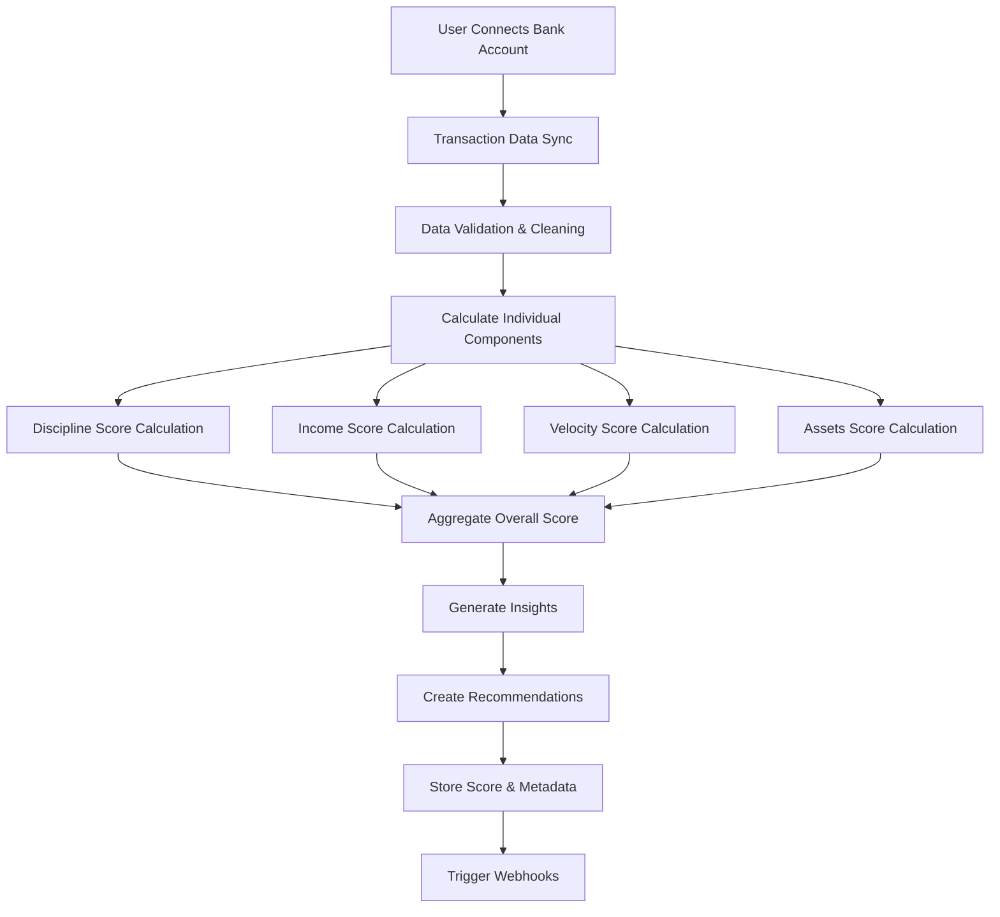

# DIVA Score Implementation Guide

This comprehensive guide covers everything you need to know about implementing the DIVA (Discipline, Income, Velocity, Assets) scoring system in your application, from basic integration to advanced customization.

<Info>
The DIVA Score is AWO's proprietary financial health assessment algorithm that analyzes real bank transaction data to provide personalized insights and recommendations.
</Info>

## Overview

The DIVA scoring system evaluates financial health across four key dimensions:

<CardGroup cols={2}>
  <Card title="Discipline (D)" icon="clock">
    **Payment Punctuality & Consistency**
    - Bill payment timing
    - Credit utilization patterns
    - Recurring payment reliability
    - Financial commitment adherence
  </Card>
  <Card title="Income (I)" icon="trending-up">
    **Stability & Growth**
    - Income consistency
    - Growth trajectory
    - Source diversification
    - Employment stability
  </Card>
  <Card title="Velocity (V)" icon="zap">
    **Cash Flow Efficiency**
    - Spending patterns
    - Money movement speed
    - Transaction frequency
    - Cash flow optimization
  </Card>
  <Card title="Assets (A)" icon="shield">
    **Accumulation & Protection**
    - Savings growth
    - Asset building
    - Emergency fund adequacy
    - Investment behavior
  </Card>
</CardGroup>

## Quick Start

### 1. Installation

<CodeGroup>
```bash npm
npm install @awo/api-sdk
```

```bash yarn
yarn add @awo/api-sdk
```

```bash pnpm
pnpm add @awo/api-sdk
```
</CodeGroup>

### 2. Basic Setup

<CodeGroup>
```typescript TypeScript
import { AWOClient } from '@awo/api-sdk';

const client = new AWOClient({
  apiKey: process.env.AWO_API_KEY!,
  baseURL: 'https://api.awo-platform.com/v1',
  timeout: 10000
});

// Get current DIVA score
async function getDivaScore(userId: string) {
  try {
    const score = await client.diva.getScore(userId);
    console.log(`Overall DIVA Score: ${score.overallScore}/100`);
    return score;
  } catch (error) {
    console.error('Failed to get DIVA score:', error);
    throw error;
  }
}
```

```javascript JavaScript
const { AWOClient } = require('@awo/api-sdk');

const client = new AWOClient({
  apiKey: process.env.AWO_API_KEY,
  baseURL: 'https://api.awo-platform.com/v1'
});

async function getDivaScore(userId) {
  try {
    const score = await client.diva.getScore(userId);
    console.log(`Overall DIVA Score: ${score.overallScore}/100`);
    return score;
  } catch (error) {
    console.error('Failed to get DIVA score:', error);
    throw error;
  }
}
```

```python Python
from awo_sdk import AWOClient
import os

client = AWOClient(
    api_key=os.environ['AWO_API_KEY'],
    base_url='https://api.awo-platform.com/v1'
)

def get_diva_score(user_id: str):
    try:
        score = client.diva.get_score(user_id)
        print(f"Overall DIVA Score: {score.overall_score}/100")
        return score
    except Exception as error:
        print(f"Failed to get DIVA score: {error}")
        raise
```
</CodeGroup>

### 3. Basic Implementation

```typescript
// Complete DIVA score workflow
class DivaScoreService {
  private client: AWOClient;

  constructor(apiKey: string) {
    this.client = new AWOClient({ apiKey });
  }

  async getCompleteScoreData(userId: string) {
    try {
      // Get current score with insights
      const currentScore = await this.client.diva.getScore(userId, {
        includeInsights: true,
        includeRecommendations: true
      });

      // Get historical data for trends
      const history = await this.client.diva.getHistory(userId, {
        period: '6months',
        granularity: 'monthly'
      });

      // Get actionable insights
      const insights = await this.client.diva.getInsights(userId, {
        priority: 'high',
        limit: 5
      });

      return {
        current: currentScore,
        trend: history.trends.overall,
        insights: insights.insights,
        potentialImprovement: insights.summary.potentialScoreIncrease
      };
    } catch (error) {
      throw new Error(`Failed to get complete DIVA data: ${error.message}`);
    }
  }
}
```

## Core Implementation Patterns

### 1. Score Calculation Flow



### 2. Data Requirements

<Tabs>
  <Tab title="Minimum Data Requirements">
    **For Basic DIVA Score:**
    
    - **Time Period**: 3+ months of transaction history
    - **Transaction Count**: 50+ transactions minimum
    - **Data Quality**: 90%+ properly categorized transactions
    - **Account Types**: At least 1 primary checking/savings account
    
    ```typescript
    interface MinimumDataRequirements {
      transactionPeriod: {
        minimum: '3 months';
        recommended: '12 months';
      };
      transactionCount: {
        minimum: 50;
        recommended: 200;
      };
      accountTypes: {
        required: ['checking' | 'savings'];
        optional: ['credit', 'investment', 'loan'];
      };
      dataQuality: {
        categorizedTransactions: 0.9; // 90%
        duplicateTransactions: 0.05; // <5%
      };
    }
    ```
  </Tab>
  
  <Tab title="Optimal Data Requirements">
    **For Comprehensive Analysis:**
    
    - **Time Period**: 12+ months of transaction history
    - **Transaction Count**: 200+ transactions
    - **Account Coverage**: Multiple account types
    - **Data Richness**: Merchant details, location data
    
    ```typescript
    interface OptimalDataRequirements {
      transactionPeriod: '12+ months';
      transactionCount: '200+ transactions';
      accountTypes: [
        'checking',
        'savings', 
        'credit',
        'investment',
        'loan'
      ];
      dataRichness: {
        merchantDetails: true;
        locationData: true;
        transactionDescriptions: true;
        recurringPatterns: true;
      };
    }
    ```
  </Tab>
  
  <Tab title="Data Quality Checks">
    **Validation & Quality Assurance:**
    
    ```typescript
    class DataQualityValidator {
      async validateTransactionData(userId: string): Promise<ValidationResult> {
        const transactions = await this.getTransactions(userId);
        
        const validation = {
          isValid: true,
          issues: [] as string[],
          recommendations: [] as string[],
          confidence: 100
        };

        // Check transaction count
        if (transactions.length < 50) {
          validation.isValid = false;
          validation.issues.push('Insufficient transaction history');
          validation.recommendations.push('Connect additional bank accounts');
        }

        // Check time period coverage
        const timeSpan = this.calculateTimeSpan(transactions);
        if (timeSpan < 90) { // Less than 3 months
          validation.confidence -= 30;
          validation.recommendations.push('Wait for more transaction history');
        }

        // Check categorization rate
        const categorizationRate = this.calculateCategorizationRate(transactions);
        if (categorizationRate < 0.8) {
          validation.confidence -= 20;
          validation.recommendations.push('Improve transaction categorization');
        }

        // Check for duplicate transactions
        const duplicateRate = this.calculateDuplicateRate(transactions);
        if (duplicateRate > 0.1) {
          validation.confidence -= 15;
          validation.issues.push('High duplicate transaction rate detected');
        }

        return validation;
      }

      private calculateTimeSpan(transactions: Transaction[]): number {
        if (transactions.length === 0) return 0;
        
        const sorted = transactions.sort((a, b) => 
          new Date(a.date).getTime() - new Date(b.date).getTime()
        );
        
        const start = new Date(sorted[0].date);
        const end = new Date(sorted[sorted.length - 1].date);
        
        return Math.ceil((end.getTime() - start.getTime()) / (1000 * 60 * 60 * 24));
      }
    }
    ```
  </Tab>
</Tabs>

### 3. Component Calculation Logic

<Tabs>
  <Tab title="Discipline Score">
    **Payment Punctuality & Consistency**
    
    ```typescript
    class DisciplineCalculator {
      calculateDisciplineScore(transactions: Transaction[]): DisciplineScore {
        const billPayments = this.extractBillPayments(transactions);
        const creditUtilization = this.calculateCreditUtilization(transactions);
        const recurringPayments = this.analyzeRecurringPayments(transactions);
        
        const components = {
          paymentPunctuality: this.calculatePaymentPunctuality(billPayments),
          creditManagement: this.calculateCreditManagement(creditUtilization),
          recurringConsistency: this.calculateRecurringConsistency(recurringPayments),
          financialCommitments: this.calculateCommitmentAdherence(transactions)
        };
        
        // Weighted average
        const weights = {
          paymentPunctuality: 0.35,
          creditManagement: 0.30,
          recurringConsistency: 0.25,
          financialCommitments: 0.10
        };
        
        const score = Object.entries(components).reduce((total, [key, value]) => {
          return total + (value * weights[key as keyof typeof weights]);
        }, 0);
        
        return {
          score: Math.round(score * 100) / 100,
          components,
          insights: this.generateDisciplineInsights(components),
          confidence: this.calculateConfidence(billPayments.length)
        };
      }

      private calculatePaymentPunctuality(billPayments: BillPayment[]): number {
        if (billPayments.length === 0) return 0.5; // Neutral score for no data
        
        const onTimePayments = billPayments.filter(payment => 
          payment.daysFromDueDate <= 0
        ).length;
        
        const latePayments = billPayments.filter(payment => 
          payment.daysFromDueDate > 0
        ).length;
        
        const earlyPayments = billPayments.filter(payment => 
          payment.daysFromDueDate < -5
        ).length;
        
        // Scoring: on-time = 1.0, early = 0.9, late = penalty based on days
        let totalScore = 0;
        billPayments.forEach(payment => {
          if (payment.daysFromDueDate <= 0) {
            totalScore += payment.daysFromDueDate < -5 ? 0.9 : 1.0;
          } else {
            // Penalty for late payments
            const penalty = Math.min(payment.daysFromDueDate * 0.1, 0.8);
            totalScore += Math.max(0.2, 1.0 - penalty);
          }
        });
        
        return totalScore / billPayments.length;
      }

      private calculateCreditManagement(utilization: CreditUtilization[]): number {
        if (utilization.length === 0) return 0.7; // Default for no credit data
        
        // Optimal utilization is < 30%, excellent is < 10%
        const averageUtilization = utilization.reduce((sum, u) => sum + u.ratio, 0) / utilization.length;
        
        if (averageUtilization <= 0.1) return 1.0;      // Excellent
        if (averageUtilization <= 0.3) return 0.8;      // Good
        if (averageUtilization <= 0.5) return 0.6;      // Fair
        if (averageUtilization <= 0.7) return 0.4;      // Poor
        return 0.2; // High utilization
      }
    }
    ```
  </Tab>
  
  <Tab title="Income Score">
    **Stability & Growth Analysis**
    
    ```typescript
    class IncomeCalculator {
      calculateIncomeScore(transactions: Transaction[]): IncomeScore {
        const incomeTransactions = this.extractIncomeTransactions(transactions);
        const incomeAnalysis = this.analyzeIncomePatterns(incomeTransactions);
        
        const components = {
          stability: this.calculateIncomeStability(incomeAnalysis),
          growth: this.calculateIncomeGrowth(incomeAnalysis),
          diversification: this.calculateIncomeDiversification(incomeAnalysis),
          predictability: this.calculateIncomePredictability(incomeAnalysis)
        };
        
        const weights = {
          stability: 0.40,
          growth: 0.25,
          diversification: 0.20,
          predictability: 0.15
        };
        
        const score = Object.entries(components).reduce((total, [key, value]) => {
          return total + (value * weights[key as keyof typeof weights]);
        }, 0);
        
        return {
          score: Math.round(score * 100) / 100,
          components,
          monthlyIncome: incomeAnalysis.averageMonthlyIncome,
          trends: incomeAnalysis.trends,
          insights: this.generateIncomeInsights(incomeAnalysis),
          confidence: this.calculateConfidence(incomeTransactions.length)
        };
      }

      private calculateIncomeStability(analysis: IncomeAnalysis): number {
        const monthlyIncomes = analysis.monthlyBreakdown;
        if (monthlyIncomes.length < 3) return 0.5;
        
        const average = monthlyIncomes.reduce((sum, income) => sum + income.amount, 0) / monthlyIncomes.length;
        const variance = monthlyIncomes.reduce((sum, income) => {
          return sum + Math.pow(income.amount - average, 2);
        }, 0) / monthlyIncomes.length;
        
        const coefficientOfVariation = Math.sqrt(variance) / average;
        
        // Lower CoV = higher stability
        if (coefficientOfVariation <= 0.1) return 1.0;      // Very stable
        if (coefficientOfVariation <= 0.2) return 0.8;      // Stable
        if (coefficientOfVariation <= 0.3) return 0.6;      // Moderate
        if (coefficientOfVariation <= 0.5) return 0.4;      // Unstable
        return 0.2; // Very unstable
      }

      private calculateIncomeGrowth(analysis: IncomeAnalysis): number {
        const monthlyIncomes = analysis.monthlyBreakdown;
        if (monthlyIncomes.length < 6) return 0.5; // Need at least 6 months
        
        // Calculate trend using linear regression
        const xValues = monthlyIncomes.map((_, index) => index);
        const yValues = monthlyIncomes.map(income => income.amount);
        
        const slope = this.calculateLinearRegressionSlope(xValues, yValues);
        const averageIncome = yValues.reduce((a, b) => a + b) / yValues.length;
        
        // Growth rate as percentage per month
        const monthlyGrowthRate = (slope / averageIncome) * 100;
        
        if (monthlyGrowthRate >= 2) return 1.0;       // Excellent growth
        if (monthlyGrowthRate >= 1) return 0.8;       // Good growth
        if (monthlyGrowthRate >= 0) return 0.6;       // Stable
        if (monthlyGrowthRate >= -1) return 0.4;      // Slight decline
        return 0.2; // Declining income
      }

      private calculateIncomeDiversification(analysis: IncomeAnalysis): number {
        const sources = analysis.incomeSources;
        const totalIncome = sources.reduce((sum, source) => sum + source.amount, 0);
        
        if (sources.length === 1) return 0.3; // Single source
        
        // Calculate Herfindahl-Hirschman Index for diversification
        const hhi = sources.reduce((sum, source) => {
          const marketShare = source.amount / totalIncome;
          return sum + Math.pow(marketShare, 2);
        }, 0);
        
        // Convert HHI to score (lower HHI = more diversified = higher score)
        if (hhi <= 0.4) return 1.0;      // Well diversified
        if (hhi <= 0.6) return 0.8;      // Moderately diversified
        if (hhi <= 0.8) return 0.6;      // Some diversification
        return 0.4; // Poorly diversified
      }
    }
    ```
  </Tab>
  
  <Tab title="Velocity Score">
    **Cash Flow Efficiency**
    
    ```typescript
    class VelocityCalculator {
      calculateVelocityScore(transactions: Transaction[]): VelocityScore {
        const cashFlowAnalysis = this.analyzeCashFlow(transactions);
        const spendingPatterns = this.analyzeSpendingPatterns(transactions);
        
        const components = {
          cashFlowEfficiency: this.calculateCashFlowEfficiency(cashFlowAnalysis),
          spendingOptimization: this.calculateSpendingOptimization(spendingPatterns),
          transactionVelocity: this.calculateTransactionVelocity(transactions),
          moneyMovementSpeed: this.calculateMoneyMovementSpeed(transactions)
        };
        
        const weights = {
          cashFlowEfficiency: 0.35,
          spendingOptimization: 0.30,
          transactionVelocity: 0.20,
          moneyMovementSpeed: 0.15
        };
        
        const score = Object.entries(components).reduce((total, [key, value]) => {
          return total + (value * weights[key as keyof typeof weights]);
        }, 0);
        
        return {
          score: Math.round(score * 100) / 100,
          components,
          cashFlowSummary: cashFlowAnalysis,
          spendingBreakdown: spendingPatterns,
          insights: this.generateVelocityInsights(cashFlowAnalysis, spendingPatterns),
          confidence: this.calculateConfidence(transactions.length)
        };
      }

      private calculateCashFlowEfficiency(analysis: CashFlowAnalysis): number {
        const { monthlyNetFlow, averageBalance, flowConsistency } = analysis;
        
        // Positive net flow is good
        const netFlowScore = monthlyNetFlow > 0 ? 
          Math.min(monthlyNetFlow / 5000, 1.0) : // Scale to R5000 monthly net positive
          Math.max(monthlyNetFlow / 2000 + 1, 0); // Penalty for negative flow
        
        // Consistent positive flow is better than volatile
        const consistencyScore = flowConsistency; // 0-1 scale
        
        // Balance efficiency (not too high, not too low)
        const balanceScore = this.calculateOptimalBalanceScore(averageBalance, analysis.monthlyExpenses);
        
        return (netFlowScore * 0.4) + (consistencyScore * 0.3) + (balanceScore * 0.3);
      }

      private calculateSpendingOptimization(patterns: SpendingPatterns): number {
        const { categoryBreakdown, seasonality, impulseSpending, budgetAdherence } = patterns;
        
        // Score based on spending distribution
        const distributionScore = this.scoreSpendingDistribution(categoryBreakdown);
        
        // Seasonal consistency (less volatility = better)
        const seasonalityScore = 1 - (seasonality.volatilityIndex / 100);
        
        // Lower impulse spending is better
        const impulseScore = 1 - Math.min(impulseSpending.percentage / 20, 1); // 20% or less is good
        
        // Budget adherence if available
        const adherenceScore = budgetAdherence?.score || 0.5;
        
        return (distributionScore * 0.3) + (seasonalityScore * 0.25) + 
               (impulseScore * 0.25) + (adherenceScore * 0.2);
      }

      private scoreSpendingDistribution(breakdown: CategoryBreakdown[]): number {
        // Optimal spending distribution (as percentages)
        const optimalDistribution = {
          housing: 0.30,      // 25-35%
          food: 0.15,         // 10-20%
          transportation: 0.15, // 10-20%
          utilities: 0.10,    // 5-15%
          healthcare: 0.05,   // 3-8%
          entertainment: 0.10, // 5-15%
          savings: 0.15       // 10-20%
        };
        
        let totalScore = 0;
        let totalWeight = 0;
        
        Object.entries(optimalDistribution).forEach(([category, optimal]) => {
          const actual = breakdown.find(b => b.category === category)?.percentage || 0;
          const deviation = Math.abs(actual - optimal);
          const categoryScore = Math.max(0, 1 - (deviation / optimal));
          
          totalScore += categoryScore * optimal; // Weight by optimal percentage
          totalWeight += optimal;
        });
        
        return totalScore / totalWeight;
      }
    }
    ```
  </Tab>
  
  <Tab title="Assets Score">
    **Accumulation & Protection**
    
    ```typescript
    class AssetsCalculator {
      calculateAssetsScore(transactions: Transaction[]): AssetsScore {
        const savingsAnalysis = this.analyzeSavingsPattern(transactions);
        const assetBuilding = this.analyzeAssetBuilding(transactions);
        const emergencyFund = this.analyzeEmergencyFund(transactions);
        
        const components = {
          savingsGrowth: this.calculateSavingsGrowth(savingsAnalysis),
          assetAccumulation: this.calculateAssetAccumulation(assetBuilding),
          emergencyPreparedness: this.calculateEmergencyPreparedness(emergencyFund),
          investmentBehavior: this.calculateInvestmentBehavior(transactions)
        };
        
        const weights = {
          savingsGrowth: 0.35,
          assetAccumulation: 0.25,
          emergencyPreparedness: 0.25,
          investmentBehavior: 0.15
        };
        
        const score = Object.entries(components).reduce((total, [key, value]) => {
          return total + (value * weights[key as keyof typeof weights]);
        }, 0);
        
        return {
          score: Math.round(score * 100) / 100,
          components,
          savingsRate: savingsAnalysis.monthlySavingsRate,
          assetGrowth: assetBuilding.growthRate,
          emergencyFundRatio: emergencyFund.monthsCovered,
          insights: this.generateAssetsInsights(savingsAnalysis, assetBuilding, emergencyFund),
          confidence: this.calculateConfidence(transactions.length)
        };
      }

      private calculateSavingsGrowth(analysis: SavingsAnalysis): number {
        const { monthlySavingsRate, consistency, trend } = analysis;
        
        // Savings rate scoring (target: 20% of income)
        const rateScore = Math.min(monthlySavingsRate / 0.20, 1.0);
        
        // Consistency scoring (regular savings vs sporadic)
        const consistencyScore = consistency; // 0-1 scale
        
        // Trend scoring (improving vs declining)
        const trendScore = trend > 0 ? Math.min(trend / 0.05, 1.0) : Math.max(trend / 0.05 + 1, 0);
        
        return (rateScore * 0.5) + (consistencyScore * 0.3) + (trendScore * 0.2);
      }

      private calculateAssetAccumulation(building: AssetBuilding): number {
        const { netWorthGrowth, diversification, liquidityRatio } = building;
        
        // Net worth growth (target: 10% annually)
        const growthScore = Math.min(netWorthGrowth / 0.10, 1.0);
        
        // Asset diversification (not all in one type)
        const diversificationScore = diversification; // 0-1 scale
        
        // Optimal liquidity (not too liquid, not too illiquid)
        const liquidityScore = this.calculateOptimalLiquidity(liquidityRatio);
        
        return (growthScore * 0.5) + (diversificationScore * 0.3) + (liquidityScore * 0.2);
      }

      private calculateEmergencyPreparedness(fund: EmergencyFund): number {
        const { monthsCovered, accessibility, growth } = fund;
        
        // Target: 3-6 months of expenses
        let coverageScore = 0;
        if (monthsCovered >= 6) coverageScore = 1.0;
        else if (monthsCovered >= 3) coverageScore = 0.8;
        else if (monthsCovered >= 1) coverageScore = 0.5;
        else coverageScore = monthsCovered / 3; // Partial credit
        
        // Accessibility (should be easily accessible)
        const accessibilityScore = accessibility; // 0-1 scale
        
        // Growth (emergency fund should grow with expenses)
        const growthScore = growth > 0 ? Math.min(growth / 0.05, 1.0) : 0.5;
        
        return (coverageScore * 0.6) + (accessibilityScore * 0.3) + (growthScore * 0.1);
      }
    }
    ```
  </Tab>
</Tabs>

## Advanced Implementation

### 1. Real-time Score Updates

```typescript
class RealTimeDivaService {
  private wsConnection: WebSocket;
  private eventEmitter: EventEmitter;

  constructor(private client: AWOClient) {
    this.eventEmitter = new EventEmitter();
    this.setupWebSocketConnection();
  }

  // Subscribe to real-time score updates
  subscribeToScoreUpdates(userId: string): void {
    this.wsConnection.send(JSON.stringify({
      type: 'subscribe',
      channel: `diva.scores.${userId}`,
      events: ['score_updated', 'component_changed', 'insights_generated']
    }));
  }

  // Handle real-time events
  private setupWebSocketConnection(): void {
    this.wsConnection = new WebSocket('wss://api.awo-platform.com/v1/ws');
    
    this.wsConnection.onmessage = (event) => {
      const data = JSON.parse(event.data);
      
      switch (data.type) {
        case 'diva.score.updated':
          this.handleScoreUpdate(data);
          break;
        case 'diva.component.changed':
          this.handleComponentChange(data);
          break;
        case 'diva.insights.generated':
          this.handleNewInsights(data);
          break;
      }
    };
  }

  private handleScoreUpdate(data: any): void {
    this.eventEmitter.emit('scoreUpdated', {
      userId: data.userId,
      newScore: data.newScore,
      previousScore: data.previousScore,
      change: data.change,
      timestamp: data.timestamp
    });
  }

  // Public event subscription methods
  onScoreUpdated(callback: (data: ScoreUpdateEvent) => void): void {
    this.eventEmitter.on('scoreUpdated', callback);
  }

  onComponentChanged(callback: (data: ComponentChangeEvent) => void): void {
    this.eventEmitter.on('componentChanged', callback);
  }

  onNewInsights(callback: (data: InsightsEvent) => void): void {
    this.eventEmitter.on('newInsights', callback);
  }
}

// Usage
const realtimeService = new RealTimeDivaService(client);

realtimeService.onScoreUpdated((data) => {
  console.log(`Score updated for user ${data.userId}: ${data.newScore} (${data.change > 0 ? '+' : ''}${data.change})`);
  
  // Update UI
  updateScoreDisplay(data.userId, data.newScore);
  
  // Show notification if significant change
  if (Math.abs(data.change) > 5) {
    showScoreChangeNotification(data);
  }
});

realtimeService.subscribeToScoreUpdates('user-123');
```

### 2. Batch Processing

```typescript
class BatchDivaProcessor {
  private queue: Array<{ userId: string; priority: 'high' | 'normal' | 'low' }> = [];
  private processing = false;
  private maxBatchSize = 50;
  private processingInterval = 30000; // 30 seconds

  constructor(private client: AWOClient) {
    this.startBatchProcessor();
  }

  // Add user to processing queue
  queueUserForProcessing(userId: string, priority: 'high' | 'normal' | 'low' = 'normal'): void {
    // Remove existing entry if present
    this.queue = this.queue.filter(item => item.userId !== userId);
    
    // Add to queue based on priority
    if (priority === 'high') {
      this.queue.unshift({ userId, priority });
    } else {
      this.queue.push({ userId, priority });
    }
  }

  private startBatchProcessor(): void {
    setInterval(async () => {
      if (!this.processing && this.queue.length > 0) {
        await this.processBatch();
      }
    }, this.processingInterval);
  }

  private async processBatch(): Promise<void> {
    this.processing = true;
    
    try {
      const batch = this.queue.splice(0, this.maxBatchSize);
      const userIds = batch.map(item => item.userId);
      
      console.log(`Processing batch of ${userIds.length} DIVA scores`);
      
      // Process in parallel with concurrency limit
      const concurrency = 10;
      const results = await this.processConcurrent(userIds, concurrency);
      
      // Handle results
      results.forEach((result, index) => {
        if (result.status === 'fulfilled') {
          console.log(`Successfully updated DIVA score for user ${userIds[index]}`);
          this.handleSuccessfulUpdate(userIds[index], result.value);
        } else {
          console.error(`Failed to update DIVA score for user ${userIds[index]}:`, result.reason);
          this.handleFailedUpdate(userIds[index], result.reason);
        }
      });
      
    } catch (error) {
      console.error('Batch processing error:', error);
    } finally {
      this.processing = false;
    }
  }

  private async processConcurrent(userIds: string[], concurrency: number): Promise<PromiseSettledResult<any>[]> {
    const results: PromiseSettledResult<any>[] = [];
    
    for (let i = 0; i < userIds.length; i += concurrency) {
      const batch = userIds.slice(i, i + concurrency);
      const promises = batch.map(userId => this.refreshUserScore(userId));
      const batchResults = await Promise.allSettled(promises);
      results.push(...batchResults);
    }
    
    return results;
  }

  private async refreshUserScore(userId: string): Promise<any> {
    try {
      const score = await this.client.diva.refreshScore(userId, {
        includeInsights: true,
        includeRecommendations: true
      });
      
      return { userId, score };
    } catch (error) {
      throw new Error(`Failed to refresh score for ${userId}: ${error.message}`);
    }
  }

  private handleSuccessfulUpdate(userId: string, result: any): void {
    // Store result in cache
    this.cacheScore(userId, result.score);
    
    // Trigger webhooks
    this.triggerWebhooks(userId, result);
    
    // Update analytics
    this.updateAnalytics(userId, result);
  }

  private handleFailedUpdate(userId: string, error: any): void {
    // Add back to queue with lower priority for retry
    this.queueUserForProcessing(userId, 'low');
    
    // Log error for monitoring
    this.logError(userId, error);
  }
}
```

### 3. Custom Scoring Models

```typescript
interface CustomScoringConfig {
  weights: {
    discipline: number;
    income: number;
    velocity: number;
    assets: number;
  };
  componentConfigs: {
    discipline: DisciplineConfig;
    income: IncomeConfig;
    velocity: VelocityConfig;
    assets: AssetsConfig;
  };
  demographicAdjustments: DemographicAdjustment[];
  regionalFactors: RegionalFactor[];
}

class CustomDivaScoring {
  private config: CustomScoringConfig;

  constructor(config: CustomScoringConfig) {
    this.config = config;
    this.validateConfig();
  }

  // Calculate score with custom configuration
  async calculateCustomScore(userId: string, transactionData: Transaction[]): Promise<CustomDivaScore> {
    // Get base component scores
    const baseScores = await this.calculateBaseScores(transactionData);
    
    // Apply custom weights
    const weightedScores = this.applyCustomWeights(baseScores);
    
    // Apply demographic adjustments
    const demographicScore = await this.applyDemographicAdjustments(userId, weightedScores);
    
    // Apply regional factors
    const finalScore = await this.applyRegionalFactors(userId, demographicScore);
    
    return {
      overallScore: finalScore.overall,
      componentScores: finalScore.components,
      adjustments: finalScore.adjustments,
      confidence: this.calculateConfidence(transactionData),
      methodology: 'custom',
      configVersion: this.config.version
    };
  }

  // Custom component calculation with configuration
  private async calculateCustomDisciplineScore(transactions: Transaction[]): Promise<number> {
    const config = this.config.componentConfigs.discipline;
    
    const components = {
      paymentTiming: this.calculatePaymentTiming(transactions, config.paymentTimingConfig),
      creditUtilization: this.calculateCreditUtilization(transactions, config.creditConfig),
      consistency: this.calculateConsistency(transactions, config.consistencyConfig)
    };
    
    return Object.entries(components).reduce((total, [key, value]) => {
      const weight = config.weights[key as keyof typeof config.weights];
      return total + (value * weight);
    }, 0);
  }

  // Demographic adjustments for scoring
  private async applyDemographicAdjustments(userId: string, scores: ComponentScores): Promise<ComponentScores> {
    const userProfile = await this.getUserDemographics(userId);
    
    const adjustments = this.config.demographicAdjustments.filter(adj => 
      this.matchesDemographic(userProfile, adj.criteria)
    );
    
    const adjustedScores = { ...scores };
    
    adjustments.forEach(adjustment => {
      Object.entries(adjustment.scoreAdjustments).forEach(([component, modifier]) => {
        adjustedScores[component as keyof ComponentScores] *= modifier;
      });
    });
    
    return adjustedScores;
  }

  // Industry-specific scoring configurations
  static getIndustryConfig(industry: string): CustomScoringConfig {
    const configs = {
      freelancer: {
        weights: {
          discipline: 0.30,
          income: 0.20,  // Lower weight due to variable income
          velocity: 0.30,
          assets: 0.20
        },
        componentConfigs: {
          income: {
            stabilityWeight: 0.2,   // Lower expectation for stability
            diversificationWeight: 0.4, // Higher weight on diversification
            growthWeight: 0.4
          }
        }
      },
      salariedEmployee: {
        weights: {
          discipline: 0.25,
          income: 0.30,  // Higher weight for stable income
          velocity: 0.25,
          assets: 0.20
        },
        componentConfigs: {
          income: {
            stabilityWeight: 0.6,   // High expectation for stability
            diversificationWeight: 0.2,
            growthWeight: 0.2
          }
        }
      },
      entrepreneur: {
        weights: {
          discipline: 0.35,  // Higher weight on discipline
          income: 0.15,      // Lower weight due to volatile income
          velocity: 0.35,    // High weight on cash flow management
          assets: 0.15
        }
      }
    };
    
    return configs[industry] || configs.salariedEmployee;
  }
}

// Usage
const freelancerConfig = CustomDivaScoring.getIndustryConfig('freelancer');
const customScoring = new CustomDivaScoring(freelancerConfig);

const customScore = await customScoring.calculateCustomScore(userId, transactions);
```

## Frontend Integration

### 1. React Component Implementation

```typescript
import React, { useState, useEffect } from 'react';
import { AWOClient } from '@awo/api-sdk';

interface DivaScoreDisplayProps {
  userId: string;
  showBreakdown?: boolean;
  showInsights?: boolean;
  autoRefresh?: boolean;
}

export const DivaScoreDisplay: React.FC<DivaScoreDisplayProps> = ({
  userId,
  showBreakdown = true,
  showInsights = true,
  autoRefresh = false
}) => {
  const [score, setScore] = useState<DivaScore | null>(null);
  const [loading, setLoading] = useState(true);
  const [error, setError] = useState<string | null>(null);
  const [lastUpdated, setLastUpdated] = useState<Date | null>(null);

  const client = new AWOClient({ apiKey: process.env.REACT_APP_AWO_API_KEY! });

  useEffect(() => {
    loadScore();
    
    if (autoRefresh) {
      const interval = setInterval(loadScore, 300000); // 5 minutes
      return () => clearInterval(interval);
    }
  }, [userId, autoRefresh]);

  const loadScore = async () => {
    try {
      setLoading(true);
      const scoreData = await client.diva.getScore(userId, {
        includeInsights: showInsights,
        includeRecommendations: showInsights
      });
      setScore(scoreData);
      setLastUpdated(new Date());
      setError(null);
    } catch (err) {
      setError(err instanceof Error ? err.message : 'Failed to load score');
    } finally {
      setLoading(false);
    }
  };

  const refreshScore = async () => {
    try {
      setLoading(true);
      const refreshedScore = await client.diva.refreshScore(userId, {
        includeInsights: showInsights,
        includeRecommendations: showInsights
      });
      setScore(refreshedScore);
      setLastUpdated(new Date());
    } catch (err) {
      setError(err instanceof Error ? err.message : 'Failed to refresh score');
    } finally {
      setLoading(false);
    }
  };

  const getScoreColor = (score: number): string => {
    if (score >= 80) return '#22C55E'; // Green
    if (score >= 60) return '#EAB308'; // Yellow
    if (score >= 40) return '#F97316'; // Orange
    return '#EF4444'; // Red
  };

  const getScoreGrade = (score: number): string => {
    if (score >= 90) return 'A+';
    if (score >= 80) return 'A';
    if (score >= 70) return 'B';
    if (score >= 60) return 'C';
    if (score >= 50) return 'D';
    return 'F';
  };

  if (loading && !score) {
    return (
      <div className="flex items-center justify-center p-8">
        <div className="animate-spin rounded-full h-8 w-8 border-b-2 border-blue-600"></div>
        <span className="ml-2">Loading DIVA Score...</span>
      </div>
    );
  }

  if (error) {
    return (
      <div className="bg-red-50 border border-red-200 rounded-lg p-4">
        <p className="text-red-700">Error: {error}</p>
        <button 
          onClick={loadScore}
          className="mt-2 px-4 py-2 bg-red-600 text-white rounded hover:bg-red-700"
        >
          Retry
        </button>
      </div>
    );
  }

  if (!score) return null;

  return (
    <div className="bg-white rounded-lg shadow-lg p-6">
      {/* Main Score Display */}
      <div className="text-center mb-6">
        <div className="relative inline-flex items-center justify-center">
          <svg className="transform -rotate-90 w-32 h-32">
            <circle
              cx="64"
              cy="64"
              r="56"
              stroke="currentColor"
              strokeWidth="8"
              fill="transparent"
              className="text-gray-200"
            />
            <circle
              cx="64"
              cy="64"
              r="56"
              stroke={getScoreColor(score.overallScore)}
              strokeWidth="8"
              fill="transparent"
              strokeDasharray={`${2 * Math.PI * 56 * (score.overallScore / 100)} ${2 * Math.PI * 56}`}
              className="transition-all duration-1000 ease-out"
            />
          </svg>
          <div className="absolute inset-0 flex items-center justify-center">
            <div className="text-center">
              <div className="text-3xl font-bold" style={{ color: getScoreColor(score.overallScore) }}>
                {Math.round(score.overallScore)}
              </div>
              <div className="text-sm text-gray-500">
                Grade: {getScoreGrade(score.overallScore)}
              </div>
            </div>
          </div>
        </div>
        <h3 className="text-xl font-semibold mt-4">DIVA Score</h3>
        <p className="text-gray-600">
          Last updated: {lastUpdated?.toLocaleDateString()}
        </p>
      </div>

      {/* Component Breakdown */}
      {showBreakdown && (
        <div className="space-y-4 mb-6">
          <h4 className="font-semibold text-lg">Component Breakdown</h4>
          {Object.entries(score.scores).map(([component, value]) => (
            <div key={component} className="flex items-center justify-between">
              <span className="font-medium capitalize">
                {component === 'discipline' && '💪 Discipline'}
                {component === 'income' && '💰 Income'}
                {component === 'velocity' && '⚡ Velocity'}
                {component === 'assets' && '🏦 Assets'}
              </span>
              <div className="flex items-center space-x-2">
                <div className="w-24 bg-gray-200 rounded-full h-2">
                  <div
                    className="h-2 rounded-full transition-all duration-500"
                    style={{
                      width: `${value}%`,
                      backgroundColor: getScoreColor(value)
                    }}
                  />
                </div>
                <span className="font-medium w-8 text-right">{Math.round(value)}</span>
              </div>
            </div>
          ))}
        </div>
      )}

      {/* Top Insights */}
      {showInsights && score.insights && score.insights.length > 0 && (
        <div className="space-y-3 mb-6">
          <h4 className="font-semibold text-lg">Key Insights</h4>
          {score.insights.slice(0, 3).map((insight, index) => (
            <div 
              key={index}
              className={`p-3 rounded-lg ${
                insight.type === 'positive' ? 'bg-green-50 border-green-200' :
                insight.type === 'warning' ? 'bg-yellow-50 border-yellow-200' :
                'bg-blue-50 border-blue-200'
              } border`}
            >
              <p className="font-medium">{insight.title}</p>
              <p className="text-sm text-gray-600 mt-1">{insight.description}</p>
            </div>
          ))}
        </div>
      )}

      {/* Action Buttons */}
      <div className="flex space-x-3">
        <button
          onClick={refreshScore}
          disabled={loading}
          className="flex-1 px-4 py-2 bg-blue-600 text-white rounded hover:bg-blue-700 disabled:opacity-50"
        >
          {loading ? 'Refreshing...' : 'Refresh Score'}
        </button>
        <button
          onClick={() => window.open('/diva/insights', '_blank')}
          className="flex-1 px-4 py-2 bg-gray-600 text-white rounded hover:bg-gray-700"
        >
          View All Insights
        </button>
      </div>

      {/* Confidence Indicator */}
      <div className="mt-4 text-center">
        <span className="text-sm text-gray-500">
          Confidence: {score.metadata?.confidence || 0}%
        </span>
      </div>
    </div>
  );
};

export default DivaScoreDisplay;
```

### 2. React Native Implementation

```typescript
import React, { useState, useEffect } from 'react';
import {
  View,
  Text,
  TouchableOpacity,
  ActivityIndicator,
  StyleSheet,
  Animated,
  Dimensions
} from 'react-native';
import { AWOClient } from '@awo/react-native-sdk';
import Svg, { Circle } from 'react-native-svg';

const { width } = Dimensions.get('window');

interface DivaMobileDisplayProps {
  userId: string;
  onScorePress?: (score: DivaScore) => void;
}

export const DivaMobileDisplay: React.FC<DivaMobileDisplayProps> = ({
  userId,
  onScorePress
}) => {
  const [score, setScore] = useState<DivaScore | null>(null);
  const [loading, setLoading] = useState(true);
  const [error, setError] = useState<string | null>(null);
  const [animatedValue] = useState(new Animated.Value(0));

  const client = new AWOClient({ apiKey: process.env.AWO_API_KEY! });

  useEffect(() => {
    loadScore();
  }, [userId]);

  useEffect(() => {
    if (score) {
      Animated.timing(animatedValue, {
        toValue: score.overallScore,
        duration: 1500,
        useNativeDriver: false
      }).start();
    }
  }, [score]);

  const loadScore = async () => {
    try {
      setLoading(true);
      const scoreData = await client.diva.getScore(userId, {
        includeInsights: true
      });
      setScore(scoreData);
      setError(null);
    } catch (err) {
      setError(err instanceof Error ? err.message : 'Failed to load score');
    } finally {
      setLoading(false);
    }
  };

  const getScoreColor = (score: number): string => {
    if (score >= 80) return '#22C55E';
    if (score >= 60) return '#EAB308';
    if (score >= 40) return '#F97316';
    return '#EF4444';
  };

  const circleRadius = 60;
  const circleCircumference = 2 * Math.PI * circleRadius;

  if (loading) {
    return (
      <View style={styles.container}>
        <ActivityIndicator size="large" color="#3B82F6" />
        <Text style={styles.loadingText}>Loading DIVA Score...</Text>
      </View>
    );
  }

  if (error) {
    return (
      <View style={styles.container}>
        <Text style={styles.errorText}>Error: {error}</Text>
        <TouchableOpacity style={styles.retryButton} onPress={loadScore}>
          <Text style={styles.retryButtonText}>Retry</Text>
        </TouchableOpacity>
      </View>
    );
  }

  if (!score) return null;

  return (
    <TouchableOpacity 
      style={styles.scoreCard}
      onPress={() => onScorePress?.(score)}
      activeOpacity={0.7}
    >
      {/* Circular Progress */}
      <View style={styles.circleContainer}>
        <Svg width={140} height={140} style={styles.circle}>
          <Circle
            cx={70}
            cy={70}
            r={circleRadius}
            stroke="#E5E7EB"
            strokeWidth={8}
            fill="transparent"
          />
          <Animated.AnimatedSvgCircle
            cx={70}
            cy={70}
            r={circleRadius}
            stroke={getScoreColor(score.overallScore)}
            strokeWidth={8}
            fill="transparent"
            strokeDasharray={circleCircumference}
            strokeDashoffset={animatedValue.interpolate({
              inputRange: [0, 100],
              outputRange: [circleCircumference, 0]
            })}
            strokeLinecap="round"
            transform={`rotate(-90 70 70)`}
          />
        </Svg>
        <View style={styles.scoreTextContainer}>
          <Text style={[styles.scoreText, { color: getScoreColor(score.overallScore) }]}>
            {Math.round(score.overallScore)}
          </Text>
          <Text style={styles.scoreLabel}>DIVA Score</Text>
        </View>
      </View>

      {/* Component Mini Bars */}
      <View style={styles.componentsContainer}>
        {Object.entries(score.scores).map(([component, value]) => (
          <View key={component} style={styles.componentRow}>
            <Text style={styles.componentLabel}>
              {component.charAt(0).toUpperCase() + component.slice(1)}
            </Text>
            <View style={styles.componentBarContainer}>
              <View 
                style={[
                  styles.componentBar,
                  { 
                    width: `${value}%`,
                    backgroundColor: getScoreColor(value)
                  }
                ]} 
              />
            </View>
            <Text style={styles.componentValue}>{Math.round(value)}</Text>
          </View>
        ))}
      </View>

      {/* Top Insight Preview */}
      {score.insights && score.insights.length > 0 && (
        <View style={styles.insightPreview}>
          <Text style={styles.insightTitle}>💡 Top Insight</Text>
          <Text style={styles.insightText} numberOfLines={2}>
            {score.insights[0].title}
          </Text>
        </View>
      )}

      {/* Last Updated */}
      <Text style={styles.lastUpdated}>
        Updated: {new Date(score.metadata?.lastCalculated || Date.now()).toLocaleDateString()}
      </Text>
    </TouchableOpacity>
  );
};

const styles = StyleSheet.create({
  container: {
    flex: 1,
    justifyContent: 'center',
    alignItems: 'center',
    padding: 20
  },
  loadingText: {
    marginTop: 10,
    fontSize: 16,
    color: '#6B7280'
  },
  errorText: {
    fontSize: 16,
    color: '#EF4444',
    textAlign: 'center',
    marginBottom: 20
  },
  retryButton: {
    backgroundColor: '#EF4444',
    paddingHorizontal: 20,
    paddingVertical: 10,
    borderRadius: 8
  },
  retryButtonText: {
    color: 'white',
    fontSize: 16,
    fontWeight: '600'
  },
  scoreCard: {
    backgroundColor: 'white',
    borderRadius: 16,
    padding: 20,
    margin: 16,
    shadowColor: '#000',
    shadowOffset: { width: 0, height: 4 },
    shadowOpacity: 0.1,
    shadowRadius: 8,
    elevation: 4
  },
  circleContainer: {
    alignItems: 'center',
    marginBottom: 20
  },
  circle: {
    transform: [{ rotate: '-90deg' }]
  },
  scoreTextContainer: {
    position: 'absolute',
    top: 0,
    left: 0,
    right: 0,
    bottom: 0,
    justifyContent: 'center',
    alignItems: 'center'
  },
  scoreText: {
    fontSize: 32,
    fontWeight: 'bold'
  },
  scoreLabel: {
    fontSize: 12,
    color: '#6B7280',
    marginTop: 4
  },
  componentsContainer: {
    marginBottom: 20
  },
  componentRow: {
    flexDirection: 'row',
    alignItems: 'center',
    marginBottom: 8
  },
  componentLabel: {
    width: 70,
    fontSize: 12,
    fontWeight: '500',
    color: '#374151'
  },
  componentBarContainer: {
    flex: 1,
    height: 6,
    backgroundColor: '#E5E7EB',
    borderRadius: 3,
    marginHorizontal: 8
  },
  componentBar: {
    height: '100%',
    borderRadius: 3
  },
  componentValue: {
    width: 25,
    fontSize: 12,
    fontWeight: '600',
    textAlign: 'right',
    color: '#374151'
  },
  insightPreview: {
    backgroundColor: '#F3F4F6',
    borderRadius: 8,
    padding: 12,
    marginBottom: 16
  },
  insightTitle: {
    fontSize: 14,
    fontWeight: '600',
    marginBottom: 4,
    color: '#374151'
  },
  insightText: {
    fontSize: 12,
    color: '#6B7280',
    lineHeight: 16
  },
  lastUpdated: {
    fontSize: 10,
    color: '#9CA3AF',
    textAlign: 'center'
  }
});

export default DivaMobileDisplay;
```

## Best Practices

<AccordionGroup>
  <Accordion title="Performance Optimization">
    **Optimize DIVA Score Performance:**
    
    - **Caching Strategy**: Cache scores for 1-24 hours based on user activity
    - **Incremental Updates**: Only recalculate when new data is available
    - **Background Processing**: Use queues for non-urgent score updates
    - **Data Preprocessing**: Pre-aggregate transaction data for faster calculations
    
    ```typescript
    class DivaPerformanceOptimizer {
      private scoreCache = new Map<string, CachedScore>();
      
      async getOptimizedScore(userId: string): Promise<DivaScore> {
        // Check cache first
        const cached = this.scoreCache.get(userId);
        if (cached && !this.isExpired(cached)) {
          return cached.score;
        }
        
        // Check if recalculation is needed
        const lastUpdate = await this.getLastScoreUpdate(userId);
        const hasNewData = await this.hasNewTransactionData(userId, lastUpdate);
        
        if (!hasNewData && cached) {
          // Extend cache if no new data
          this.extendCache(userId, cached);
          return cached.score;
        }
        
        // Recalculate score
        const newScore = await this.calculateScore(userId);
        this.cacheScore(userId, newScore);
        
        return newScore;
      }
    }
    ```
  </Accordion>

  <Accordion title="Error Handling">
    **Robust Error Handling:**
    
    - **Graceful Degradation**: Show cached/partial scores when fresh calculation fails
    - **Retry Logic**: Implement exponential backoff for failed calculations
    - **Data Validation**: Validate transaction data before processing
    - **Fallback Mechanisms**: Use simplified scoring when full calculation isn't possible
    
    ```typescript
    class DivaErrorHandler {
      async safeGetScore(userId: string): Promise<DivaScore | PartialScore> {
        try {
          return await this.client.diva.getScore(userId);
        } catch (error) {
          console.warn('Failed to get fresh DIVA score:', error);
          
          // Try cached score
          const cached = await this.getCachedScore(userId);
          if (cached) {
            return { ...cached, isStale: true };
          }
          
          // Try simplified calculation
          try {
            return await this.getSimplifiedScore(userId);
          } catch (fallbackError) {
            console.error('All DIVA score methods failed:', fallbackError);
            
            // Return default/placeholder score
            return this.getDefaultScore(userId);
          }
        }
      }
      
      private async getSimplifiedScore(userId: string): Promise<PartialScore> {
        // Simplified calculation with minimal data requirements
        const recentTransactions = await this.getRecentTransactions(userId, 30); // Last 30 days
        
        if (recentTransactions.length < 10) {
          throw new Error('Insufficient data for simplified calculation');
        }
        
        // Basic scoring based on limited data
        const basicScore = this.calculateBasicScore(recentTransactions);
        
        return {
          overallScore: basicScore,
          isSimplified: true,
          confidence: 50,
          dataLimitations: ['Limited transaction history', 'Simplified calculation model']
        };
      }
    }
    ```
  </Accordion>

  <Accordion title="Data Privacy & Security">
    **Protect User Financial Data:**
    
    - **Data Minimization**: Only process necessary transaction data
    - **Encryption**: Encrypt sensitive data in transit and at rest
    - **Access Controls**: Implement proper API authentication and authorization
    - **Audit Logging**: Log all DIVA score calculations and data access
    
    ```typescript
    class DivaSecurityManager {
      async calculateSecureScore(userId: string): Promise<DivaScore> {
        // Validate user permissions
        await this.validateUserAccess(userId);
        
        // Audit log the calculation request
        await this.auditLog({
          action: 'diva_score_calculation',
          userId,
          timestamp: new Date(),
          source: 'api_request'
        });
        
        try {
          // Get encrypted transaction data
          const encryptedData = await this.getEncryptedTransactions(userId);
          
          // Decrypt for processing (in memory only)
          const transactions = await this.decryptTransactions(encryptedData);
          
          // Calculate score
          const score = await this.calculateScore(transactions);
          
          // Clear sensitive data from memory
          this.clearSensitiveData(transactions);
          
          // Audit log the successful calculation
          await this.auditLog({
            action: 'diva_score_calculated',
            userId,
            score: score.overallScore,
            timestamp: new Date()
          });
          
          return score;
        } catch (error) {
          // Audit log the error
          await this.auditLog({
            action: 'diva_score_error',
            userId,
            error: error.message,
            timestamp: new Date()
          });
          
          throw error;
        }
      }
      
      private clearSensitiveData(data: any[]): void {
        // Overwrite sensitive data in memory
        data.forEach(item => {
          Object.keys(item).forEach(key => {
            if (typeof item[key] === 'string') {
              item[key] = '';
            } else if (typeof item[key] === 'number') {
              item[key] = 0;
            }
          });
        });
      }
    }
    ```
  </Accordion>

  <Accordion title="Testing Strategy">
    **Comprehensive Testing Approach:**
    
    - **Unit Tests**: Test individual component calculations
    - **Integration Tests**: Test full score calculation workflows
    - **Performance Tests**: Test with large datasets and concurrent users
    - **Accuracy Tests**: Validate against known financial scenarios
    
    ```typescript
    describe('DIVA Score Calculation', () => {
      describe('Discipline Component', () => {
        it('should calculate perfect discipline score for on-time payments', () => {
          const transactions = createMockTransactions({
            billPayments: generateOnTimePayments(12), // 12 months of on-time payments
            creditUtilization: [{ ratio: 0.15, month: 'recent' }] // 15% utilization
          });
          
          const disciplineScore = calculateDisciplineScore(transactions);
          
          expect(disciplineScore.score).toBeGreaterThanOrEqual(90);
          expect(disciplineScore.components.paymentPunctuality).toBeGreaterThanOrEqual(0.95);
        });
        
        it('should penalize late payments appropriately', () => {
          const transactions = createMockTransactions({
            billPayments: [
              ...generateOnTimePayments(10),
              ...generateLatePayments(2, { averageDaysLate: 15 })
            ]
          });
          
          const disciplineScore = calculateDisciplineScore(transactions);
          
          expect(disciplineScore.score).toBeLessThan(85);
          expect(disciplineScore.insights).toContain(
            expect.objectContaining({
              type: 'warning',
              category: 'payment_discipline'
            })
          );
        });
      });
      
      describe('Full Score Integration', () => {
        it('should handle edge case of minimal transaction data', async () => {
          const minimalTransactions = createMockTransactions({
            count: 50, // Minimum required
            period: '3 months',
            quality: 'basic'
          });
          
          const score = await calculateDivaScore('test-user', minimalTransactions);
          
          expect(score.overallScore).toBeGreaterThan(0);
          expect(score.metadata.confidence).toBeLessThan(80); // Lower confidence with minimal data
          expect(score.metadata.dataLimitations).toBeDefined();
        });
        
        it('should produce consistent scores for identical data', async () => {
          const transactions = createMockTransactions({ seed: 12345 });
          
          const score1 = await calculateDivaScore('test-user', transactions);
          const score2 = await calculateDivaScore('test-user', transactions);
          
          expect(score1.overallScore).toEqual(score2.overallScore);
          expect(score1.scores).toEqual(score2.scores);
        });
      });
      
      describe('Performance Tests', () => {
        it('should calculate score within performance thresholds', async () => {
          const largeDataset = createMockTransactions({
            count: 5000, // Large transaction history
            period: '2 years'
          });
          
          const startTime = performance.now();
          const score = await calculateDivaScore('test-user', largeDataset);
          const endTime = performance.now();
          
          const calculationTime = endTime - startTime;
          
          expect(calculationTime).toBeLessThan(5000); // Should complete within 5 seconds
          expect(score.overallScore).toBeDefined();
        });
      });
    });
    ```
  </Accordion>
</AccordionGroup>

## Troubleshooting

<CardGroup cols={2}>
  <Card title="Common Issues" icon="warning">
    **Typical Problems & Solutions:**
    
    - **Low Confidence Scores**: Usually indicates insufficient transaction data
    - **Calculation Failures**: Often due to data quality issues or missing categorization
    - **Performance Issues**: Check for large datasets or inefficient queries
    - **Inconsistent Results**: Verify data consistency and calculation reproducibility
  </Card>
  
  <Card title="Debug Tools" icon="bug">
    **Debugging Resources:**
    
    - **Score Breakdown**: Use detailed component analysis
    - **Data Quality Reports**: Validate input transaction data
    - **Calculation Logs**: Review step-by-step score computation
    - **Performance Metrics**: Monitor calculation times and resource usage
  </Card>
</CardGroup>

## Next Steps

<Steps>
  <Step title="Implement Basic Integration">
    Start with the basic DIVA score retrieval and display in your application
  </Step>
  <Step title="Add Real-time Updates">
    Implement webhooks and real-time score updates for better user experience
  </Step>
  <Step title="Customize for Your Use Case">
    Adapt scoring weights and components based on your specific requirements
  </Step>
  <Step title="Optimize Performance">
    Implement caching, batch processing, and performance monitoring
  </Step>
  <Step title="Enhance User Experience">
    Add insights, recommendations, and actionable guidance based on DIVA scores
  </Step>
</Steps>

## Related Resources

- [DIVA Score API Reference](/api-reference/diva-score/get-score) - Complete API documentation
- [DIVA Score Refresh](/api-reference/diva-score/refresh) - Trigger score recalculation
- [DIVA Insights](/api-reference/diva-score/insights) - Get personalized recommendations
- [Integration Walkthrough](/guides/integration-walkthrough) - Step-by-step integration guide