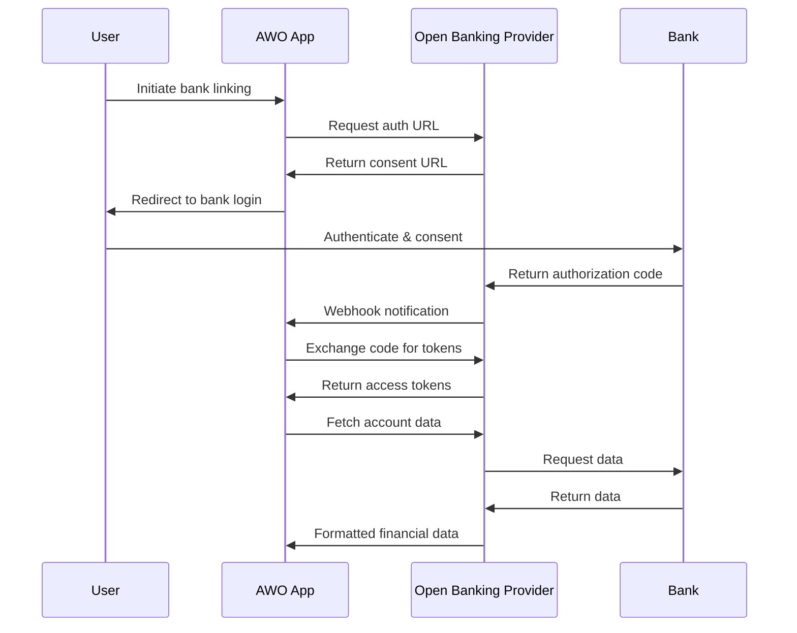

# Open Banking Integration Guide

This guide provides comprehensive information on integrating Open Banking capabilities into AWO Platform using our primary providers: Stitch (South Africa) and Mono (West/East Africa).

## Overview

<Info>
Open Banking enables AWO to securely access user financial data and initiate payments through standardized APIs, providing the foundation for our DIVA scoring system and automated financial services.
</Info>

### What is Open Banking?

Open Banking is a financial service that allows third-party financial service providers to access consumer banking, transaction, and other financial data from banks and financial institutions through Application Programming Interfaces (APIs). This access is granted with explicit customer consent and enables innovative financial products and services.

### AWO's Open Banking Strategy

<CardGroup cols={2}>
  <Card title="Primary Provider: Stitch" icon="bank">
    **Coverage**: South Africa, Nigeria  
    **Strength**: Deep SADC market expertise, regulatory compliance  
    **Use Case**: Primary integration for South African users
  </Card>
  <Card title="Secondary Provider: Mono" icon="globe">
    **Coverage**: Nigeria, Kenya, Ghana, South Africa  
    **Strength**: West and East African expansion  
    **Use Case**: Market expansion and backup coverage
  </Card>
</CardGroup>

### Key Capabilities Enabled

**For DIVA Scoring:**
- Real-time transaction data analysis
- Income verification and stability assessment
- Spending pattern analysis
- Account balance verification

**For Payment Services:**
- Pay-by-bank transfers
- Account-to-account payments
- Direct bank debits
- Payment verification

**For User Experience:**
- Automated bank account linking
- Real-time balance checks
- Transaction categorization
- Financial insights

## Technical Architecture

### Integration Pattern



### Data Flow

<Steps>
  <Step title="User Consent">
    User initiates bank account linking through AWO mobile app or web interface
  </Step>
  <Step title="Authentication">
    User redirected to bank's secure authentication portal
  </Step>
  <Step title="Authorization">
    Bank returns authorization code to Open Banking provider
  </Step>
  <Step title="Token Exchange">
    AWO exchanges authorization code for access and refresh tokens
  </Step>
  <Step title="Data Access">
    AWO uses tokens to securely access user's financial data
  </Step>
</Steps>

## Supported Banks & Coverage

### South Africa (via Stitch)

**Major Banks:**
- Standard Bank
- ABSA Bank
- First National Bank (FNB)
- Nedbank
- Capitec Bank
- Discovery Bank
- African Bank
- Bidvest Bank

**Digital Banks:**
- TymeBank
- Bank Zero

### Nigeria (via Stitch & Mono)

**Stitch Coverage:**
- GTBank
- Access Bank
- First Bank
- Zenith Bank
- UBA

**Mono Coverage:**
- All major Nigerian banks (25+ institutions)
- Fintech wallets (Kuda, PiggyVest, etc.)
- Microfinance banks

### Kenya (via Mono)

**Supported Institutions:**
- KCB Bank
- Equity Bank
- Cooperative Bank
- Standard Chartered Kenya
- NCBA Bank
- Family Bank

### Ghana (via Mono)

**Coverage:**
- GCB Bank
- Ecobank Ghana
- Standard Chartered Ghana
- Fidelity Bank Ghana
- CAL Bank

## Authentication & Security

### OAuth 2.0 Flow

All Open Banking integrations use industry-standard OAuth 2.0 authorization code flow:

<CardGroup cols={2}>
  <Card title="Authorization" icon="shield-check">
    **Client ID & Secret**: Secure client credentials  
    **Scopes**: Granular permission control  
    **Consent**: Explicit user authorization  
    **Redirects**: Secure callback handling
  </Card>
  <Card title="Token Management" icon="key">
    **Access Tokens**: Short-lived (1-24 hours)  
    **Refresh Tokens**: Long-lived (90 days)  
    **Automatic Refresh**: Seamless token renewal  
    **Secure Storage**: Encrypted token storage
  </Card>
</CardGroup>

### Security Best Practices

**Data Protection:**
- All data transmitted over TLS 1.3
- Field-level encryption for sensitive data
- Regular security audits and penetration testing
- Compliance with GDPR, POPIA, and local regulations

**Access Control:**
- Role-based access control (RBAC)
- API rate limiting and throttling
- Request signing and verification
- Webhook signature validation

## Data Types & Structures

### Account Information

```typescript
interface BankAccount {
  id: string;
  accountNumber: string;
  accountName: string;
  accountType: 'SAVINGS' | 'CURRENT' | 'CREDIT' | 'LOAN';
  currency: string;
  balance: {
    available: number;
    current: number;
    limit?: number;
  };
  bank: {
    name: string;
    code: string;
    logo?: string;
  };
  status: 'ACTIVE' | 'INACTIVE' | 'CLOSED';
  createdAt: string;
  updatedAt: string;
}
```

### Transaction Data

```typescript
interface Transaction {
  id: string;
  accountId: string;
  amount: number;
  currency: string;
  description: string;
  reference?: string;
  type: 'DEBIT' | 'CREDIT';
  category: string;
  subcategory?: string;
  merchant?: {
    name: string;
    category: string;
    location?: string;
  };
  date: string;
  processingDate: string;
  balance: number;
  metadata?: Record<string, any>;
}
```

### Identity Information

```typescript
interface AccountHolder {
  id: string;
  name: string;
  email?: string;
  phone?: string;
  address?: {
    street: string;
    city: string;
    state: string;
    country: string;
    postalCode: string;
  };
  dateOfBirth?: string;
  bvn?: string; // Nigeria only
  idNumber?: string;
  verification: {
    level: 'BASIC' | 'ENHANCED' | 'VERIFIED';
    verifiedAt?: string;
    documents: string[];
  };
}
```

## Error Handling

### Common Error Scenarios

<CardGroup cols={2}>
  <Card title="Authentication Errors" icon="x-circle">
    **Invalid Credentials**: Incorrect client ID/secret  
    **Expired Tokens**: Access token expiration  
    **Invalid Scope**: Insufficient permissions  
    **Rate Limiting**: Too many requests
  </Card>
  <Card title="Banking Errors" icon="exclamation-triangle">
    **Bank Downtime**: Institution unavailable  
    **Account Errors**: Closed/inactive accounts  
    **Consent Issues**: Revoked or expired consent  
    **Data Errors**: Invalid or missing data
  </Card>
</CardGroup>

### Error Response Format

```typescript
interface ErrorResponse {
  error: {
    code: string;
    message: string;
    details?: string;
    timestamp: string;
    requestId: string;
  };
  retry?: {
    recommended: boolean;
    after: number; // seconds
  };
}
```

### Retry Strategy

```typescript
const retryConfig = {
  maxRetries: 3,
  baseDelay: 1000, // ms
  maxDelay: 10000, // ms
  exponentialBackoff: true,
  retryableErrors: [
    'RATE_LIMITED',
    'BANK_TIMEOUT',
    'TEMPORARY_UNAVAILABLE'
  ]
};
```

## Rate Limits & Performance

### API Rate Limits

| Provider | Endpoint Type | Rate Limit | Window |
|----------|---------------|------------|---------|
| Stitch | Authentication | 10 requests | 1 minute |
| Stitch | Account Data | 100 requests | 1 minute |
| Stitch | Transactions | 60 requests | 1 minute |
| Mono | Connect Widget | 50 requests | 1 minute |
| Mono | Account APIs | 200 requests | 1 minute |
| Mono | Transaction APIs | 100 requests | 1 minute |

### Performance Optimization

**Caching Strategy:**
- Account data: 5 minutes
- Transaction data: 1 minute
- Balance data: 30 seconds
- Institution status: 15 minutes

**Batch Operations:**
- Multiple account fetching
- Bulk transaction retrieval
- Parallel API calls with concurrency limits
- Intelligent retry mechanisms

## Regional Compliance

### South Africa (POPIA)

<CardGroup cols={2}>
  <Card title="Data Protection" icon="shield">
    **Consent Management**: Explicit, informed consent  
    **Purpose Limitation**: Data used only for stated purposes  
    **Data Minimization**: Collect only necessary data  
    **Retention Limits**: Automatic data deletion
  </Card>
  <Card title="User Rights" icon="user-check">
    **Access Rights**: View collected data  
    **Rectification**: Correct inaccurate data  
    **Erasure**: Delete personal data  
    **Portability**: Export data in standard format
  </Card>
</CardGroup>

### Nigeria (NDPR)

**Key Requirements:**
- Lawful basis for data processing
- Data subject consent and rights
- Cross-border transfer restrictions
- Breach notification requirements

### Regional Banking Regulations

**South Africa:**
- National Credit Act (NCA) compliance
- SARB prudential requirements
- FICA (Financial Intelligence Centre Act)

**Nigeria:**
- CBN open banking guidelines
- Nigerian Data Protection Regulation
- Bank Verification Number (BVN) requirements

**Kenya:**
- Central Bank of Kenya regulations
- Data Protection Act 2019
- National Payment System regulations

## Integration Checklist

### Pre-Integration Requirements

<Steps>
  <Step title="Business Registration">
    Complete AWO business verification with Open Banking providers
  </Step>
  <Step title="Compliance Review">
    Ensure compliance with regional data protection laws
  </Step>
  <Step title="Technical Setup">
    Set up development and production environments
  </Step>
  <Step title="Security Assessment">
    Complete security review and penetration testing
  </Step>
</Steps>

### Testing Strategy

**Sandbox Environment:**
- Use test credentials and mock data
- Simulate various bank responses
- Test error scenarios and edge cases
- Validate webhook delivery and processing

**Production Readiness:**
- Complete end-to-end user journey testing
- Load testing with expected traffic volumes
- Monitor integration performance metrics
- Set up alerting and monitoring systems

## Monitoring & Analytics

### Key Metrics

<CardGroup cols={2}>
  <Card title="Performance Metrics" icon="chart-line">
    **API Response Times**: &lt;500ms for 95th percentile  
    **Success Rates**: &gt;99% for critical operations  
    **Error Rates**: &lt;1% for all API calls  
    **Data Freshness**: Real-time to 5-minute delays
  </Card>
  <Card title="Business Metrics" icon="trending-up">
    **Account Linking Rate**: Target &gt;85%  
    **User Retention**: Track 30-day retention  
    **Data Quality**: Monitor completeness and accuracy  
    **Regional Performance**: Track by country/bank
  </Card>
</CardGroup>

### Alerting Setup

**Critical Alerts:**
- API availability &lt;99%
- Error rates &gt;5%
- Response times &gt;2 seconds
- Failed webhook deliveries

**Warning Alerts:**
- Unusual traffic patterns
- Rate limit approaching
- Bank downtime notifications
- Token expiration warnings

---

*This overview provides the foundation for implementing Open Banking integration in AWO Platform. For specific implementation details, refer to the individual integration guides for [Stitch](/integration/stitch-integration) and [Mono](/integration/mono-integration).*

*Last updated: June 2025*  
*Next review: Dec 2025*