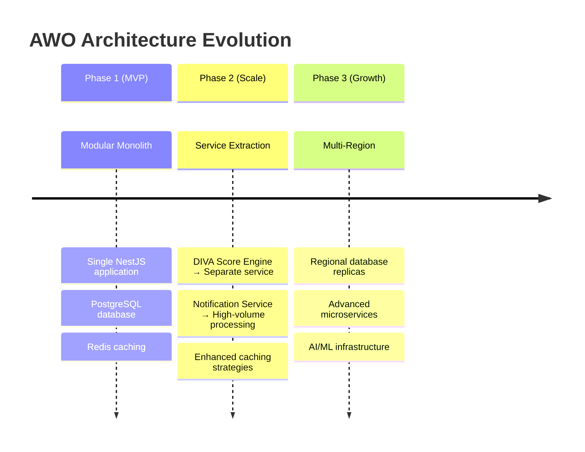

# Welcome to AWO Platform

African Wealth Oasis (AWO) is a comprehensive mobile-first wealth management platform specifically designed for African women in the SADC (Southern African Development Community) region. Our platform combines behavioral financial analysis with culturally relevant community features to democratize access to savings, investment, and financial education.

## What Makes AWO Different

<CardGroup cols={2}>
  <Card title="DIVA Scoring System" icon="chart-line">
    Real-time financial health assessment based on actual bank transaction data, not self-reported information
  </Card>
  <Card title="Digital Chama Integration" icon="users">
    Modernized traditional savings groups (Chamas/Stokvels) with blockchain transparency
  </Card>
  <Card title="Cultural Relevance" icon="heart">
    Built specifically for African women's financial behaviors and cultural practices
  </Card>
  <Card title="Financial Inclusion" icon="globe">
    USSD support, mobile money integration, and multi-language accessibility
  </Card>
</CardGroup>

## Core Features

### 🏦 Bank Transaction Analysis
Connect securely to users' bank accounts via Open Banking APIs (Stitch, Mono, Plaid) to analyze spending patterns, savings behavior, and financial discipline.

### 📊 DIVA Score Engine
Our proprietary scoring system evaluates four key components:
- **Discipline**: Payment consistency and financial control
- **Income**: Stability, growth, and diversification  
- **Velocity**: Cash flow efficiency and timing
- **Assets**: Accumulation, protection, and optimization

### 🤝 Community Savings (Chamas/Stokvels)
Digital infrastructure for traditional rotating savings groups with:
- Transparent contribution tracking
- Automated payout scheduling
- Blockchain-backed transaction records
- Group governance and voting tools

### 💰 Investment Marketplace
Curated investment products tailored to different risk profiles with micro-investment options and comprehensive financial education.

### 📱 Multi-Channel Access
- **Mobile App**: React Native with Expo for iOS and Android
- **Web Platform**: Next.js Progressive Web App
- **USSD Interface**: Feature phone compatibility for rural markets
- **Mobile Money**: M-Pesa, MTN MoMo, Orange Money integration

## Target Markets

<Tabs>
  <Tab title="Primary Markets">
    **Launch Phase (Q3- Q4 2025)**
    - 🇿🇦 South Africa
    

    **Target**: 50,000 active users by end of Year 1 
  </Tab>
  <Tab title="Secondary Markets">
    **Expansion Phase (2026)**
    - 🇿🇲 Zambia
    - 🇧🇼 Botswana
    - 🇹🇿 Tanzania
    - 🇲🇿 Mozambique

    **Target**: 300,000 active users across 6+ countries
  </Tab>
</Tabs>

## Platform Architecture

AWO is built on a modern **modular monolith architecture** designed for rapid development and seamless scaling:

```mermaid
graph TB
    subgraph "Client Applications"
        MOBILE[React Native Mobile App]
        WEB[Next.js Web App<br/>PWA]
        USSD[USSD Interface<br/>Feature Phones]
    end

    subgraph "Shared Packages (Monorepo)"
        TYPES[Types<br/>@awo/types]
        SDK[API SDK<br/>@awo/api-sdk]
        UI[UI Components<br/>@awo/ui]
        UTILS[Utilities<br/>@awo/utils]
    end

    subgraph "AWO Backend (NestJS)"
        GATEWAY[API Gateway Layer]
        
        subgraph "Core Modules"
            AUTH[Auth Module]
            USERS[Users Module]
            DIVA[DIVA Module]
            CHAMA[Chama Module]
            BANKING[Banking Module]
            PAYMENTS[Payments Module]
            SAVINGS[Savings Module]
            EDUCATION[Education Module]
            NOTIFICATIONS[Notifications Module]
        end
    end

    subgraph "Data & Infrastructure"
        PG[(PostgreSQL<br/>Primary Database)]
        REDIS[(Redis<br/>Cache & Sessions)]
        S3[(S3<br/>File Storage)]
        BLOCKCHAIN[Blockchain<br/>Chama Ledger]
    end

    MOBILE --> SDK
    WEB --> SDK
    USSD --> GATEWAY
    
    SDK --> TYPES
    SDK --> UTILS
    SDK --> GATEWAY
    
    GATEWAY --> AUTH
    GATEWAY --> USERS
    GATEWAY --> DIVA
    GATEWAY --> CHAMA
    GATEWAY --> BANKING
    GATEWAY --> PAYMENTS
    GATEWAY --> SAVINGS
    GATEWAY --> EDUCATION
    GATEWAY --> NOTIFICATIONS
    
    AUTH --> PG
    USERS --> PG
    DIVA --> PG
    CHAMA --> PG
    CHAMA --> BLOCKCHAIN
    BANKING --> PG
    PAYMENTS --> PG
    SAVINGS --> PG
    EDUCATION --> PG
    NOTIFICATIONS --> REDIS
    
    DIVA --> REDIS
    USERS --> S3
    EDUCATION --> S3
```

### Architecture Benefits

<CardGroup cols={2}>
  <Card title="Developer Efficiency" icon="rocket">
    Single codebase with shared types ensures consistency. Atomic changes across web, mobile, and backend in one commit.
  </Card>
  <Card title="Financial Transaction Safety" icon="shield">
    ACID transactions in PostgreSQL ensure data consistency for all financial operations - critical for Chama payouts.
  </Card>
  <Card title="Rapid Iteration" icon="zap">
    Simplified deployment and debugging. Single stack trace for complex operations spanning multiple domains.
  </Card>
  <Card title="Cost Effective" icon="dollar-sign">
    Single application deployment with lower infrastructure overhead. Perfect for bootstrap and growth phases.
  </Card>
</CardGroup>

## Technology Stack

<Tabs>
  <Tab title="Backend">
    **Framework**: NestJS with TypeScript  
    **Database**: PostgreSQL with logical schema separation  
    **Cache**: Redis for sessions and application cache  
    **ORM**: TypeORM with migration support  
    **Authentication**: JWT with OAuth 2.0  
    **API**: GraphQL + REST with OpenAPI documentation
  </Tab>
  <Tab title="Frontend">
    **Web**: Next.js 14+ with App Router and PWA capabilities  
    **Mobile**: React Native with Expo for cross-platform development  
    **State Management**: Redux Toolkit with RTK Query  
    **UI Framework**: Material-UI for web, React Native Elements for mobile  
    **Offline Support**: Progressive enhancement with background sync
  </Tab>
  <Tab title="Infrastructure">
    **Deployment**: Docker containers on Railway/Render  
    **CI/CD**: GitHub Actions with Turborepo build orchestration  
    **Monitoring**: Sentry for error tracking, Prometheus for metrics  
    **Storage**: AWS S3 for documents and media  
    **CDN**: CloudFront for global content delivery
  </Tab>
  <Tab title="Integrations">
    **Banking**: Stitch (SA), Mono (Kenya), Plaid (Global)  
    **Payments**: Flutterwave, Paystack, Mobile Money APIs  
    **KYC**: Smile ID, Onfido for identity verification  
    **Communications**: Twilio for SMS, SendGrid for email  
    **Analytics**: Custom analytics with anonymized user data
  </Tab>
</Tabs>

## API Design Philosophy

Our APIs are built with these core principles:

<AccordionGroup>
  <Accordion title="Type-Safe Development">
    **End-to-end TypeScript** with shared types across the entire stack. Changes to data models automatically propagate to web, mobile, and backend - eliminating integration bugs.
    
    ```typescript
    // Shared across all applications
    import { CreateChamaRequest, DivaScore } from '@awo/types';
    ```
  </Accordion>
  <Accordion title="Financial-First Design">
    **ACID transaction support** for all financial operations. Chama contributions, payouts, and DIVA score updates happen atomically to ensure data consistency.
    
    ```sql
    BEGIN;
      INSERT INTO contributions (...);
      UPDATE chama_balances SET total = total + amount;
      UPDATE user_diva_scores SET last_calculated = NOW();
    COMMIT;
    ```
  </Accordion>
  <Accordion title="Mobile-Optimized Performance">
    **Efficient data loading** with GraphQL for complex queries, REST for simple operations. Progressive loading and offline support for unreliable network conditions.
  </Accordion>
  <Accordion title="Cultural Sensitivity">
    APIs designed to **respect and enhance** traditional African financial practices. Digital Chamas preserve social dynamics while adding transparency and efficiency.
  </Accordion>
  <Accordion title="Security by Design">
    **Bank-grade security** with field-level encryption for PII, comprehensive audit logging, and rate limiting. OAuth 2.0 with MFA support.
  </Accordion>
</AccordionGroup>

## Development Experience

### Monorepo Structure
```
awo-platform/
├── apps/
│   ├── backend/          # NestJS API server
│   ├── web/             # Next.js PWA
│   └── mobile/          # React Native app
├── packages/
│   ├── types/           # @awo/types - Shared TypeScript definitions
│   ├── api-sdk/         # @awo/api-sdk - API client library
│   ├── ui/              # @awo/ui - Shared UI components
│   └── utils/           # @awo/utils - Common utilities
└── tools/
    ├── database/        # Migrations and seeds
    └── scripts/         # Build and deployment scripts
```

### Key Developer Benefits

<CardGroup cols={2}>
  <Card title="Atomic Changes" icon="atom">
    Update API, types, web, and mobile in a single pull request. No version coordination headaches.
  </Card>
  <Card title="Shared Business Logic" icon="recycle">
    DIVA score calculations, validation rules, and currency formatting shared across all platforms.
  </Card>
  <Card title="Consistent UI/UX" icon="palette">
    Design system components used across web and mobile for consistent user experience.
  </Card>
  <Card title="Simplified Testing" icon="test-tube">
    End-to-end tests across the entire stack with shared test data and utilities.
  </Card>
</CardGroup>

## Getting Started

<CardGroup cols={2}>
  <Card title="Quick Integration" icon="rocket" href="/guides/integration-walkthrough">
    Get up and running with AWO APIs in under 10 minutes using our SDK
  </Card>
  <Card title="Authentication Setup" icon="key" href="/api-reference/auth/login">
    Implement secure user authentication with JWT and OAuth 2.0
  </Card>
  <Card title="DIVA Score Implementation" icon="calculator" href="/guides/diva-score-implementation">
    Integrate our proprietary financial health scoring system
  </Card>
  <Card title="Chama Management" icon="handshake" href="/guides/chama-management">
    Build community savings features with blockchain transparency
  </Card>
</CardGroup>

## API Features

### Core API Capabilities
- **RESTful Endpoints**: Standard HTTP methods with consistent response patterns
- **GraphQL Queries**: Efficient data fetching for complex UI requirements
- **Real-time Updates**: WebSocket connections for live transaction notifications
- **Batch Operations**: Optimized bulk operations for better performance
- **Pagination**: Cursor-based pagination for large datasets
- **Filtering & Sorting**: Flexible query parameters for data exploration

### Security Features
- **OAuth 2.0 + JWT**: Industry-standard authentication with refresh tokens
- **Rate Limiting**: Protect against abuse with configurable limits
- **Input Validation**: Comprehensive request validation with detailed error messages
- **Audit Logging**: Complete audit trail for all financial operations
- **Field Encryption**: Sensitive PII encrypted at the database level
- **CORS Protection**: Configurable cross-origin resource sharing

### Integration Support
- **SDKs**: TypeScript/JavaScript SDK with full type safety
- **OpenAPI Documentation**: Interactive API documentation with examples
- **Postman Collections**: Ready-to-use API collections for testing
- **Webhook Support**: Real-time notifications for important events
- **Mock APIs**: Sandbox environment for development and testing

## Support & Community

<CardGroup cols={3}>
  <Card title="API Reference" icon="book" href="/api-reference/auth/login">
    Complete API documentation with interactive examples
  </Card>
  <Card title="Integration Guides" icon="map" href="/guides/integration-walkthrough">
    Step-by-step tutorials for common use cases
  </Card>
  <Card title="Developer Support" icon="life-ring">
    **Email**: developers@awo-platform.com  
    **GitHub**: github.com/awo-platform  
    **Discord**: AWO Developer Community
  </Card>
</CardGroup>

## Success Metrics & Roadmap

### Platform Targets

<Tabs>
  <Tab title="Year 1 (2025)">
    - **100,000+** active users across 3 SADC countries
    - **50,000+** connected bank accounts
    - **5,000+** active Chamas managing **$5M+** in savings
    - **30%+** of users with active investments
    - **15%** average DIVA score improvement
  </Tab>
  <Tab title="Year 2 (2026)">
    - **500,000+** active users across 6+ countries
    - **$50M+** in assets under management
    - **25,000+** active Chamas
    - **Advanced AI insights** for financial recommendations
    - **Cross-border remittances** and investments
  </Tab>
</Tabs>

### Technology Evolution



## Regulatory Compliance

<Note>
AWO operates under strict regulatory compliance across all SADC markets:

- **Financial Services Licensing**: Compliant with local banking and financial services regulations
- **Data Protection**: GDPR-influenced national laws including POPIA (South Africa)
- **KYC/AML Compliance**: FATF standards with risk-based verification
- **Consumer Protection**: Fair pricing, transparent terms, and dispute resolution
- **Cross-Border Regulations**: Compliant money movement across SADC region
</Note>

---

Ready to start building with AWO? Check out our [Integration Walkthrough](/guides/integration-walkthrough) or dive straight into the [API Reference](/api-reference/auth/login).

<Tip>
**New to financial APIs?** Our platform is designed to be developer-friendly with comprehensive documentation, TypeScript support, and a sandbox environment for safe testing.
</Tip>