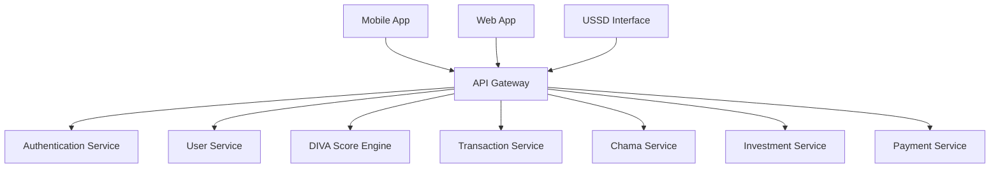

# Welcome to AWO Platform

African Wealth Oasis (AWO) is a comprehensive mobile-first wealth management platform specifically designed for African women in the SADC (Southern African Development Community) region. Our platform combines behavioral financial analysis with culturally relevant community features to democratize access to savings, investment, and financial education.

## What Makes AWO Different

<CardGroup cols={2}>
  <Card title="DIVA Scoring System" icon="chart-line">
    Real-time financial health assessment based on actual bank transaction data, not self-reported information
  </Card>
  <Card title="Digital Chama Integration" icon="users">
    Modernized traditional savings groups (Chamas/Stokvels) with blockchain transparency
  </Card>
  <Card title="Cultural Relevance" icon="heart">
    Built specifically for African women's financial behaviors and cultural practices
  </Card>
  <Card title="Financial Inclusion" icon="globe">
    USSD support, mobile money integration, and multi-language accessibility
  </Card>
</CardGroup>

## Core Features

### 🏦 Bank Transaction Analysis
Connect securely to users' bank accounts via Open Banking APIs to analyze spending patterns, savings behavior, and financial discipline.

### 📊 DIVA Score Engine
Our proprietary scoring system evaluates four key components:
- **Discipline**: Payment consistency and financial control
- **Income**: Stability, growth, and diversification
- **Velocity**: Cash flow efficiency and timing
- **Assets**: Accumulation, protection, and optimization

### 🤝 Community Savings (Chamas/Stokvels)
Digital infrastructure for traditional rotating savings groups with:
- Transparent contribution tracking
- Automated payout scheduling
- Blockchain-backed transaction records
- Group governance tools

### 💰 Investment Marketplace
Curated investment products tailored to different risk profiles with micro-investment options and comprehensive education.

### 📱 Multi-Channel Access
- **Mobile App**: React Native for iOS and Android
- **Web Platform**: Progressive Web App
- **USSD Interface**: Feature phone compatibility
- **Mobile Money**: Seamless integration with popular providers

## Target Markets

<Tabs>
  <Tab title="Primary Markets">
    **Launch Phase (Q3 2025)**
    - 🇿🇦 South Africa
    - 🇰🇪 Kenya  
    - 🇿🇼 Zimbabwe
  </Tab>
  <Tab title="Secondary Markets">
    **Expansion Phase (2026)**
    - 🇿🇲 Zambia
    - 🇧🇼 Botswana
    - 🇹🇿 Tanzania
    - 🇲🇿 Mozambique
  </Tab>
</Tabs>

## API Architecture

AWO is built on a modern, cloud-native microservices architecture:

### Key Technical Features
- **GraphQL & REST APIs**: Efficient data retrieval and standard HTTP operations
- **OAuth 2.0 + JWT**: Secure authentication with multi-factor support
- **Real-time Updates**: WebSocket connections for live data
- **Blockchain Integration**: Transparent Chama transaction ledger
- **Bank-Grade Security**: AES-256 encryption, TLS 1.3, comprehensive auditing

## Getting Started

<CardGroup cols={2}>
  <Card title="Quick Integration" icon="rocket" href="/guides/integration-walkthrough">
    Get up and running with AWO APIs in under 10 minutes
  </Card>
  <Card title="Authentication Setup" icon="key" href="/api-reference/auth/login">
    Implement secure user authentication and authorization
  </Card>
  <Card title="DIVA Score Implementation" icon="calculator" href="/guides/diva-score-implementation">
    Integrate our proprietary financial health scoring system
  </Card>
  <Card title="Chama Management" icon="handshake" href="/guides/chama-management">
    Build community savings features into your application
  </Card>
</CardGroup>

## API Principles

Our APIs are designed with these core principles:

<AccordionGroup>
  <Accordion title="Developer Experience First">
    Clear documentation, consistent patterns, comprehensive examples, and intuitive endpoint design
  </Accordion>
  <Accordion title="Security by Design">
    Bank-grade security with OAuth 2.0, rate limiting, input validation, and comprehensive audit logging
  </Accordion>
  <Accordion title="Cultural Sensitivity">
    APIs designed to respect and enhance traditional African financial practices and community structures
  </Accordion>
  <Accordion title="Scalability & Performance">
    Built for high availability with auto-scaling, caching strategies, and optimized for mobile networks
  </Accordion>
</AccordionGroup>

## Support & Community

<CardGroup cols={3}>
  <Card title="API Reference" icon="book" href="/api-reference/auth/login">
    Complete API documentation with examples
  </Card>
  <Card title="Implementation Guides" icon="map" href="/guides/integration-walkthrough">
    Step-by-step integration tutorials
  </Card>
  <Card title="Developer Support" icon="life-ring">
    Email: developers@awo-platform.com
    GitHub: github.com/awo-platform
  </Card>
</CardGroup>

## Success Metrics

**Year 1 Targets:**
- 100,000+ active users across 3 SADC countries
- 50,000+ connected bank accounts
- 5,000+ active Chamas managing $5M+ in savings
- 30%+ of users with active investments

---

Ready to start building with AWO? Check out our [Integration Walkthrough](/guides/integration-walkthrough) or dive straight into the [API Reference](/api-reference/auth/login).

<Note>
AWO operates under strict regulatory compliance across all SADC markets, including financial services licensing, data protection laws (GDPR-influenced), and KYC/AML requirements.
</Note>